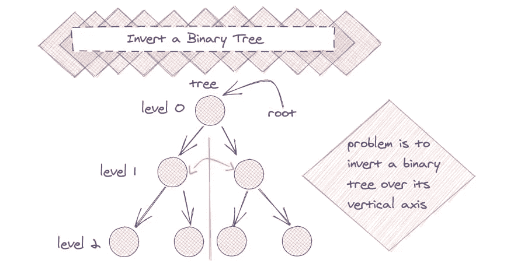
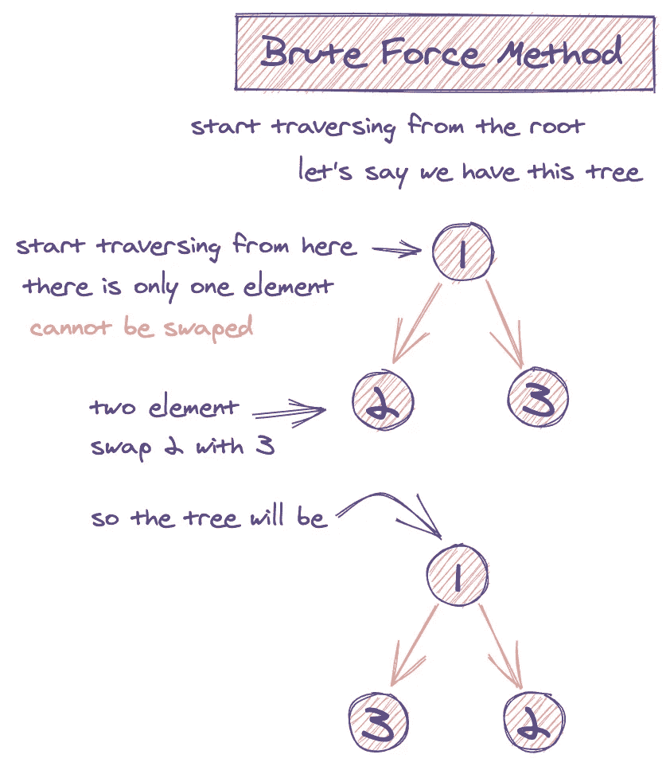
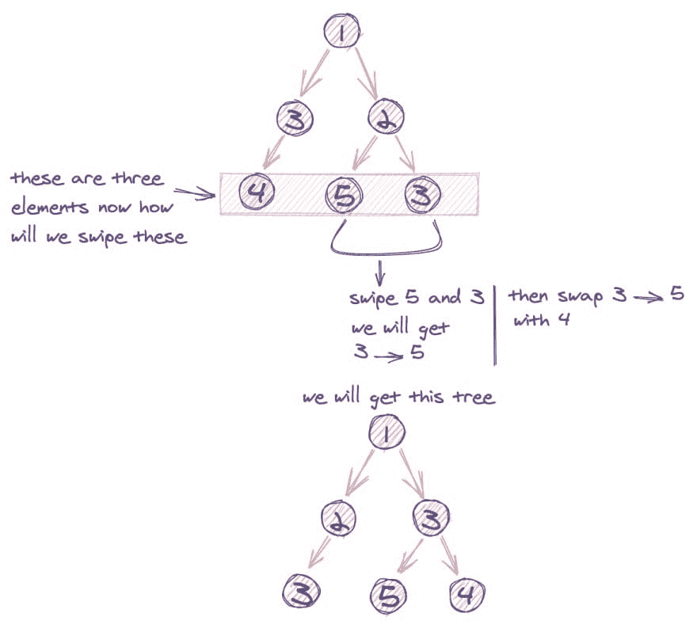
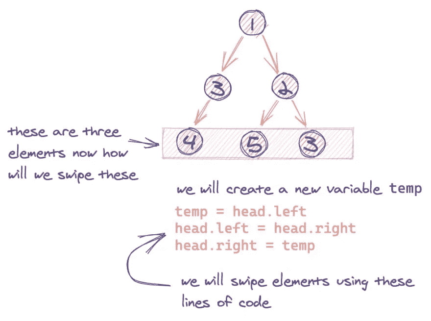

# 如何实际反转二叉树的可视化指南

> 原文：<https://javascript.plainenglish.io/a-visual-guide-to-how-to-actually-invert-a-binary-tree-9e5df119218f?source=collection_archive---------0----------------------->

## 你能在垂直轴上翻转`binary tree`吗？这是一个著名的问题，通过这条推特变得流行起来:



> *谷歌:我们 90%的工程师使用您编写的软件(自制软件)，但您不能在白板上颠倒二叉树，所以滚开。*
> 
> *-Max Howell(@ mxcl)*[*2015 年 6 月 10 日*](https://twitter.com/mxcl/status/608682016205344768?ref_src=twsrc%5Etfw)

给定这样的`binary tree`:

```
 4
   /   \
  2     7
 / \   / \
1   3 6   9
```

执行反演将导致:

```
Output:

     4
   /   \
  7     2
 / \   / \
9   6 3   1
```

树节点的定义如下:

```
function Node(val) {
  this.val = val;
  this.left = null;
  this.right = null;
}
```

*这节课最初发表在*[*https://algodaily.com*](https://algodaily.com/challenges/invert-a-binary-tree)*上，在那里我开设了一门技术面试课程，并为雄心勃勃的开发者写一些想法。*

这是著名问题`Homebrew`的作者`Max Howell` [在谷歌采访](https://twitter.com/mxcl/status/608682016205344768?lang=en)中出了名的错误。希望这能防止你有同样的不幸！

让我们想想蛮力——如果没有任何巧妙的算法，我们怎么做？我们可以从非常基本的输入开始，如下所示:

```
 1
 / \
2   3
```

所以要垂直翻转它，我们要从`1`开始，那里没有东西可以翻转或交换，它会保持不动。我们现在已经处理了第一行。

转到第二个，我们遇到`2`和`3`，所以我们会交换它们，得到:



```
 1
 / \
3   2
```

有趣的是，这似乎颠倒了它！当有多个节点时，它是否像交换一样简单？

但是，如果每个级别有两个以上的节点可以交换呢？如果有额外的级别，可能如下所示:

```
 1
     / \
    3   2
   / \   \
  4   5   3
```

最后一行目前的方向是`4 -> 5 -> 3`，但我们希望结果是`3 -> 5 -> 4`被正确颠倒。

然而，我们可以通过进行两次单独的互换来实现这一点。请注意，如果我们将`4`和`5`换成`5 -> 4`，然后将`5 -> 4`换成`3`，就会得到下面的结果。



```
 1
     / \
    2   3
   /   / \
  3   5   4
```

因此，将所有这些放在一起:我们可以按顺序遍历，并在每次迭代时进行交换。



读者指出了一个警告——如果我们处理的是一个非常大的二叉树，那么递归解决方案可能会由于调用堆栈大小而引起问题。有两种方法可以解决这个问题:

1.  使用堆栈来模拟递归
2.  使用一个队列，以 BFS 方式一个接一个地访问各个级别，并交换左右节点来反转树。

下面是最终代码的样子:

```
function invertTree(head) {
  if (head) {
    var temp = head.left;
    head.left = head.right;
    head.right = temp;

    invertTree(head.left);
    invertTree(head.right);
  }

  return head;
}
```

*最初发表于*[*【https://algodaily.com】*](https://algodaily.com/challenges/invert-a-binary-tree)*。*