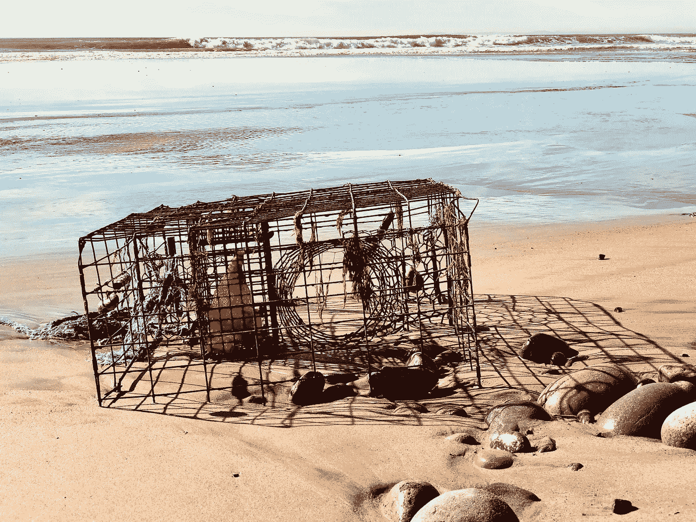

# Vue 事件处理备忘单—要点

> 原文：<https://javascript.plainenglish.io/a-vue-event-handling-cheatsheet-the-essentials-19462263e594?source=collection_archive---------4----------------------->



Vue 事件处理是每个 Vue 项目的一个必要方面。

在本文中，我将介绍一些基础知识，并提供一些处理事件的代码示例。它将只包括我认为最有用的技巧/方法，要深入了解 Vue 能做的所有事情，请查看 [Vue 文档。](https://vuejs.org/v2/guide/events.html)

# 基本事件处理

使用`v-on` [指令](https://learnvue.co/2020/01/creating-your-first-vuejs-custom-directive/)(简称为`@`)我们可以监听 DOM 事件并运行处理程序方法或内联 Javascript

我们将会报道一些你可能想要捕捉的更常见的事件，点击这里查看 [DOM 事件](https://developer.mozilla.org/en-US/docs/Web/Events)的完整列表。

# 发出自定义事件

除了 DOM 事件，我们可以通过使用实例方法`$emit`来创建自定义事件。然后，此自定义事件可以由发出该事件的实例的父组件来处理。

```
// Child Component this.$emit('close') // Parent Component <child-component @close='handleClose' />
```

我们还可以将数据传递给我们的父组件。这很重要，因为这是一种在组件中实现双向数据绑定的技术。

```
// Child Component 
this.$emit('close', false) // Parent Component 
<child-component @close='isOpen = $event' />
```

# 处理鼠标修改器

下面是我们可以在`v-on`指令中捕获的主要 DOM [鼠标事件](https://developer.mozilla.org/en-US/docs/Web/API/MouseEvent)的列表:

```
<div 
  @mousedown='handleEvent'
  @mouseup='handleEvent'
  @click='handleEvent'
  @dblclick='handleEvent'
  @mousemove='handleEvent'
  @mouseover='handleEvent'
  @mousewheel='handleEvent'
  @mouseout='handleEvent'
>
Interact with Me!
</div>
```

对于我们的点击事件，我们还可以添加鼠标事件修饰符来限制哪些鼠标按钮将触发我们的事件。有三个(每个按钮一个):`left`、`right`和`middle`。

```
<!-- This will only trigger for the left mouse click -->
<div @mousedown.left='handleLeftClick'> Left </div>
```

# 关键修饰符

我们可以监听三个 DOM 键盘事件

```
<input
   type='text'
   placeholder='Type something'
   @keypress='handkeKeyPressed'
   @keydown='handleKeyDown'
   @keyup='handleKeyUp'
/>
```

通常，我们希望检测某个键上的这些事件，有两种方法可以做到这一点。

1.  [键码](https://keycode.info/)
2.  Vue 对某些键有别名(`enter`、`tab`、`delete`、`esc`、`space`、`up`、`down`、`left`、`right`)

```
<!-- Trigger even when enter is released -->
<input
   type='text'
   placeholder='Type something'
   @keyup.enter='handleEnter'
/>

<!-- OR -->
<input
   type='text'
   placeholder='Type something'
   @keyup.13='handleEnter'
/>
```

# 系统修改器

对于某些项目，我们可能只想在用户按下修饰键时触发事件。修饰键类似于 command 或 shift。

在 Vue 中，有四个系统修改器。

1.  `shift`
2.  `alt`
3.  `ctrl`
4.  `meta`(MAC 上的 cmd 和 windows 上的 windows 键)

这对于在 Vue 应用程序中创建自定义键盘快捷键等功能非常有用。

```
<!-- Custom Shortcut that creates a list for Shift + 8 -->
<input
   type='text'
   placeholder='Type something'
   @keyup.shift.56='createList'
/>
```

浏览 Vue 文档，还有一个`exact`修饰符，确保只有当**我们指定的**键被按下而没有其他键被按下时，事件才会被触发。

```
<!-- Custom Shortcut that creates a list for Shift + 8 ONLY -->
<input
   type='text'
   placeholder='Type something'
   @keyup.shift.56.exact='createList'
/>
```

# 事件修改器

对于所有的 DOM 事件，我们可以使用一些修改器来改变它们的运行方式。无论是停止传播还是阻止默认动作，Vue 都有几个内置的 DOM 事件修饰符。

```
<!-- Prevent Default Action -->
<form @submit.prevent>

<!-- Stop Event Propagation -->
<form @submit.stop='submitForm'>

<!-- Easy to Join Modifiers -->
<form @submit.stop.prevent='submitForm'>

<!-- Prevent event from being triggered more than once -->
<div @close.once='handleClose'>
```

# 使用$listeners

这个题目是比较高级的。本质上，每个 Vue 实例都有一个包含其父级`v-on`事件监听器的`$listeners`属性。

当我们想从子进程调用一个方法事件处理程序而不必创建一个长长的`$emit`链时，使用这个属性会非常有用

相反，我们可以简单地将父组件的事件侦听器包含到子组件的元素中。当我们想要[可重用组件](https://learnvue.co/2019/12/building-reusable-components-in-vuejs-tabs/)和清晰的组件结构时，这真的很有帮助。

[VueDose 写了一篇关于这些“自适应组件”的精彩文章](https://vuedose.tips/tips/adaptive-components-using-v-bind-and-v-on/)，以下是我的主要观点。

> *一种情况是，我们有一个基础组件，比如说* `*BaseList*` *，你想创建一个类似的组件，在它的基础上添加一些额外的功能，比如* `*SortableList*` *。我称它们为* ***自适应组件*** *(也称代理或包装组件)。构建自适应组件时，通常希望* `*SortableList*` *与原来的* `*BaseList*` *保持相同的 API，以保持组件的一致性。也就是说从* `*SortableList*` *开始你需要把所有的道具都传下来，听完* `*BaseList*` *的所有事件。*
> 
> *来自 VueDose*

为了监听来自原始基本组件的所有事件，我们可以使用$listeners。

```
<BaseList
  v-on='$listeners'
/>
```

如果我们想要更多地控制我们调用的侦听器，我们可以添加对象析构和一个[计算属性](https://learnvue.co/2019/12/mastering-computed-properties-in-vuejs/)来挑选我们想要的元素。

```
<BaseList
   @click='click'
   v-on='listeners'
/>

// ...

computed: {
  listeners: () => {
    const { click, ...listeners } = this.$listeners;
    return listeners;
}
```

# 结论

希望这篇简短的备忘单能让您更好地了解 Vue 事件处理以及可能发生的事情。

和往常一样，我建议也查看一下[官方 Vue 文档](https://vuejs.org/v2/guide/events.html)，以便更深入地了解 Vue 事件处理的特性。

编码快乐！

[如果你有兴趣了解更多关于 Vue 3 的知识，请下载我的免费 Vue 3 备忘单，里面有一些基本知识，比如合成 API、Vue 3 模板语法和事件处理。](https://learnvue.co/vue-3-essentials-cheatsheet/)

*原载于 2020 年 1 月 30 日 https://learnvue.co*[](https://learnvue.co/2020/01/a-vue-event-handling-cheatsheet-the-essentials/)**。**