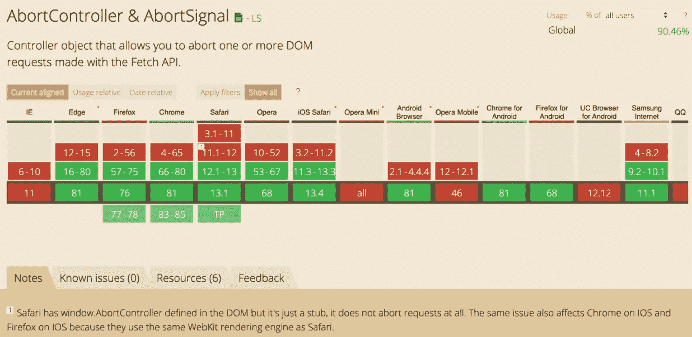

# 如何取消获取 API 请求

> 原文：<https://javascript.plainenglish.io/abort-requests-with-abortcontroller-in-fetch-api-7829c919c3f9?source=collection_archive---------4----------------------->

Photo by [Nikita Kostrykin](https://unsplash.com/@chilinik?utm_source=medium&utm_medium=referral) on [Unsplash](https://unsplash.com?utm_source=medium&utm_medium=referral)

Fetch API 提供了一个获取资源的接口。直到 2017 年，我们都没有办法用这个 API 取消请求。然而，当一个名为 AbortController 的新接口引入时，情况发生了变化。

这篇文章将重点让你开始使用 AbortController 接口，以便在需要时中止请求。

# 用例

让我们首先看一个基本的 fetch 实现和一个例子:

Simple fetch implementation

上述沙盒只是在一个循环中运行获取请求。您可以点击“获取数据”按钮，一旦获取所有数据，结果将显示在卡片上。

您可以打开开发人员工具来查看一个接一个的请求。目前没有办法中止正在进行的请求，我们必须等到所有的结果回来。这似乎是一个用例，用户可能想要取消长时间运行的请求，并参与应用程序的其他部分。

> 注意:上面的沙盒只是为了演示的目的，显示一些需要时间的请求。我们还不如利用 **Promise.all** 同时发出多个请求，但这不是本文的重点。

# 介绍中止控制器

在上面的代码中使用 abortController 之前，让我们先介绍一下它的一些语法基础。

**AbortController** 接口代表一个控制器对象，允许您在需要时中止一个或多个 Web 请求。

您可以使用 [AbortController 创建一个新的 AbortController 对象。AbortController()](https://developer.mozilla.org/en-US/docs/Web/API/AbortController/AbortController) 构造函数。使用 [AbortSignal](https://developer.mozilla.org/en-US/docs/Web/API/AbortSignal) 对象完成与 DOM 请求的通信。

## 构造器

> 中止控制器()
> 
> 创建新的 AbortController 对象实例。

## 性能

> AbortController.signal **只读**
> 
> 返回一个 [AbortSignal](https://developer.mozilla.org/en-US/docs/Web/API/AbortSignal) 对象实例，该实例可用于与 DOM 请求通信或中止 DOM 请求。

## 方法

> [abort controller . abort()](https://developer.mozilla.org/en-US/docs/Web/API/AbortController/abort)
> 
> 在 DOM 请求完成之前中止它。这能够中止[获取请求](https://developer.mozilla.org/en-US/docs/Web/API/WindowOrWorkerGlobalScope/fetch)，任何响应[主体](https://developer.mozilla.org/en-US/docs/Web/API/Body)和流的消耗。

基本完成了。现在让我们在前面的例子中使用 AbortController。使用起来非常简单，所以我将在这里嵌入代码沙箱:

AbortController in action

我们在此添加的内容:

*   HTML 中的取消按钮，用于取消正在进行的请求
*   我们定义了 AbortController 实例，并提取了 AbortSignal 来控制与之关联的 DOM 请求。
*   然后，我们将这个信号用于获取请求。
*   最后，单击“Cancel Request ”,我们添加了一个事件监听器，它在 abort()方法的帮助下取消正在进行的请求。

**您会注意到，一旦您取消请求，只会生成该请求已处理的那些数量的卡，而不会发送任何进一步的请求。**

> **注意**:当 abort()被调用时，fetch() promise 以一个名为 AbortError 的 DOMException 拒绝。

所有主流浏览器的支持看起来都很有希望:

Globally available in 90%+ browsers

# 资源

 [## 我能用吗...HTML5、CSS3 等的支持表

### “我可以使用吗”提供了最新的浏览器支持表，以支持桌面和移动设备上的前端 web 技术…

caniuse.com](https://caniuse.com/#feat=abortcontroller)  [## 堕胎控制员

### AbortController 接口代表一个控制器对象，它允许您中止一个或多个 Web 请求，如和…

developer.mozilla.org](https://developer.mozilla.org/en-US/docs/Web/API/AbortController) 

## **简明英语团队的笔记**

你知道我们有四种出版物吗？给他们一个关注来表达爱意吧:[**JavaScript in Plain English**](https://medium.com/javascript-in-plain-english)，[**AI in Plain English**](https://medium.com/ai-in-plain-english)，[**UX in Plain English**](https://medium.com/ux-in-plain-english)，[**Python in Plain English**](https://medium.com/python-in-plain-english)**—谢谢，继续学习！我们还推出了一个 YouTube，希望你能通过 [**订阅我们的英语频道**](https://www.youtube.com/channel/UCtipWUghju290NWcn8jhyAw) 来支持我们**

**一如既往,“简明英语”希望帮助推广好的内容。如果您有一篇文章想要提交给我们的任何出版物，请发送电子邮件至[**submissions @ plain English . io**](mailto:submissions@plainenglish.io)**并附上您的媒体用户名和您感兴趣的内容，我们将会回复您！****