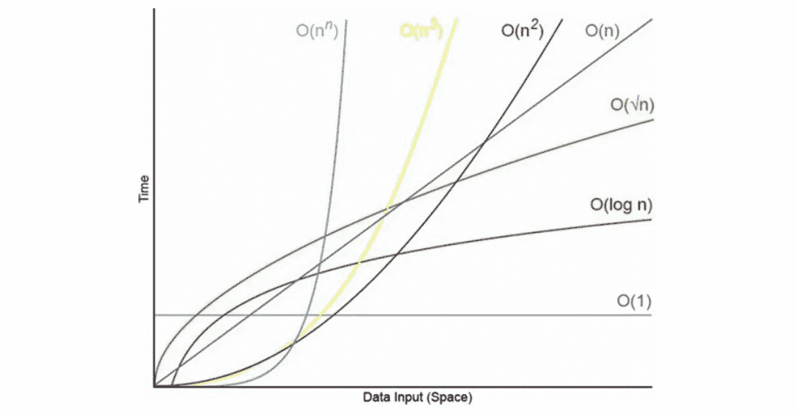

# 关于大 O 符号的几点提示

> 原文：<https://javascript.plainenglish.io/about-big-o-notation-aedafde0aa65?source=collection_archive---------7----------------------->

作为一名刚从软件工程训练营毕业的学生，我通过面试找到了我的第一份开发工作，我不止一次地遇到了“大 O 符号”这个术语。

当输入变得任意大时，运行时相对于输入的增长速度对我来说是非常模糊的，这似乎是明天的问题，而不是今天的问题。

我读的文章越多，写的代码越多，为面试练习代码挑战的次数越多，和其他开发人员交谈的次数越多，我就越意识到这是一个多么重要的概念。这就是为什么我决定写这篇文章，列出我所理解的围绕大 O 符号的关键概念和 JavaScript 中的具体应用

## 一般概念

首先，算法只是完成一组任务所需的一个过程或一组步骤。现在这个问题已经解决了，我们可以继续了。大 O 由两部分组成:

*   **时间复杂度**与我们如何分析一个算法在其输入规模增加时的运行时间有关。
*   空间复杂度与需要分配多少额外的内存来运行我们算法中的代码有关。
    注意:在本文中，一般来说当提到大 O 时，空间复杂度是**辅助空间复杂度**。这意味着我们感兴趣的是算法所需的空间量，不包括输入所占用的空间。

**时间**复杂性的一些一般规则:

*   算术运算、变量赋值和访问带索引的数组元素或带键的对象元素是**常量** : O(1)。
*   在一个循环中，时间复杂度是循环的**长度**乘以循环内发生的任何事情。

**空间**复杂性的一些一般规则:

*   JavaScript 中的大多数原语类型都是空间中的**常量**:O(1)。
*   字符串需要 O(n)个空间，其中 n 是**字符串的长度**。
*   引用类型一般需要 O(n)，其中 n 是数组的**长度**或对象的**键数**。

下图总结了不同的复杂程度。

Big O comparison chart in web development

这个图表的重点是展示各种复杂性之间的巨大差异以及它的重要性。事实上，你可以有两个算法来完成相同的任务，但时间复杂度不同，比如说 O(2n)-简化为 O(n)-和 O(n)。在我们的输入是一个包含 3 个元素的数组的情况下，运行时的差异可能是微不足道的。时间复杂度为 O(2n)的算法是 6，时间复杂度为 O(n)的算法是 9。但是在我们的输入是 1000 个元素的数组的情况下，O(2n)是 2000，而 O(n)是 1 000 000。从这个角度来看，您可以看到更高性能算法的影响。

## 关于对象的使用

JavaScript 中的对象是**无序的**数据结构，一切都存储在**键值对**中。当您不需要以特定顺序排列对象的元素时，以及当您需要快速访问、插入和移除时，使用对象是合适的。

对象的一般规则:

*   **插入**、**移除**和**访问**在时间上与 O(1)是常数。
*   **搜索**复杂度为 O(n)。搜索是检查某条信息是否存储在数据结构中某个位置的值中。没有简单的方法可以做到这一点，如果需要检查所需信息的每一个值，可能会非常快或非常长。

对象方法:

*   **Object.keys** ， **Object.values** ， **Object.entries** 有 O(n)
*   **Object.hasOwnProperty** 有 O(1)。如果属性存在，它将返回 true，否则返回 false。

## 关于数组的使用

JavaScript 中的数组是有序的 T21 数据结构。当数组元素的顺序很重要，并且需要快速访问和快速插入或移除元素时，在算法中使用它们是合适的。

阵列的一般规则:

*   **访问**有 O(1)。只要提供一个有效的索引，访问一个元素确实非常容易。不管数组有多长，时间都是不变的。
*   **插入**的性能取决于元素必须插入的位置。在末尾插入非常简单，并且具有 O(1)，而在其他地方插入会非常耗费时间。事实上，在数组的开头插入意味着后面的每个元素都需要用新的索引来修改。所以通常在数组的开头插入 O(n)。
*   **移除**与插入非常相似。移除数组末尾的元素需要 O(1)，而移除数组开头的元素意味着后面的每个元素都需要重新索引，这可能是一个开销很大的操作 O(n)。
*   **搜索**一个数组和搜索一个对象的性能是一样的。因为所有的元素都可能被检查，所以假设 O(n)用于搜索是合理的。

因此，不应该不惜一切代价避免长数组，但值得注意的是，随着数组大小的增加，许多操作的时间复杂度也会增加。

数组方法:

*   **push()** 和 **pop()** 有 O(1)，因为它们在末尾插入和移除。
*   **shift()** 和 **unshift()** 有 O(n)，因为在数组开头插入和删除会触发重新索引。
*   **concat()** 有 O(n)。由于合并数组的增长，时间也在增长。
*   **slice()** 返回一个新数组中数组的一部分，具有 O(n)。时间根据新数组中元素的数量而增长。
*   **splice()** 用途广泛但一般认为有 O(n)。
*   **sort()** 有 O(n log n)，比 O(n)高，因为运算多。
*   迭代方法—如 **map()** 、 **filter()** 、 **forEach()** 、 **reduce()** —具有 O(n)，因为对每个元素都应用了一个操作。

总结一下，大 O 是用来分析算法的**性能**的。它给了我们一个**高** - **平**-**观**的时空复杂度。不是关于**精度**，而是关于**一般**趋势**。最后，当用大 O 测量时，复杂度只取决于**算法**，而不取决于所使用的**硬件**。**

感谢您的阅读，希望这对您有所帮助。