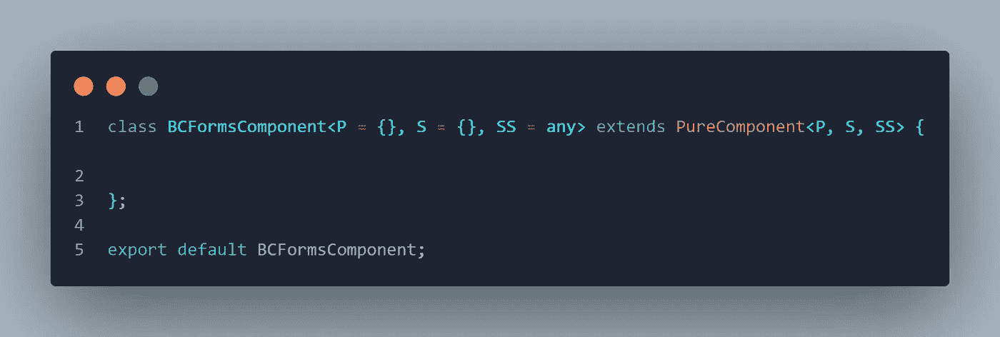
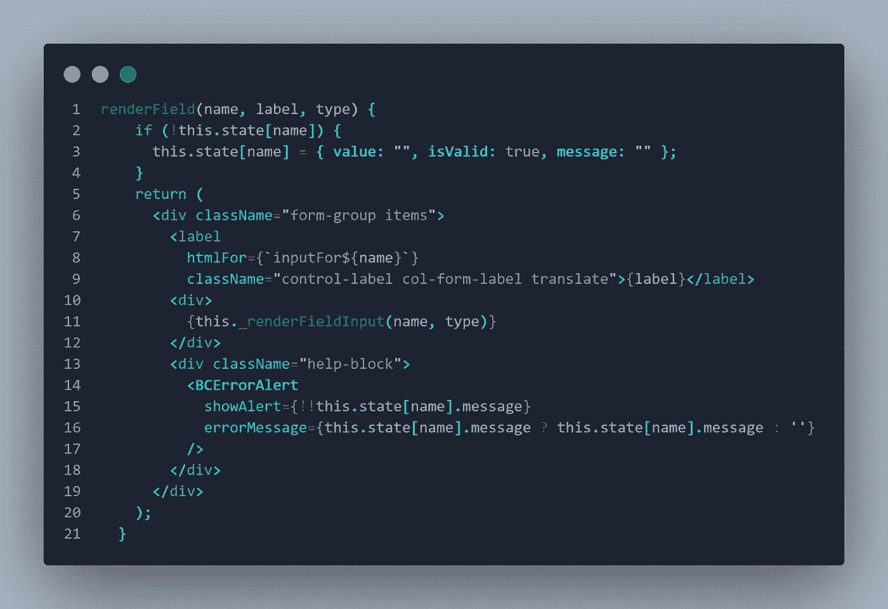
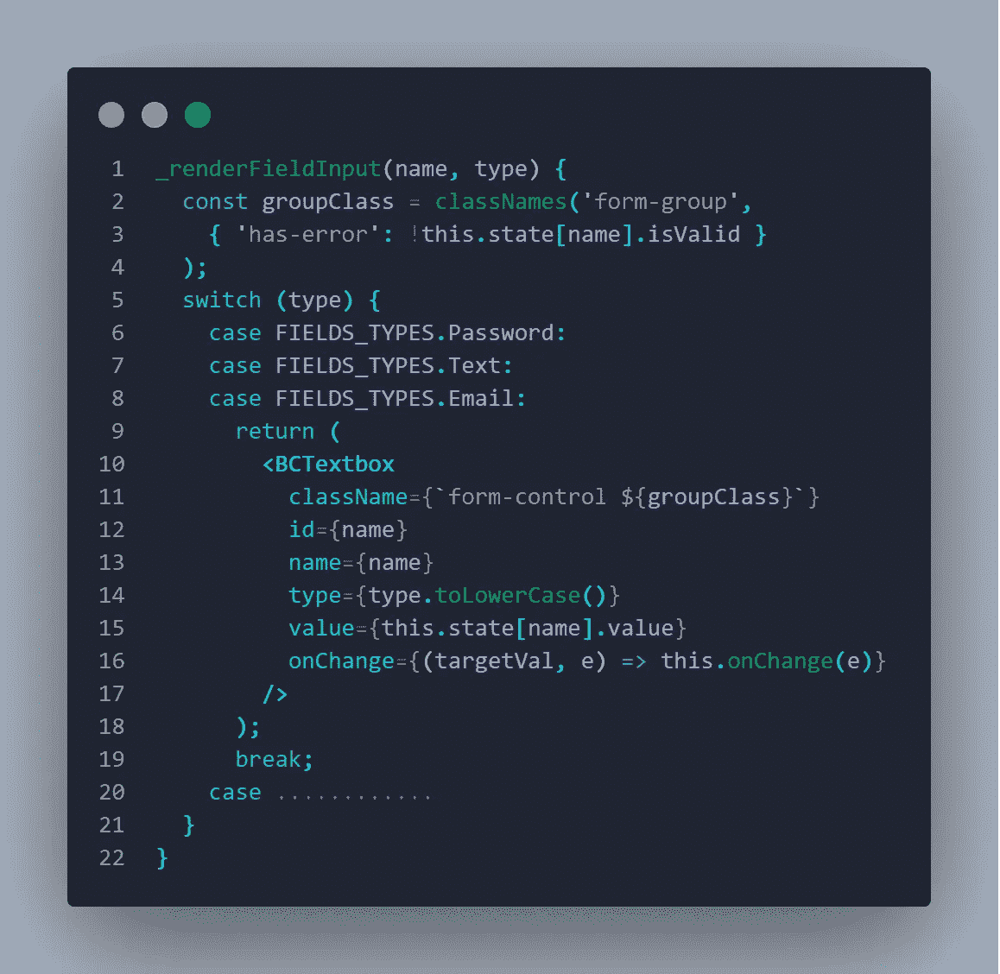
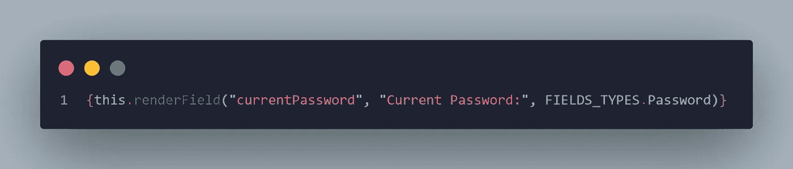
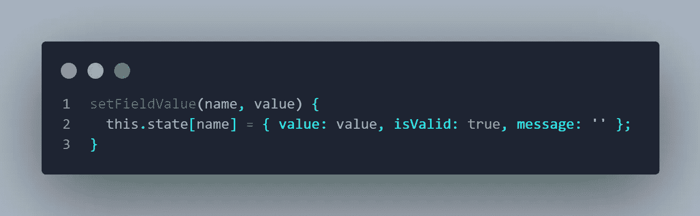
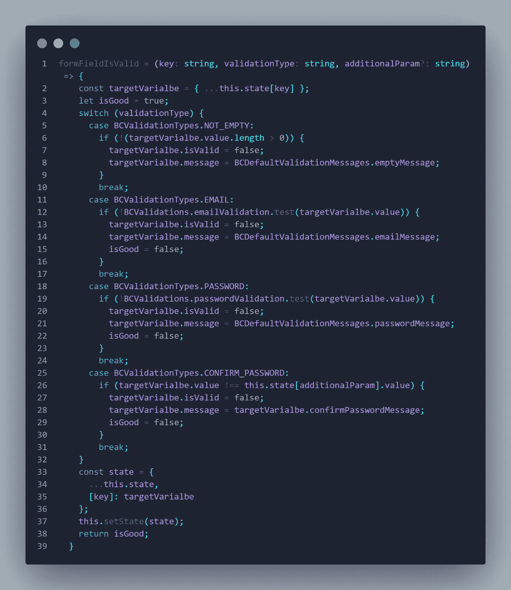
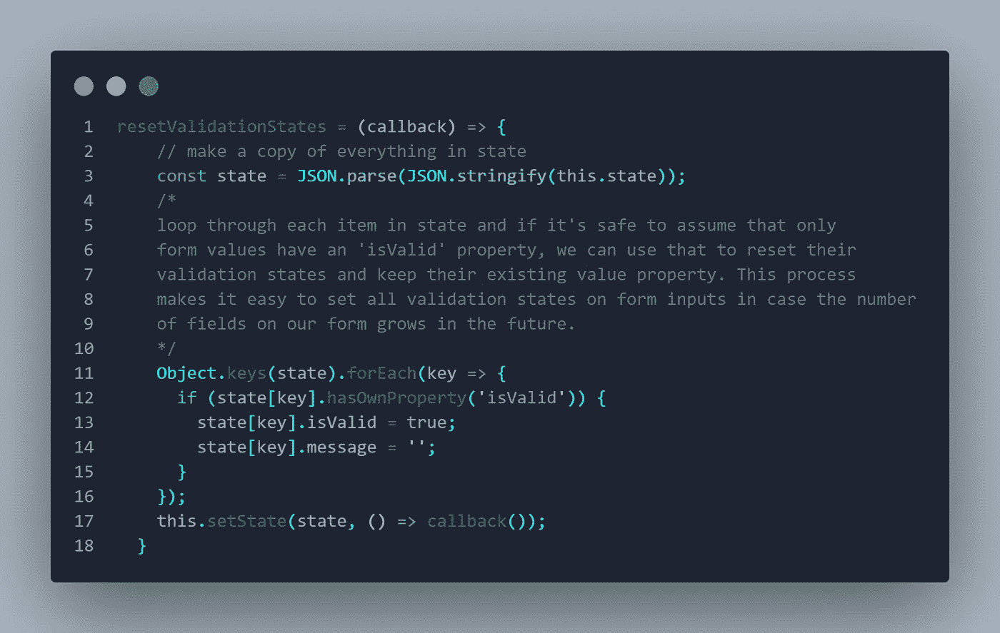
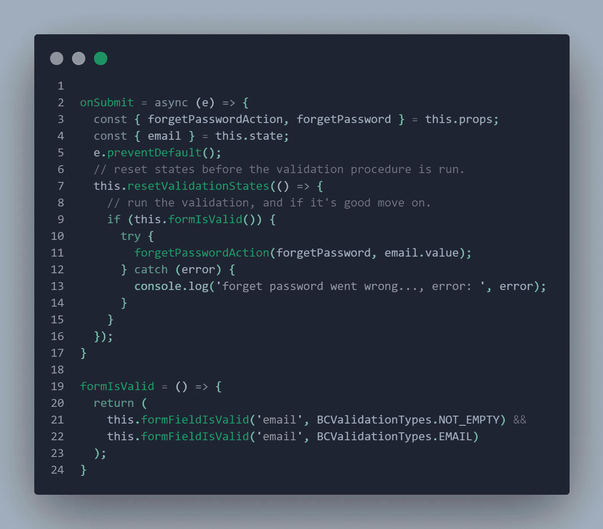

# React 中的抽象表单组件

> 原文：<https://javascript.plainenglish.io/abstract-forms-component-in-react-25304681fd55?source=collection_archive---------7----------------------->

DRY(不要重复自己)是软件开发的一个原则，旨在减少软件模式的**重复**，用**抽象**代替或者使用**数据规范化**来避免冗余。虽然 React 开发在富表单应用程序中的本质将包括大量处理状态变量、验证和呈现字段的重复工作；我在本文中介绍了一种通过抽象的 React 组件来抽象这些操作的方法。

第一步是创建一个作为抽象表单组件的 React 组件，它应该从任何需要访问这些特性的视图组件继承而来。该组件的示例如下:

# 抽象处理字段生成

通常我们需要有相同的渲染字段的方式，通常包含以下步骤:

1-选择输入组件(当然，在这种情况下，不要忘记实现您自己的低级输入组件:)

2-选择组的结构和需要的 CSS 类

3-呈现错误消息组件

4-呈现验证类逻辑

接下来是一个如何在代码中处理这个问题的例子:

这个函数将呈现一个表单组(引导表单组),它包括一个标签、一个低级组件的占位符、一个帮助块来呈现其中的错误。我还使用了一个显示错误的就绪组件。

请注意，我做了另一个函数来根据字段的类型呈现低级输入组件，函数代码如下:

通常，如果是一个私有函数，我更喜欢用 _ 作为函数名的开头。

我们可以注意到，对于三种类型(密码、文本和电子邮件),我们正在呈现一个文本框组件。以此类推，我们将呈现适合该类型的底层组件。像文件上传的图像类型和日期类型的日期选择器…等。

我们可以看到，在出现错误的情况下，has-error 将被附加到组件 CSS 类中，我们可以根据需要显示错误(比如输入组件周围的红色边框)。

因此，为了在任何子组件中使用“renderField”函数，我们只需像下面这样调用它:

请注意，在这个函数中，如果状态变量尚未初始化，我们将对其进行初始化，对于每个变量(字段)，我们有三个属性:

*   **Value** :存储字段的真实值
*   **IsValid** :一个布尔值，用来知道该字段是否有效
*   **信息**:无效时的错误信息

但是，如果需要在呈现组件之前对其进行初始化，我们可以为此实现下一个函数:

# 抽象验证操作

大多数时候，在表单内部，我们可能需要验证字段，拥有一个以简洁的方式处理验证的函数是一个非常好的主意。下一个函数是接受字段名、验证类型和需要时的附加参数。如果它遵循与该类型相关的验证规则，它将检查具有该名称的字段。然后，该函数将 IsValid 更新为 false，如果它无效，则使用目标字段的错误消息更新消息；这意味着该字段将使用错误样式和消息再次重新呈现。

我们可以根据需要添加更多的验证类型，我们还需要一个函数来重置整个字段，这样错误消息和样式就会消失，下一个函数可以轻松地迭代所有表单字段并重置它们:

请注意,“resetValidationStates”函数需要一个参数(回调参数),因为在 React 中更新状态不是以同步的方式进行的，所以我们需要确保在再次验证之前所有字段都被重置。

最后，我们得到了一个非常简洁的方法，只需几行代码就可以在视图组件中验证任何表单字段，比如下一个示例显示了我如何在分派操作之前验证忘记密码的表单:

我希望这篇文章能够支持您的 React 项目，使代码更有组织、更短、更干净，并且在需要遵循 DRY 原则时有一个修改的地方:)

## 简单英语的 JavaScript

喜欢这篇文章吗？如果是这样，通过 [**订阅解码获得更多类似内容，我们的 YouTube 频道**](https://www.youtube.com/channel/UCtipWUghju290NWcn8jhyAw) **！**