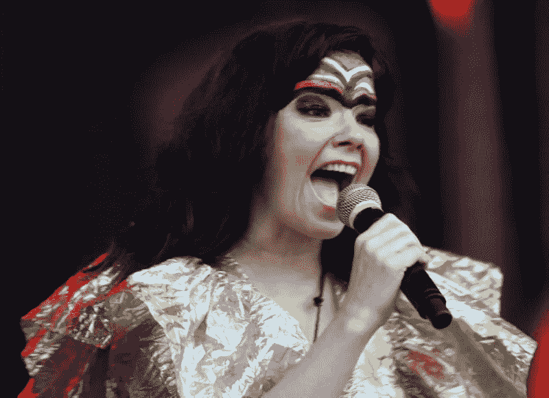

# 盖茨比形象和反应挂钩的无障碍艺术指导

> 原文：<https://javascript.plainenglish.io/accessible-art-direction-with-gatbsy-images-600b7b23eca8?source=collection_archive---------6----------------------->

我最近在盖茨比纽约聚会上做了一个关于用盖茨比中的图像做艺术指导的演讲。

我以前在这个聚会上讲过如何处理《盖茨比》中的图像，以及盖茨比用你的现成图像做的所有很酷的事情。

当我开始探索艺术方向并为演讲建立一个示例网站时，我意识到没有一种明显的方式为我的图像提供替代文本。

由于制作不可访问的网站是坏开发人员做的事情(我想成为一个好的开发人员)，我想出了一个使用状态和自定义 Graphql 字段的解决方案。

所以，我想我会分享给你:)

如果你想跳过这篇文章，直接进入[回购](https://github.com/mrkutly/gatsby-nyc-talk-good-example)，那也没问题。最后一个例子是[这里主持](https://naughty-kare-c652c4.netlify.com/art/best/)。

# 什么是艺术方向？

不是所有的图片在任何尺寸下都好看。有些图片真的大的时候看起来很棒，小的时候就有点平淡无奇了。就像这广阔的冰岛风景:

其他人可能看起来很小，但看起来很奇怪或变得粒状大。比如 bjrk 的这张照片:

当你的网站根据*不同的断点显示 ***不同的图像*** 时，这就是所谓的艺术指导。*

# *我们该如何对待盖茨比呢？*

*如果你之前和`gatsby-image`合作过，这个你会很熟悉。如果没有，我建议按照这里的[文档](https://www.gatsbyjs.org/docs/gatsby-image/)进行设置，并学习如何在 Gatsby 中渲染单个图像。*

*为了让我们的图像与盖茨比艺术指导，我们将遵循以下步骤:*

*1.用 graphql 查询我们的图像*

*2.创建图像源阵列*

*3.将数组传递给 gatsby ``组件*

# *步骤 1 -查询图像*

*这里，我们从文件系统中查询三个映像，并将结果命名为`reynisfjara`、`skogafoss`和`bjork`。我们使用`GatsbyImageSharpFluid` graphql 片段来获取创建一些流动图像所需的一切。如果这部分对你来说是陌生的，我建议你浏览一下[文档](https://www.gatsbyjs.org/docs/gatsby-image/)并练习自己绘制一些图像。*

# *步骤 2 -创建一个源数组*

*现在我们有了查询，我们的图像将在页面组件的 props 的“data”属性中可用。*

*首先，让我们把这些图像从道具中提取出来:*

*既然我们已经访问了需要提供给`` 组件的所有图像数据，我们就可以创建图像源数组了。*

*每个源都是添加了`media`属性的`GatsbyImageSharpFluid`片段的结果。*

*`media`属性将是一个 CSS 媒体查询，告诉``组件哪个图像需要在每个断点显示。*

*我们将在以下断点显示这些图像:*

*- **下方 701px** - `bjork`*

*-**701 像素到 1000 像素** - `skogafoss`*

*-**1000 px 以上** - `reynisfjara`*

*因此，我们的源数组看起来像这样:*

*太好了。现在我们有了源数组。让我们进入第三步！*

# *步骤 3 —将数组传递给 gatbsy-image*

*代替将单个`fluid`图像结果作为流体道具传递给``组件(我们对单个图像所做的方式)，我们将把源数组传递给它。所以让我们从`gatsby-image`导入``组件来做吧！*

*厉害！我们做到了。太神奇了。我们完了，对吧？*

# *没有。没完成。你的替代文本呢？*

*糟糕。我们太花哨了，现在我们的网站坏了。因为我们不知道在任何给定的时间显示的是哪个图像，所以我们不能给它一个`alt`属性。我们该如何处理这件事？*

*幸运的是，``组件接受了一个非常有用的叫做`onLoad`的道具。`onLoad`是一个回调函数，它将在图像加载时被调用。*

*因为我们是超级聪明的 React 开发者，我打赌我们可以使用 state 来跟踪哪个图像正在被显示，并相应地更新 alt 文本。让我们开始吧！*

*首先，我们设置我们的状态并将其传递给``组件的`alt`属性:*

*接下来，我们将使用`onLoad` 回调来跟踪替换文本应该是什么。我们将通过检查视口的宽度来做到这一点。*

*很好。危机解除。现在，我们的艺术指导图像有了替代文本。*

# *我们说完了吗？*

*大概不会。我们解决了问题，但是如果我们想在项目的其他地方重用这些图像呢？*

*所有的替代文本都被硬编码在我们的页面组件中。这意味着我们每次使用这些图像时都必须重写这些替代文本！*

*如果有什么方法可以让我们将 alt 文本附加到这些图片上就好了。这样，每当我们 ***查询*** 图像时，alt 文本就会随之出现。*

# *在 gatsby-node.js 中创建自定义字段*

*事实证明，我们可以使用`gatsby-node.js`文件中的`onCreateNode`函数来实现这一点。*

*这个函数将在我们的图上创建每个节点时运行一次。这意味着任何图像、markdown 文件、json 文件——作为我们数据层的一部分设置的任何东西——都将触发这个功能。*

*这个`onCreateNode`函数的一个非常方便的用途是将自定义字段附加到我们的节点上。因此，对于我们的图像，我们可以为它们附加替代文本，这些替代文本可以 ***写一次******在任何地方使用*** 。*

*首先，让我们为我们的图像创建一个基本的配置对象:*

*通常，我会把它放在自己的文件中，并导入到`gatsby-node.js`中，但是为了简单起见，我们暂时把它放在这里。*

*接下来，我们可以使用`onCreateNode`功能将这些配置附加到图像上:*

*现在，我们的每个图像都有一个附加的 alt 文本。这意味着当我们用 GraphQL 查询图像时，alt 文本可能会随之出现。*

*让我们重写一下之前的`icelandImagesQuery`:*

*太好了！现在让我们用它来代替硬编码的替代文本。*

# *谢谢:)*

*仅此而已。感谢阅读！米格韦希·❤*