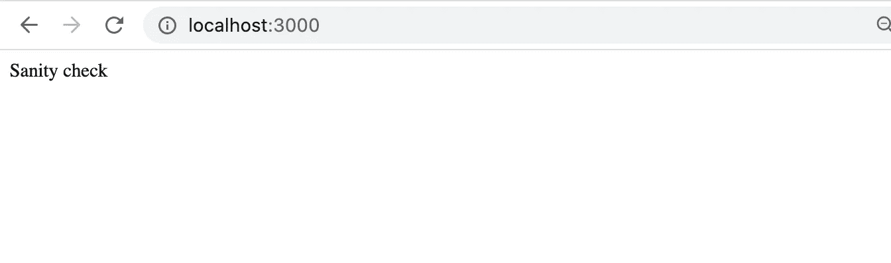
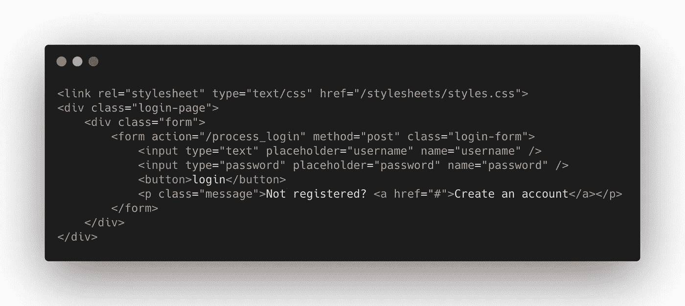
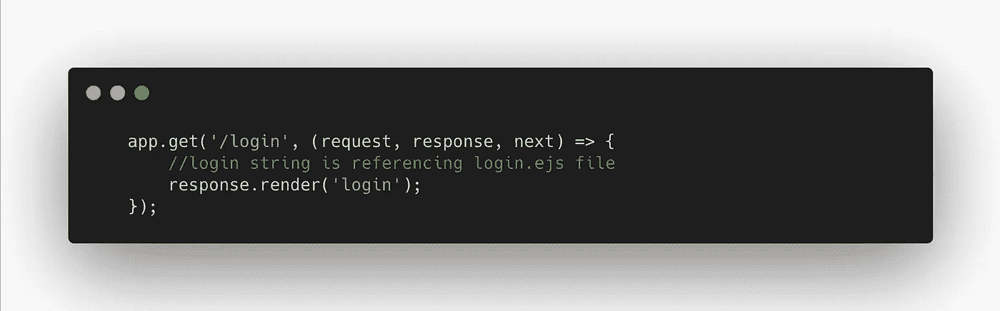
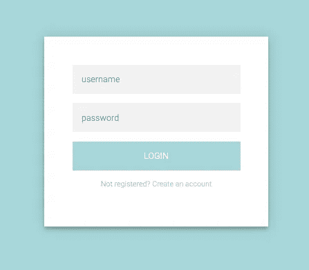
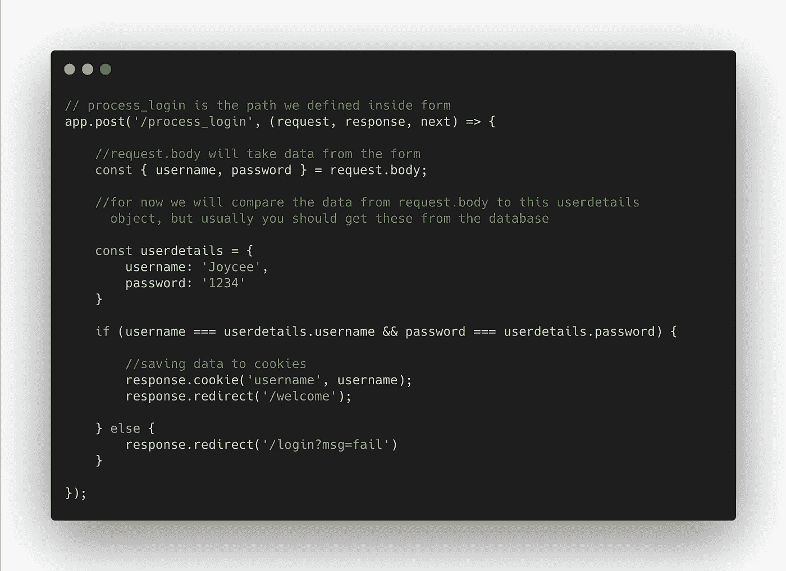
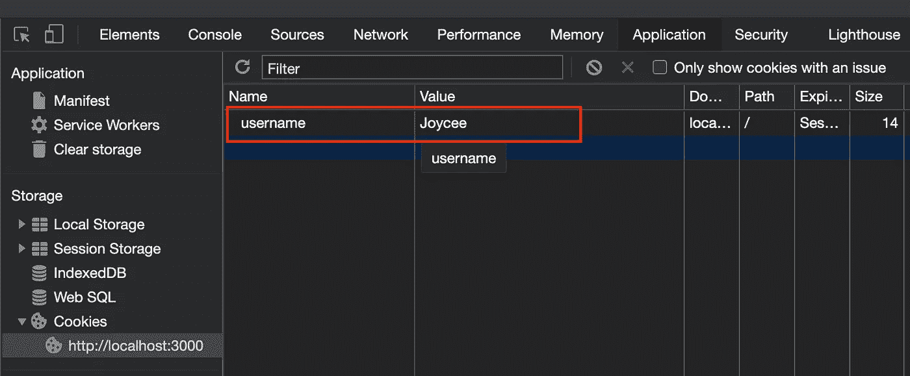
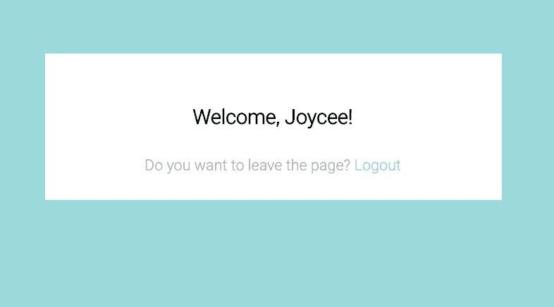
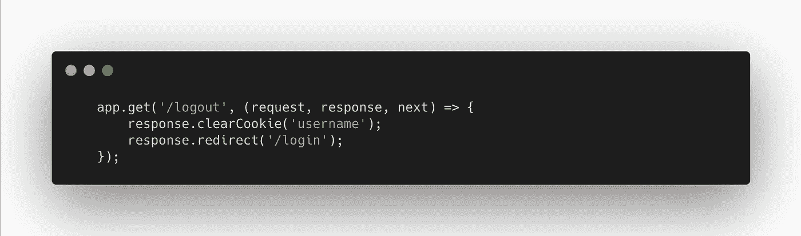

# 使用 Express & Node.js 从 Cookies 和表单中访问数据

> 原文：<https://javascript.plainenglish.io/accessing-data-from-cookies-and-forms-using-express-node-js-c140c9f59f6d?source=collection_archive---------4----------------------->

## 使用 Node.js 了解 Express

## 了解如何通过 Cookies 和表单从请求对象获取数据


Photo by [The Creative Exchange](https://unsplash.com/@thecreative_exchange) on Unsplash.

对于有兴趣将 node 用作 web 服务器或者将 WebSockets 与 Express 结合使用的开发人员。这篇文章一定会对你有益。

***Express.js*** *，或简称为* ***Express*** *，是一个后端 web 应用框架，为*[*node . js*](https://en.wikipedia.org/wiki/Node.js)*，在 MIT 许可下作为免费开源软件发布。它是为构建 web 应用程序和 API 而设计的。它被称为 Node.js 的* [*事实上的标准*](https://en.wikipedia.org/wiki/De_facto_standard) *服务器框架——Wikipedia.org*

# **初始设置**

1.  使用 **npm init** 命令为应用程序创建一个 **package.json** 文件，要了解更多关于 NPM package . JSON 的规范，你可以去这个[链接](https://docs.npmjs.com/files/package.json)，否则按回车键保留默认配置。

```
 **npm init**
```

2.安装[***Express***](https://expressjs.com/)并通过运行以下命令将其添加到依赖列表中:

```
**npm install express -- save**
```

3.安装[***node mon***](https://nodemon.io/)，这是一个实用程序，它会监视您在源文件中所做的更改，并会自动为您重启服务器。这在开发过程中很有帮助，所以每当您添加一些更改时，您不需要不断重启服务器。

```
**npm install nodemon -- save**
```

4.安装 [***头盔***](https://helmetjs.github.io/)——这是一个 Express 中间件 web 框架。通过适当地提供 HTTP 头，Helmet 可以帮助保护 Express 应用程序免受各种已知漏洞的影响。头盔由 11 个较小的中间件函数组成，这些函数设置与安全相关的 HTTP 请求头。

```
**npm install helmet -- save**
```

5.为了能够从 cookie 中获取信息，你需要安装一个 cookie 解析器**。**[***cookie-parser***](http://expressjs.com/en/resources/middleware/cookie-parser.html)是一个 Express 中间件函数，负责解析 Cookie 头，并将 Cookie 数据公开为 *response.cookie* 。

```
**npm install cookie-parser -- save**
```

6.对于你的模板，你需要安装 EJS。 [EJS](https://ejs.co/) 是一种简单的模板语言，可以让你用普通的 Javascript 生成 HTML 标记。

```
**npm install ejs -- save**
```

7.在根目录下添加 ***index.js*** 文件。这个文件与您在生成 package.json 时指定为*入口点*的文件相同。

```
**touch index.js**
```

8.配置 ***package.json*** 。如果您想更改您在 package.json 中指定为入口点的文件名，您可以在*脚本*部分中指定它。为了能够在运行应用程序时使用 ***Nodemon*** ，您需要将 start 命令的属性更改为:

```
**“start”: “nodemon index.js”**
```

# 目录结构

Express 是一个非个人化的 web 框架，因此，只要你提供正确的脚本路径，文件夹结构将不仅仅影响应用程序的运行。在这个项目中，因为它只是一个简单的应用程序，将描述如何从表单和 cookies 中访问数据，我们将使用下面的文件夹结构，但如果你想要一个详细和完整的脚手架，你可能想使用 [Express generator](http://expressjs.com/en/starter/generator.html) 代替。

```
.
├── public
│   └── stylesheets
│       └── styles.css
├── views
│   ├── login.ejs
│   └── welcome.ejs
├── index.js
├── package.json
└── README.md
```

# 在主文件中

现在您已经完成了应用程序的设置，我们将开始在 *index.js* 文件中添加所需的脚本。我们将一行一行地检查代码，我将尝试添加一个详细的解释，说明代码的作用和用途。

下面的代码显示了如何在一个常量中赋值 express，并声明了另一个常量 *app* ，以便我们稍后可以调用 Express。

```
**const express = require(‘express’);
const app = express();**
```

然后，您必须指定您将使用的端口，该端口应该是 1000 及以上，以便它的工作。

```
**const port = 3000;
app.listen(port);**
```

Express 有一个内置的中间件函数，你需要添加它来指定你的静态文件的位置——**path。由于它是内置的，你可能会注意到我们在初始设置时不需要安装它。只要把它存储在一个变量中就可以使用了。**

```
**const path = require(‘path’);**
```

为安全连接添加中间件 ***头盔*** 也是习惯和标准。

```
**const helmet = require(‘helmet’);
app.use(helmet());**
```

你必须调用[***express . json()***](https://expressjs.com/en/4x/api.html#express.json)—这是 Express 中内置的中间件功能，它使用 JSON 有效负载解析传入的请求，并基于*主体解析器*。

```
**app.use(express.json());**
```

以及[***express . urlencoded(***](https://expressjs.com/en/4x/api.html#express.urlencoded)***)***—它解析 *urlencoded* 主体，并且只查看*内容类型*与*类型*选项匹配的请求。

```
**app.use(express.urlencoded());**
```

为了在应用程序中添加和使用静态文件，我们需要使用 Express 内置中间件—[***Express . static()***](https://expressjs.com/en/4x/api.html#express.static)，它接受根参数，即您将放置所有静态资产的文件夹名称。在这个应用程序中，我们将把它们放在 **public** 文件夹中。

如果找不到该文件，它将执行回调中的 ***next()*** 参数，然后移动到下一个中间件来执行，允许回退和堆栈，而不是显示 404 响应。

```
**app.use(express.static(‘public’));**
```

然后我们需要定义使用哪个 javascript 模板，还有其他可用的 JS 模板如 [***帕格***](https://pugjs.org/api/getting-started.html) *，* [***车把***](https://handlebarsjs.com/) *，**[*小胡子*](https://mustache.github.io/) *。*但是，在这个应用中，我们将使用 EJS。*

```
***app.use(‘view engine’, ‘ejs’);
app.use(‘views’, path.join(__dirname, ‘views’));***
```

*在根页面上，您现在只需显示*‘健全性检查’*文本。以确保我们的配置和我们编写的代码运行良好。我们将重点关注*登录*页面，因此无需在此页面呈现详细信息。*

```
***app.get(‘/’, (response, request, next) => {
    app.send(‘Sanity check’);
});***
```

*我们现在已经完成了初始设置，您可以使用下面的命令在您的本地机器上运行它:*

```
***npm start***
```

*然后在浏览器中导航到[**https://localhost:3000**](https://localhost:3000)**。您应该能够看到与下面截图相同的页面:***

******

***View to the root page.***

# ***构建表单模板***

***本文的重点是指导你如何从表单和 Cookie 中获取数据，所以不要浪费太多时间设计模板。你可以参考我在这个[文件](https://github.com/foobearer/Express-Form-and-Cookies/blob/main/public/stylesheets/styles.css)中写的 CSS，并将其复制到***/public/style sheet****文件夹中的 styles.css 中。****

****对于模板，您需要创建一个新文件 *login.ejs* ，然后将其放在 **/views** 文件夹中，并添加以下代码:****

********

****login.ejs page template.****

****为了让我们在浏览器上看到上面的模板，我们必须创建一个 get 请求，如下所示:****

********

****index.js — adding get a request to display the login.ejs page.****

****太好了，现在您可以导航到浏览器并进入登录页面。[https://localhost:3000/log in](http://localhost:3000/login)。****

********

****login page view.****

# ****从 cookie 中获取数据****

****如果您返回并检查我们上面创建的登录表单，您将看到在表单标记的 ***action*** 属性下，我们添加了一个***/process _ log in***路径，该路径将执行我们放在 POST 请求中的代码。按照下面的图像:****

********

****index.js — post method to get data from the form and to save that inside a cookie.****

****当您按下页面上的登录按钮时，您在表单中提供的用户名和密码将被转发到请求主体。****

****我们可以用它来验证我们是将用户重定向到欢迎页面还是返回到登录页面。****

****在上面的代码中，要将这些数据保存到 cookie 中，我们只需添加:****

```
******response.cookie('username', username);******
```

****为了确保它正常工作，检查页面并导航到 ***应用*** 选项卡，然后单击侧边栏上的 cookies:****

********

****Checking the data saved inside Cookies.****

****一旦您的用户凭证与 *userdetails* 对象中的凭证相匹配，您将被重定向到 *welcome* 页面:****

********

****Welcome page view — https://localhost:3000/welcome:.****

# ****从 Cookies 中删除数据****

****删除 cookie 里面保存的数据非常简单。您只需要在下面添加这段代码。****

```
******response.clearCookie('username');******
```

****最后一部分是添加注销的代码片段。****

********

****index.js — logout GET method.****

****如果你热衷于学习并且想要获得这个应用程序的完整副本，你可以在我的 GitHub 帐户中克隆这个[库](https://github.com/foobearer/Express-Form-and-Cookies)。✌🏻😉****

****你觉得这篇文章有帮助吗？别忘了在评论区留下一些反馈。****

## ****参考资料:****

****[快递](https://expressjs.com/)****

****[头盔](https://helmetjs.github.io/)****

****[NPM package . JSON 规范](https://docs.npmjs.com/files/package.json)****