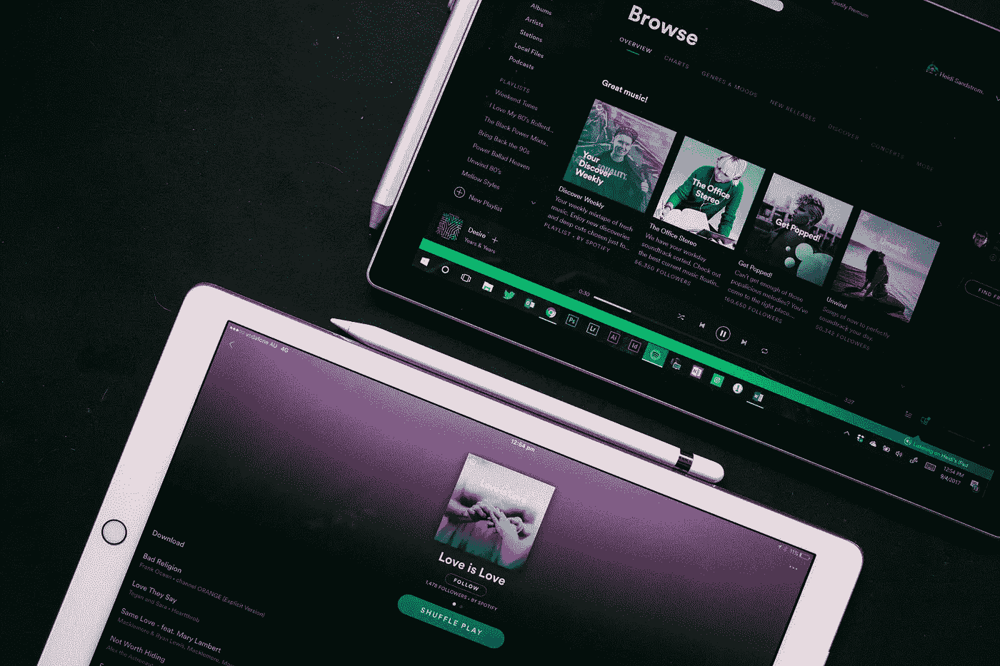
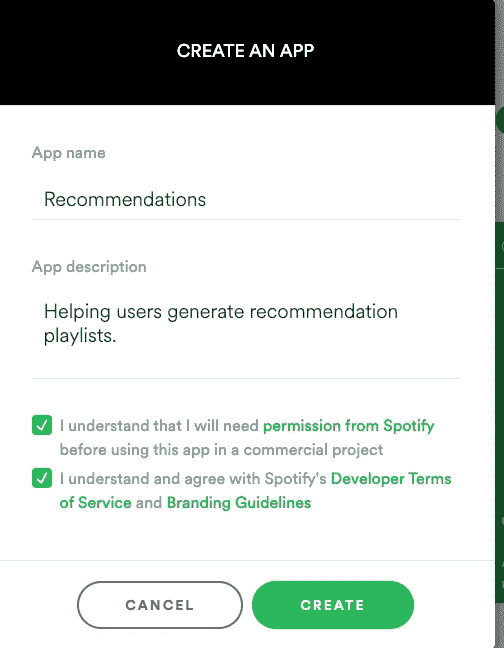
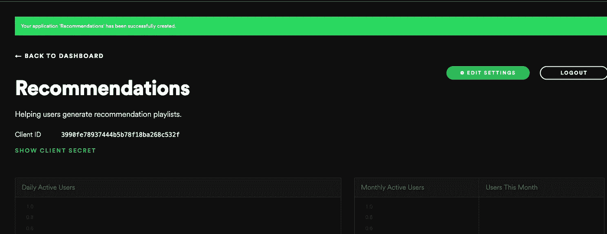

# 让我们用 Spotify 算法和 API 构建一个全栈应用

> 原文：<https://javascript.plainenglish.io/accessing-the-spotifyalgorithm-full-stack-application-tutorial-part-1-792a2c0ff13?source=collection_archive---------3----------------------->



Photo by [Heidi Fin](https://unsplash.com/@heidifin?utm_source=unsplash&utm_medium=referral&utm_content=creditCopyText) on [Unsplash](https://unsplash.com/s/photos/spotify?utm_source=unsplash&utm_medium=referral&utm_content=creditCopyText)

首先，Spotify，如果你在看这个，请雇佣我。好了，现在我们已经解决了这个问题…

很多人不知道的是，Spotify 有一个不为人知的功能，那就是深度。如此之深，以至于特征本身可以是它自己的应用。这一切都存在于 Spotify 公共 web api 的一个小端点中:

`[https://api.spotify.com/v1/recommendations](https://api.spotify.com/v1/recommendations)`

或许，如果你最近刚进入 web 开发领域，你会在实践中偶然发现 Spotify 的公共 Web API。有了这个 API，您可以使用 premium 帐户进行身份验证，检索用户喜欢的歌曲和播放列表的所有数据，甚至可以通过浏览器使用他们的 Web Player SDK 播放音乐。

但是这个推荐端点完全是另外一回事。这个端点允许你利用 Spotify 的算法向你推荐歌曲。如果你使用 Spotify，你很可能至少听过一次你的个人精选播放列表。这些包括播放列表，如每周发现，释放雷达，或任何每日混音系列。通过一点小技巧，我们可以对推荐算法进行调整，并根据自己的喜好自动生成播放列表。

# 它是这样工作的

根据 Spotify 的 web api:

```
Recommendations are generated based on the available information for a given seed entity and matched against similar artists and tracks. If there is sufficient information about the provided seeds, a list of tracks will be returned together with pool size details.
```

因此，我们只需要提供任意数量的“种子”歌曲、艺术家或流派，就可以得到一个推荐曲目列表。

假设我想获得一个基于种子流派“electronic”的推荐播放列表(或者在本例中只有一首歌曲)。然后，我使用 Spotify 进行身份验证，并向推荐端点发送如下 get 请求:

```
"https://api.spotify.com/v1/recommendations?limit=1&market=US&seed_genres=electronic"
```

我会从他们的服务器收到这样的响应(为了便于查看，我删除了很多无用的数据):

```
{
  "tracks": [
    {
      "artists": [
          "id": "25fqWEebq6PoiGQIHIrdtv",
          "name": "Baauer",
          "type": "artist",
          "uri": "spotify:artist:25fqWEebq6PoiGQIHIrdtv"
        }
      ],
      "name": "Harlem Shake",
      "track_number": 1,
      "type": "track",
      "uri": "spotify:track:01XFgRZfZI7oBagNf1Loml"
    },
  ],
  "seeds": [
    {
      "initialPoolSize": 1000,
      "afterFilteringSize": 1000,
      "afterRelinkingSize": 972,
      "id": "electronic",
      "type": "GENRE",
      "href": null
    }
  ]
}
```

在这种情况下，我只使用流派种子`electronic`搜索了 1 首歌曲。我们必须能够用更多的领域来影响种子:

**限制:**返回的歌曲数量(最少 1 首，最多 100 首)

**种子艺术家:**逗号分隔的种子艺术家列表(需要使用他们的 spotify ID)

**种子 _ 流派:**可用流派种子集合中任何流派的逗号分隔列表`[https://api.spotify.com/v1/recommendations/available-genre-seeds](https://api.spotify.com/v1/recommendations/available-genre-seeds)`

**seed_tracks:** 种子轨道的 SpotifyIDs 的逗号分隔列表

然后我们有了真正有趣的东西:

**max _ *:_ _ _ _ _ _**的最大值

**min _ *:_ _ _ _ _ _ _ _ _**的最小值

**目标 _*:目标值 _____**

这些查询参数中的通配符指的是以下可调谐轨道属性列表:

**acoustic ness**:0.0 到 1.0 之间的一个关于音轨是否声学的置信度度量。

**可跳舞性:**根据音乐元素的组合，如节奏、韵律稳定性、节拍强度和整体规律性，判断一首曲目是否适合跳舞。

**duration_ms** :以毫秒为单位的音轨持续时间

**乐器性:**预测音轨是否不包含人声。

**键**:轨道所在的键。0=C，1=C#，2=D 等等

**活跃度**:检测录像中是否有观众。

**响度**:音轨的整体响度，单位为分贝。

**模式**:音轨的模态(大调/小调)值。大调为 1，小调为 0。

**人气**:赛道的人气。该值将介于 0 和 100 之间，100 是最受欢迎的。

**语速**:检测音轨中是否存在口语单词。

**速度**:一个音轨的整体估计速度，单位为每分钟节拍数(bpm)。

**time_signature** :估计的音轨整体时间签名。

**价**:描述曲目所传达的音乐积极性。价越高=越积极的氛围。

关于这些具体值的更深入的细节可以在本页上阅读。

# 非常棒

使用这个端点的能力真是太酷了。我们可以做一系列非常有趣的项目，但其中一个我一直想做的是一个播放列表生成器。这正是我们要做的，有一个反应前端和一个快速后端。让我们开始吧。

# 我对这个系列的计划

理想情况下，我想做的是一系列地检查整个堆栈任务，如下所示:

第 1 部分:设置后端
第 2 部分:创建前端组件&功能
第 3 部分:为后端+前端逻辑创建测试
第 4 部分:部署到生产服务器

# 制作服务器

我不会考虑后端服务器的所有后勤工作，主要是 Spotify 的认证部分。如果你有兴趣了解我是如何维护安全会话的，[请查看我最近写的另一篇文章，名为《如何创建安全反应&快速应用:](https://medium.com/javascript-in-plain-english/secure-react-express-apps-jsonwebtoken-cookie-session-auth0-and-passport-tutorial-e58d6dce6c91)

```
$ npm init (for creating a package.json, and checking my entry point to be server.js)And now we create our backend files$ touch server.js
$ touch .envNow for our backend dependencies$ yarn add express cookie-session helmet hpp csurf dotenv axios jsonwebtoken
```

这是我们的 server.js 的内容

```
// server.js
const express = require('express');
const session = require('cookie-session');
const helmet = require('helmet');
const hpp = require('hpp');
const csurf = require('csurf');
const dotenv = require('dotenv');
const path = require('path');

/* Import config */
dotenv.config({path: path.resolve(__dirname, '.env')});

/* Create Express App */
const app = express();

/* Set Security Configs */
app.use(helmet());
app.use(hpp());

/* Set Cookie Settings */
app.use(
    session({
        name: 'session',
        secret: process.env.COOKIE_SECRET,
        expires: new Date(Date.now() + 24 * 60 * 60 * 1000), // 24 hours
    })
);
app.use(csurf());

app.listen(8080, () => {
    console.log("I'm listening!");
});

module.exports = app;
```

目前你的。env 文件只需要一个值，这是我们用来签署我们的会话 cookie 的秘密:

```
# .env
COOKIE_SECRET=asecretyoushallputhere
```

运行您的应用程序应该会显示以下输出:

```
$ yarn start
yarn run v1.22.4
$ node server.js
I'm listening!
```

# 向 Spotify 注册我们的应用程序

1.  去[https://developer.spotify.com/dashboard/login](https://developer.spotify.com/dashboard/login)
2.  登录后，您可以使用 Spotify 创建一个应用程序，如下所示:



3.点击 create 后，我们被重定向到应用程序“建议”的仪表板



4.让我们点击“编辑设置”并将`[http://localhost:3000/auth/callback](http://localhost:3000/auth/callback)`添加到重定向 URIs 字段。这将是 Spotify 在向 Spotify 认证后将浏览器发送回的链接。

5.保存您的设置并查看仪表板，我们需要来自页面的两条信息，ClientID 和 ClientSecret。单击“显示客户端密码”查看并复制它。让我们把这些放进我们的。环境文件:

```
# .env
COOKIE_SECRET=yoursecretcookiekey
SPOTIFY_CLIENT_ID=<your client id here>
SPOTIFY_CLIENT_SECRET=<your client secret here>
```

## 制作身份验证路由

Spotify 实际上提供了几种不同的应用认证方式。其中之一是授权代码流。类似于我在另一篇文章中使用的 Auth0 流程，流程如下，这是 Spotify 提供的图形:


为了简化:

1.  让我们的应用程序请求授权，然后让用户通过 spotify 的授权流登录:

```
// routes/auth.js
const express = require('express');
const querystring = require('querystring');
const axios = require('axios');
const jwt = require('jsonwebtoken');

const router = express.Router();

router.get('/login', (req, res) => {
    res.redirect(`https://accounts.spotify.com/authorize?${querystring.stringify({
        response_type: 'code',
        client_id: process.env.SPOTIFY_CLIENT_ID,
        redirect_uri: process.env.SPOTIFY_REDIRECT_URI,
    })}`);
});
```

登录端点是我们将用户重定向到 spotify 授权页面的地方，传入 client_id、redirect_uri 和响应类型作为查询参数。

2.在我们从身份验证中收到代码后，我们可以使用它来获得一个访问和刷新令牌。访问令牌是我们从 Spotify Web API 获取数据所需要的，比如搜索曲目和使用推荐端点

```
router.get('/callback', async (req, res) => {
    const {code} = req.query;
    const clientId = process.env.SPOTIFY_CLIENT_ID;
    const secret = process.env.SPOTIFY_CLIENT_SECRET;
    const redirect_uri = process.env.SPOTIFY_REDIRECT_URI;
    const grant_type = 'authorization_code';

    const basicHeader = Buffer.*from*(`${clientId}:${secret}`).toString('base64');
    const {data} = await axios.post('https://accounts.spotify.com/api/token', querystring.stringify({
        grant_type,
        code,
        redirect_uri,
    }), {
        headers: {
            Authorization: `Basic ${basicHeader}`,
            'Content-Type': 'application/x-www-form-urlencoded'
        }
    });

    const sessionJWTObject = {
        token: data.access_token,
    };

    req.session.jwt = jwt.sign(sessionJWTObject, process.env.JWT_SECRET_KEY)
    return res.redirect('/');
});
```

这个请求看起来有点复杂，但没什么太糟糕的。它只是获取我们从请求查询中获得的代码，并使用它向[https://acounts.spotify.com/api/token.](https://acounts.spotify.com/api/token.)发送 post 请求。授权头是使用我们的 clientId 和 secret 的基本 Auth，内容类型是 Spotify 文档的规范。

如果我们打印出从这里得到的数据，看起来会像这样:

```
{
  access_token: 'longcode',
  token_type: 'Bearer',
  expires_in: 3600,
  refresh_token: 'anotherlongcode',
  scope: ''
}
```

我们从这个请求中获取访问令牌，并将其放入我们的会话 cookie 中。如果您想了解更多关于会话 cookies 的信息，请查看另一篇文章。

这就是 Spotify 认证的大部分内容！我们可以添加另外两个端点，让我们以后的生活更轻松:

```
router.get('/current-session', (req, res) => {
    jwt.verify(req.session.jwt, process.env.JWT_SECRET_KEY, (err, decodedToken) => {
        if (err || !decodedToken) {
            res.send(false);
        } else {
            res.send(decodedToken);
        }
    });
})

router.get('/logout', (req, res) => {
    req.session = null;
    res.redirect(
        `/`
    );
});

module.exports = router;
```

1.  `/current-session`:这个端点正在验证我们的会话对象中的 jwt-token，如果它有效，我们就在请求中将内容发送给客户机。如果不存在，我们返回 false。一旦我们做了前端，这就更有意义了
2.  `/logout`:这是一个端点，用于简单地销毁我们的 jwt 令牌，我们将使用它来确定用户是否通过了 Spotify 的身份验证。

# 第二部分在这里！

[https://stregz . medium . com/part-2-lets-build-a-full-stack-app-with-the-Spotify-algorithm-and-API-fronted-development-463 C6 c 232219](https://stregz.medium.com/part-2-lets-build-a-full-stack-app-with-the-spotify-algorithm-and-api-frontend-development-463c6c232219)

我们的 Spotify 播放列表推荐服务的后端部分已经非常完整了。我们现在需要做的是创建可以执行我们需要的所有功能的前端！我希望在本周晚些时候发布这个。如果你想查看我在本文中已经打出的代码，我正在这里创建这个项目:【https://github.com/jdstregz/spotify-recommendations

谢谢大家！