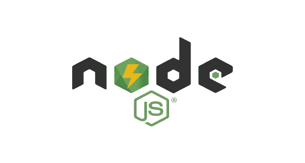
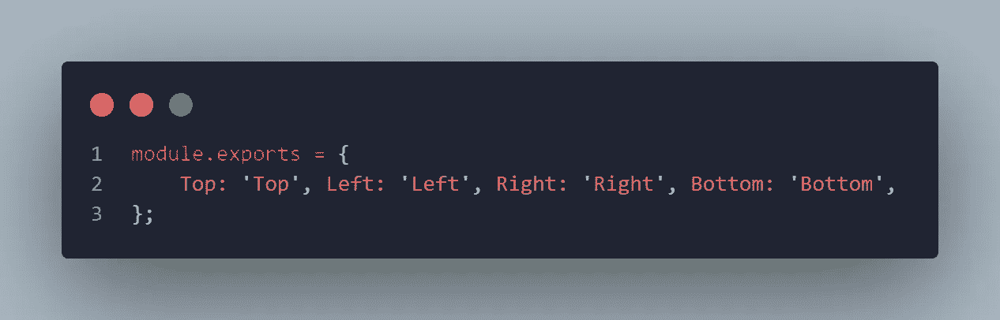
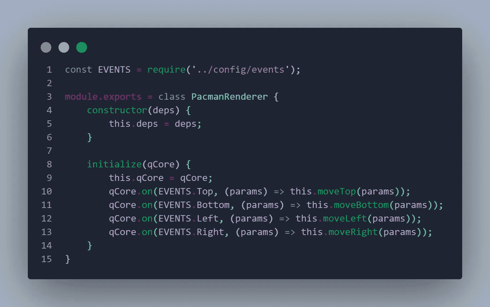
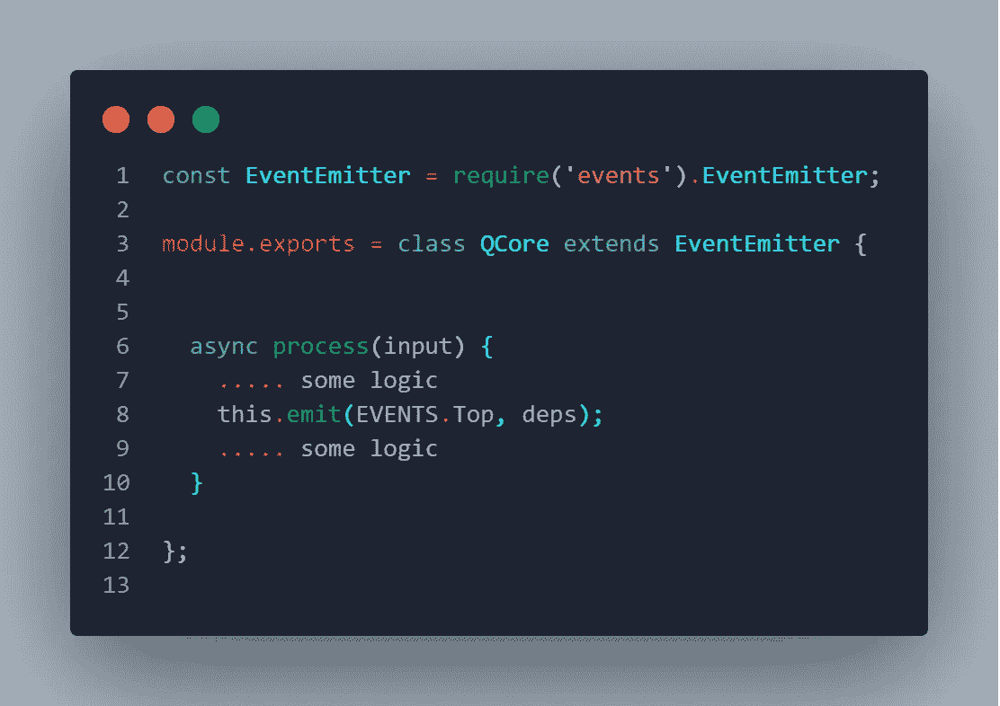
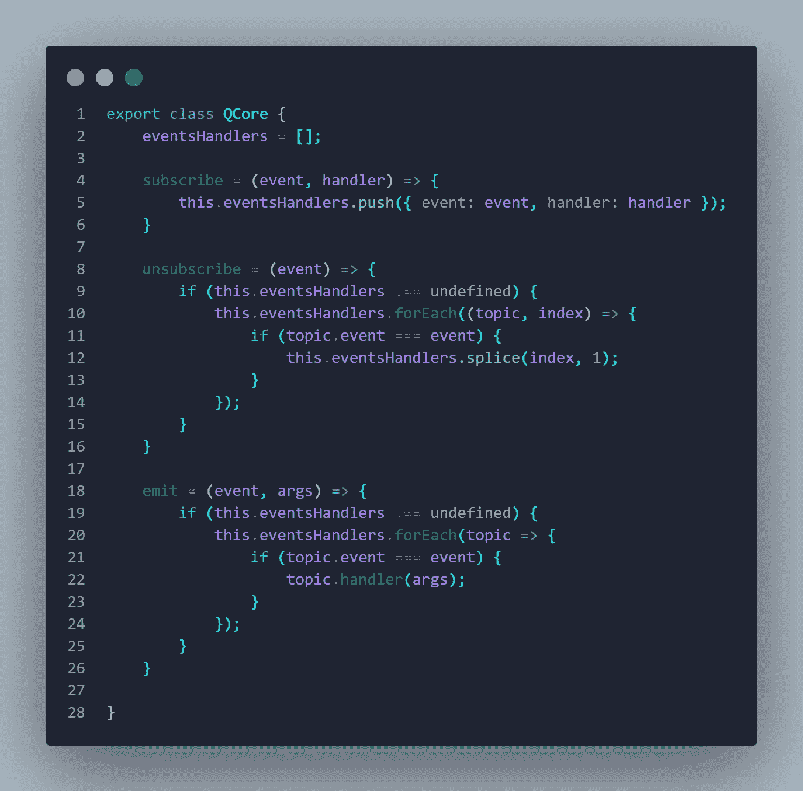

# 使用 Node.js 中的事件实现关注点分离

> 原文：<https://javascript.plainenglish.io/achieving-separation-of-concerns-using-events-in-nodejs-40e23b1d5c3b?source=collection_archive---------8----------------------->

**关注点分离(SoC)** 软件设计和架构中的一个重要概念，它是关于将系统分解成高度独立且在功能上略有重叠的部分。

对于 OOP 语言来说，**封装**和**继承**是实现 SoC 的主要方式之一。**事件驱动编程(EDP)** 也可以是 SoC 中的一个主要概念，理想情况下，抛出事件的模块不应该知道将处理它们的模块。在本文中，我将通过一个真实的例子带您在 **NodeJS** 中实现 EDP。

# 带示例的基本概念

我将谈论一个人工智能系统，它处理输入，在几个状态之间移动，并相应地采取行动。我可以举一个通过 Q 学习算法进行强化学习的例子。

虽然 Q-learning 算法的核心思想是使用奖励来优化代理的知识库，但是动作执行将是可以从学习过程中分离出来的另一个主题。

一个例子是 Pacman 游戏，其中动作将被限制在下面的列表中(上移-下移-左移-右移), SoC 将通过分离 Q-Learning 算法实现和将动作应用于屏幕以将 Pacman 移动到其中一个方向来实现。

在我的例子中，我将使用一个非常有趣的库来实现事件驱动系统:

 [## 事件

### 所有引擎的节点事件发射器。这为没有 Node.js 模块的环境实现了 node . js 模块，比如…

www.npmjs.com](https://www.npmjs.com/package/events) 

库中 EventEmitter 组件支持通过“Emitter”函数调度事件的能力，以及使用“on”函数将处理程序附加到事件的能力，接下来我们将更多地讨论这些概念。

事件驱动的系统通常由以下部分组成:

*   **Event:** 系统内部可能发生的事件类型，在我们的例子中是(Top，bottom，Left，Right)并且可以使用 enum 实现，我在 events.js 文件内部实现了该文件，该文件导出以下仅由键值对组成的对象，如果您不希望任何人错误地修改该对象，一个好的做法是对该对象使用 [Object.freeze()](https://developer.mozilla.org/en-US/docs/Web/JavaScript/Reference/Global_Objects/Object/freeze) :

*   **事件处理程序:**一个将被附加到事件的函数，因此每当调度程序调度该事件时，该函数将被触发以用特定的逻辑来处理该事件，我将通过一个由作为函数的处理程序组成的类来实现它，在初始化函数中，我将传递调度程序，并根据事件类型将事件处理程序与该调度程序链接起来，如下所示:

*   **事件分派器:**根据特定上下文分派事件的核心，下面是一个简单的例子:

简而言之，QCore 是我的主要组件，负责 Q-Learning 算法，决定下一个状态，并分派应该采取的行动。然后任何其他处理程序可以监听这些事件来移动 Pacman，做一些日志记录，给某人发送消息…等等。请注意，多个处理程序可以附加到同一个事件上，最好将每组处理程序封装在一个特定的类中，每个类都有一个单独的职责，比如日志记录、通信、渲染等等。

**注意:**我使用了一个库来实现事件驱动系统，但是你也可以自己设计，接下来是一个非常基本的例子，说明如何用 Javascript 来实现:

所以我相信一个例子总是比理论演讲更有助于更快地理解案例。我的例子是在人工智能中，但你可以在任何领域应用该模式，大多数时候，当你有一个管道来处理一些输入，你还想做一些与处理业务逻辑无关的其他事情时，那么最好的解决方案之一是为管道中的每一步分派事件，然后根据其他需要设计处理程序模块来处理事件。

我希望这种模式的快速概述可以帮助开始新项目的人，因为我知道在预先设计的项目中实现这一点并不容易，将包括大量的重构和测试:)但是相信我，如果您的项目在功能上有很多重叠，您会非常高兴。