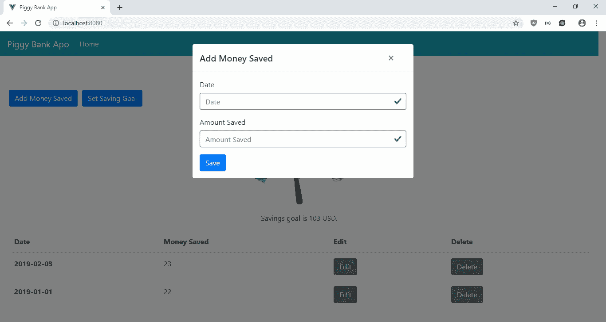
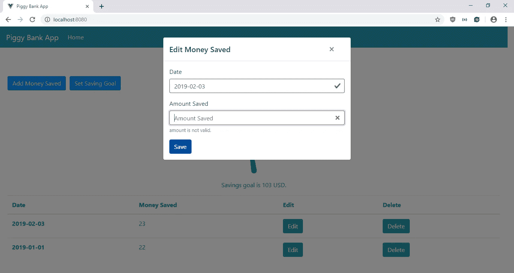

# 使用 VGauge 向您的 Vue.js 应用程序添加仪表图

> 原文：<https://javascript.plainenglish.io/add-a-gauge-chart-to-your-vue-js-app-with-vgauge-802c788254e6?source=collection_archive---------4----------------------->

如果某样东西接近最大值或最小值，量规图很方便显示。这对于可视化任何具有最大值或最小值的量是很方便的。制作自己的将是一个真正的痛苦，因为我们必须在画布上绘制形状、线条和文本来创建标尺。幸运的是，开发者创造了预制的解决方案供我们使用。

对于 Vue.js 应用程序，我们可以使用位于[https://github.com/amroessam/vgauge](https://github.com/amroessam/vgauge)的 VGauge 库，在我们自己的应用程序上放置量表。在本文中，我们将创建一个存钱罐应用程序，让用户设定他们的储蓄目标，并添加他们在给定日期的储蓄金额。我们将显示量表，让用户知道他们是否达到了节约目标。首先，我们将通过运行以下命令来运行 Vue CLI:

```
npx @vue/cli create piggy-bank
```

在向导中，我们选择“手动选择功能”，并选择 Vue 路由器、Vuex 和 Babel。

接下来，我们安装一些软件包。我们将使用 Axios 进行 HTTP 请求，使用 BootstrapVue 进行样式化，使用 VGauge 显示与目标相关的节省量，使用 VueFilterDateFormat 格式化模板中的日期，使用 Vee-Validate 进行表单验证。要安装它们，我们运行:

```
npm i axios bootstrap-vue vgauge vee-validate vue-filter-date-format
```

现在我们可以构建我们的应用程序了。在`components`文件夹中创建一个名为`GoalForm.vue`的文件，并添加:

```
<template>
  <ValidationObserver ref="observer" v-slot="{ invalid }">
    <b-form [@submit](http://twitter.com/submit).prevent="onSubmit" novalidate>
      <b-form-group label="Savings Amount Goal">
        <ValidationProvider name="amount" rules="required|min_value:0" v-slot="{ errors }">
          <b-form-input
            type="text"
            :state="errors.length == 0"
            v-model="form.amount"
            required
            placeholder="Savings Amount Goal"
            name="amount"
          ></b-form-input>
          <b-form-invalid-feedback :state="errors.length == 0">{{errors.join('. ')}}</b-form-invalid-feedback>
        </ValidationProvider>
      </b-form-group><b-button type="submit" variant="primary">Save</b-button>
    </b-form>
  </ValidationObserver>
</template><script>
import { requestsMixin } from "@/mixins/requestsMixin";export default {
  name: "SavingForm",
  mixins: [requestsMixin],
  data() {
    return {
      form: {}
    };
  },
  computed: {
    goal() {
      return this.$store.state.goal;
    }
  },
  beforeMount() {
    this.getSavingsGoal();
  },
  methods: {
    cancel() {
      this.$emit("cancelled");
    },async getSavingsGoal() {
      const { data } = await this.getGoal();
      this.$store.commit("setGoal", data);
    },async onSubmit() {
      const isValid = await this.$refs.observer.validate();
      if (!isValid) {
        return;
      }
      await this.setGoal(this.form);const { data } = await this.getSavings();
      this.$store.commit("setGoal", data);
      this.$emit("saved");
    }
  },
  watch: {
    goal: {
      handler(val) {
        this.form = val || {};
      },
      deep: true,
      immediate: true
    }
  }
};
</script>
```

该文件是让用户输入其储蓄目标的表单。我们有一个`getSavingsGoal`功能，从后端获取用户的储蓄。它在`beforeMount`钩子中被调用，并在`onSubmit`函数的末尾被调用，以获取最新的值。

在`onSubmit` 函数中，我们通过调用`this.$refs.observer.validate();`来使用 Vee-Validate 验证我们的表单，以确保输入了`amount` ，并且在保存之前它为 0 或更高。我们使用 Vee-Validate 来验证表单字段。`ValidationObserver`组件用于验证整个表单，而`ValidationProvider`组件用于验证它所包装的表单字段。验证规则由`amount` 字段的`rule`属性指定。`state`道具用于设置验证状态，当`errors`长度为 0 时显示绿色，否则显示红色。错误信息显示在`b-form-invalid-feedback`组件中。此页面只有国家下拉列表。

然后在同一文件夹中创建一个`SavingForm.vue`文件，并添加:

```
<template>
  <ValidationObserver ref="observer" v-slot="{ invalid }">
    <b-form [@submit](http://twitter.com/submit).prevent="onSubmit" novalidate>
      <b-form-group label="Date">
        <ValidationProvider name="date" rules="required|date" v-slot="{ errors }">
          <b-form-input
            type="text"
            :state="errors.length == 0"
            v-model="form.date"
            required
            placeholder="Date"
            name="date"
          ></b-form-input>
          <b-form-invalid-feedback :state="errors.length == 0">{{errors.join('. ')}}</b-form-invalid-feedback>
        </ValidationProvider>
      </b-form-group><b-form-group label="Amount Saved">
        <ValidationProvider name="amount" rules="required|min_value:0" v-slot="{ errors }">
          <b-form-input
            type="text"
            :state="errors.length == 0"
            v-model="form.amount"
            required
            placeholder="Amount Saved"
            name="amount"
          ></b-form-input>
          <b-form-invalid-feedback :state="errors.length == 0">{{errors.join('. ')}}</b-form-invalid-feedback>
        </ValidationProvider>
      </b-form-group><b-button type="submit" variant="primary">Save</b-button>
    </b-form>
  </ValidationObserver>
</template><script>
import { requestsMixin } from "@/mixins/requestsMixin";
import * as moment from "moment";export default {
  name: "SavingForm",
  props: {
    saving: Object,
    edit: Boolean
  },
  mixins: [requestsMixin],
  data() {
    return {
      form: {}
    };
  },
  computed: {
    savings() {
      return this.$store.state.savings;
    }
  },
  methods: {
    cancel() {
      this.$emit("cancelled");
    }, async onSubmit() {
      const isValid = await this.$refs.observer.validate();
      if (!isValid) {
        return;
      }
      const offDate = new Date(this.form.date);
      const correctedDate = new Date(
        offDate.getTime() + Math.abs(offDate.getTimezoneOffset() * 60000)
      ); const params = {
        ...this.form,
        date: correctedDate
      }; if (!this.edit) {
        await this.addSaving(params);
      } else {
        await this.editSaving(params);
      }
      const { data } = await this.getSavings();
      this.$store.commit("setSavings", data);
      this.$emit("saved");
    }
  },
  watch: {
    saving: {
      handler(val) {
        this.form = JSON.parse(JSON.stringify(val || {}));
        if (this.form.date) {
          this.form.date = moment(this.form.date).format("YYYY-MM-DD");
        }
      },
      deep: true,
      immediate: true
    }
  }
};
</script>
```

该文件是让用户输入其储蓄数据的表单。我们有一个带有`date` 和`amount` 字段的表单，让用户保存他们输入日期的储蓄金额。

在`onSubmit` 函数中，我们通过调用`this.$refs.observer.validate();`来使用 Vee-Validate 验证我们的表单，以确保在保存之前输入了`date` 和`amount` ，并且日期为 YYYY-MM-DD 格式，金额为 0 或更大。我们使用 Vee-Validate 来验证表单字段。`ValidationObserver`组件用于验证整个表单，而`ValidationProvider`组件用于验证它所包装的表单字段。验证规则由表单字段的`rule`属性指定。`date`是我们将添加的自定义验证规则。`state`道具用于设置验证状态，当`errors`长度为 0 时显示绿色，否则显示红色。错误信息显示在`b-form-invalid-feedback`组件中。此页面只有国家下拉列表。

接下来，我们在`src`文件夹中创建一个`mixins`文件夹，并创建一个名为`requestsMixin.js`文件的文件。在那里，我们添加:

```
const APIURL = "[http://localhost:3000](http://localhost:3000)";
const axios = require("axios");export const requestsMixin = {
  methods: {
    getSavings() {
      return axios.get(`${APIURL}/savings`);
    }, addSaving(data) {
      return axios.post(`${APIURL}/savings`, data);
    }, editSaving(data) {
      return axios.put(`${APIURL}/savings/${data.id}`, data);
    }, deleteSaving(id) {
      return axios.delete(`${APIURL}/savings/${id}`);
    }, getGoal() {
      return axios.get(`${APIURL}/goal`);
    }, setGoal(data) {
      return axios.post(`${APIURL}/goal`, data);
    }
  }
};
```

这些是获取并保存我们的储蓄和储蓄目标数据到后端的功能。

接下来在`views`文件夹中，我们将`Home.vue`文件中的代码替换为:

```
<template>
  <div class="page">
    <h1 class="text-center">Piggy Bank App</h1> <b-button-toolbar class="button-toolbar">
      <b-button [@click](http://twitter.com/click)="openAddModal()" variant="primary">Add Money Saved</b-button>
      <b-button [@click](http://twitter.com/click)="openGoalModal()" variant="primary">Set Saving Goal</b-button>
    </b-button-toolbar> <div class="text-center" v-if="goal && totalSavings">
      <v-gauge :maxValue="+goal" :minValue="0" :value="+totalSavings" unit="USD" top />
      <p>Savings goal is {{+goal}} USD.</p>
    </div> <b-modal id="add-modal" title="Add Money Saved" hide-footer>
      <SavingForm [@saved](http://twitter.com/saved)="closeModal()" [@cancelled](http://twitter.com/cancelled)="closeModal()" :edit="false" />
    </b-modal> <b-modal id="edit-modal" title="Edit Money Saved" hide-footer>
      <SavingForm
        [@saved](http://twitter.com/saved)="closeModal()"
        [@cancelled](http://twitter.com/cancelled)="closeModal()"
        :edit="true"
        :saving="selectedSaving"
      />
    </b-modal> <b-modal id="goal-modal" title="Set Saving Goal" hide-footer>
      <GoalForm [@saved](http://twitter.com/saved)="closeModal()" [@cancelled](http://twitter.com/cancelled)="closeModal()" />
    </b-modal> <b-table-simple responsive>
      <b-thead>
        <b-tr>
          <b-th sticky-column>Date</b-th>
          <b-th>Money Saved</b-th>
          <b-th>Edit</b-th>
          <b-th>Delete</b-th>
        </b-tr>
      </b-thead>
      <b-tbody>
        <b-tr v-for="s in savings" :key="s.id">
          <b-th sticky-column>{{ new Date(s.date) | dateFormat('YYYY-MM-DD') }}</b-th>
          <b-td>{{s.amount}}</b-td>
          <b-td>
            <b-button [@click](http://twitter.com/click)="openEditModal(s)">Edit</b-button>
          </b-td>
          <b-td>
            <b-button [@click](http://twitter.com/click)="deleteOneSaving(s.id)">Delete</b-button>
          </b-td>
        </b-tr>
      </b-tbody>
    </b-table-simple>
  </div>
</template><script>
// @ is an alias to /src
import SavingForm from "@/components/SavingForm.vue";
import GoalForm from "@/components/GoalForm.vue";
import { requestsMixin } from "@/mixins/requestsMixin";
import VGauge from "vgauge";export default {
  name: "home",
  components: {
    SavingForm,
    GoalForm,
    VGauge
  },
  mixins: [requestsMixin],
  data() {
    return {
      selectedSaving: {},
      goal: 0,
      totalSavings: 0
    };
  },
  computed: {
    savings() {
      return this.$store.state.savings.sort(
        (a, b) => +new Date(b.date) - +new Date(a.date)
      );
    }
  },
  beforeMount() {
    this.getAllSavings();
    this.getSavingsGoal();
  },
  methods: {
    openAddModal() {
      this.$bvModal.show("add-modal");
    }, openEditModal(saving) {
      this.$bvModal.show("edit-modal");
      this.selectedSaving = saving;
    }, closeModal() {
      this.$bvModal.hide("add-modal");
      this.$bvModal.hide("edit-modal");
      this.$bvModal.hide("goal-modal");
      this.getSavingsGoal();
      this.getAllSavings();
    }, openGoalModal() {
      this.$bvModal.show("goal-modal");
    }, async getAllSavings() {
      this.totalSavings = 0;
      const { data } = await this.getSavings();
      this.$store.commit("setSavings", data);
      this.totalSavings = +this.$store.state.savings
        .map(s => s.amount)
        .reduce((a, b) => +a + +b, 0);
    }, async deleteOneSaving(id) {
      await this.deleteSaving(id);
      this.getAllSavings();
    }, async getSavingsGoal() {
      this.goal = 0;
      const { data } = await this.getGoal();
      this.goal = +data.amount;
    }
  }
};
</script>
```

我们有按钮添加保存数据，以及编辑和删除他们在每一行。添加节省的钱和设定节省目标将分别用`SavingForm` 和`GoalForm`打开模式。我们使用`SavingForm`来添加和编辑保存条目。

节省数据从后端获取，并保存在我们的 Vuex 商店中。一旦它存在，我们就在`computed`属性中获取数据，然后显示来自`computed`属性的数据。

我们有一个表格来显示输入的保存数据。我们按日期降序排列，以时间倒序显示。在`scripts`部分，我们用`beforeMount`钩子在页面加载期间用我们在 mixin 中编写的`getAllSavings` 函数获取所有密码条目。当点击编辑按钮时，`selectedSaving`变量被设置，我们将它传递给`SavingForm`进行编辑。

要删除一个食谱，我们在 mixin 中调用`deleteSaving`通过`deleteOneSaving`函数向后端发出请求。

这里使用了 VGauge 组件。模板中的`v-gauge`元素将显示仪表图。`maxValue`道具被设置为我们的保存目标，保存在`goal`变量中，而`value`道具被设置为`totalSavings`变量。`units`设置为 USD 并显示在金额的末尾，而`top`支柱使`value`显示在标尺的顶部。`v-if=”goal && totalSavings”`非常重要。它允许我们通过将`goal`和`totalSavings`设置为 0 来刷新图形，然后再次设置从存储或后端获得的值。我们在`getAllSavings`和`getSavingsGoal`函数中完成了这项工作。

接下来在`App.vue`中，我们将现有代码替换为:

```
<template>
  <div id="app">
    <b-navbar toggleable="lg" type="dark" variant="info">
      <b-navbar-brand to="/">Piggy Bank App</b-navbar-brand> <b-navbar-toggle target="nav-collapse"></b-navbar-toggle> <b-collapse id="nav-collapse" is-nav>
        <b-navbar-nav>
          <b-nav-item to="/" :active="path  == '/'">Home</b-nav-item>
        </b-navbar-nav>
      </b-collapse>
    </b-navbar>
    <router-view />
  </div>
</template><script>
import { requestsMixin } from "@/mixins/requestsMixin";export default {
  mixins: [requestsMixin],
  data() {
    return {
      path: this.$route && this.$route.path
    };
  },
  watch: {
    $route(route) {
      this.path = route.path;
    }
  },
  beforeMount() {
    this.getSavingsGoal();
  },
  methods: {
    async getSavingsGoal() {
      const { data } = await this.getGoal();
      this.$store.commit("setGoal", data);
    }
  }
};
</script><style lang="scss">
.page {
  padding: 20px;
}button,
.btn.btn-primary {
  margin-right: 10px !important;
}.button-toolbar {
  margin-bottom: 10px;
}
</style>
```

在页面顶部添加一个引导导航条，以及一个显示我们定义的路线的`router-view`。这个`style`部分没有限定范围，所以样式将全局应用。在`.page`选择器中，我们给页面添加一些填充。我们还在这里为应用程序的按钮添加了边距。

在`script`部分，我们通过调用`this.getSavingsGoal`获得节约目标，并将它们放入我们的 Vuex 商店。

接下来在`main.js`中，我们将现有代码替换为:

```
import Vue from "vue";
import App from "./App.vue";
import router from "./router";
import store from "./store";
import BootstrapVue from "bootstrap-vue";
import "bootstrap/dist/css/bootstrap.css";
import "bootstrap-vue/dist/bootstrap-vue.css";
import { ValidationProvider, extend, ValidationObserver } from "vee-validate";
import { required, min_value } from "vee-validate/dist/rules";
import VueFilterDateFormat from "vue-filter-date-format";extend("required", required);
extend("min_value", min_value);
extend("date", {
  validate: value =>
    /([12]\d{3}-(0[1-9]|1[0-2])-(0[1-9]|[12]\d|3[01]))/.test(value),
  message: "Date must be in YYYY-MM-DD format"
});
Vue.use(VueFilterDateFormat);
Vue.component("ValidationProvider", ValidationProvider);
Vue.component("ValidationObserver", ValidationObserver);
Vue.use(BootstrapVue);Vue.config.productionTip = false;new Vue({
  router,
  store,
  render: h => h(App)
}).$mount("#app");
```

我们在这里添加了我们需要的所有库，包括 BootstrapVue JavaScript 和 CSS、Vee-Validate 组件以及验证规则。我们创建了`date`规则，它验证使用该规则的输入将是 YYYY-MM-DD 格式。此外，我们添加了 VueFilterDateFormat 包来格式化`Home.vue`中表的日期列中的日期。

在`router.js`中，我们用以下代码替换现有代码:

```
import Vue from "vue";
import Router from "vue-router";
import Home from "./views/Home.vue";Vue.use(Router);export default new Router({
  mode: "history",
  base: process.env.BASE_URL,
  routes: [
    {
      path: "/",
      name: "home",
      component: Home
    }
  ]
});
```

将主页包含在我们的路线中，以便用户可以看到该页面。

在`store.js`中，我们将现有代码替换为:

```
import Vue from "vue";
import Vuex from "vuex";Vue.use(Vuex);export default new Vuex.Store({
  state: {
    savings: [],
    goal: {}
  },
  mutations: {
    setSavings(state, payload) {
      state.savings = payload;
    }, setGoal(state, payload) {
      state.goal = payload;
    }
  },
  actions: {}
});
```

将我们的`recipes`状态添加到存储中，这样我们就可以在`GoalForm`、`SavingForm,` 和`HomePage`组件的`computed`块中观察到它。我们用`setSavings` 函数来更新`savings` 状态，并像在`SavingForm`中一样通过调用`this.$store.commit(“setSavings”, data);`在组件中使用它，用`setGoal`为`GoalForm`和`HomePage`设置储蓄目标数据。

最后，在`index.html`中，我们将现有代码替换为:

```
<!DOCTYPE html>
<html lang="en">
  <head>
    <meta charset="utf-8" />
    <meta http-equiv="X-UA-Compatible" content="IE=edge" />
    <meta name="viewport" content="width=device-width,initial-scale=1.0" />
    <link rel="icon" href="<%= BASE_URL %>favicon.ico" />
    <title>Piggy Bank App</title>
  </head>
  <body>
    <noscript>
      <strong
        >We're sorry but vgauge-tutorial-app doesn't work properly without
        JavaScript enabled. Please enable it to continue.</strong
      >
    </noscript>
    <div id="app"></div>
    <!-- built files will be auto injected -->
  </body>
</html>
```

改一下标题。

在所有的努力之后，我们可以通过运行`npm run serve`来启动我们的 app。

为了启动后端，我们首先通过运行`npm i json-server`来安装`json-server`包。然后，转到我们的项目文件夹并运行:

```
json-server --watch db.json
```

在`db.json`中，将文本改为:

```
{
  "savings": [],
  "goal": {}
}
```

所以我们有了在`requests.js`中定义的`savings`和`goal`端点。

经过所有的努力，我们得到了:

