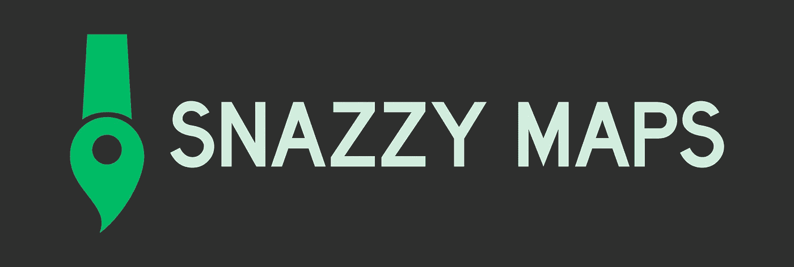
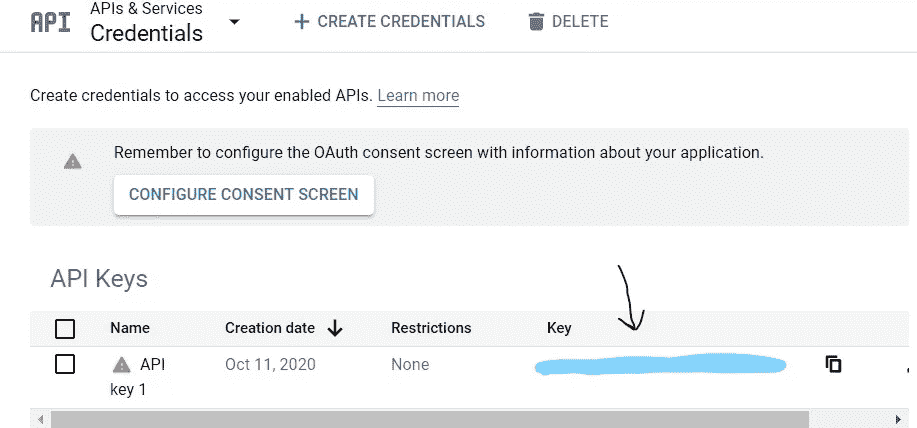
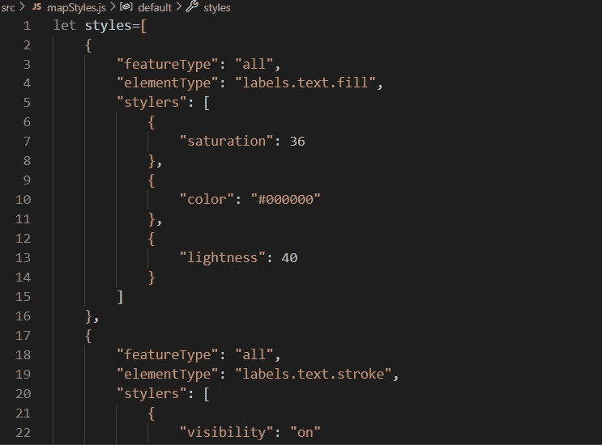

# 将谷歌地图添加到您的 React 应用程序中，使其具有时髦的地图风格

> 原文：<https://javascript.plainenglish.io/add-a-google-map-to-your-react-app-with-a-snazzy-maps-style-38781edcdc7a?source=collection_archive---------6----------------------->



在过去的 13 天里，我一直粘在我的电脑上自学 React.js。当你在 Flatiron 这样的编码训练营中时，在第 3 周，我最喜欢的项目周之前，你有大约 2 周的时间来学习一种新的语言/概念！

对于项目，你可以选择单独工作，也可以和伙伴一起工作。作为开发者，这是你大放异彩的时候了！项目激发创造力，并证明你能够学习该模块的材料。求职时，在简历上展示项目是至关重要的。

对于我在 Flatiron 的第四个项目，我想挑战自己，加入一个谷歌地图 API。这让我感到害怕，因为我仍然在尝试使用 React.js 库。**旁注——我只是在 4 周前才开始学习 JavaScript 语言的基础知识！**

用 Ruby on Rails API 后端和 React.js 前端构建一个动态 CRUD 应用程序将是我面临的最大挑战。我的项目想法需要一张地图，所以我决定看看谷歌地图[文档。](https://developers.google.com/maps/documentation)随着项目周的临近，我知道没有时间让恐惧来说服我放弃我的计划。我创建了一个练习项目，经过 2 天的努力，我终于能够让一张地图出现在我的浏览器上了！

## **注意！📣📣📣**

在下面，我写下了我实现这个目标的步骤。我希望这个博客能节省你的时间和挫折。虽然我肯定有很多方法可以做到这一点，但这是对我有用的。如有建议，欢迎评论分享！

## 第一步。获取 API 密钥

为了使用 Maps JavaScript API，您需要创建一个项目并添加一个计费帐户。别担心，除非你的地图请求超过了一个相当大的数量(我相信这个数字在 28，000 左右)，否则你不会被计费。点击[此处](https://developers.google.com/maps/documentation/javascript/get-api-key)并遵循提供的步骤。

创建个人 API 密钥后，您可以通过转到 API 密钥下的[凭证](https://console.cloud.google.com/apis/credentials)页面来复制这个密钥。找到您的项目，您应该会看到旁边有一个复制按钮的密钥。



## 第二步。创建 react 应用程序并安装 react-googlemaps

接下来，我们想要创建 react 应用程序。在终端中写入:

```
**create-react-app react-googlemaps**
```

安装 google-maps-react 库:

```
**npm install google-maps-react@2.0.6**
```

这将创建一个带有`google-maps-react`库的 React 应用程序。现在，您可以探索如何在应用程序中使用地图。

## 第三步。写出导入内容

设置一个存储和显示地图的组件。我亲自创建了一个组件，并将其命名为 **MapContainer.js.** 该组件的**导入**如下所示:

```
**import React, {Component} from 'react'
import { Map, GoogleApiWrapper, Marker } from 'google-maps-react'                         import mapStyles from './mapStyles'**
```

**Map-** 这是我们用来显示地图的地图组件。

**GoogleApiWrapper-** 这是一个[高阶组件](https://reactjs.org/docs/higher-order-components.html)，它提供了一个围绕 Google APIs 的包装器。

**标记-** 我们将使用它在地图上显示标记。

## 第四步。设置您的州

设置您的组件。我创建了一个具有初始状态的类组件，它保存了一些纬度/经度坐标，我可以用它们作为地图上的标记。

```
**import React, {Component} from 'react'
import { Map, GoogleApiWrapper, Marker } from 'google-maps-react'                         import mapStyles from './mapStyles'****class MapContainer extends Component{****state = {myMarkers: [
{latitude: 40.710992, longitude: -74.008292},   
{latitude: 40.792917, longitude: -73.969497},
{latitude:  40.710992, longitude: -74.008292}]
}**
```

**myMarkers-** 一个存储在**状态的数组**由 3 个不同的对象组成。

## 第五步。创建显示标记的方法

然后我创建了一个在地图上显示 **myMarkers** 的方法。

```
**import React, {Component} from 'react'
import { Map, GoogleApiWrapper, Marker } from 'google-maps-react'                         import mapStyles from './mapStyles'
class MapContainer extends Component{****state = {myMarkers: [
{latitude: 40.710992, longitude: -74.008292},   
{latitude: 40.792917, longitude: -73.969497},
{latitude:  40.710992, longitude: -74.008292}]
}****displayMarkers = () => {                                        return this.state.myMarkers.map((mark, index) => {                return <Marker id={index}  position={{                            lat: mark.latitude,                                              lng: mark.longitude                                                }} 
onClick={() => console.log("You clicked me!",{index})} />          })
}**
```

**标记组件**接收包括**位置在内的一些附加道具。**您可以通过状态映射将您的位置设置为等于 **myMarkers** 坐标，并将这些值分配给**position = { { lat:_ _ _ _ _ _，LNG:_ _ _ _ _ _ } }。**在底部，我包含了一个 **onClick()** 事件来显示控制台中每个标记的**索引**以确认每个标记都有自己的索引。

## 第六步。渲染出地图组件

现在我们要在类的返回中将我们的地图渲染到浏览器中。

```
**import React, {Component} from 'react'
import { Map, GoogleApiWrapper, Marker } from 'google-maps-react'                         import mapStyles from './mapStyles'****class MapContainer extends Component{****state = {myMarkers: [
{latitude: 40.710992, longitude: -74.008292},   
{latitude: 40.792917, longitude: -73.969497},
{latitude:  40.710992, longitude: -74.008292}]
}****displayMarkers = () => {                                        return this.state.myMarkers.map((mark, index) => {                return <Marker id={index}  position={{                            lat: mark.latitude,                                              lng: mark.longitude                                                }} 
onClick={() => console.log("You clicked me!",{index})} />          })
}****render() {
return (
<div style={{**
**position: "relative",
width: "50%",
height: "1100px"}} 
className="map">****<Map google={this.props.google} 
zoom={13}
styles={mapStyles.styles}
initialCenter={{ lat: 40.7812, lng: -73.9665}}
disableDefaultUI= {true}>
{this.displayMarkers()}</Map>
</div>
);
}}**
```

⭐ **重要！！！** ⭐

几个小时以来，我都不明白为什么我的地图没有出现在浏览器中。没有错误，但我能看到的只是一个白色的空白屏幕。40+浏览器标签后来终于解决了。您必须为环绕地图的元素设置宽度和高度值。

```
**<div style={{**
**position: "relative",
width: "50%",
height: "1100px"}} 
className="map">**
```

你可以随心所欲的定制你的地图，但是请不要忘记做好这一部分！

在我的地图组件中，我为导入时可用的一些属性提供了一些值。

**缩放-** 加载地图时设置默认缩放比例。数字越大，地图的放大程度越大。

风格- 你可以在这里自定义你的地图。更多关于我的造型过程如下。

初始中心(initial center)-在这里你可以选择你希望地图载入的位置。

**disabled defaultui = { true }-**谷歌地图自带地图上的一些默认按钮。将这个属性设置为 true 来隐藏这些属性。

**this . display markers()**-调用我们的方法 **displayMarkers()** ，以便标记可以在创建时显示在地图上

这些是我选择使用的 UI 组件。你可以谷歌一下，做一些研究，看看你可以定制你的地图的不同方法。请记住，在谷歌搜索时，你可能会遇到另一个看起来非常相似的库，“react-google-maps”。有区别！我花了一段时间才意识到这一点，所以现在我想让你注意到这一点。点击[了解更多关于 React 中不同谷歌地图库的信息。](https://npmcompare.com/compare/google-map-react,react-google-maps)

## 第七步。写出你的出口

最后一步是写出你的导出。这将与您的典型情况略有不同

```
**export default MapContainer**
```

为了让地图出现，我们必须导出我们的 MapContainer 以及我们在这个项目开始时创建的 API 键。

```
**export default GoogleApiWrapper({
apiKey: 'YOUR API KEY HERE'
})(MapContainer)**
```

快速提醒- **GoogleApiWrapper** 是一个[高阶组件](https://reactjs.org/docs/higher-order-components.html)，它提供了一个围绕 Google APIs 的包装器。

## 奖励-用时髦的地图设计您的地图

对于我的特定项目，一个简单的默认谷歌地图并不能解决问题。所以我做了一些研究，无意中发现了一个很棒的来源，叫做[时髦地图](https://snazzymaps.com/)。

有成千上万种不同的地图样式被创造出来。你甚至可以创造自己的风格！我建议您不要使用他们的“构建地图”功能。当您使用这个特性时，您会得到一个可以嵌入到项目中的 **< iframe >** 代码片段。如果您想简单地显示一个用户不会与之交互或点击标记的地图，这是很好的选择。对于我的项目，我需要一个用户可以与之交互的地图。在使用内嵌的 **< iframe >，**进行了几个小时的反复试验后，我意识到这是行不通的，于是我创建了上面的 **< Map >** 组件🔝。

如果你向后滚动，你会看到我导入了一个 **mapStyles** 组件，并将 **< Map >** 属性 **styles 设置为{{this.mapStyles}}。我创建了一个新文件，并将其命名为 **mapStyles.js** 。在这个文件中，我创建了一个变量 **let styles=[]。在里面，我将来自时髦地图的 JSON 格式的代码粘贴到这个空数组中。你可以在左下方看到这个，这里写着 **JAVASCRIPT 风格数组。******



⭐Don't 忘记导出页面底部的样式变量。⭐

```
**export default {styles}**
```

这应该与您在 MapContainer 组件中的导入正确链接，该组件在 Map 中被分配给您的 props。您现在应该可以在浏览器中看到您定制的地图了！不要忘记将 MapContainer 正确地呈现给任何父组件。

## 最后的想法

经过几天的挫折，在我的浏览器上看到那张地图是我永远不会忘记的胜利！我知道这可能不是最理想的方式，但这是一个好的开始。总是有更多的东西需要学习，我欢迎评论中的任何建议！我在下面添加了一些我使用的资源的链接。

感谢您的阅读:)

~克里斯蒂

 [## 时髦的地图——谷歌地图的免费风格

### 时髦地图是谷歌地图的不同配色方案的储存库，面向网络设计者和开发者。

snazzymaps.com](https://snazzymaps.com/style/72543/assassins-creed-iv) [](https://itnext.io/google-maps-react-makes-adding-google-maps-api-to-a-react-app-a-breeze-effb7b89e54) [## google-maps-react 使得向 react 应用添加 Google Maps Api 变得轻而易举

### 包含谷歌地图 Api 实际上比听起来容易得多。嗯，这主要是由于国家预防机制包…

itnext.io](https://itnext.io/google-maps-react-makes-adding-google-maps-api-to-a-react-app-a-breeze-effb7b89e54) 

[https://www . digital ocean . com/community/tutorials/how-to-integrate-the-Google-maps-API-into-react-applications # step-2-% E2 % 80% 94-using-map-and-Google API wrapper](https://www.digitalocean.com/community/tutorials/how-to-integrate-the-google-maps-api-into-react-applications#step-2-%E2%80%94-using-map-and-googleapiwrapper)