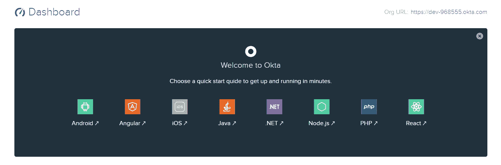

# 将身份验证添加到您的反应应用程序

> 原文：<https://javascript.plainenglish.io/add-a-simple-authentication-to-your-react-app-de8add1e3278?source=collection_archive---------3----------------------->

## 如何使用 Okta 向您的 Action 应用程序添加身份验证


今天，我将向您展示如何向您的 React 应用程序添加一个简单的身份验证，该应用程序使用来自 Okta 的身份验证，Okta 是一个用户管理系统，可以在基于多种语言或框架的多个应用程序中使用。

它类似于身份验证 0。您可以在多个应用程序中使用它，甚至可以与构建在不同语言和平台上的应用程序一起使用。

目前，Okta 支持以下语言:

*   机器人
*   有角的
*   ios
*   Java 语言(一种计算机语言，尤用于创建网站)
*   。网
*   Node.js
*   服务器端编程语言（Professional Hypertext Preprocessor 的缩写）
*   反应

# 签约

在您将 Okta 集成到您的反应应用程序之前，您将需要一个 Okta 开发人员帐户。所以现在就去创建你的免费账户吧。

[免费 Okta 开发商账户](https://developer.okta.com/signup/)

# Okta 仪表板

创建免费帐户后，您将被重定向到仪表板。您注意到仪表盘上的**组织网址**了吗？您的申请需要这个。仪表板还有显示所有活动的用户指标和系统日志。



# 注册您的反应申请

该注册您的反应申请了。点击仪表盘上的**应用**链接。

*   点击添加应用程序
*   选择单页应用程序
*   在“名称”字段中为您的应用程序添加名称

现在，您必须编辑 URIs 基地字段。我将假设您正在本地服务器上使用 create-react-app。

`[http://localhost:3000](http://localhost:3000)`

与登录重定向 URIs 相同& **单击完成**

`[http://localhost:3000/implicit/callback](http://localhost:3000/implicit/callback)`

现在您的申请已经登记，您将获得一个**客户 ID**

# 启动您的代码编辑器

*   导航到您的项目文件夹
*   添加必要的包

`yarn add react-router-dom @okta/okta-react @okta/signin-widget`

为了这个例子，让我们假设您的 react 应用程序有三个位于私有路由中的页面，并且只有授权用户可以访问这些路由。

/主页/用户/订单

# 创建登录组件

在您的组件文件夹中创建一个名为 *auth* 的新文件夹，并使用以下代码创建一个名为 Login.js 的新文件。

```
import React, { Component } from 'react';
import { Redirect } from 'react-router-dom';
import OktaSignInWidget from './SigninWidget';
import { withAuth } from '@okta/okta-react';

export default withAuth(class Login extends Component {
  constructor(props) {
    super(props);
    this.state = {
      authenticated: null
    };
    this.checkAuthentication();
  }

  async checkAuthentication() {
    const authenticated = await this.props.auth.isAuthenticated();
    if (authenticated !== this.state.authenticated) {
      this.setState({ authenticated });
      this.props.history.push('/home')

    }
  }

  componentDidUpdate() {
    this.checkAuthentication();
  }

  onSuccess = (res) => {
    if (res.status === 'SUCCESS') {
      return this.props.auth.redirect({
        sessionToken: res.session.token
      });
   } else {
    // The user can be in another authentication state that requires further action.
    // For more information about these states, see:
    //   https://github.com/okta/okta-signin-widget#rendereloptions-success-error
    }
  }

  onError = (err) => {
    console.log('error logging in', err);
  }

  render() {
    if (this.state.authenticated === null) return null;
    return this.state.authenticated ?
      <Redirect to={{ pathname: '/' }}/> :
      <OktaSignInWidget
        baseUrl={this.props.baseUrl}
        onSuccess={this.onSuccess}
        onError={this.onError}/>;
  }
});
```

接下来，您需要在同一个 *auth* 目录下创建一个名为*signingidget*的新文件，代码如下。

```
*SigninWidget.js*

import React, { Component } from 'react';
import ReactDOM from 'react-dom';
import OktaSignIn from '@okta/okta-signin-widget';
import '@okta/okta-signin-widget/dist/css/okta-sign-in.min.css';

 class SigninWidget extends Component {
  componentDidMount() {
    const el = ReactDOM.findDOMNode(this);
    this.widget = new OktaSignIn({
      baseUrl: this.props.baseUrl,
      authParams: {
        pkce: true
      },
    });
    this.widget.renderEl({el}, this.props.onSuccess, this.props.onError);
  }

  componentWillUnmount() {
    this.widget.remove();
  }

  render() {
    return <div />;
  }
};

export default SigninWidget
```

下一步是更新您的路由文件。下面是我的 Okta 实现中的一个例子。将私有路由包装在 **SecureRoute** 组件中，并用 Okta 开发人员控制台中您自己的凭证替换**客户端 ID** 和**发行方**。

```
import React from "react";
import { BrowserRouter as Router, Route } from "react-router-dom";
import Order from "./pages/Order.js";
import Home from "./pages/Home.js";
import Users from "./pages/Users.js";
import Login from "./components/auth/Login";
import { Security, SecureRoute, ImplicitCallback } from "@okta/okta-react";

function onAuthRequired({ history }) {
  history.push("/login");
}

const AppRoute = () => (
  <Router>
    <Security
      issuer="https://dev-944example.okta.com/oauth2/default" //Replace with your ORG URI.
      clientId="0oa1ws12avokObj45C357example" //Replace with your own client id
      redirectUri={window.location.origin + "/implicit/callback"}
      onAuthRequired={onAuthRequired}
    >
      <SecureRoute exact path="/orders" component={Order} />
      <SecureRoute exact path="/users" component={Users} />
      <Route exact path="/" component={Home} />
      <Route
        path="/login"
        render={() => <Login baseUrl="https://dev-968924.okta.com" />}
      />
      <Route path="/implicit/callback" component={ImplicitCallback} />
    </Security>
  </Router>
);

export default AppRoute;
```

# 创建注销功能

这是最后一步。您将希望在 home.js 文件或根文件中创建一个注销按钮，在用户登录后呈现给用户，并且不要忘记将您的函数包装在带有 Auth 的**中，以使用 **auth** 属性。**

```
import { withAuth } from "@okta/okta-react";
import Breadcrumb from './breadcrumb.js'
class Home extends Component {
  logout = async () => {
    this.props.auth.logout("/");
  };

  render() {
    return (
      <>
        <Breadcrumb home="Logout" click={this.logout} />
      </>
    );
  }
}

export default withAuth(Home);
```

# 恭喜你！🎉

如果您设法做到了这一步，那么我希望您已经成功地将 Okta 身份验证集成到 react 应用程序中。如果你遇到任何麻烦，请在下面发表评论。我会帮你解决的。

这是我在这里的第一个帖子。我很快会带着新的回来。

谢谢大家！