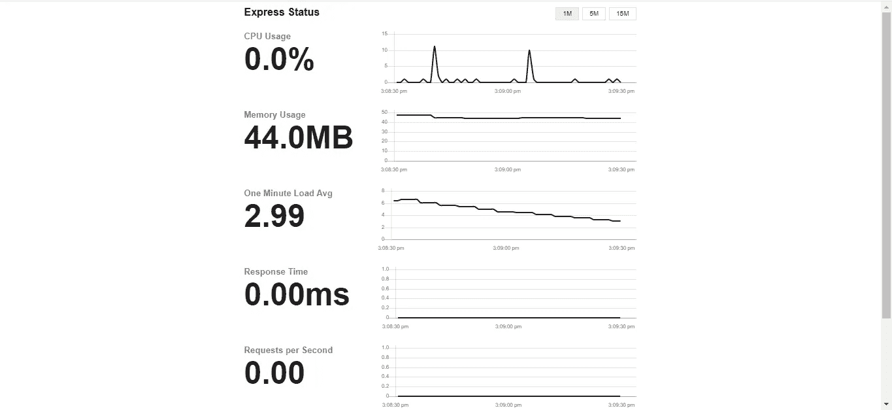

# 使用 express-status-monitor 向 Express 应用程序添加状态监视器

> 原文：<https://javascript.plainenglish.io/add-a-status-monitor-to-an-express-app-with-express-status-monitor-35fd7f36a8e8?source=collection_archive---------3----------------------->


Photo by [John Duncan](https://unsplash.com/@jrduncan11?utm_source=medium&utm_medium=referral) on [Unsplash](https://unsplash.com?utm_source=medium&utm_medium=referral)

默认情况下，Express 不提供跟踪我们的应用程序状态的方法。

幸运的是，我们可以添加一个包来做到这一点。

在本文中，我们将看看`express-status-monitor`包以及如何使用它。

# 装置

`express-status-monitor`作为节点包提供。我们可以通过运行以下命令来安装它:

```
npm install express-status-monitor --save
```

# 使用

一旦我们安装了这个包，我们可以如下使用它:

```
const express = require('express');
const bodyParser = require('body-parser');const app = express();
app.use(require('express-status-monitor')());app.get('/', (req, res) => {
  res.send('hello');
});app.listen(3000, () => console.log('server started'));
```

然后当我们去`/status`时，我们得到一个看起来如下的屏幕:



# 附加选项

我们可以通过向`expressMonitor`构造函数传递一个对象来传递额外的选项。

可用选项包括:

*   `title` —页面标题
*   `theme`—CSS 样式表的路径
*   `path` —状态页面的路径
*   `socketPath` —要使用的 web 套接字路径
*   `websocket` —我们想要使用的套接字 IO 实例
*   `spans` —包含以秒为单位记录数据的`interval`和要保留的数据点数的对象，通过为`retention`属性设置一个数字来设置
*   `chartVisibility` —我们希望在状态页面上看到的项目，包括处理器使用情况的`cpu`、内存使用情况的`mem`、CPU 平均负载的`load`、`responseTime`是应用的响应时间、`rps`是每秒的请求数、`statusCodes`是应用返回的状态代码。如果这些被设置为`true`，那么它们将被看到。
*   `healthChecks`是一个带有用于健康检查的端点的数组
*   `ignoreStartsWith` —忽略从我们设置的测量值开始的路径

# 健康检查

我们可以添加一系列的健康检查，出现在其他统计数据下面。如果运行状况检查返回 200 状态代码，则运行状况检查成功。

例如，我们可以编写以下代码来添加状态页面的配置:

```
const express = require('express');
const bodyParser = require('body-parser');const config = {
  title: 'Express Status',
  path: '/status',
  spans: [{
    interval: 1,
    retention: 60
  }, {
    interval: 5,
    retention: 60
  }, {
    interval: 15,
    retention: 60
  }],
  chartVisibility: {
    cpu: true,
    mem: true,
    load: true,
    responseTime: true,
    rps: true,
    statusCodes: true
  },
  healthChecks: [
    {
      protocol: 'http',
      host: 'localhost',
      path: '/admin/health/ex1',
      port: '3000'
    }
  ],
  ignoreStartsWith: '/admin'
}const app = express();
app.use(require('express-status-monitor')(config));app.get('/', (req, res) => {
  res.send('hello');
});app.listen(3000, () => console.log('server started'));
```

我们应该在页面底部看到一个图表，其中包含发送的状态代码和一个运行状况检查状态框。

# 保护端点

我们可以使用 [http-auth](https://www.npmjs.com/package/http-auth) 包来保护`status`页面。

例如，我们可以添加包并设置用户名和密码，以进行如下检查:

```
const express = require('express');
const auth = require('http-auth');
const statusMonitor = require('express-status-monitor')({ path: '' });const basic = auth.basic({ realm: 'Monitor Area' }, (user, pass, callback) => {
  callback(user === 'username' && pass === 'password');
});const app = express();app.use(statusMonitor.middleware);
app.get('/status', auth.connect(basic), statusMonitor.pageRoute);app.get('/', (req, res) => {
  res.send('hello');
});app.listen(3000, () => console.log('server started'));
```

在上面的代码中，我们添加了`http-auth`包，然后我们有:

```
const basic = auth.basic({ realm: 'Monitor Area' }, (user, pass, callback) => {
  callback(user === 'username' && pass === 'password');
});
```

添加一个登录对话框，检查用户名是否为`username`，密码是否为`password`。

然后我们有:

```
app.use(statusMonitor.middleware);
app.get('/status', auth.connect(basic), statusMonitor.pageRoute);
```

添加`auth.connect(basic)`中间件，将基本身份验证添加到状态页面，这样我们必须登录才能看到该页面。


Photo by [Mathew Schwartz](https://unsplash.com/@cadop?utm_source=medium&utm_medium=referral) on [Unsplash](https://unsplash.com?utm_source=medium&utm_medium=referral)

# 在同一项目中使用 socket.io

`express-status-monitor`可能用现有的 socket.io 实例破坏项目。

如果我们有它，那么我们应该将 socket.io 实例设置为我们的应用程序的主 socket.io 实例。

# 结论

`express-status-monitor`是一个方便的软件包，用于监控我们的 Express 应用程序的状态。

它通过使用认证中间件来支持认证，所以它是安全的。

我们也可以用许多选项来配置它。

## **用简单英语写的 JavaScript 笔记**

我们总是有兴趣帮助推广高质量的内容。如果你有一篇文章想用简单的英语提交给 JavaScript，用你的中级用户名发邮件到[**submissions@javascriptinplainenglish.com**](mailto:submissions@javascriptinplainenglish.com)给我们，我们会把你添加为作者。

我们还推出了三种新的出版物！为我们的新出版物献上一点爱心吧，请跟随他们:[**AI in Plain English**](https://medium.com/ai-in-plain-english)，[**UX in Plain English**](https://medium.com/ux-in-plain-english)，[**Python in Plain English**](https://medium.com/python-in-plain-english)**——谢谢，继续学习！**