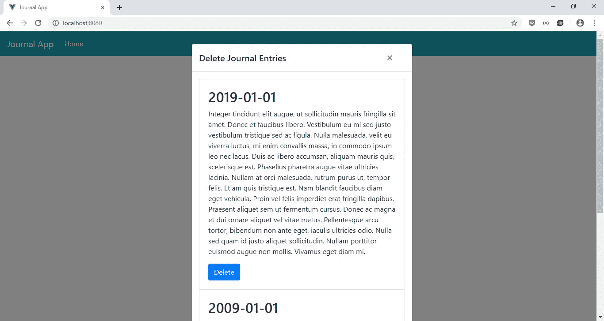
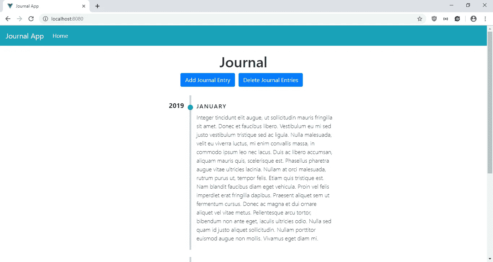

# 向您的 Vue.js 应用程序添加时间线

> 原文：<https://javascript.plainenglish.io/add-a-timeline-to-your-vue-js-app-3b0804c06c0a?source=collection_archive---------1----------------------->

时间线非常适合显示按时间顺序排列的项目。很好看，也很好读。我们可以很容易地用位于[https://github.com/pablosirera/timeline-vuejs](https://github.com/pablosirera/timeline-vuejs)的`timeline-vuejs` 包给 Vue.js 添加一个。它显示一个垂直的时间线，显示年份和您选择的内容。

在本文中，我们将构建一个日记条目应用程序，让用户在中输入日记条目并保存它们。他们也可以随意删除。保存的条目将显示在垂直时间线中，左边是年份，右边是内容。首先，我们将通过运行以下命令来运行 Vue CLI:

```
npx @vue/cli create journal-app
```

Vuex 和 Babel。

接下来，我们安装一些包。我们将使用 Axios 进行 HTTP 请求，使用 BootstrapVue 进行样式化，使用 Timeline-Vuejs 在时间轴中显示用户的日记，使用 VueFilterDateFormat 格式化模板中的日期，使用 Vee-Validate 进行表单验证。要安装它们，我们运行:

```
npm i axios bootstrap-vue timeline-vuejs vee-validate vue-filter-date-format
```

现在我们可以开始构建我们的应用程序了。在`components`文件夹中创建一个名为`JournalForm.vue`的文件，并添加:

```
<template>
  <ValidationObserver ref="observer" v-slot="{ invalid }">
    <b-form [@submit](http://twitter.com/submit).prevent="onSubmit" novalidate>
      <b-form-group label="Date">
        <ValidationProvider name="date" rules="required|date" v-slot="{ errors }">
          <b-form-input
            type="text"
            :state="errors.length == 0"
            v-model="form.date"
            required
            placeholder="Date"
            name="date"
          ></b-form-input>
          <b-form-invalid-feedback :state="errors.length == 0">{{errors.join('. ')}}</b-form-invalid-feedback>
        </ValidationProvider>
      </b-form-group><b-form-group label="Diary">
        <ValidationProvider name="diary" rules="required" v-slot="{ errors }">
          <b-form-textarea
            :state="errors.length == 0"
            v-model="form.diary"
            required
            placeholder="Diary"
            name="diary"
            rows="3"
          ></b-form-textarea>
          <b-form-invalid-feedback :state="errors.length == 0">{{errors.join('. ')}}</b-form-invalid-feedback>
        </ValidationProvider>
      </b-form-group><b-button type="submit" variant="primary" style="margin-right: 10px">Submit</b-button>
      <b-button type="reset" variant="danger" [@click](http://twitter.com/click)="cancel()">Cancel</b-button>
    </b-form>
  </ValidationObserver>
</template><script>
import { requestsMixin } from "@/mixins/requestsMixin";export default {
  name: "JournalForm",
  mixins: [requestsMixin],
  props: {
    edit: Boolean,
    journal: Object
  },
  data() {
    return {
      form: {}
    };
  },
  methods: {
    async onSubmit() {
      const isValid = await this.$refs.observer.validate();
      if (!isValid) {
        return;
      }
      const offDate = new Date(this.form.date);
      const correctedDate = new Date(
        offDate.getTime() + Math.abs(offDate.getTimezoneOffset() * 60000)
      ); const params = {
        ...this.form,
        date: correctedDate
      }; if (this.edit) {
        await this.editJournal(params);
      } else {
        await this.addJournal(params);
      }
      const { data } = await this.getJournals();
      this.$store.commit("setJournals", data);
      this.$emit("saved");
    },
    cancel() {
      this.$emit("cancelled");
    }
  },
  watch: {
    journal: {
      handler(val) {
        this.form = JSON.parse(JSON.stringify(val || {}));
      },
      deep: true,
      immediate: true
    }
  }
};
</script>
```

该文件是让用户输入日志条目的表单。

在`onSubmit` 函数中，我们通过调用`this.$refs.observer.validate();`来使用 Vee-Validate 验证我们的表单，以确保输入了`diary`，并且在保存之前输入了它，日期字段以 YYYY-MM-DD 格式输入。

我们使用 Vee-Validate 来验证表单字段。`ValidationObserver`组件用于验证整个表单，而`ValidationProvider`组件用于验证它所包装的表单字段。

验证规则由`date`和`diary`字段的`rule`属性指定。

`state`道具用于设置验证状态，当`errors`长度为 0 时显示绿色，否则显示红色。错误信息显示在`b-form-invalid-feedback`组件中。此页面只有国家下拉列表。

我们在提交之前更正了日期，因为 YYYY-MM-DD 格式的日期必须通过添加时区偏移量来更正，以便以 UTC 格式保存日期。一旦保存了数据，我们就获得最新的数据，然后将数据放入存储中。然后我们向`HomePage`发出`saved`事件，这样我们就可以关闭模态。

接下来，我们在`src`文件夹中创建一个`mixins`文件夹，并创建一个名为`requestsMixin.js`的文件。在那里，我们添加:

```
const APIURL = "[http://localhost:3000](http://localhost:3000)";
const axios = require("axios");export const requestsMixin = {
  methods: {
    getJournals() {
      return axios.get(`${APIURL}/journals`);
    }, addJournal(data) {
      return axios.post(`${APIURL}/journals`, data);
    }, editJournal(data) {
      return axios.put(`${APIURL}/journals/${data.id}`, data);
    }, deleteJournal(id) {
      return axios.delete(`${APIURL}/journals/${id}`);
    }
  }
};
```

这些是获取日志数据并保存到后端的函数。

接下来在`views`文件夹中，我们将`Home.vue`文件中的代码替换为:

```
<template>
  <div class="page">
    <h1 class="text-center">Journal</h1> <div class="text-center">
      <b-button [@click](http://twitter.com/click)="openAddModal()" variant="primary">Add Journal Entry</b-button>
      <b-button [@click](http://twitter.com/click)="openDeleteModal()" variant="primary">Delete Journal Entries</b-button>
    </div> <br /> <Timeline
      :timeline-items="journals"
      message-when-no-items="No Entries Found"
      :unique-year="true"
      order="desc"
    /> <b-modal id="add-modal" title="Add Journal" hide-footer>
      <JournalForm [@saved](http://twitter.com/saved)="closeModal()" [@cancelled](http://twitter.com/cancelled)="closeModal()" :edit="false" />
    </b-modal> <b-modal id="delete-modal" title="Delete Journal Entries" hide-footer>
      <b-card v-for="(j, i) of journals" :key="i">
        <b-card-text>
          <h2>{{j.from | dateFormat('YYYY-MM-DD')}}</h2>
          <p>{{j.description}}</p>
        </b-card-text>
        <b-button [@click](http://twitter.com/click)="deleteOneJournal(j.id)" variant="primary">Delete</b-button>
      </b-card>
    </b-modal>
  </div>
</template><script>
// @ is an alias to /src
import JournalForm from "@/components/JournalForm.vue";
import Timeline from "timeline-vuejs";
import { requestsMixin } from "@/mixins/requestsMixin";export default {
  name: "home",
  components: {
    JournalForm,
    Timeline
  }, mixins: [requestsMixin],
  computed: {
    journals() {
      return this.$store.state.journals
        .sort((a, b) => +new Date(b.date) - +new Date(a.date))
        .map(j => ({
          id: j.id,
          from: new Date(j.date),
          title: j.title,
          description: j.diary
        }));
    }
  },
  beforeMount() {
    this.getAllJournals();
  },
  data() {
    return {
      selectedJournal: {}
    };
  },
  methods: {
    openAddModal() {
      this.$bvModal.show("add-modal");
    },
    openDeleteModal() {
      this.$bvModal.show("delete-modal");
    },
    closeModal() {
      this.$bvModal.hide("add-modal");
      this.$bvModal.hide("delete-modal");
    },
    async deleteOneJournal(id) {
      await this.deleteJournal(id);
      this.getAllJournals();
    },
    async getAllJournals() {
      const { data } = await this.getJournals();
      this.$store.commit("setJournals", data);
      this.closeModal();
    }
  }
};
</script><style lang="scss" scoped>
.timeline {
  margin: 0 auto;
}
</style>
```

这是我们应用程序的主页。我们在页面顶部有一个添加和删除日志条目的按钮。当我们点击按钮时，我们打开模式，打开一个用于输入日记条目的表单，并显示一个日记列表，您可以点击删除按钮分别删除它们。按钮下面是显示日志条目的时间线。我们将`journals`数组传入`timeline-items`。

下面我们有显示`JournalForm`的模式和一个垂直堆叠的卡片列表来显示现有的项目，在那里它们可以被单独读取和删除。我们处理来自`JournalForm`的`saved`事件，在项目保存后关闭模态。

在`delete-modal`中，我们列出了条目并有一个按钮来删除每个条目。VueFilterDateFormat 包将`from`字段格式化为 YYYY-MM-DD 格式，以正确显示日期。

在`scripts`部分，我们在`computed`对象中有`journals`属性来获取最新的日志条目。

我们将这些字段映射到 Timeline-Vuejs 包所需的字段，这样我们就可以正确地显示时间线。我们按时间倒序对它们进行排序，以查看顶部的最新项目和下面的旧项目。

此外，我们使用在 mixin 中编写的`getJournals`函数，通过`beforeMount`钩子获取页面加载期间的所有密码条目。

要删除一个日志条目，我们调用`deleteOneJournal`我们的 mixin 通过`deleteJournal`函数向后端发出请求。

接下来在`App.vue`中，我们将现有代码替换为:

```
<template>
  <div id="app">
    <b-navbar toggleable="lg" type="dark" variant="info">
      <b-navbar-brand to="/">Journal App</b-navbar-brand> <b-navbar-toggle target="nav-collapse"></b-navbar-toggle> <b-collapse id="nav-collapse" is-nav>
        <b-navbar-nav>
          <b-nav-item to="/" :active="path  == '/'">Home</b-nav-item>
        </b-navbar-nav>
      </b-collapse>
    </b-navbar>
    <router-view />
  </div>
</template><script>
export default {
  data() {
    return {
      path: this.$route && this.$route.path
    };
  },
  watch: {
    $route(route) {
      this.path = route.path;
    }
  }
};
</script><style lang="scss">
.page {
  padding: 20px;
}button,
.btn.btn-primary {
  margin-right: 10px !important;
}.button-toolbar {
  margin-bottom: 10px;
}
</style>
```

在页面顶部添加一个引导导航条，并添加一个`router-view`来显示我们定义的路线。这个`style`部分没有限定范围，所以样式将适用于全球。在`.page`选择器中，我们给页面添加一些填充。我们还在这里为应用程序的按钮添加了边距。

接下来在`main.js`中，我们将现有代码替换为:

```
import Vue from "vue";
import App from "./App.vue";
import router from "./router";
import store from "./store";
import BootstrapVue from "bootstrap-vue";
import "bootstrap/dist/css/bootstrap.css";
import "bootstrap-vue/dist/bootstrap-vue.css";
import "../node_modules/timeline-vuejs/dist/timeline-vuejs.css";
import { ValidationProvider, extend, ValidationObserver } from "vee-validate";
import { required } from "vee-validate/dist/rules";
import VueFilterDateFormat from "vue-filter-date-format";extend("required", required);
extend("date", {
  validate: value =>
    /([12]\d{3}-(0[1-9]|1[0-2])-(0[1-9]|[12]\d|3[01]))/.test(value),
  message: "Date must be in YYYY-MM-DD format"
});
Vue.component("ValidationProvider", ValidationProvider);
Vue.component("ValidationObserver", ValidationObserver);
Vue.use(VueFilterDateFormat);
Vue.use(BootstrapVue);
Vue.config.productionTip = false;new Vue({
  router,
  store,
  render: h => h(App)
}).$mount("#app");
```

我们在这里添加了我们需要的所有库，包括 BootstrapVue JavaScript 和 CSS、Vee-Validate 组件以及验证规则。我们创建了`date`规则，它验证使用该规则的输入是否为 YYYY-MM-DD 格式。此外，我们添加了 VueFilterDateFormat 包来格式化`Home.vue`中表的日期列中的日期。

在`router.js`中，我们将现有代码替换为:

```
import Vue from "vue";
import Router from "vue-router";
import Home from "./views/Home.vue";Vue.use(Router);export default new Router({
  mode: "history",
  base: process.env.BASE_URL,
  routes: [
    {
      path: "/",
      name: "home",
      component: Home
    }
  ]
});
```

将主页包含在我们的路线中，以便用户可以看到该页面。

在`store.js`中，我们将现有代码替换为:

```
import Vue from "vue";
import Vuex from "vuex";Vue.use(Vuex);export default new Vuex.Store({
  state: {
    journals: []
  },
  mutations: {
    setJournals(state, payload) {
      state.journals = payload;
    }
  },
  actions: {}
});
```

将我们的`journals` 状态添加到存储中，这样我们就可以在`JournalForm`和`HomePage`组件的`computed`块中观察到它。我们用`setSavings` 函数来更新`savings` 状态，并通过调用`this.$store.commit(“setJournals”, data);`在组件中使用它来设置`JournalForm`和`HomePage`的日志条目数据。

最后，在`index.html`中，我们将现有代码替换为:

```
<!DOCTYPE html>
<html lang="en">
  <head>
    <meta charset="utf-8" />
    <meta http-equiv="X-UA-Compatible" content="IE=edge" />
    <meta name="viewport" content="width=device-width,initial-scale=1.0" />
    <link rel="icon" href="<%= BASE_URL %>favicon.ico" />
    <title>Journal App</title>
  </head>
  <body>
    <noscript>
      <strong
        >We're sorry but vue-timeline-tutorial-app doesn't work properly without
        JavaScript enabled. Please enable it to continue.</strong
      >
    </noscript>
    <div id="app"></div>
    <!-- built files will be auto injected -->
  </body>
</html>
```

改一下标题。

在所有的努力之后，我们可以通过运行`npm run serve`来启动我们的 app。

为了启动后端，我们首先通过运行`npm i json-server`来安装`json-server`包。然后，转到我们的项目文件夹并运行:

```
json-server --watch db.json
```

在`db.json`中，将文本改为:

```
{
  "journals": [],
}
```

所以我们有了在`requests.js`中定义的`journals` 端点。

经过所有的努力，我们得到了:

