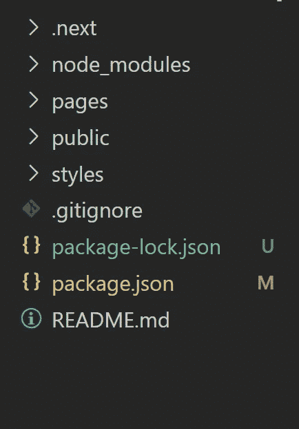

# 向 Next.js 应用程序添加翻译功能第 1 部分:设置 next-i18next 包

> 原文：<https://javascript.plainenglish.io/add-a-translation-feature-to-your-next-js-app-part-1-set-up-the-next-i18next-package-4a4788cb98ba?source=collection_archive---------4----------------------->


在过去的几周里，我一直在为我的 Next.js 应用程序添加一个翻译功能。我开始没有看到太多的教程，在这个过程中遇到了很多问题。因此，我决定写下这篇文章供自己参考，希望它也能帮助你！

如果我把所有的事情都写在一篇文章里，那就太长了！所以我打算把它分成几篇文章。以下是我的计划(完成后我会添加一个链接):

1.  用`next-i18next`包*(本文)*设置翻译功能
2.  添加按钮改变语言([出来了！](https://medium.com/swlh/add-a-translation-feature-to-your-next-js-app-part-2-manually-switch-languages-e308b1ec576a))
3.  用`localSubpaths`([OUT 了)为每种语言添加一个路径！](https://chanwingkeihaha.medium.com/add-a-translation-feature-to-your-next-js-app-part-3-add-language-specific-url-3b22e492a363))

# **资源:**

1.  [下一个-i18 下一个](https://github.com/isaachinman/next-i18next)
2.  [我的回购示例](https://github.com/yingqi-chen/next-translation-demo)

# 开始吧！

## 先决条件

因此，我假设您已经创建了一个 next.js 应用程序，其基本结构如下:



而在你的`package.json`里，你有`next`和`react`、`react-dom`。

我们将不得不使用`next-i18next`包，所以你想这样安装它:

```
npm install next-i18next/yarn add next-i18next
```

现在我们可以按照[文档](https://github.com/isaachinman/next-i18next)中的介绍来设置一切。您可以在文档中找到这些介绍，但我将复制到这里，以防您不想来回重复。此外，我将我的一些解释整合到一些配置中。

# 添加翻译内容

像这样设置翻译文件(这是包期望的路径，如果你不这样做，你会得到错误):

```
.
└── public
    └── static
        └── locales
            ├── en
            |   └── hello.json
            └── zh
                └── hello.json
```

我在`en` 里的`hello.json`长这样:

```
{ "hello": "Hi! This is a translation feature demo."}
```

我在`zh` 里的`hello.json`长这样:

```
{ "hello": "你好！这是一个翻译范例。"}
```

当然，你可以从不同的文件中获得翻译脚本。当我们到达**使用组件**部分时，我将介绍这一点。

# 启动一个`i18n`实例

在根目录下创建一个名为`i18n.js`的文件。**与文档中的示例不同。**在文档的例子中，它指定了一个`localSubPaths`,但我稍后会添加它，因为我只想先使用最少的代码来构建该特性。如果您从示例中复制文档，您也必须遵循`next.config.js` [中的配置。](https://github.com/isaachinman/next-i18next#3-project-setup)

```
//import the default class contructor from the package
const NextI18Next = require('next-i18next').default
const path = require('path')module.exports = new NextI18Next({
  defaultLanguage:'en',
  otherLanguages: ['zh'],
  localePath: path.resolve('./public/static/locales')
})
```

所以我们要做的是从包`next-i18next`中导入默认的类构造器，然后用它来初始化它的一个实例。我们将一些配置传递给它，这样我们将获得一个自定义实例，我们导出该实例并由应用程序中的其他组件使用。

`defaultLanguage`默认为`en`，意为“英语”。所以除非你想设置默认语言为其他语言，否则不必指定这个值。

接受一个数组来传递您正在为其构建翻译的所有语言。

`localPath`指定查找翻译文件的路径。它必须是一个绝对路径。

点击此处查看针对此包[的其他配置。你可以在这里](https://github.com/isaachinman/next-i18next#options)寻找其他的 i18n 配置选项[。](https://www.i18next.com/overview/configuration-options)

# 其他设置

根据文档，我们还必须像这样配置`_app.js`:

```
import App from 'next/app'
import { appWithTranslation } from '../i18n'const MyApp = ({ Component, pageProps }) => <Component {...pageProps} />MyApp.getInitialProps = async (appContext) => ({ ...await App.getInitialProps(appContext) })export default appWithTranslation(MyApp)
```

现在我们可以开始使用 i18n 实例了！唷！

# 在组件中使用包

设置完成后，我们如何将它们集成到我们的组件中？其实很简单！在我的`Home`组件中，我使用功能组件，在`SecondPage`组件中，我使用类组件。可以参考我的[回购](https://github.com/yingqi-chen/next-translation-demo)。首先，你可以看看这些例子，我会解释更多。

## 类别组件:

```
import { withTranslation } from "../i18n"class SecondPage extends React.Component {
    render() {
    return <h1>{this.props.t('hello')}</h1>;
    }
  }
export default withTranslation('common')(SecondPage)
```

## 功能组件:

```
import Head from 'next/head'
import styles from '../styles/Home.module.css'
import { withTranslation } from "../i18n"function Home({t}) {
  return (
    <div className={styles.container}>
      <Head>
        <title>Create Next App</title>
        <link rel="icon" href="/favicon.ico" />
      </Head> <main className={styles.main}>
        <h1 className={styles.title}>
          {t('hello')}
        </h1>
      </main>
    </div>
  )
}export default withTranslation('common')(Home)
```

## `withTranslation`

所以我们可以看到，他们的共同点是使用`withTranslation`功能。我们在开始时导入它，然后导出由它包装的组件。使用`withTranslation` HOC(高阶组件)，`t`将被传递给我们的组件，它可以用来在那里添加翻译脚本。

它会自动寻找`common.json`中的 sript。您可以使用这样的嵌套脚本:

```
{   
    "hello": "Hi! This is a translation feature demo.",
    "nested": {
        "content":"What is nested?"
    }
}
```

## 使用`t`

`t`是方法。简单地用翻译键调用这个方法就可以了:

```
t('hello') or 
t('nested.content') 
```

然后应用程序将在`common.json`中呈现键`hello`和`nested.content`的值。

## 好处:在同一个组件中使用多个名称空间

显然，你看到我们可以通过嵌套的内容来组织不同的内容，例如`t(‘firstpage.h1’), t(‘secondpage.h1’)`等。它适用于一个小应用程序。然而，当应用程序变得更大时，我们希望根据路线或某些特定功能在不同的文件中分离不同的翻译功能。

我们怎么告诉包裹？使用`namespaceRequired`。这里有一个例子:

```
import { withTranslation } from "../i18n"class SecondPage extends React.Component {
    render() {
    return (
    <>
      <h1>{this.props.t('nested.content')}</h1>
      <p>{this.props.t('secondFile:second')}</p>
    </>
    );
    }
  }// New added!!
SecondPage.getInitialProps = async () => ({
    namespacesRequired: ['common','secondFile'],
  })export default withTranslation('common')(SecondPage)
```

`namespacesRequired`是由页面级组件上的`getInitialProps`返回的数组。它“告诉”组件该组件所有可用的名称空间。

要使用来自不同文件的脚本，您应该参考此处的:

在`withTranslation` HOC 中，只有第一个名称空间可以不带前缀使用。所有其他的都必须以文件名为前缀:

`t('anotherFile:translationFromAnotherFile')`

因此，在我们的例子中，你可以看到当我们在`common.json`中使用`nested.content`脚本时，我们可以直接使用它，而当我们在`secondFile.json`中使用`second`脚本时，我们需要这样使用它:`t(‘secondFile:second’)}`。

## 注意

如果你使用的是非页面级组件，那么就不要使用`getInitialProps`。相反，你可以删除它，在`withTranslation`特设你可以这样做:

```
export default withTranslation(['common','secondFile'])(SecondPage)
```

这也可以用在页面中！我用它作为回购的例子。围着它玩；)

# 结束

这星期到此为止！在接下来的几周里，我将继续写关于用`localSubPaths`给应用程序添加一个特定语言的 URL，并添加一个按钮来手动改变语言。感谢阅读！

# 资源:

1.  [下一个-i18 下一个](https://github.com/isaachinman/next-i18next)套餐
2.  [我的回购例子](https://github.com/yingqi-chen/next-translation-demo)