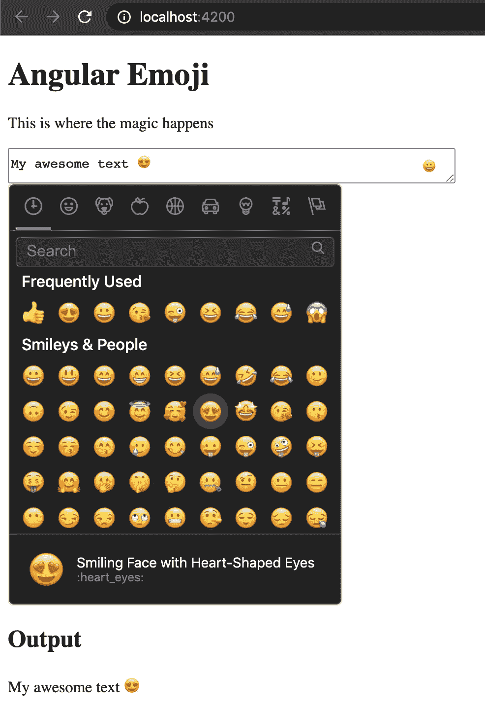

# 如何将表情符号添加到您的 Angular 应用程序中

> 原文：<https://javascript.plainenglish.io/add-emoji-to-your-angular-application-c753e0d5cf84?source=collection_archive---------0----------------------->


Photo by [Denis Cherkashin](https://unsplash.com/@denic?utm_source=medium&utm_medium=referral) on [Unsplash](https://unsplash.com?utm_source=medium&utm_medium=referral)

如今，逃脱表情符号是不可能的。我们被表达我们感情的微笑所包围，或者微笑的唯一目的是缩短我们的句子。

你是否在笑😂或者你收到的信息是否让你感到震惊😱，你已经可以通过添加我们所说的表情符号来表达这些情绪了。

因此，在本文中，我们将会看到如何将这些漂亮的表情符号添加到我们的 Angular 项目中。

## 准备我们的环境

创建项目、生成应用程序和库代码、执行测试、构建和部署等任务都依赖于 Angular CLI。

要安装 Angular CLI，请打开终端并运行以下命令:

```
npm install -g @angular/cli
```

此时，我们通过运行以下命令来创建我们的工作区:

```
cd ~
ng new emoji-app
```

使用 ng new 命令，将会根据您安装的 Angular CLI 版本询问您一系列问题，您可以接受默认值。

你应该回答的典型问题:

*   *您想要添加角度路由吗？是的*
*   *您想使用哪种样式表格式？* SCSS

这可能需要几分钟时间。

## 你好世界

创建项目后，我们要做的第一件事就是启动它，并查看默认情况下我们的工作区中有什么。

```
cd emoji-app
ng serve
```

此时，打开浏览器并导航至:`[http://localhost:4200/](http://localhost:4200/)`

如你所见，Angular 的 CLI 非常友好，为我们创建了一个默认页面，并立即显示在浏览器上。

## 必要的依赖关系

为了实现我们的目标，我们将使用模块:“ [ngx-emoji-mart](https://www.npmjs.com/package/@ctrl/ngx-emoji-mart) ”。

作为第一步，我们将安装以下依赖项:

```
npm install @ctrl/ngx-emoji-mart --save
```

此时，在`package.json`中的“dependencies”属性下，您应该能够看到与此非常相似的内容:`@ctrl/ngx-emoji-mart: ^4.1.0`。

此时，我们在`app.module.ts`和 FormsModule 中添加了对新模块的引用，以便正确使用所有的角度指令。

```
import { BrowserModule } from '@angular/platform-browser';
import { NgModule } from '@angular/core';
import { AppRoutingModule } from './app-routing.module';
import { AppComponent } from './app.component';
import { FormsModule } from '@angular/forms';import { PickerModule } from '@ctrl/ngx-emoji-mart';@NgModule({
   declarations: [
      AppComponent
   ],
   imports: [
      PickerModule,
      FormsModule,
      BrowserModule,
      AppRoutingModule
   ],
   providers: [],
   bootstrap: [AppComponent]
})export class AppModule { }
```

我们将 CSS 导入到我们项目`angular.json`的配置文件中的字段`projects.emoji-app.architect.build.styles`下。

```
..."styles": [
   "src/styles.scss",
   "node_modules/@ctrl/ngx-emoji-mart/picker.css"
]...
```

或者，您也可以在`src/styles.scss`文件中导入 CSS，如下所示:

```
**@import** '~@ctrl/ngx-emoji-mart/picker';
```

## 让我们对模板进行编码

虽然在生成过程中在`app.component.html`中创建了一个默认模板，但是我们从自动生成的模板中清除了代码，并继续创建一个带有添加图标按钮的文本区域。

我们将在输入内容的正下方显示编译后的文本。

**让我们为我们的** `**app.component.html**` **页面创建一个标题和下面的一个小段落。**

```
<h1>Angular Emoji</h1>
<p>This is where the magic happens</p>
```

在这一点上，我们添加我们的文本区域。

```
<textarea placeholder="Type a message" type="text" name="textarea" [(ngModel)]="textArea"></textarea>
```

以及`app.component.ts`中的变量“textArea”。

```
public textArea: string = '';
```

此时，剩下的就是利用我们安装的模块了。
然后我们在文本区域后添加一个按钮来激活表情选择器和表情集市指令

```
<button (click)="isEmojiPickerVisible = !isEmojiPickerVisible;">😀</button>
<br><emoji-mart class="emoji-mart" *ngIf="isEmojiPickerVisible" (emojiSelect)="addEmoji($event)" title="Choose your emoji"></emoji-mart>
```

显然，正如可能观察到的那样，使用了一些还没有出现在我们的 typescript 组件中的变量。

出于这个原因，让我们转到`app.component.ts`，用布尔`isEmojiPickerVisible`和`addEmoji` 方法完成我们的组件

```
export class AppComponent {

   public textArea: string = '';
   public isEmojiPickerVisible: boolean; public addEmoji(event) {
      this.textArea = `${this.textArea}${event.emoji.native}`;
      this.isEmojiPickerVisible = false;
   }}
```

addEmoji 方法的基本功能就是输入所选表情符号的值，然后再次关闭选取器(根据您希望选取器具有的行为，您可以对代码行进行注释或不进行注释)。

## **咱们的风格**

和任何事情一样，让一个布局看起来更顺眼一点，永远是一个不可小觑的方面，哪怕是一个简单的教程。

具体来说，我们转到我们的`app.component.scss`并添加以下代码。

```
.container {
   display: grid;
   grid-template-columns: 100% 0%;
   width: 36%;

   button {
      background: transparent;
      border: 0;
      transform: translateX(-40px);
      cursor: pointer;
      &:focus {
         outline: 0;
      }
   }
}
```

确保您已经用类“container”将 textarea 和按钮包含在一个 div 中，如下所示。

```
<div class="container"> <textarea placeholder="Type a message" type="text" name="textarea" [(ngModel)]="textArea"></textarea> <button (click)="isEmojiPickerVisible = !isEmojiPickerVisible;">😀</button></div>
```

## 最终输出



如果你喜欢这篇文章，请按👏想按多少次就按多少次。如果你有任何问题，请随意提问。

非常感谢你的阅读！

*更多内容请看*[***plain English . io***](http://plainenglish.io/)