# 在 10 分钟内将 Google 登录添加到您的 React 应用程序

> 原文：<https://javascript.plainenglish.io/add-google-login-to-your-react-apps-in-10-mins-c45315c93db0?source=collection_archive---------2----------------------->

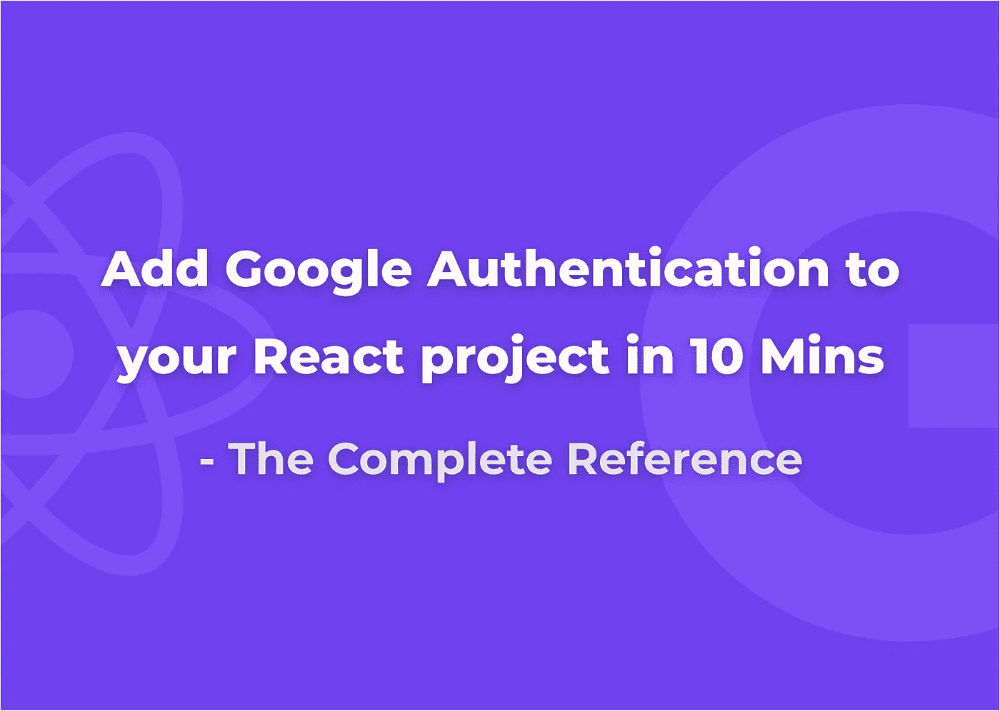

作为客户端开发人员，创建带身份验证的应用程序可能是一个乏味的过程。因为我们需要在服务器中处理认证并维护代码。它确实有一些基于身份验证机制的多个案例需要维护。(Basic、OAuth 等)这个博客帮助你为你的 react 应用创建一个独立的后端无认证。(或另外)您也可以添加服务器配置，以便与您的服务器进行认证。

# 为什么是 OAuth？

使用 OAuth 有很多原因。

*   它是安全的。
*   它不需要用户的任何凭证。所以不需要记住多个密码。
*   网站也可以获得用户的基本信息，而不用花太多时间在表格上。

特别是在我们的案例中，我们不需要服务器来验证或获取用户的初始详细信息。😉

我发现了一个名为`react-google-login`的包。它提供了添加 Google 登录的简单机制。您可以直接使用他们的`GoogleLogin`组件，也可以使用自定义按钮。他们还提供像`useGoogleLogin`和`useGoogleLogout`这样的定制钩子，这对钩子爱好者来说很容易。*(两种方法如下所述)*

他们为这个库提供的[文档](https://npmjs.com/package/react-google-login)棒极了。但它在某些方面是缺失的，这在这篇博客中有所提及。详细来说，这个博客有助于在谷歌开发者控制台中创建你的应用程序，并访问`clientId`。这个包获得的初始`access_token`只会持续一个小时(出于安全原因*)。*我们需要使用`refresh_token`迭代这个过程来访问新的`access_token`。因此您可以制作一个**生产就绪的应用程序。**

# 步伐

*   我们需要在 Google 开发者控制台中创建一个应用程序。它提供了`clientId`用于识别你的应用的认证细节。按照以下步骤获取客户端 ID。

1.  进入[凭证页面](https://console.developers.google.com/apis/credentials)。*(如果你是新手，那么* [*创建一个项目*](https://console.developers.google.com/projectcreate) *并遵循这些步骤)*
2.  点击**创建凭证> OAuth 客户端 ID** 。
3.  选择 **Web 应用**类型。
4.  命名你的 OAuth 2.0 客户端，点击**创建**

*   确保您提供了您的域和重定向 URL。以便 Google 识别它可以提供认证的源域。

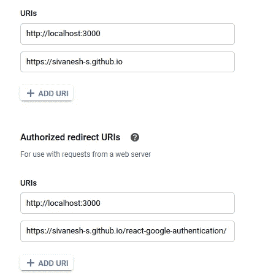

您也可以添加您的本地发展路线。现在，Google 开发者控制台中的身份验证设置已经准备好了。

# 让我们编码

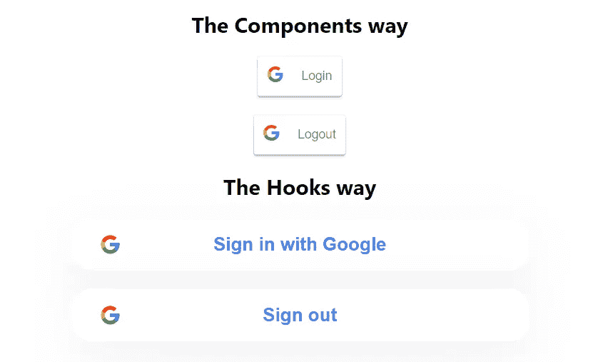

先说代码。[查看我的回购](https://github.com/sivanesh-s/react-google-authentication/)获取所有代码片段。查看[演示](https://sivanesh-s.github.io/react-google-authentication/)。

在你的 CRA 安装包中

创建一个充当登录按钮的`Login`组件。

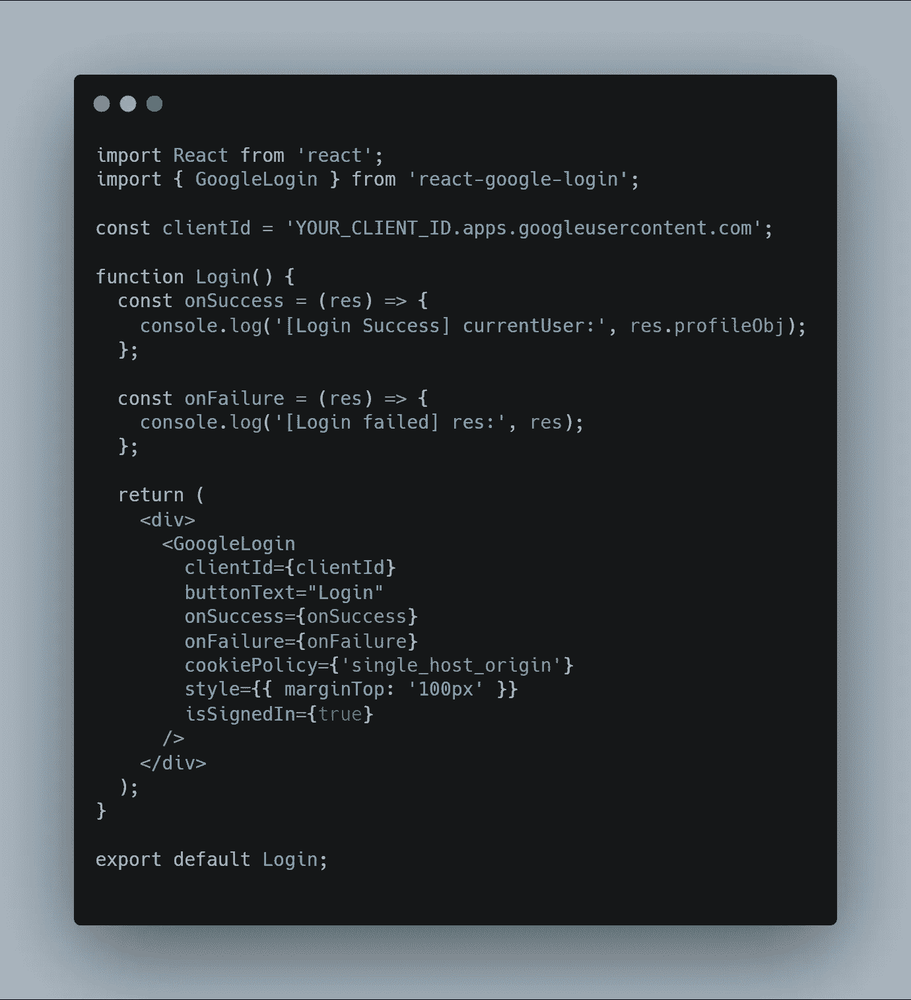

类似地，创建一个`Logout`组件

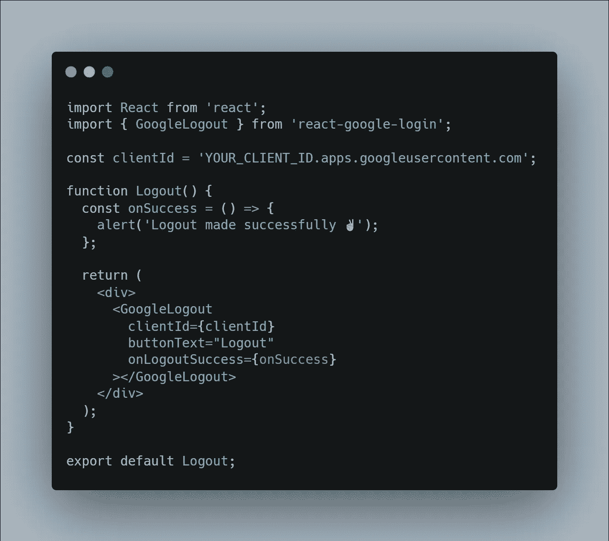

并将二者添加到应用程序的所需位置。我的在`App.js`

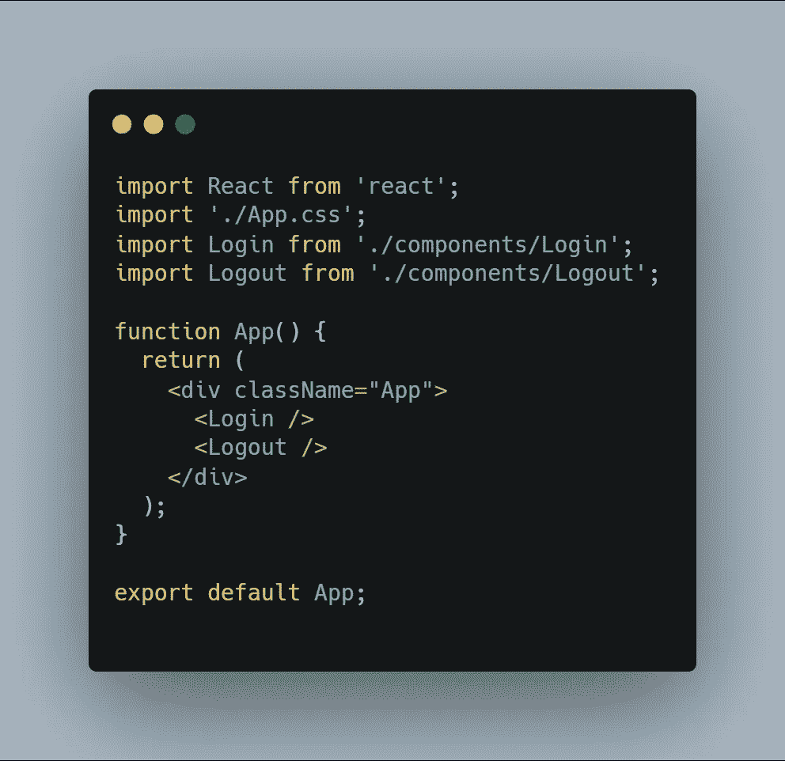

现在运行你的应用程序，登录后会在控制台显示`profileObj`。

祝贺🎉你成功地做到了😃。

但是 1 小时后你的`tokenId`就过期了，因此它不会被用来访问数据或验证用户。因此我们需要生成新的`tokenId`。为了让事情顺利进行，我们需要在`Login`组件中添加一些额外的案例。

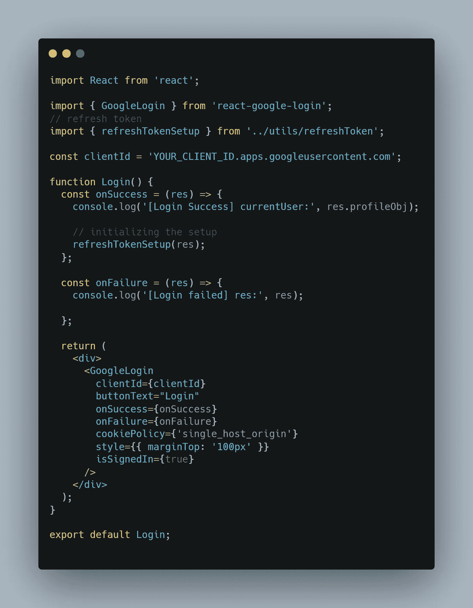

`refreshTokenSetup`函数将负责处理新的`tokenIds`

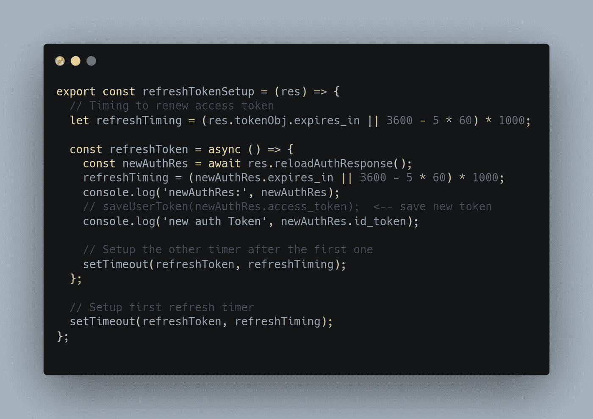

该函数检查`expires_in`时间戳或我们的自定义时间*(在令牌过期之前)*并调用`reloadAuthResponse`，这是库提供的一个实用函数，它处理`refresh_token`并获得新的`tokenId`。

是的😃Google 登录已成功添加到您的应用程序中🎉。所以现在你可以访问用户的**姓名、照片网址、电子邮件、谷歌 Id、**等。

# 额外的

以上方式使用 Google 登录默认按钮。您也可以使用`render`道具使用您的自定义按钮。

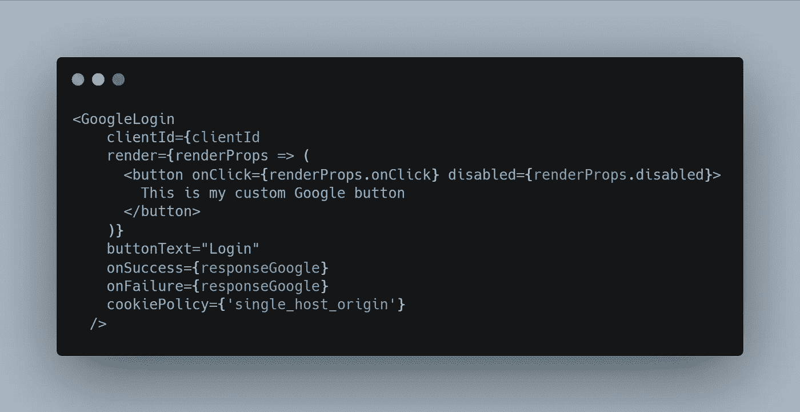

我们也可以使用 **React 钩子实现相同的功能。** ❤️

`LoginHooks.js`

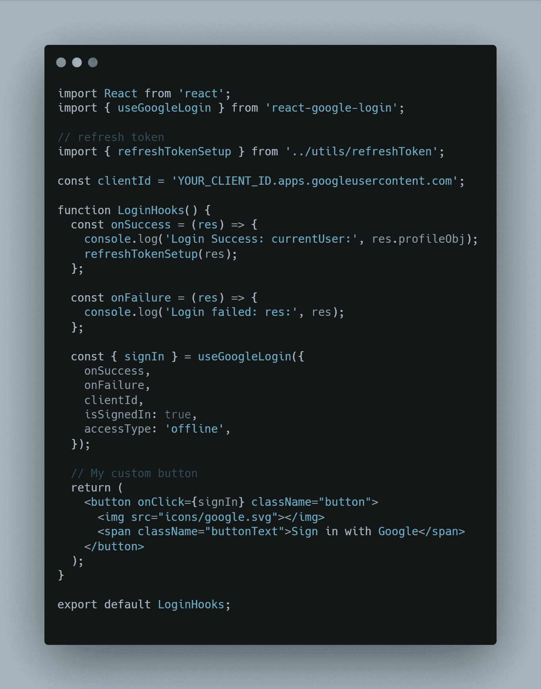

`LogoutHooks.js`

# 服务器端验证

如果您希望添加服务器端验证，请在调用`Login`组件中的`onSuccess`后，将`tokenId`从客户端发送到服务器。

因此，在处理认证路由时，来自客户端的所有请求都需要在报头中发送用户的`tokenId`作为**承载令牌。**在服务器上，一旦收到令牌，就必须对其进行验证`tokenId`

*   属于当前应用程序。
*   过期了吗

你可以手动操作，但是谷歌建议使用他们的认证库*(需要最少的努力)*。

在服务器端*(这里使用 Node.js)。*

安装谷歌官方支持的库`google-auth-library`包，用于认证和验证 OAuth 应用。

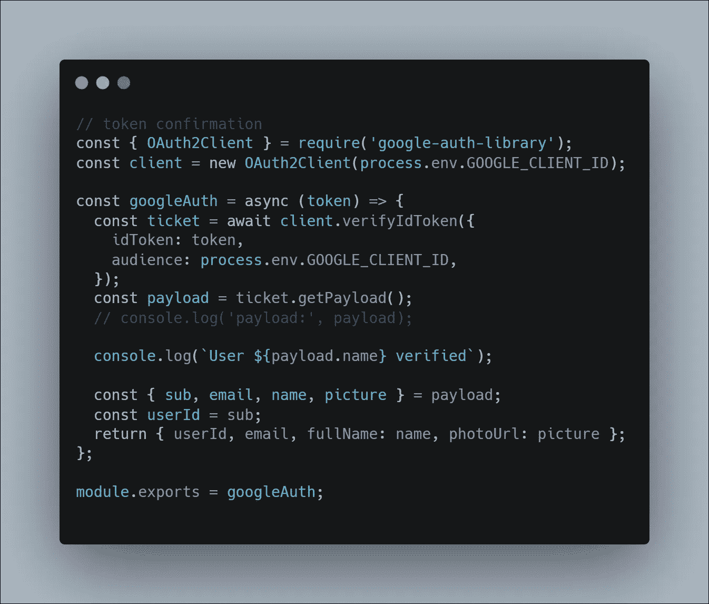

在这里，通过我们发送的`GOOGLE_CLIENT_ID`，它验证这个令牌是否属于我们的应用程序。它解析它们并在`getPayload`函数中提供配置文件细节。您可以使用它们来访问用户数据。

如有任何疑问，欢迎在我的社交媒体账户中发表评论或与我本人聊天。

我喜欢与开发人员联系在一起。😃

[Twitter](https://twitter.com/sivanesh_fiz)|[LinkedIn](https://www.linkedin.com/in/sivanesh-shanmugam/)|[GitHub](https://github.com/Sivanesh-S)