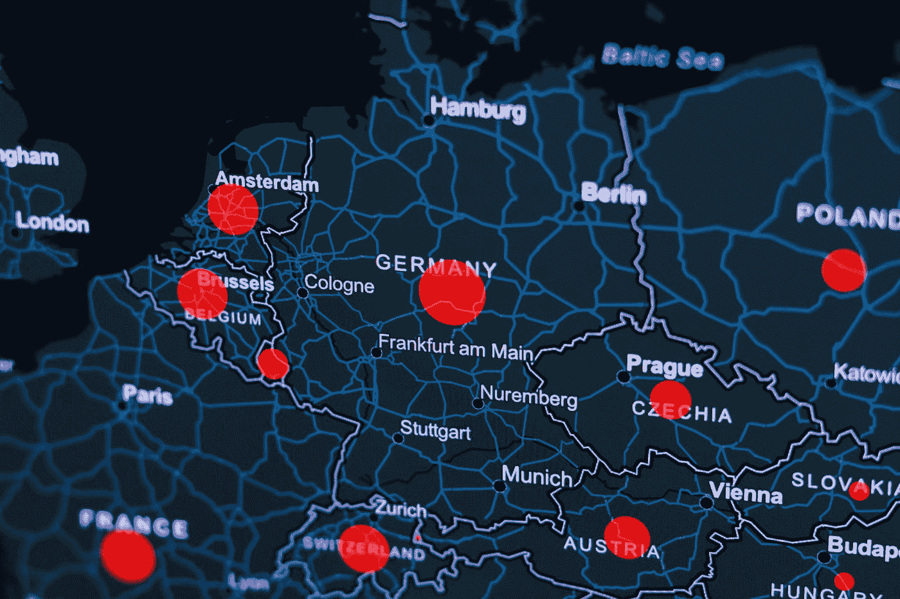
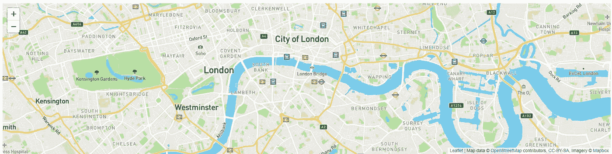
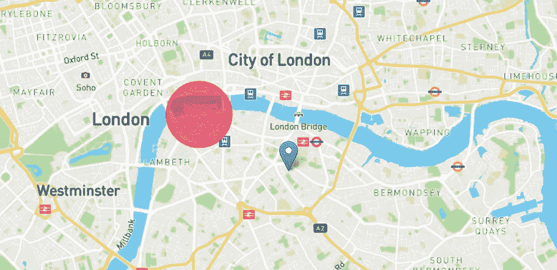
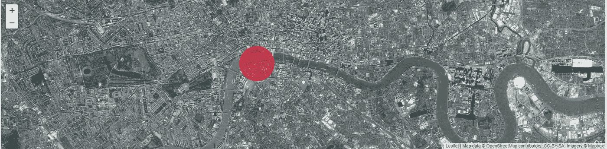

# 向您的网站添加交互式地图

> 原文：<https://javascript.plainenglish.io/add-interactive-maps-to-your-website-5e935924ff5c?source=collection_archive---------4----------------------->

## 不用谷歌地图！



Photo by [KOBU Agency](https://unsplash.com/@kobuagency?utm_source=medium&utm_medium=referral) on [Unsplash](https://unsplash.com?utm_source=medium&utm_medium=referral)

在你的网站上添加一个交互式地图可以使它看起来更漂亮，也有助于用户体验。

地图可以添加到地址旁边以及登录页面上，以传达地理信息。

为了添加免费、快速的交互式地图，我们将使用 fleet . js，这是一个用于触摸友好地图的开源库。

该软件包的大小约为 40kb，包括一套全面的[地图功能。](https://leafletjs.com/index.html#features)

## 装置

要安装这个库，我们需要在 HTML 文件的 head 部分添加一些东西。

1.  CSS 文件

2.传单 JavaScript 文件(应放在上述 CSS 文件之后)

这就是我们需要添加的所有文件。

现在我们可以用元素来帮助显示地图。您可以为 div 元素提供一个唯一的 ID。

这个元素将用于显示地图。

此外，确保元素具有如下所示的高度属性:

```
<div id="htmlmap" style="height:50vh"></div>
```

在本文中，我们将使用 Mapbox 来获取 apt 切片图层。然而，要获得 tile 层，我们需要一个访问令牌(可以免费获得)。您可以创建一个帐户，并通过进入[这里](https://www.mapbox.com/studio/account/tokens/)获得访问令牌。

此外，我还将添加我的自定义 CSS 文件以及 index.js 文件。

最终的 HTML 文件应该如下所示:

## 初始化

在 index.js 文件中，我们只需使用以下代码初始化地图:

```
var mymap = L.map('mapid').setView([51.505, -0.09], 13);
```

`setView`方法返回一个地图对象。第一个参数是一个数组，包含您希望在地图上显示的地点的坐标，13 是缩放级别。

这还不是全部。

我们需要添加一个平铺层到我们的地图。如前所述，我们将使用地图框来获得瓷砖层。

`tileLayer`中的第一个参数是切片层的 URL，而第二个参数是包含属性的对象。

如您所见，您需要将 Mapbox 访问令牌作为字符串传递给属性' access token '。

你现在有一个交互式地图了！



Source: Author

## 标记和圆圈

添加标记非常简单。

像地图的初始化一样，我们需要用坐标初始化地图，然后使用`addTo` 方法添加到我们的地图中。

圆圈也是如此。

您也可以自定义标记的图标！



Source: Author

## 事件

为了在每次用户与地图交互时执行一些操作，您可以使用`onMapClick`函数，该函数在每次地图发生变化时获取一个事件对象。

您可以使用它来显示重要的消息或在后台运行一些代码。

在下面的例子中，我们使用了函数向用户显示一个弹出窗口。

我们使用事件对象通过使用`latlng`来获得纬度和经度，我们使用它来显示弹出窗口，通知用户他所点击的位置的坐标。

如果您记录该事件，您会发现它包含的所有属性。


The event object. Source: Author

## 卫星地图

切换到卫星视图，您实际上只需要修改一行代码。



Source: Author

当我们将地图从“mapbox/streets-v11”初始化为“mapbox/satellite-v9”时，我们需要更改“id”属性。

## 结论

添加地图可以增强网站的可访问性，并给人留下良好的第一印象。

fleed . js 提供了一种简单的方法，可以免费快速地将漂亮的交互式地图添加到您的网站上。

除此之外，您还可以使用许多功能和工具。官方指南非常深入地涵盖了所有这些方面。