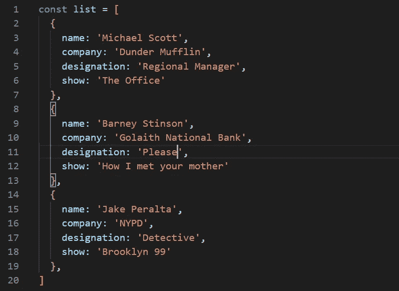

# 如何添加、修改和删除 JavaScript 对象文字属性

> 原文：<https://javascript.plainenglish.io/add-modify-and-delete-properties-from-javascript-object-7ad07e7be1bb?source=collection_archive---------0----------------------->

JavaScript 对象是属性的集合，属性是名称(或*键*)和值之间的关联。我们作为开发人员过度使用它。在我编程生涯的最初几天，我发现很难处理对象操作。所以今天我想列出添加、更新和删除对象属性的方法。

# 向对象添加属性:

只需给对象赋值，就可以将属性添加到对象中。就像下面的例子，我们添加了丈夫的财产并直接给出了价值。我们也可以在赋值时使用括号。

可以使用 ES7 语法和函数方法，并添加会产生相同结果的属性。

# 从对象中删除属性:

用户可以使用关键字`delete`从对象中删除属性。`delete`关键字删除属性的值和属性本身。删除后，该属性在重新添加之前无法使用。

# 更新现有属性的值

只需将属性值重新分配给同一个键，就可以更新属性值。

# 将属性添加到对象数组中

假设我们有一个对象数组，我们希望将属性添加到数组中的每个对象。我们可以使用许多数组方法来实现这一点(也可以使用循环的*)。但是这里我使用了数组方法。 ***forEach*** 循环访问数组并将属性添加到对象中。*

# 从对象数组中删除属性

这里，删除与添加类似。迭代是用数组方法完成的。 ***forEach*** 然后用关键字 *delete* 完成删除。

# 更新对象数组中现有属性的每个值

这里是数组方法。 ***每一个*** 都用来迭代数组的元素。财产*、【责任】、*被重新分配*(【表演之心】到【逗人笑】)*到不同的价值。

我列出了一些我知道的添加、更新和删除属性的方法。如果你知道其他方法，请在下面评论。

谢谢你..