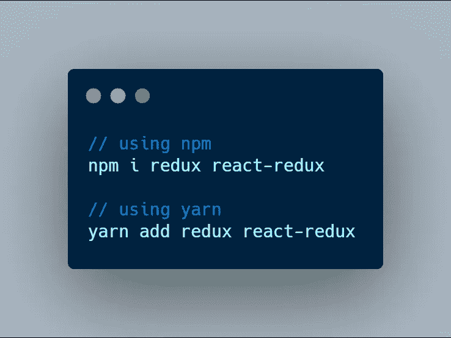
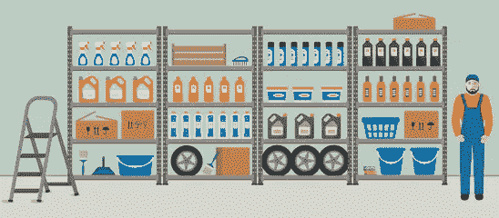

# 使用 React 挂钩将 Redux 添加到 React 应用程序中

> 原文：<https://javascript.plainenglish.io/add-redux-to-your-react-app-with-react-hooks-5abb0bff9d7e?source=collection_archive---------2----------------------->

## 带有反应挂钩的 REDUX

## 你能找到的最全面的指南


Add Redux to Your React App

你曾经很难理解 Redux 吗？我曾经也像你一样，被抛弃在最初毫无意义的时髦词汇的海洋中。本文旨在解释 Redux 如何工作，并将 Redux 添加到您的 React 应用程序中。如果你读到这篇文章的结尾，我敢肯定你会对 Redux 以及如何在 React 应用程序中使用它有一个很好的理解。

我先介绍一下 Redux 是什么，它将为我们解决的问题。之后，让我们直接进入代码，看看事情是如何工作的。

> **先决条件:**为了充分利用本文，您首先应该熟悉 React 和 React 钩子的基本概念。

让我们开始吧。

# 为什么是 Redux？

看看这段代码。

在上面的代码中，`Component3`有一个状态变量`theme`，`Component1`正在使用它的值。`Component1`显示什么取决于`Component1`中`theme`变量的值。

每个组件通过 props 获得变量`theme`的值，一切都会如预期的那样正常工作。

但是，你也会看到`Component2`甚至不需要`theme`变量的值。我们把`theme`作为道具传递给它，只是因为我们不能在没有先把它传递给`Component2`的情况下把`theme`传递给`Component1`。

对于上面这样的简单场景来说，这可能不是问题，但是如果`Component1`嵌套了几十个组件，这肯定会变得更加复杂。理解、调试和维护代码会非常困难

这是开发人员的观点，但是在应用程序方面也有缺点。

您知道，React 组件的属性和状态的变化会导致它及其子组件重新渲染。那么当你传递不必要的道具时会发生什么呢？随着这些道具的每一次改变，这些组件将开始重新渲染，没有合理的理由，因此将导致缓慢的性能。

这在一个小项目中可能也不明显，但是当你的应用程序增加了几十个组件时，这将变得非常明显。

这就是 Redux 前来救援的地方。使用 Redux，我们可以在一个地方定义`theme`并从任何组件与它交互，而不用像上面的代码那样将它的值作为道具传递给几十个组件。

# Redux 是什么？

Redux 是一个开源的 JavaScript 库，用于管理 JavaScript 应用程序中的应用程序(全局)状态。它使你能够将应用程序的所有全局状态变量存储在一个地方。那么你应用程序中的任何组件都将能够直接**与它**交互。

# 如何将 Redux 添加到我的 React 应用程序

现在我们对 Redux 是什么以及为什么使用它有了足够的了解。让我们来看看如何在 React 应用程序中使用 Redux。

## 步骤 01 —安装 Redux 和 React-Redux

假设您已经有一个 React 项目，根据您使用的包管理器，使用以下命令之一安装 [**Redux**](https://www.npmjs.com/package/redux) 和 [**React-Redux**](https://www.npmjs.com/package/react-redux) 包。React-Redux 是 React.js 的官方 Redux 绑定。我们需要它从 React 组件访问和修改全局状态的内容。



## 步骤 02——为我们未来的商店定义店主

想想现实世界中的商店。这种商店通常有一个店主负责。他的职责是管理商店。所有影响商店的事情都应该通过店主发生。



A real-world store with the storekeeper — source: Adobe

同样，当我们定义一个 Redux 存储时，我们也需要为它设置一个 storekeeper，这样我们存储中的全局状态变量只能通过它来修改。在 Redux 中，这个 storekeeper 是一个函数，叫做 **reducer** 。

由于 Redux 不允许我们在没有 storekeeper 的情况下创建商店，所以我们先从定义一个 reducer 开始。创建一个名为`Reducer.js`的文件，并用下面的代码填充它。

如上所述，这个缩减器负责对悬挂物进行修改。reducer 真正做的是**将当前状态作为输入，修改它并将修改后的状态返回给 Redux store** 。你可以看到我们已经声明了一个初始状态。当使用上述 reducer 创建商店时，这将是我们商店的初始内容。

> 别担心，现在这样就够了。我们将在本文后面详细讨论减速器。继续读😊。

## 步骤 03-定义一个中央存储来保存全局状态

我们需要一个存放应用程序状态变量的地方。Redux 附带了一个方法`createStore`来为我们所有的全局状态变量创建一个存储空间。为了使商店对整个应用程序可用，我们还应该用它的`Provider`组件包装我们的应用程序组件。

在你的 React 应用中修改`index.js`如下。

在上面的代码中，我们使用上面创建的缩减器创建了一个 Redux 存储。我们商店的初始状态是由减速器定义的。因此，这就是我们商店现在的样子:

```
{
  theme: "default"
}
```

还和我在一起吗？太好了。让我们继续前进。

## 步骤 04 —从我们的 Redux 商店获取内容

现在我们的商店里有了一笔`theme`资产。那么，我们如何在子组件中使用它呢？嗯，非常简单。Redux 有一个现成的钩子，`useSelector`就是为了那个。

很简单，不是吗？现在我们可以直接访问全局状态。不再像 before🥳.一样钻道具

## 步骤 05——用减速器修改存储状态

嘿，你还记得我在上面承诺过以后会详细讨论减速器吗？时候到了。

那么，Redux 中减速器的实际用途是什么呢？

不仅从全局存储中检索值，有时我们还需要直接从子组件中更新存储。

想象一个真实世界的商店，我们需要在那里放一些商品。我们通常会将商品发送给店主，并附上一条信息，告诉店主如何在商店中包装商品。收到消息后，保管员检查消息，并按消息中所述储存货物。

同样，当我们需要更新 Redux 存储时，我们需要向 storekeeper 发送一条消息，同时发送新数据。在 Redux 术语中，这个消息被称为**类型**，它包含的数据被称为**有效载荷。**数据和消息的组合称为一个**动作**。收到这个动作后，reducer 检查它是否有指定类型的指令。如果有，reducer 根据指令用有效载荷更新存储。

但是，怎么做呢？

很简单。使用 React-Redux 提供的`useDispatch()`钩子，我们可以向我们的 Redux 存储分派动作。然后，减速器根据它们的类型响应这些动作。

让我们用代码来弄清楚这一点。

在下面的代码片段中，一个类型为`CHANGE_THEME`的动作被发送到商店。

在接收到动作时，缩减器检查动作的类型。因为它有类型`CHANGE_THEME`的动作指令，全局状态中的`theme`用有效载荷更新如下。

你有时可能会想知道那个`...state`是什么意思。当我们在当前状态下修改一些值时，我们不希望所有其他变量都改变。因此，我们还在新状态中包含旧状态变量，并在列表末尾添加修改后的变量。由于底部的键替换了顶部的相同键，旧的`theme`被底部的新键值对替换。

Hooray

Congratulations🥳…:现在你已经将 Redux 完全集成到 React 应用程序中了。如果你走了这么远，我应该感谢你对学习新事物的耐心和热情。

# 常见问题

到目前为止，我们已经对如何将 Redux 集成到 React 应用程序中有了很好的理解。然而，它通常不会就此结束。许多初学者可能仍有许多问题要问。以下是初学者经常问的一些常见问题及其答案。

*   **为什么在浏览器中页面刷新期间，Redux 存储中的状态变量被设置为初始状态？**

Redux 允许我们将应用程序状态存储在一个地方，并在 React 应用程序的任何深度从任何组件处理它。然而，在页面刷新期间，存储在计算机存储器中的这些全局状态值被清除。如果您希望全局状态值在页面刷新期间保持不变，那么您需要将其保存在某个地方，比如本地存储。

幸运的是，你不必为此担心。有几个专门为此开发的包，比如 [redux-persist](https://www.npmjs.com/package/redux-persist) 和 [redux-storage](https://www.npmjs.com/package/redux-storage) 。解释如何将它们与 Redux 集成超出了本文的范围。然而，一旦你理解了 Redux，由于它们全面的文档，把它们添加到你的项目中是非常简单的。

*   **何必去学习和设置 Redux？我们不能只使用本地存储或会话存储吗？**

说了这么多解释，你们有些人可能会有这样的想法。

> 嗯（表示踌躇等）..为什么要用 Redux 呢？我可以将所有全局状态变量存储在 localStorage/ sessionStorage 中，并随时从中检索。这比设置 Redux 要方便得多。

相当容易和舒适，对不对？不完全是。频繁访问 localStorage / sessionStorage 中的全局状态变量会产生一些负面影响。如需更多详细信息，请查看 Stackoverflow 上的[这个问题的答案。](https://stackoverflow.com/questions/56923481/why-redux-instead-of-session-storage)

**注意:**如上所述，我们使用 localStorage 在页面刷新期间持久存储。那么 redux 只在发生页面刷新或存储更新时访问 localStorage。相反，如果在 localStorage 中声明全局变量值，那么每次都要访问它。

*   **我想为每个模块创建单独的减速器，而不是一个大的单个减速器。可能吗？**

随着全局状态变大，使用单个缩减器来管理所有应用程序状态变量将变得复杂和低效。此时，您可能更喜欢为每个模块使用单独的 reducers，以便应用程序代码保持有组织和整洁。

Redux 使我们能够为应用程序中的每个模块使用几个 reducer，然后将它们全部导出为一个 reducer。如需了解更多信息，请点击此处查看[相关重复文档](https://redux.js.org/api/combinereducers)。指南非常简单。

在本文中，我们学习了如何将 Redux 与 React 应用程序集成，并回答了一些常见问题，这些问题是好奇的初学者经常问的。我希望这将有助于您深入了解在 React web 应用程序中集成 Redux。我非常感谢你诚实的建议和反馈。因此，请让我知道你的宝贵意见。

保持安全&感谢阅读💻💝

## 来自简明英语团队的说明

你知道我们有四种出版物吗？给他们一个关注来表达爱意:[**JavaScript in Plain English**](https://medium.com/javascript-in-plain-english)[**AI in Plain English**](https://medium.com/ai-in-plain-english)[**UX in Plain English**](https://medium.com/ux-in-plain-english)[**Python in Plain English**](https://medium.com/python-in-plain-english)**——谢谢，继续学习！我们还推出了一个 YouTube，希望你能通过 [**订阅我们的简明英语频道**](https://www.youtube.com/channel/UCtipWUghju290NWcn8jhyAw) 来支持我们**

**一如既往,“简明英语”希望帮助推广好的内容。如果您有一篇文章想要提交给我们的任何出版物，请发送电子邮件至[**submissions @ plain English . io**](mailto:submissions@plainenglish.io)**，并附上您的媒体用户名和您感兴趣的内容，我们将会回复您！****

******资源:******

****[](https://redux.js.org/) [## redux-JavaScript 应用程序的可预测状态容器。|还原

### JS Apps Redux 的可预测状态容器帮助您编写行为一致的应用程序，运行在不同的…

redux.js.org](https://redux.js.org/) [](https://react-redux.js.org/) [## React Redux 官方 React 绑定

### Redux 的官方 React 绑定

Reduxreact-redux.js.org 官方反应绑定](https://react-redux.js.org/) [](https://stackoverflow.com/questions/56923481/why-redux-instead-of-session-storage) [## 为什么是 redux 而不是会话存储

### 感谢贡献一个堆栈溢出的答案！请务必回答问题。提供详细信息并分享…

stackoverflow.com](https://stackoverflow.com/questions/56923481/why-redux-instead-of-session-storage)  [## Redux

### 随着你的应用变得越来越复杂，你会想把你的归约函数分解成单独的函数，每个函数管理…

redux.js.org](https://redux.js.org/api/combinereducers)****