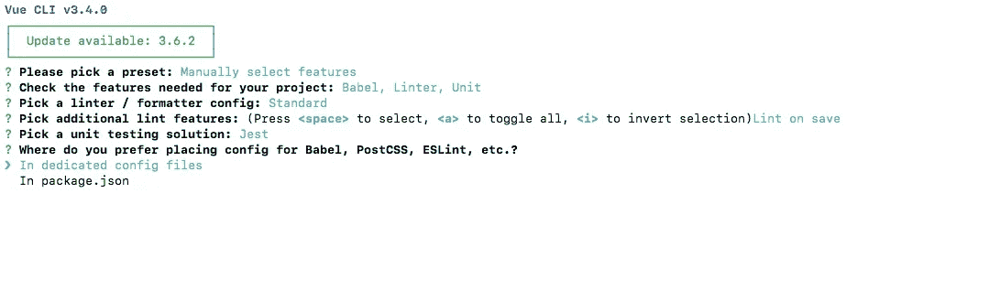

# 使用 Jest 和 Travis CI 测试您的 Vue 应用

> 原文：<https://javascript.plainenglish.io/add-test-coverage-to-vue-js-app-with-jest-travis-ci-and-coveralls-d10d118125c2?source=collection_archive---------0----------------------->


Photo by [David Travis](https://unsplash.com/photos/WC6MJ0kRzGw?utm_source=unsplash&utm_medium=referral&utm_content=creditCopyText) on [Unsplash](https://unsplash.com/search/photos/test?utm_source=unsplash&utm_medium=referral&utm_content=creditCopyText)

在本文中，我们将了解如何向 Vue 应用程序添加一些规范，并使用 Jest test runner 运行这些规范，使用工作服添加一些测试覆盖范围，并在 GitHub 中将它们显示为徽章。

## 为了实现这些，我们可能需要理解测试覆盖的概念。

这里要注意的第一点是，它不是对 Vue 测试的详细解释，而是主要集中在 Vue.js 应用程序的配置方面。

# 博客的结构

1.  我们将在这个博客中构建什么。
2.  什么是单元测试？
3.  vue-test-utils 简介。
4.  什么是玩笑？
5.  设置应用程序
6.  添加测试规格。
7.  为 Jest 添加覆盖代码。
8.  添加 Travis 配置。
9.  将工作服添加到应用程序中。
10.  完成 100%的测试覆盖率。
11.  将覆盖范围显示为徽章。
12.  重要参考点。

# 1.我们将在这个博客中构建什么

在这里，我们将构建一个小的应用程序来显示被点击的按钮的数量。我知道，这是一个非常简单的应用程序，因为我们不打算在这里覆盖 Jest，因为有大量的博客可以集成 Vue 和 Jest。所以我不想重复。

# 2.什么是单元测试？

从 Vue 官方文件来看，

> 单元测试是软件开发的基础部分。单元测试孤立地执行最小的代码单元，以增加添加新功能和追踪 bug 的便利性。Vue 的[单文件组件](https://vuejs.org/v2/guide/single-file-components.html)使得独立编写组件的单元测试变得非常简单。

从一个简单的角度来看，我们可以说当 UI 中的按钮被点击时计数器增加时，单元测试正在进行。

# 3.vue-test-utils 简介。

它是 Vue.js 的官方单元测试实用程序库，处理单元测试使用的按钮点击和许多事件。通过使用 vue-test-utils，我们可以模拟输入甚至道具。

在创建应用程序时，有一个使用 vue-cli 来适应 vue-test-utils 的选项，将在下面的部分中向您展示。

# 4.什么是玩笑？

通过使用 vue-test-utils，我们可以创建测试，但是运行这些测试需要一个运行程序。这就是笑话出现的地方。Jest 实际上是由脸书实现的 test runner，在测试界很受欢迎。它有最少的配置和所有。

笑话包含 ***快照测试*** 。快照测试会将 UI 转换为字符串并检查内容。这是一个令人敬畏的笑话。

# 5.设置应用程序

我已经安装了 vue-cli，因此我们正在创建应用程序。

## 1.创建应用程序并选择特性

使用下面的命令，

```
vue create application-nameexample:
$ vue create vue-code-coverage
```

我将手动选择应用程序的功能。


对于单元测试部分，将选择 Jest 作为测试运行程序


我们可以将 Jest 的配置文件存储在 package.json 或专用文件中。在这里，我们选择专用文件选项。



然后，我们提交这个项目中的第一个提交

## 2.为按钮单击创建一个新组件

我们在那里已经有了一个名为 HelloWorld.vue 的组件，我们只是删除它并在那里添加我们的组件。

[代码提交的链接](https://github.com/anoobbava/vue-code-coverage/commit/09703e87865f5dbefe6d12b4e15600c7758b1273)

## 3.添加按钮点击和显示计数的功能。

现在，我们需要创建一个按钮，并添加一个方法来增加点击次数。我们需要一个名为 count 的数据，它将在单击按钮时递增。


如此简单的权利。最初，计数变为零，这是由 data 属性初始化的。然后分配一个方法来调用，以便在单击按钮时增加计数

输出将是这样的，


[代码变更链接](https://github.com/anoobbava/vue-code-coverage/commit/ea4d692fe88dcdfd1fa5eb8ed0fc599d13780137)。

## 4.检查测试文件。

当使用 vue-cli 创建一个应用程序并选择测试工具时，它会自动创建一个名为 ***example.spec.js 的样本测试文件。***

我们可以根据自己的要求删除或编辑该文件。


# 6.添加测试规格。

我们将在 ***/tests/unit/*** 中创建一个名为 buttonCount.spec.js 的文件

## 1.导入 test-utils 文件

首先，需要导入 vue-test-utils。这可以通过，

```
import { shallowMount } from '@vue/test-utils'
```

我们可以在这里使用山或浅山。当使用 shallowMount 时，它将只考虑当前组件，而不考虑子组件。浅层安装对于单元测试来说太好了，因为它们是用来测试单个组件的。

## 2.导入相应的组件文件。

这里，我们需要导入我们自己的将要被测试的组件。就像我们的例子一样，

```
import ButtonCount from '@/components/ButtonCount.vue'
```

## 3.使用浅层安装创建一个包装器

我们的测试套件将会有一个 ***描述*** 一个跟随着 ***it 功能。***


以上是我们测试套件的基本框架，现在我们正在添加更多来完成功能。

```
describe('ButtonCount.vue', () => { const wrapper = shallowMount(ButtonCount) // checks ButtonCount is a component. it('Register is a component', () => { expect(wrapper.isVueInstance()).toBeTruthy() })})
```

检查 ButtonCount 是否生成是一个非常基本的测试。现在，我们将在终端中执行这个测试，以确定它是成功还是失败。

在我们的 package.json 中，已经为测试配置了脚本，


我们可以使用，

```
npm run test:unit
```


万岁，我们的测试通过了，现在我们可以完成所有的测试了。

***这里有个注意，*** 请将 ***— watch*** 添加到 package.json 中的测试单元，成为一个交互式的测试运行工具，只执行失败的测试，降低开销问题。


## 4.完成所有测试

完整的测试变成这样，


并且执行输出变成使用监视模式，


[提交代码更改的链接](https://github.com/anoobbava/vue-code-coverage/commit/0fdfb555316225c18aafa625cd6171b7aeb940db)

# 7.为 Jest 添加覆盖代码。

我们需要向 jest.config.js 添加一些代码，以便向 UI 显示代码覆盖率。

```
collectCoverage: true,collectCoverageFrom: ['**/*.{vue}', '!**/node_modules/**', '!<rootDir>/dist/**','!<rootDir>/src/plugins/**', '!<rootDir>/tests/unit/**'],coverageReporters: ['lcov', 'text-summary']
```

这意味着，需要发送代码覆盖率，并且只需要选择那些文件。


现在，再次运行测试套件，


万岁，我们已经覆盖了 Vue 文件，现在我们可以移动到我们的配置部分。

# 8.添加 Travis 配置。

Travis CI 是持续集成，它将有助于处理运行测试并检查构建是否通过。

特拉维斯使用一个名为 ***的 yml 文件。特拉维斯. yml.*** 需要添加一些配置来处理这个文件。

这个文件必须在我们项目的根路径上，而不是在某个内部路径上，


在 yml 中，间距非常重要，请记住这一点。

转到 [Travis ci 站点](https://travis-ci.org/) →登录 GitHub →选择项目


目前，我们仍然没有推出. travis.yml，这就是为什么构建现在是未知的，


现在，等着行刑吧，


太棒了，现在我们可以将特拉维斯徽章添加到我们的应用程序中了。


Github repo 添加了 Travis 徽章，


# 9.将工作服添加到应用程序中。

根据文件，

> Coveralls 是一种 web 服务，可以帮助您跟踪代码覆盖率，并确保所有新代码都被完全覆盖。

## 1.准备好工作服

转到[套装](https://coveralls.io/) →登录 GitHub →添加仓库→点击同步仓库→选择仓库


## 2.添加工作服 npm 包。


穿上工作服，


## 3.更新 travis.yml


这将把保险范围发送到我们的工作服上。


太棒了，现在我们有 67%的覆盖率。原因是我们有两个文件

1.  App.vue
2.  按钮计数. vue

目前，仅测试 ButtonCount.vue 的覆盖率。在 App.vue 的情况下也需要添加。

## 10.完成 100%的测试覆盖率。

为此，还需要为 App.vue 编写规范。在测试/单元/中创建一个名为 ***App.spec.js*** 的文件

添加规格，


该

### 数据来自我们的 ButtonClick 组件。


太棒了，我们现在可以 100%覆盖了。现在我们可以推出代码了。

# 11.将覆盖范围显示为徽章。

按下密码后，工作服就变成了，


复制徽章，更新到 GitHub Repo。


厉害了，现在在 GitHub repo 更新了。


# 12.重要参考点。

我们在这里取得了很多成就，我只是想更新一些写这篇博客时用到的信息。

> 如果这个故事对你有所帮助，请随时[给我买杯咖啡](https://www.buymeacoffee.com/anoobbava)

1.  Vue 测试手册:[链接](https://lmiller1990.github.io/vue-testing-handbook/)。非常感谢创建和实现这个网站和开源它。
2.  笑话[链接](https://jestjs.io/)
3.  Github [链接](https://github.com/anoobbava/vue-code-coverage)

# 感谢阅读！

如果您有任何问题，请随时留下您的意见。