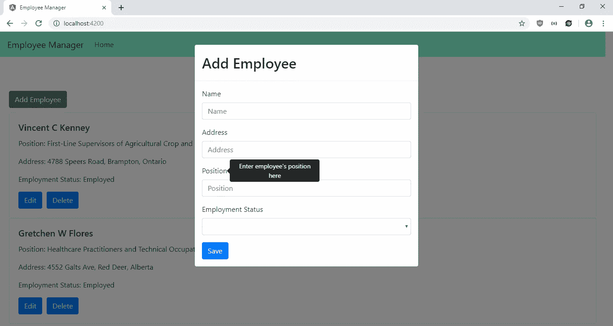
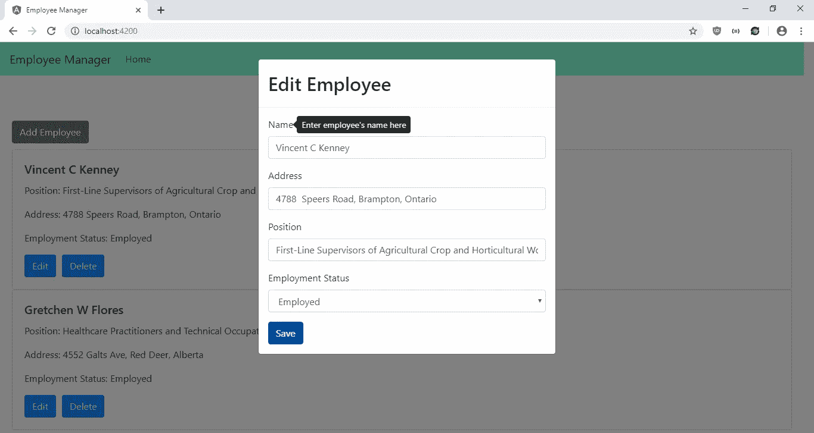
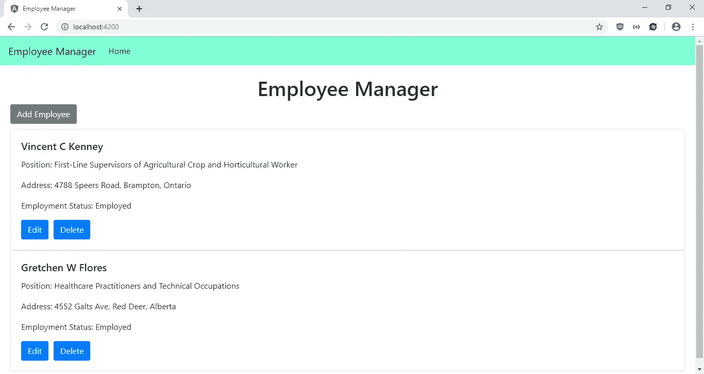

# 向您的 Angular 应用程序添加工具提示，帮助用户使用您的应用程序

> 原文：<https://javascript.plainenglish.io/add-tool-tips-to-your-angular-app-to-help-users-use-your-app-35c663eb49f8?source=collection_archive---------2----------------------->

工具提示通常用于提供如何使用 web 应用程序不同部分的提示。它很容易添加，并帮助用户更好地理解该应用。它们对于显示过长的文本也很有用。

Ngx-Bootstrap 有工具提示作为一个组件。它还有许多其他我们可以使用的组件。使用 Ngx-Bootstrap 添加工具提示很容易。参见[https://valor-software.com/ngx-bootstrap/#/tooltip](https://valor-software.com/ngx-bootstrap/#/tooltip)了解工具提示的全套选项。它可以有文字，位置可以改变，也可以根据屏幕大小改变位置。内容也可以是超文本标记语言。也可以自定义工具提示的触发器。

在本文中，我们将编写一个 employee-manager 应用程序，让用户可以在表单中输入他们的员工数据。用户可以使用工具提示添加、编辑和删除他们的数据，以便在使用表单时引导他们浏览表单。

为了开始这个项目，我们通过运行`npm i -g @angular/cli`安装了 Angular CLI(如果还没有安装的话)。接下来，我们运行 Angular CLI，通过键入以下内容来创建项目:

```
ng new employee-manager
```

在向导中，我们选择包括路由，并使用 SCSS 作为我们的 CSS 预处理器。

然后我们安装一些软件包。我们需要用于样式、模式和工具提示的 Ngx-Bootstrap，以及 MobX，以将国家存储在一个共享的存储中。要安装它们，我们运行:

```
npm i ngx-bootatrap mobx mobx-angular
```

接下来，我们创建组件、类和服务。为此，我们运行:

```
ng g component employeeForm
ng g component homePage
ng g service employees
ng g class employeeStore
ng g class employee
```

现在，我们准备编写一些代码。在`employee-form.component.html`中，我们将现有代码替换为:

```
<form (ngSubmit)="save(employeeForm)" #employeeForm="ngForm">
  <div class="form-group">
    <label tooltip="Enter employee's name here" placement="right">Name</label>
    <input
      type="text"
      class="form-control"
      placeholder="Name"
      #name="ngModel"
      name="name"
      [(ngModel)]="form.name"
      required
    />
    <div *ngIf="name?.invalid && (name.dirty || name.touched)">
      <div *ngIf="name.errors.required">
        Name is required.
      </div>
    </div>
  </div> <div class="form-group">
    <label tooltip="Enter employee's address here" placement="right"
      >Address</label
    >
    <input
      type="text"
      class="form-control"
      placeholder="Address"
      #address="ngModel"
      name="address"
      [(ngModel)]="form.address"
      required
    />
    <div *ngIf="address?.invalid && (address.dirty || address.touched)">
      <div *ngIf="address.errors.required">
        Address is required.
      </div>
    </div>
  </div> <div class="form-group">
    <label tooltip="Enter employee's position here" placement="right"
      >Position</label
    >
    <input
      type="text"
      class="form-control"
      placeholder="Position"
      #position="ngModel"
      name="position"
      [(ngModel)]="form.position"
      required
    />
    <div *ngIf="position?.invalid && (position.dirty || position.touched)">
      <div *ngIf="position.errors.required">
        Position is required.
      </div>
    </div>
  </div> <div class="form-group">
    <label tooltip="Select employee's employment status" placement="right"
      >Employment Status</label
    >
    <select
      class="form-control"
      #status="ngModel"
      name="status"
      [(ngModel)]="form.status"
      required
    >
      <option value="Employed">Employed</option>
      <option value="Terminated">Terminated</option>
    </select>
    <div *ngIf="status?.invalid && (status.dirty || status.touched)">
      <div *ngIf="status.errors.required">
        Status is required.
      </div>
    </div>
  </div> <button class="btn btn-primary">Save</button>
</form>
```

这是员工表单的模板，允许用户添加和编辑员工数据。我们有姓名、地址、职位和状态字段，它们都是根据需要设置的。未填写任何数据时会显示错误消息，如果用户尝试在不填写任何数据的情况下提交，将停止提交。当用户将鼠标悬停在标签上时，标签将显示工具提示。我们将`placement`设置为`right`，以便它们显示在右侧。当用户点击保存按钮时，代码中的`save`功能被调用。

然后在`employee-form.component.ts`中，我们将现有代码替换为:

```
import { Component, OnInit, Output, Input, SimpleChanges, EventEmitter } from '[@angular/core](http://twitter.com/angular/core)';
import { employeeStore } from '../employee-store';
import { EmployeesService } from '../employees.service';
import { NgForm } from '[@angular/forms](http://twitter.com/angular/forms)';
import { Employee } from '../employee';[@Component](http://twitter.com/Component)({
  selector: 'app-employee-form',
  templateUrl: './employee-form.component.html',
  styleUrls: ['./employee-form.component.scss']
})
export class EmployeeFormComponent implements OnInit {
  form: Employee = <Employee>{};
  [@Output](http://twitter.com/Output)('saved') saved = new EventEmitter();
  [@Input](http://twitter.com/Input)() edit: boolean;
  [@Input](http://twitter.com/Input)() selectedEmployee: Employee;
  store = employeeStore; constructor(private employeeService: EmployeesService) { } ngOnInit() {
  } ngOnChanges(changes: SimpleChanges) {
    this.form = Object.assign({}, this.selectedEmployee);
  } save(employeeForm: NgForm) {
    if (employeeForm.invalid) {
      return;
    }
    if (this.edit) {
      this.employeeService.editEmployee(this.form)
        .subscribe(res => {
          this.getEmployees()
          this.saved.emit();
        })
    }
    else {
      this.employeeService.addEmployee(this.form)
        .subscribe(res => {
          this.getEmployees()
          this.saved.emit();
        })
    }
  } getEmployees() {
    this.employeeService.getEmployees()
      .subscribe((res: Employee[]) => {
        this.store.setEmployees(res);
      })
  }}
```

这个文件包含了我们在之前的模板中调用的函数，比如`save`函数。我们还有从主页获取数据的输入，以及向主页发出一个`saved`事件的输出。因为我们使用表单进行编辑，所以我们还需要用`selectedEmployee`输入来传递选中的条目，这样它就可以被编辑了。为了用`selectedEmployee`值更新`form`对象，每当`selectedEmployee`输入改变时，我们复制该值。

在`save`函数中，我们验证表单，并根据表单是否用于添加或编辑条目来调用不同的函数进行保存。通过调用`getEmployees`函数，最新的条目将被填充到我们的 MobX 存储中，一旦完成，就会发出`saved`事件。

接下来在`home-page.component.html`中，我们将代码替换为:

```
<ng-template #addTemplate>
  <div class="modal-header">
    <h2 class="modal-title pull-left">Add Employee</h2>
  </div>
  <div class="modal-body">
    <app-employee-form (saved)="closeModals()"></app-employee-form>
  </div>
</ng-template><ng-template #editTemplate>
  <div class="modal-header">
    <h2 class="modal-title pull-left">Edit Employee</h2>
  </div>
  <div class="modal-body">
    <app-employee-form
      [edit]="true"
      (saved)="closeModals()"
      [selectedEmployee]="selectedEmployee"
    ></app-employee-form>
  </div>
</ng-template><h1 class="text-center">Employee Manager</h1><div class="btn-group" role="group" id="add-group">
  <button
    type="button"
    class="btn btn-secondary"
    (click)="openAddModal(addTemplate)"
  >
    Add Employee
  </button>
</div><br /><div class="card" *ngFor="let e of store.employees">
  <div class="card-body">
    <h5 class="card-title">{{ e.name }}</h5>
    <p class="card-text">Position: {{ e.position }}</p>
    <p class="card-text">Address: {{ e.address }}</p>
    <p class="card-text">Employment Status: {{ e.status }}</p>
    <button (click)="openEditModal(editTemplate, e)" class="btn btn-primary">
      Edit
    </button>
    <button (click)="deleteEmployee(e.id)" class="btn btn-primary">
      Delete
    </button>
  </div>
</div>
```

添加用于添加、编辑和删除条目的按钮。员工条目显示在卡片上。编辑和删除按钮显示在卡片的底部。此外，我们有用于添加和编辑条目的模态，我们分别用添加和编辑按钮打开它们。

在`home-page.component.scss`中，我们添加:

```
$margin: 10px;#add-group {
  margin-bottom: $margin;
}button {
  margin-right: $margin;
}
```

给我们的按钮增加一些空白。

接下来在`home-page.component.ts`中，我们将现有代码替换为:

```
import { Component, OnInit, TemplateRef } from '[@angular/core](http://twitter.com/angular/core)';
import { employeeStore } from '../employee-store';
import { BsModalRef, BsModalService } from 'ngx-bootstrap/modal';
import { EmployeesService } from '../employees.service';
import { Employee } from '../employee';[@Component](http://twitter.com/Component)({
  selector: 'app-home-page',
  templateUrl: './home-page.component.html',
  styleUrls: ['./home-page.component.scss']
})
export class HomePageComponent implements OnInit {
  addModalRef: BsModalRef;
  editModalRef: BsModalRef;
  selectedEmployee: Employee = <Employee>{};
  store = employeeStore; constructor(
    private modalService: BsModalService,
    private employeeService: EmployeesService
  ) { } ngOnInit() {
    this.getEmployees()
  } getEmployees() {
    this.employeeService.getEmployees()
      .subscribe((res: Employee[]) => {
        this.store.setEmployees(res);
      })
  } openAddModal(template: TemplateRef<any>) {
    this.addModalRef = this.modalService.show(template);
  } openEditModal(template: TemplateRef<any>, employee: Employee) {
    this.editModalRef = this.modalService.show(template);
    this.selectedEmployee = employee;
  } closeModals() {
    this.addModalRef && this.addModalRef.hide();
    this.editModalRef && this.editModalRef.hide();
  } deleteEmployee(id) {
    this.employeeService.deleteEmployee(id)
      .subscribe((res: Employee[]) => {
        this.getEmployees();
      })
  }
}
```

我们有`openAddModal`和`openEditModal`函数来打开添加和编辑模式。`closeModals`功能是在`app-employee-form`组件中保存东西时关闭模态。`deleteEmployee`函数用于删除雇员，而`getEmployees`函数用于在项目被删除时获取页面加载时的条目，并删除我们商店中的项目，以便每个组件都可以访问它。

在`app-routing.module.ts`中，我们输入:

```
import { NgModule } from '[@angular/core](http://twitter.com/angular/core)';
import { Routes, RouterModule } from '[@angular/router](http://twitter.com/angular/router)';
import { HomePageComponent } from './home-page/home-page.component';const routes: Routes = [
  { path: '', component: HomePageComponent }
];[@NgModule](http://twitter.com/NgModule)({
  imports: [RouterModule.forRoot(routes)],
  exports: [RouterModule]
})
export class AppRoutingModule { }
```

因此，当用户点击链接或输入 URL 时，他们可以看到我们刚刚添加的页面。

接下来在`app.component.html`中，我们放入:

```
<nav class="navbar navbar-expand-lg navbar-light bg-light">
  <a class="navbar-brand" routerLink="/">Employee Manager</a>
  <button
    class="navbar-toggler"
    type="button"
    data-toggle="collapse"
    data-target="#navbarSupportedContent"
    aria-controls="navbarSupportedContent"
    aria-expanded="false"
    aria-label="Toggle navigation"
  >
    <span class="navbar-toggler-icon"></span>
  </button><div class="collapse navbar-collapse" id="navbarSupportedContent">
    <ul class="navbar-nav mr-auto">
      <li class="nav-item active">
        <a class="nav-link" routerLink="/">Home </a>
      </li>
    </ul>
  </div>
</nav><div class="page">
  <router-outlet></router-outlet>
</div>
```

向我们的页面添加链接，并暴露`router-outlet`以便用户可以看到我们的页面。

然后在`app.component.scss`中，我们加上:

```
.page {
  padding: 20px;
}nav {
  background-color: aquamarine !important;
}
```

添加填充到我们的页面，并改变我们的引导导航栏的颜色。

在`app.module.ts`中，我们将现有代码替换为:

```
import { BrowserModule } from '[@angular/platform-browser](http://twitter.com/angular/platform-browser)';
import { NgModule } from '[@angular/core](http://twitter.com/angular/core)';import { AppRoutingModule } from './app-routing.module';
import { AppComponent } from './app.component';
import { HomePageComponent } from './home-page/home-page.component';
import { EmployeeFormComponent } from './employee-form/employee-form.component';
import { FormsModule } from '[@angular/forms](http://twitter.com/angular/forms)';
import { HttpClientModule } from '[@angular/common](http://twitter.com/angular/common)/http';
import { TooltipModule } from 'ngx-bootstrap/tooltip';
import { ModalModule } from 'ngx-bootstrap/modal';
import { EmployeesService } from './employees.service';[@NgModule](http://twitter.com/NgModule)({
  declarations: [
    AppComponent,
    HomePageComponent,
    EmployeeFormComponent
  ],
  imports: [
    BrowserModule,
    AppRoutingModule,
    FormsModule,
    HttpClientModule,
    ModalModule.forRoot(),
    TooltipModule.forRoot()
  ],
  providers: [
    EmployeesService
  ],
  bootstrap: [AppComponent]
})
export class AppModule { }
```

我们添加我们在应用中使用的组件、服务和库。注意，我们在 Ngx-Bootstrap 中分别添加了每个组件，所以我们只添加我们需要的组件。

在`employee.ts`中，我们添加:

```
export class Employee {
    public id: number;
    public name: string;
    public address: string;
    public position: string;
    public status: string;
}
```

向我们的员工表单模型添加类型。

然后在`employeeStore.ts`中，我们添加:

```
import { observable, action } from 'mobx-angular';
import { Employee } from './employee';class EmployeeStore {
    [@observable](http://twitter.com/observable) employees: Employee[] = [];
    [@action](http://twitter.com/action) setEmployees(employees) {
        this.employees = employees;
    }
}export const employeeStore = new EmployeeStore();
```

创建 MobX store 来让我们的组件共享数据。每当我们调用`this.store.setEmployees` 我们的组件时，我们在这个存储中设置货币数据，因为我们在它之前添加了`@action`装饰器。当我们在组件代码中调用`this.store.employees` 时，我们总是从这个商店获得最新的值，因为它有`@observable`装饰器。我们将`Employee[]`类型添加到`employees`中，因此我们不必猜测可用的字段。

然后在`employee.service.ts`中，我们将现有代码替换为:

```
import { Injectable } from '[@angular/core](http://twitter.com/angular/core)';
import { environment } from 'src/environments/environment';
import { HttpClient } from '[@angular/common](http://twitter.com/angular/common)/http';[@Injectable](http://twitter.com/Injectable)({
  providedIn: 'root'
})
export class EmployeesService { constructor(private http: HttpClient) { } getEmployees() {
    return this.http.get(`${environment.apiUrl}/employees`);
  } addEmployee(data) {
    return this.http.post(`${environment.apiUrl}/employees`, data);
  } editEmployee(data) {
    return this.http.put(`${environment.apiUrl}/employees/${data.id}`, data);
  } deleteEmployee(id) {
    return this.http.delete(`${environment.apiUrl}/employees/${id}`);
  }}
```

这样我们就可以向后端发出 HTTP 请求来获取、保存和删除用户的雇员条目。

接下来在`environment.prod.ts`和`environment.ts`中，我们将现有代码替换为:

```
export const environment = {
  production: true,
  apiUrl: '[http://localhost:3000'](http://localhost:3000')
};
```

添加我们的 API 的 URL。

最后，在`index.html`中，我们将代码替换为:

```
<!DOCTYPE html>
<html lang="en">
  <head>
    <meta charset="utf-8" />
    <title>Employee Manager</title>
    <base href="/" /><meta name="viewport" content="width=device-width, initial-scale=1" />
    <link
      href="[https://maxcdn.bootstrapcdn.com/bootstrap/4.0.0/css/bootstrap.min.css](https://maxcdn.bootstrapcdn.com/bootstrap/4.0.0/css/bootstrap.min.css)"
      rel="stylesheet"
    />
    <link rel="icon" type="image/x-icon" href="favicon.ico" />
    <script
      src="[https://code.jquery.com/jquery-3.3.1.slim.min.js](https://code.jquery.com/jquery-3.3.1.slim.min.js)"
      integrity="sha384-q8i/X+965DzO0rT7abK41JStQIAqVgRVzpbzo5smXKp4YfRvH+8abtTE1Pi6jizo"
      crossorigin="anonymous"
    ></script>
    <script
      src="[https://cdnjs.cloudflare.com/ajax/libs/popper.js/1.14.7/umd/popper.min.js](https://cdnjs.cloudflare.com/ajax/libs/popper.js/1.14.7/umd/popper.min.js)"
      integrity="sha384-UO2eT0CpHqdSJQ6hJty5KVphtPhzWj9WO1clHTMGa3JDZwrnQq4sF86dIHNDz0W1"
      crossorigin="anonymous"
    ></script>
    <script
      src="[https://stackpath.bootstrapcdn.com/bootstrap/4.3.1/js/bootstrap.min.js](https://stackpath.bootstrapcdn.com/bootstrap/4.3.1/js/bootstrap.min.js)"
      integrity="sha384-JjSmVgyd0p3pXB1rRibZUAYoIIy6OrQ6VrjIEaFf/nJGzIxFDsf4x0xIM+B07jRM"
      crossorigin="anonymous"
    ></script>
  </head>
  <body>
    <app-root></app-root>
  </body>
</html>
```

将引导 CSS 和 JavaScript 依赖项添加到我们的应用程序中，并更改标题。

完成所有工作后，我们可以运行`ng serve`来运行 app。

为了启动后端，我们首先通过运行`npm i json-server`来安装`json-server`包。然后，转到我们的项目文件夹并运行:

```
json-server --watch db.json
```

在`db.json`中，将文本改为:

```
{
  "employees": [
  ]
}
```

所以我们有了定义在可用的`requests.js`中的`employees` 端点。

那么我们应该得到:

