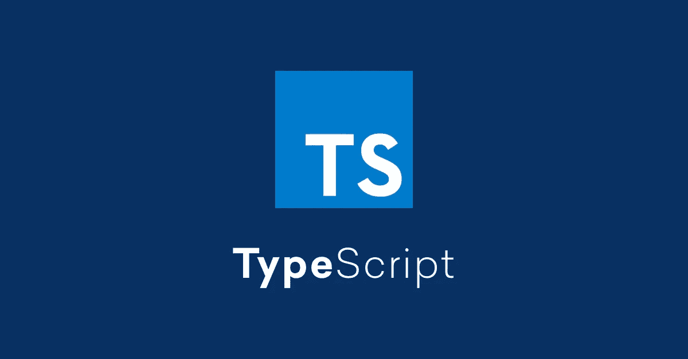

# 向现有代码库添加 TypeScript 支持

> 原文：<https://javascript.plainenglish.io/add-typescript-support-to-an-existing-codebase-9e9402e53f75?source=collection_archive---------4----------------------->



最近，我不得不将一个客户的代码库从普通的 JavaScript 转移到 TypeScript。创建类型之前的第一步是添加对 TypeScript 的支持。我想写下一些如何做到这一点的笔记，以防在不久的将来我不得不再次这样做。这是:

**步骤**:

1.  安装 typescript npm 包和节点类型定义。只需运行`npm i --save-dev typescript @types/node`
2.  在您的目录路径下创建一个名为 tsconfig.json 的文件，在其中粘贴以下内容:

```
{
    "compilerOptions": {
        "module": "commonjs",
        "esModuleInterop": true,
        "target": "es6",
        "noImplicitAny": true,
        "moduleResolution": "node",
        "sourceMap": true,
        "outDir": "dist",
        "baseUrl": ".",
        "paths": {
            "*": ["node_modules/*", "@types/*", "src/types/*"]
        }
    },
    "include": ["src/**/*"],
    "lib": ["es2016", "dom"]
}
```

tsconfig.json 文件的完整文档可在[这里](https://www.typescriptlang.org/docs/handbook/tsconfig-json.html)获得。

3.在 package.json 中将 tsc 添加到 npm 脚本中，如下所示:

```
 …
*scripts: {
 … 
 “tsc”: “tsc”;
},
…*
```

4.将“dist”文件夹添加到。既然你不想你所有的文件都被复制，你就不应该把编译好的。在 dist 目录中生成的 js 文件

5.可选:将文件转换为。ts 扩展和添加类型
您可以通过逐个文件地转换来实现，并且每次都检查错误。或者，您可以全部转换。js 文件到。在 linux 上使用此命令的 ts 文件:

```
 find . -name ‘*.js’ -exec sh -c ‘mv “$0” “${0%.js}.ts”’ {} \;
```

6.您可能需要将 json 文件复制到新的 dist 目录中。我所做的是向我的 package.json 添加一个构建脚本，它做两件事:编译。ts 文件，然后复制。json 文件复制到 dist 目录。然后我从 dist 文件夹启动节点应用程序。它看起来或多或少像这样:

```
…
*scripts: {
 …
 “build”: “npm run tsc && npm run cp-json”;
 “cp-json”: “cp src/*.json* dist/”;
 “start”: “nodemon dist/index.js”;
* *“tsc”: “tsc”;
},
…*
```

恭喜，你现在可以写打字稿了，用`npm run build`构建项目，然后用`npm start`启动它。你未来的自己可能会感谢你。

**结论:** 这只是一个将现有代码库转换为 typescript 的非常简单的指南，它在任何情况下都不是一个全面的指南，所以不要这样对待它。完全转换为 TypeScript 取决于现有代码库的复杂程度。祝你好运，编码快乐！