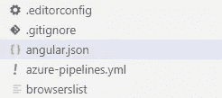

# 在 Azure 中向我们的 Angular 应用程序添加资产

> 原文：<https://javascript.plainenglish.io/adding-assets-to-our-angular-apps-in-azure-2d009ff7989?source=collection_archive---------2----------------------->

## 在 Angular 中构建生产就绪代码时，如何将资产包含在我们的 dist 目录中(针对云)


Photo by [Rúben dos Santos](https://unsplash.com/@ruben_dossantos?utm_source=medium&utm_medium=referral) on [Unsplash](https://unsplash.com?utm_source=medium&utm_medium=referral)

你泡一杯咖啡需要多长时间？事实上，我现在喝得很少，但当我喝的时候，我会全力以赴地喝倒出来的、现磨的、时髦的 Chemex 玻璃咖啡。

这真的很好，更好的是，在我煮咖啡的时间里，我可以建立一个完整的 web 应用程序部署管道，这要归功于极其方便的 Azure 应用程序服务。

然而，我最初发现不太方便的是在我们的 web 应用程序分发中包含其他非角度特定资产的过程。具体来说就是一个`web.config`和 JSON 文件。

任何 Angular 应用程序，当被部署为生产版本时，都需要在`dist/`目录中包含我们在应用程序中使用的所有东西——这个目录是用`ng build --prod`命令构建的。

此外，允许访问 JSON 文件还需要一个步骤。我们将在本文中讨论这两个问题。

# 将文件添加到发行版

对于这个例子，我们将向我们的`dist/`添加一个`web.config`文件。首先，我们需要创建它。

我们将`web.config`文件添加到`src/`目录中。在该文件中添加您需要的内容，例如:

现在我们需要告诉 Angular 在用`ng build --prod`构建我们的生产应用程序时，将这个文件包含在`dist/`中。

为此，导航至`angular.json`。



**angular.json** is found in the top-level directory of any Angular project.

现在，在 JSON 中，在`"projects"`中应该有一个名为`"assets"`的列表——这里我们需要添加到`web.config`的路径，如下所示:


Adding **web.config** to our **dist/** assets in **angular.json**.

就是这样！每当我们现在用`ng build --prod`构建生产就绪的应用程序时，我们的`web.config`文件将包含在`dist/`目录中。

# 添加 JSON 资产

如果我们使用与`web.config`相同的方法来添加一个 JSON 文件——当运行我们的应用程序时，我们会很快找到`404 File Not Found`。

在将 JSON 文件添加到我们的`dist/`中时，需要一个额外的步骤。回到我们的`web.config`文件——就在`<rewrite>`标签之前——我们需要添加:

```
<staticContent>
  <mimeMap fileExtension=".json" mimeType="application/json" />  </staticContent>
```

这留给我们一个完整的`web.config`脚本，如下所示:

最后，我们简单地将我们的 JSON 文件添加到`angular.json`中的`"assets"`——就像我们对`web.config`所做的那样:


Adding two JSON files, **model.json** and **char2idx.json** to our **dist/**.

就是这样！我们已经将一个`web.config`文件添加到我们的生产构建应用程序中，然后用`<mimeMap>`映射 JSON 文件，并将它们包含在我们的应用程序中。

我希望这篇文章对你有用，如果你有任何建议或问题，请通过 [Twitter](https://twitter.com/jamescalam) 或在下面的评论中告诉我。

感谢阅读！

如果你有兴趣了解如何使用 Azure App Service 将 Angular 应用程序部署到 web，请随意查看这篇文章:

[](https://towardsdatascience.com/how-to-deploy-web-apps-with-azure-52ca340b41b9) [## 如何使用 Azure 部署 Web 应用

### 利用 Angular 和 Azure 应用服务快速轻松地部署应用

towardsdatascience.com](https://towardsdatascience.com/how-to-deploy-web-apps-with-azure-52ca340b41b9)