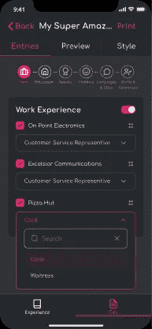
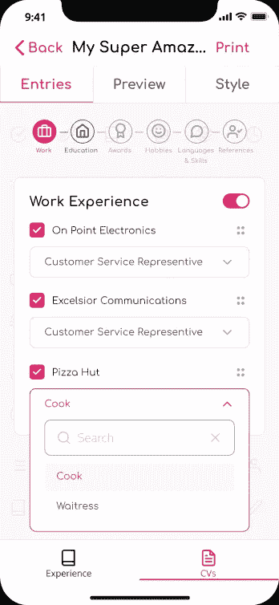

# 将黑暗模式添加到我基于 Expo 的 React 原生应用程序

> 原文：<https://javascript.plainenglish.io/adding-dark-mode-to-my-expo-based-react-native-app-4ad37ef97511?source=collection_archive---------3----------------------->

上周，我在 React 本地应用程序中添加了一个新的日期选择器组件。这个日期选择器在我的组件库中看起来很棒，我对它的工作方式感到非常自豪。

然后，我在新版本的组件库中更新了我的应用程序 pull，添加了新组件，在我的 iPhone 上进行了测试，出现了一个空白框，日期选择器应该在那里。

在绝望地试图改变代码以使其工作并失败的几个新版本之后，我终于找到了问题的答案——日期选择器在那里，只是因为我的手机处于黑暗模式，文本是白色的，而我的选择器恰好也在白色背景上。

我觉得自己像个十足的白痴，浪费时间认为这是一个代码修复，但后来我开始思考——如果我的手机处于黑暗模式，那么我的组件库为什么没有同样的问题？原来，storybook 将主题设置为灯光模式，而不考虑手机的设置。

然后我意识到，如果我有这些问题，那么很可能其他人也会有类似的问题，我可能应该同时支持黑暗和光明模式。

# 为黑暗模式设计

在设计应用程序时，我使用 Figma 构建原型，以便进行一些用户测试，并在编写任何代码之前验证这个想法。

由于我在最初的设计中已经为应用程序布置好了所有的屏幕，所以我能够使用 Figma 的调色板交换功能来创建设计的副本，并更改用于黑暗模式颜色的颜色。

这使得工作变得非常容易，并大大加快了设计的迭代速度，而且有很多迭代，因为事实证明为黑暗模式设计并不容易。

黑暗模式不仅仅是颠倒光明模式调色板的情况，你仍然需要传达正确的信息层次，简单的白色->黑色颠倒将颠倒这种层次。

此外，如果你有明亮的颜色，你可能会发现它们在黑暗模式下使用时变得非常不和谐，我不得不为我的强调色创建一组柔和的色调，因为在黑暗模式下亮度太大了。

比较下面三张图片；左边是光模式的反转，中间是确保屏幕元素的层次保持不变，右边是光模式版本。

As you can see the middle one maintains the visual hierarchy of light mode making the UI far easier to understand

为了在已经非常暗的设计中创造一种深度感，我使用了“适当的”黑色(#000000)作为最暗的颜色，而不是我在亮模式中使用的稍微亮一点的阴影。

这让我可以用稍微亮一点的颜色作为设计的基础色(在我的设计中，基本上变成了白色的暗模式)。

另一个重要因素是对比度，因为背景色的变化，你可能会发现任何符合 WCAG 的强调色都不再有足够的对比度来通过。这与前面提到的不和谐效果相结合，意味着很难使设计适应黑暗模式。

# 将黑暗模式引入基于 Expo 的 React 原生应用

Expo 使得处理你的应用程序如何响应用户在它的`app.json`文件中的颜色设置变得非常简单，使用`userInterfaceStyle`属性，该属性可以被设置为`automatic`来支持用户当前的颜色方案选择，或者使用`light`和`dark`来强制应用程序进入其中一种颜色方案。

您还可以在`ios`和`android`对象中设置`userInterfaceStyle`属性，以便在平台级别管理它们。对于我的应用程序，我选择了`automatic`。

要检测应用程序中的配色方案，您需要将`react-native-appearance`包添加到您的项目中，因为这为我们提供了用于包装应用程序的`AppearanceProvider`上下文和用于组件级别的`useColorScheme`钩子，以确保使用正确的样式表。

这里有一个使用`AppearanceProvider`包装应用程序的例子。

In side MainApp we can use the useColorScheme hook to get the colour scheme value

这里有一个在组件中使用`useColorScheme`钩子的例子，如果用户使用黑暗模式，钩子返回`'dark'`，因此对它的检查可以用来加载黑暗模式样式表。

useColorScheme returns ‘dark’ if the use is using dark mode, ‘light’ if using light mode

为了在我的组件中既有亮模式样式又有暗模式样式，我采用了亮模式中使用的现有样式表，并将样式对象提取到一个名为`baseStyles`的常量中。

然后，我创建了一个`darkModeOverrides` const，在根据各自的对象创建亮暗模式的样式表实例之前，它复制并修改了`baseStyles`。

然后我使用`useColorScheme`的输出在我的组件中使用正确的样式表。

这种方法允许我通过只关注我需要改变的东西来快速实现黑暗模式，但如果我要重构，我很可能会从彩色样式中删除结构样式，使其更加整洁。

This is a simple example of how I converted my existing app, as you can see I can keep the padding on the view by only updating the values I need to change for dark mode

为了在亮暗模式下测试我的 UI，我为`react-native-appearance`创建了一个简单的 mock，当我需要在暗模式下测试 UI 时，它允许我返回‘dark’。

As the checks we’re doing in the component are for the value to be ‘dark’ we can just use jest.fn() until we need to set the return value

## 抓住了——反应本地故事书

我使用 Expo 在其一个入门项目中提供的 React Native 版本的 Storybook 构建了我的组件库。

我最终不得不将`@storybook/.react-native`升级到`5.3.23`，以便让《故事书》尊重`userInterfaceStyle`的设定。

我还必须对`App.tsx`文件进行修改，以便在`AppearanceProvider`中包装主故事书视图。这看起来如何的要点可以在下面找到。

Wrapping the storybook UI in appearance provider allows all components in the component library to use the useColorScheme hook

值得注意的是，虽然你可以为 Storybook 提供一个主题，但它只会对它的元素进行样式化。应用程序的基本视图仍然是白色背景，但这些变化至少足以让我在创建组件时测试它们。

# 摘要

除非你使用的组件不支持配色方案，否则你可以构建一个应用程序，而不必考虑构建一个自适应的 UI。

然而，如果你像我一样在 iOS 上使用原生日期选择器，你可能会发现自己的 UI 不起作用，除非你决定强制一种特定的模式或构建一些更具适应性的东西。

如果你决定建立一个自适应的用户界面，那么理解和测试你的用户界面在黑暗模式下如何工作是很重要的，而不是仅仅改变你现有的配色方案。

一旦你对 UI 的工作方式感到满意，那么`react-native-appearance`将帮助你检测用户正在使用的配色方案，并允许你构建自适应的 UI 组件。