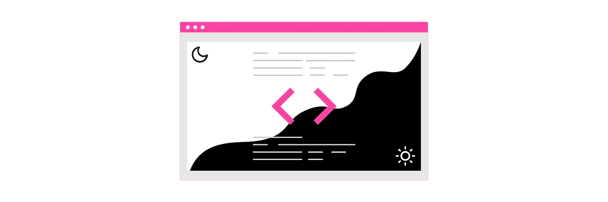

# 将黑暗模式添加到 React 项目

> 原文：<https://javascript.plainenglish.io/adding-dark-mode-to-your-react-project-21b98fd852b0?source=collection_archive---------4----------------------->

黑暗模式让用户在使用你的网站时能够控制自己的体验，给他们更好的用户体验。出于这个原因，你可能会有兴趣在你的网站上添加一个黑暗模式的功能。我将带你通过一种可能的方式来添加一个黑暗模式特性到你的 React 站点。

我从运行**npx create-react-app my-app**创建的一个新项目开始，但是您可以按照本教程学习任何现有的 React 项目。

为了在整个项目中得到一个可切换的黑暗模式，我们需要创建一个“全局风格”。幸运的是，styled-component 有一个很好的助手函数 createGlobalStyle，可以轻松处理全局样式。样式化的组件通常自动限定在本地 CSS 类的范围内，但是使用 createGlobalStyle 消除了这种限制。要将样式化组件添加到您的项目中，运行**NPM install styled-component**

现在我们已经安装了样式组件并准备好使用，让我们创建我们的全局样式文件。创建一个新的 src>styles 文件夹，并在其中创建一个新的文件 globalStyles.js。在该文件中，我们希望使用 styled-component 的 createGlobalStyle 函数，并为亮暗主题定义恒定的颜色。在这里定义一个过渡将在亮暗模式之间切换时创建一个渐变的线性背景颜色。

接下来，我们想创建一个自定义钩子，使我们能够使用黑暗模式。在 styles 文件夹中，创建另一个名为 useDarkMode.js 的新文件。在这里，您将管理主题值(我使用 dark 作为我的默认值)以及它如何变化。

现在，我们想要创建一个切换组件，用户可以点击它在亮和暗之间切换。让我们创建一个新的 src>components 文件夹，在这里我们可以创建一个新的文件 Toggle.js。

最后一步是将所有东西放在 App.js 中。如果您使用 create-react-app 开始您的项目，请确保删除一些默认样式，以便我们的新全局样式不会被覆盖。在 App.css 文件夹中，从 className App-header 中删除背景色和颜色字段。

在 App.js 中，我们必须导入新创建的文件，以及来自样式化组件的 ThemeProvider。我们想在这里调用我们的自定义 useDarkMode 钩子来设置初始状态。我们还需要用 Provider 包装我们的 JSX 代码，并添加我们的全局样式。我直接在 React 徽标下添加了切换按钮，但是可以随意将它放在页面内的任何地方。我完成的 App.js 文件如下所示:

如果你还没有，用 yarn start 开始你的项目，测试你的新黑暗模式特性。你完了！

希望这个教程对你有帮助:)你可以在这里找到[完整回购](https://github.com/cierrabeck/dark-mode-starter)！