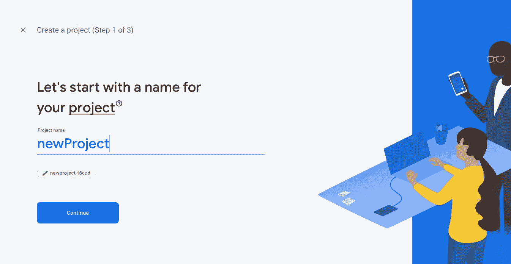
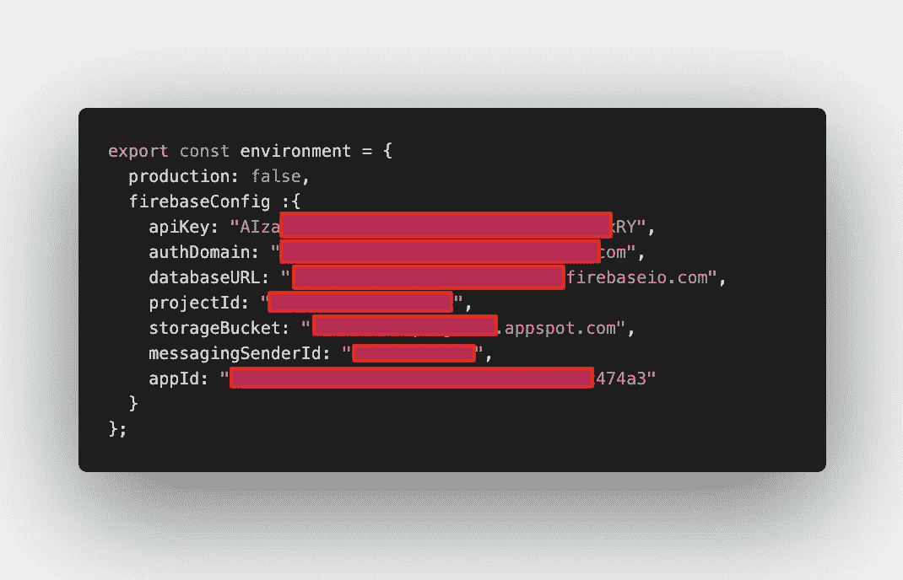

# 向 Ionic 5 项目添加 Firebase 认证(不使用 Angular Fire)

> 原文：<https://javascript.plainenglish.io/adding-firebase-authentication-into-your-ionic-project-without-using-angular-fire-f80bd9e8d25e?source=collection_archive---------3----------------------->


Photo by [Bethany Legg](https://unsplash.com/@bkotynski?utm_source=unsplash&utm_medium=referral&utm_content=creditCopyText) on [Unsplash](https://unsplash.com/s/photos/lonely-work?utm_source=unsplash&utm_medium=referral&utm_content=creditCopyText)

如果你是一个同时做前端和后端的全栈开发人员，在后端工作的同时构建一个应用程序可能是一项艰巨的任务…独自工作，生活可能会非常孤独，但那是另一个时间和另一个主题。

一方面，你需要确保后端，特别是身份验证，工作良好；另一方面，你需要确保你正在构建的 Ionic 应用程序看起来棒极了

就我而言，我已经经历过多次了，我可以向你保证，在构建你的 Ionic 应用程序这一非常重要的工作中，同时确保后端如预期的那样工作，这并不是一件容易的事情。我通常会雇用另一个人，或者让我的组织雇用另一个人来做后端工作，而我则致力于开发一个人能开发的最好版本的 Ionic 应用程序。

如果你雇佣某人来协助你，有时，如果不是的话，大多数时候，在你的系统的前端或后端会有需要纠正的冲突，而人类，作为智人，有时对这些变化和修改的反应很慢。这有时会导致挫败感，而且比我愿意承认的更多的时候，消极的问题开始爬进我的脑海:“如果我自己能做得更好，我当初为什么要雇用你！?"

但是我跑题了…

所以你要找的。你真正需要的是一个可以自我管理的后端，但同时，你可以在需要的时候对它进行快速修改。

某种托管后端。

从新手的角度来看，如果你刚刚开始学习将你的应用集成到 web 后端，你也会想要一些自动管理的东西。不那么令人头疼。

如果有人为您构建并管理后端，而您所要担心的只是确保您的前端 Ionic 应用程序正常工作，那该怎么办？

有人做到了…而那个人就是… `<drumroll in HTML>`

# 谷歌。

是的，那个巨大的多色巨兽，**谷歌**。

[谷歌](https://firebase.google.com)的 Firebase 是一个神奇的基于云的服务，以其后端即服务(BaaS)应用而闻名，让你不用担心后端。您所需要担心的是确保您的应用程序正常工作。为了处理应用程序或网站的预期传入和传出流量，或者确保后端与前端应用程序保持一致，您需要担心配置服务器的日子已经一去不复返了。

Firebase 背后的关键思想是创建一个后端，它可以轻松地与前端应用程序集成和使用，如典型的 Angular 前端应用程序或 Android 和 iOS 应用程序。

从 ional Angular 的角度来看，我想指出，我在这里写的东西纯粹是基于我将 Firebase 与 ional Angular 项目集成的经验。

在撰写本文时，这是针对 Ionic 版的。

你需要什么？

1.  一个带有 [Firebase 控制台](https://console.firebase.google.com)的谷歌账户准备就绪
2.  离子角度应用

# 设置 Firebase

1.  单击“添加项目”。为您的项目命名，然后单击“继续”



2.你会被要求做的第一件事是添加分析。这取决于你的判断，如果你想添加分析或其他。如果不想，就不选这部分。

3.Firebase 将自动为您创建一个项目，这将需要大约 2 分钟。

4.完成后，您需要向这个项目添加一个应用程序。爱奥尼亚角项目本质上是角项目，因此，创建一个基于网络的项目

5.然后，您将看到一串配置密钥。复制并粘贴这些密钥，我们稍后会用到它们。点击完成。

6.接下来，我们需要在 Firebase 上设置身份验证。单击身份验证选项卡

7.在这里，您需要单击登录方法，并在本例中选择“用户名和密码”。

# 设置您的离子角度项目*

*我假设你能够开始一个离子角度的项目。我不打算在这里详细说明如何做到这一点，因为这是另一个话题本身。

如果你不确定该做什么以及如何开始一个 Ionic 项目，我建议你去官方的 [Ionic 框架网站](https://www.ionicframework.com)，点击“开始”。你将被指导如何从那里开始一个离子项目。*

# **安装 Firebase 并插入配置密钥**

现在来看主要事件，在你创建了一个 Ionic 项目之后，

下一步是在您的应用程序上设置 Firebase。您需要首先安装 Firebase。转到您的项目文件夹，在终端上键入以下内容:

```
npm install firebase
```

这应该会在您的项目上安装 Firebase。

2.将上一节步骤 5 中的配置密钥添加到 environment.ts 中，如下所示:



3.在 app.module.ts 文件中初始化 Firebase 项目

```
import * as firebase from 'firebase';
import { environment } from '../environment/environment'; .... firebase.initialiseApp(environment.firebaseConfig);
```

# **最终构建您的登录页面**

通常您会创建一个登录页面，但是对于这个示例，我将在我的 home.page.ts 和 home.page.html 中构建以下服务:

1.  在 home.page.ts 中添加以下内容:

```
import * as firebase from 'firebase';...email:any;
password:any; login()
{  
    firebase.auth()
    .signInWithEmailAndPassword(this.email, this.password)
    .then(resp=>{ console.log(resp);      
      //Success! Do success stuff here! },err=>{

      console.log(err);
      //Fail! Login Failed! });
}
```

2.在 home.page.html 增加以下内容:

```
<ion-input [(ngModel)]='email' placeholder='Email'
type='email'>
</ion-input><ion-input [(ngModel)]='password' placeholder='Password' type='password'>
</ion-input><ion-button (click)=login()> Login</ion-button>
```

3.好了，试试看，你应该能够运行一个简单的登录页面。试着`ionic serve`检查它是否工作。

Firebase 文档供您参考:

[](https://firebase.google.com) [## 重火力点

### Firebase 为您提供了分析、数据库、消息传递和崩溃报告等功能，因此您可以快速移动并…

firebase.google.com](https://firebase.google.com) 

离子框架:

[](https://www.ionicframework.com) [## Ionic -跨平台移动应用开发

### Ionic 是面向 web 开发者的应用开发平台。构建令人惊叹的跨平台移动、web 和桌面应用程序…

www.ionicframework.com](https://www.ionicframework.com)