# 将 Firebase Auth 添加到 Nuxt.js 应用程序中

> 原文：<https://javascript.plainenglish.io/adding-firebase-authentication-to-a-nuxt-js-spa-application-92beb4a44509?source=collection_archive---------0----------------------->

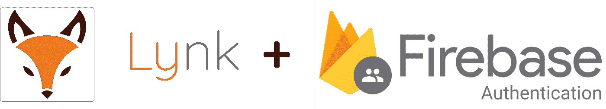

在为我的最新项目 Lynk( [https://lynk.sh](https://lynk.sh) )设置主页时，我意识到我需要一种简单而安全的方式来认证和接纳新用户。

问题是，Lynk 的主页是用 Nuxt.js 编写的单页应用程序(SPA)——虽然有*关于将 Firebase 添加到服务器端渲染应用程序(SSR)的*教程，但没有太多关于如何使用 SPA 的文档。

那我为什么决定去做水疗呢？因为托管真的很容易，也很便宜。对于 SSR 应用程序(以及一般的 Node.js 应用程序),您通常需要一个服务器或容器来运行您的代码。然而，使用 Nuxt.js，我可以轻松地生成静态 HTML、CSS 和 Javascript，并将其托管在任何地方——无论是 Github 页面，还是 Firebase 托管，甚至是 Netlify。

那么，如何将 Firebase 身份认证添加到 SPA 中呢？

有三个基本步骤:

1.  向 Nuxt.js 添加 Firebase
2.  配置 Vuex 以登录/注册用户
3.  向 Vuex 添加持久性，以便用户保持登录状态

## 步骤 1:向 Nuxt.js 添加 Firebase

这看起来很简单，但是要让它正确地与 Nuxt.js 一起工作，还有一些注意事项。

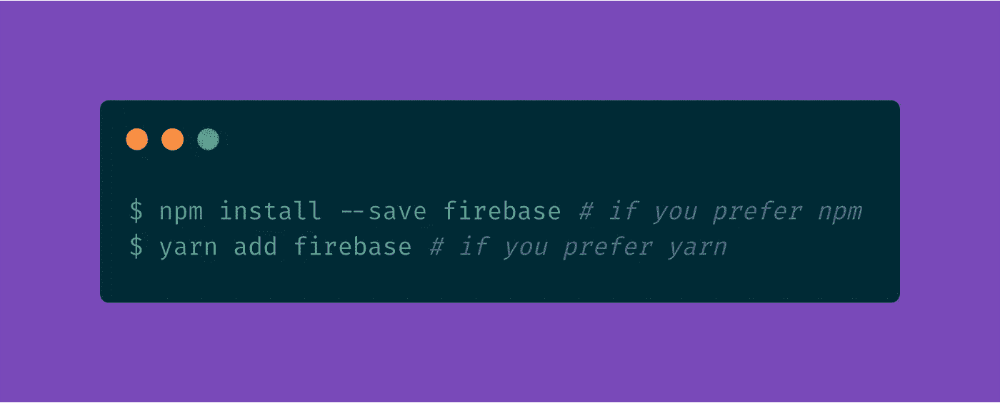

完成此操作后，您可能会遇到一个错误，webpack 将无法再生成您的 SPA。要解决这个问题，只需修改您的`nuxt.config.js`文件，如下所示:

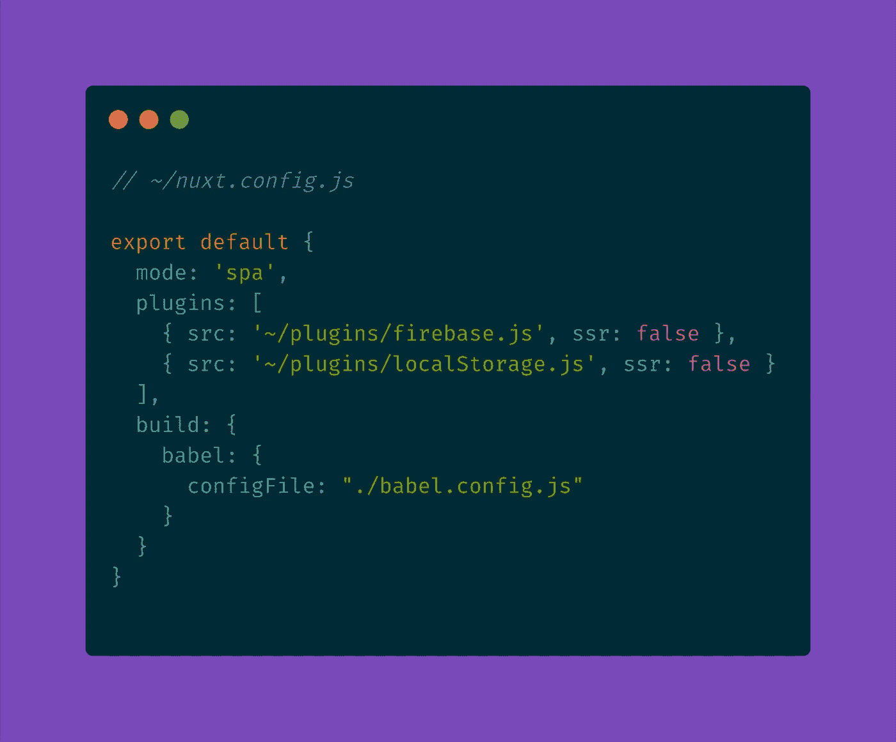

Source: [https://gist.github.com/ShivanshVij/c1e9898737ed92e8e030fb3807cc50f4](https://gist.github.com/ShivanshVij/c1e9898737ed92e8e030fb3807cc50f4)

你会注意到我还添加了两个插件。我们将在以后创建它们。

接下来，在与您的`nuxt.config.js`相同的位置创建一个`babel.config.js`文件，并用以下内容填充它:

Source: [https://gist.github.com/ShivanshVij/ddfa1095f0d0fb4d42ed4b7852006ee6](https://gist.github.com/ShivanshVij/ddfa1095f0d0fb4d42ed4b7852006ee6)

最后，我们需要安装 babel 依赖项:

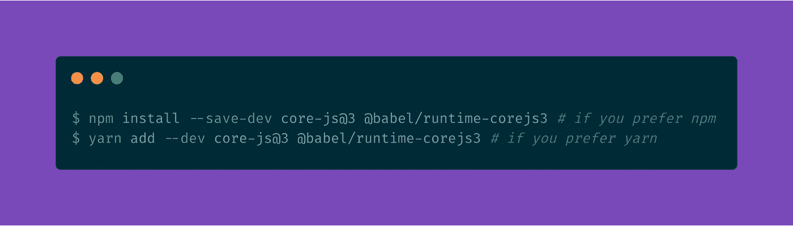

现在 Firebase 可以实际使用了，让我们把它变成一个插件来使用:

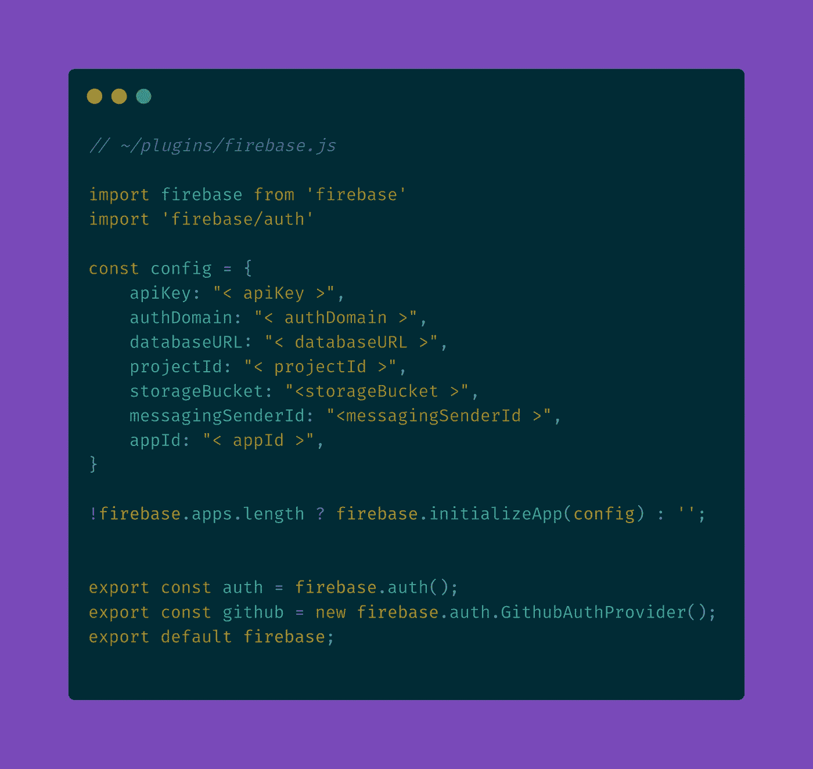

Source: [https://gist.github.com/ShivanshVij/daef4b98b52d78a08a0a30ec7f2f03e8](https://gist.github.com/ShivanshVij/daef4b98b52d78a08a0a30ec7f2f03e8)

确保填写您自己的 Firebase 配置。上面我还导出了一个 Github Auth provider 来展示我们如何使用自己的定制 OAuth 域，而不是提供的 Firebase】。

我们已经在我们的`nuxt.config.js`文件中注册了这个插件，所以我们可以继续下一步。

## 第 2 部分:配置 Vuex

我们的 Vuex 存储需要三样东西:用户状态、设置用户状态的 mutator 以及登录/注册和注销动作。在 Nuxt.js 提供的`~/store`文件夹中创建一个`index.js`文件:

Source: [https://gist.github.com/ShivanshVij/9799930e94a33f3136b18e6fee8a305b](https://gist.github.com/ShivanshVij/9799930e94a33f3136b18e6fee8a305b)

首先，我们开始从我们的`~/plugins/firebase.js`导入`auth`和`github`对象，然后我们设置我们的`user`状态对象和赋值函数。

接下来，我们可以创建我们的`logout`函数，它只是等待 Firebase 将我们注销，然后清除用户状态。然后是处理注册和登录的`login`函数。它总是首先尝试注册用户，如果他们已经注册了，它就会尝试让他们登录。

`login`功能是手动邮箱地址+密码认证，不是 OAuth。为了使用 OAuth，我们有一个单独的`loginGithub`动作，让 Firebase 使用弹出窗口处理 OAuth。

在我们继续之前，我们需要确保我们的 [Firebase 控制台](https://console.firebase.google.com/)被正确配置为允许登录。

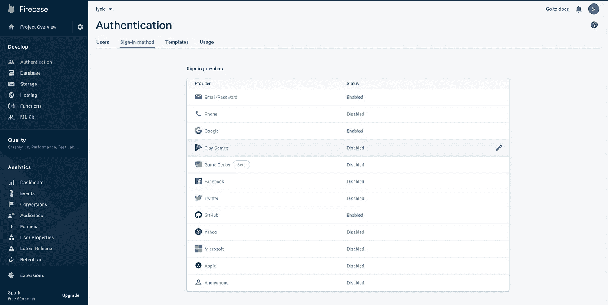

如果你打算使用 OAuth，确保你已经启用了电子邮件/密码认证和 Github。

稍后，我将解释如何为 OAuth 使用您自己的自定义域，因此如果您对此感兴趣，请确保您已经将其添加为授权域:

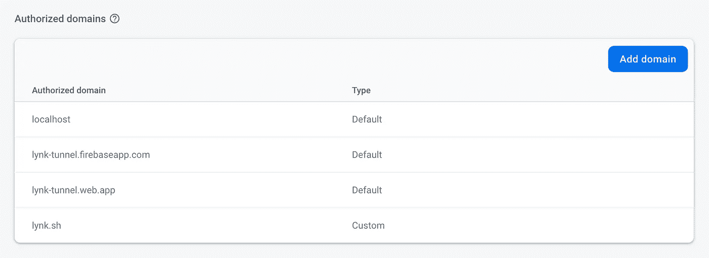

这里我添加了 [https://lynk.sh](https://lynk.sh) 作为授权域。

## 第 3 部分:添加持久性

如果您现在尝试使用如下所示的登录功能登录您的应用程序，它将正常工作。然而，当你导航到一个不同的页面(使用类似`this.$router.push();`的东西)时，你会丢失你的状态，并且在这样做的过程中也会丢失你的身份验证。

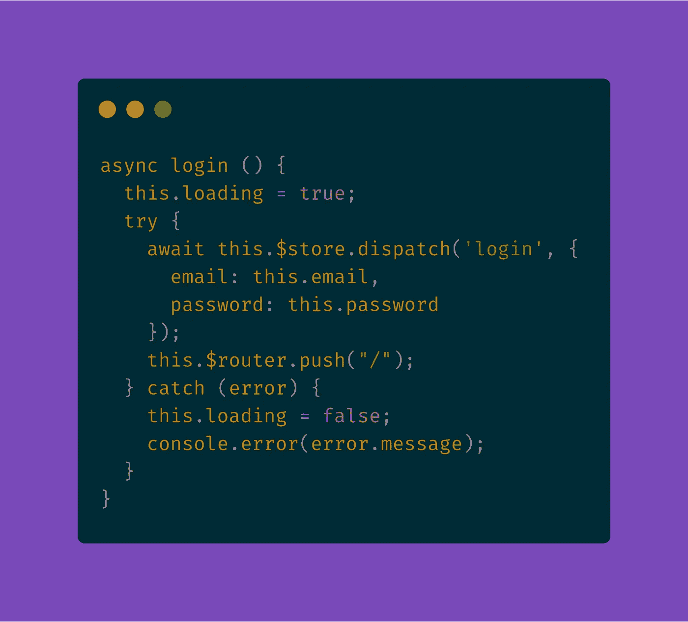

Source: [https://gist.github.com/ShivanshVij/f1f75fa3a9a2c05a7a46ac3ce3f6f91d](https://gist.github.com/ShivanshVij/f1f75fa3a9a2c05a7a46ac3ce3f6f91d)

为了保持这一点，我们将使用一个 npm 库:`vuex-persistedstate`

首先安装它:

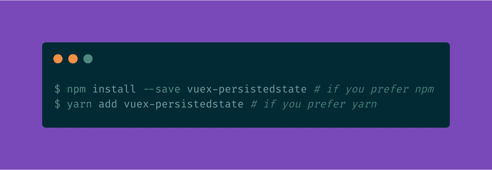

安装完成后，创建我们之前添加到`nuxt.config.js`中的 localStorage 插件:

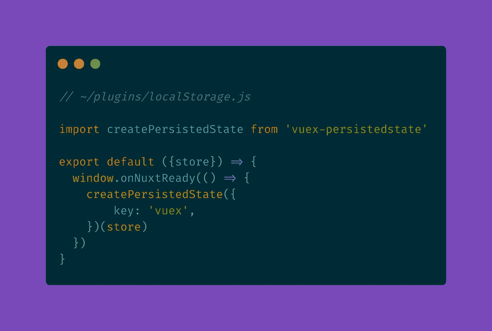

Source: [https://gist.github.com/ShivanshVij/32f30073fa67dee80c6609d0fa04af84](https://gist.github.com/ShivanshVij/32f30073fa67dee80c6609d0fa04af84)

就是这样！现在您可以放心地在您的 Nuxt.js 应用程序中使用 Firebase 身份验证了！

## 如何为 OAuth 使用自定义域

如果您确实想为 OAuth 提供者使用自定义域，而不是提供的 Firebase】，请执行以下操作:

首先，在`~/plugins/firebase.js`中修改你的`config`对象:

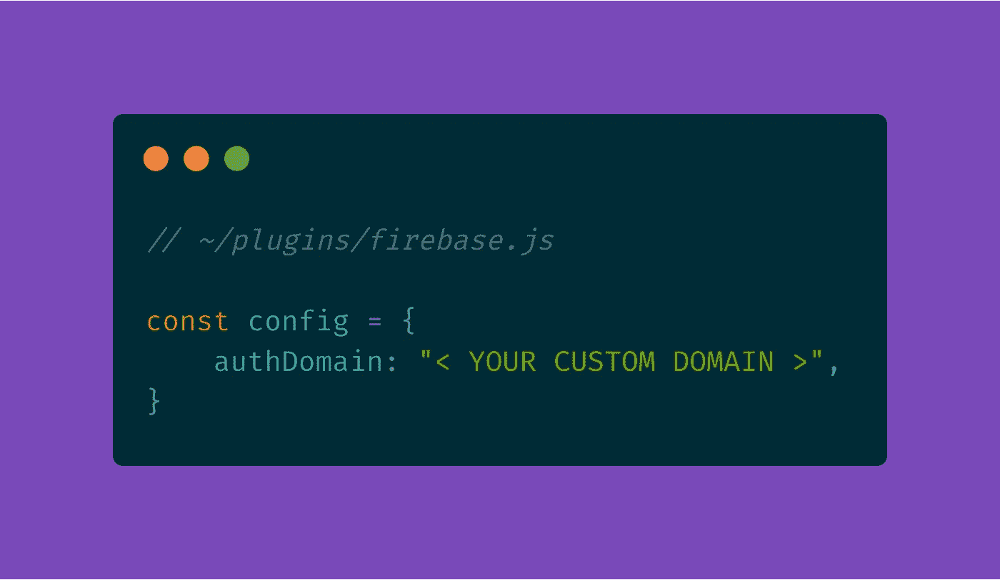

对我来说那就是`authDomain: "lynk.sh"`。

最后，在 OAuth 应用程序中修改回调 url:

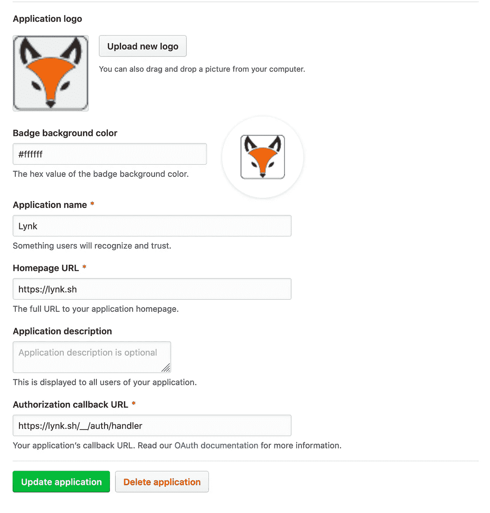

确保使用您的自定义域，而不是提供的域`https://<APP>.firebaseapp.com/__/auth/handler`。

这样，你就可以开始了！

感谢阅读！如果您有任何问题，请随时通过`shivanshvij@loopholelabs.io`联系我。

我最近花了很多时间开发 Lynk，这是一个允许开发者安全地向互联网公开他们基于 TCP 的服务的工具。不再需要处理端口转发、绕过防火墙或设置动态 DNS。有了 Lynk，你可以开始一个隧道，并继续发展。

如果你想了解 Lynk，请在 [https://lynk.sh](https://lynk.sh) 注册我们的邮件列表

查看我们的产品搜索:

你可以在`[https://shivanshvij.com](https://shivanshvij.com)`、`[https://github.com/shivanshvi](https://github.com/shivanshvij)j`或`[https://linkedin.com/in/shivanshvij](https://linkedin.com/in/shivanshvij)`找到更多关于我的信息