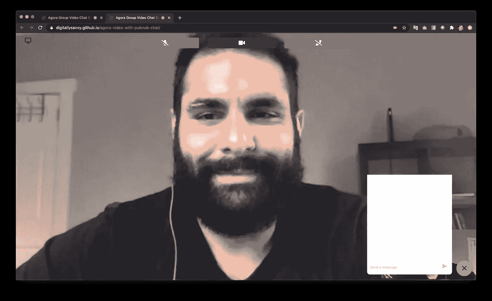

# 将 PubNub 聊天添加到 Agora 视频 Web 应用程序

> 原文：<https://javascript.plainenglish.io/adding-pubnub-chat-to-an-agora-video-web-app-b5bd76f6cc9?source=collection_archive---------9----------------------->

数字通信在社会中无处不在，越来越多的团队希望将语音、视频和文本聊天功能添加到他们的产品中。Agora 和 PubNub 提供工具，使团队能够快速、轻松地构建实时应用程序，利用语音、视频和文本聊天功能，以更有意义的方式连接他们的用户。

在本教程中，我将向您展示如何集成 PubNub Web SDK，将基于文本的聊天添加到使用 Agora Web SDK 进行语音和视频通信的 Web 应用程序中。

> *为 TL；大众博士查看了* [*现场试玩*](https://agoraio-community.github.io/agora-video-with-pubnub-chat/) *。*
> *Agora 和 PubNub 账户为必填项。

# 先决条件

*   一个简单的网络服务器(我喜欢使用直播服务器)
*   [Agora 开发者账户——在此注册](https://sso2.agora.io/en/signup?utm_source=medium&utm_medium=blog&utm_campaign=adding-pubnub-chat-to-an-agora-video-web-app)
*   一个 PubNub 开发者账户([https://bit.ly/2JgzKll](https://bit.ly/2JgzKll))
*   对 HTML，CSS，JS 的理解
*   了解 Bootstrap 和 JQuery 如何运行
    ( *所需的最少知识*)

# 项目设置

首先，让我们使用[我的教程](https://github.com/digitallysavvy/group-video-chat)[构建群组视频聊天 web 应用](https://medium.com/agora-io/building-a-group-video-chat-app-bc05e8962c41)中的代码作为我们的基础项目。这个项目具有基本视频聊天的所有功能:切换摄像头和麦克风，以及加入和离开通话的按钮。

# 建设

本教程的构建阶段包括修改输入表单以添加 PubNub 键的输入、添加聊天 UI、集成 PubNub 客户端、将 PubNub 客户端连接到通道，以及使用客户端在通道中发送和接收消息。

## 更新表单

在“[构建群组视频聊天 web 应用程序](https://medium.com/agora-io/building-a-group-video-chat-app-bc05e8962c41)”教程中，我在`agora-interface.js`文件中硬编码了应用程序 ID、频道名称、令牌和 UID 值。但是在基础项目中，我已经更新了代码，添加了一个输入表单来输入应用 ID、令牌和频道名称。

> 注意:该项目旨在用于参考目的和开发环境，而不是用于生产环境。
> 
> 建议对生产环境中运行的所有 RTE 应用程序进行令牌身份验证。有关 Agora 平台内基于令牌的身份验证的更多信息，请参考本指南:[https://bit.ly/3sNiFRs](https://bit.ly/3sNiFRs)

该项目使用现有的模态形式，并为 PubNub 键的 join 模态添加了新的输入。打开`index.html`并更新`modalForm`以包含 PubNub 发布和订阅键的文本输入。

## 添加聊天界面

接下来，我们将聊天 UI 直接添加到 join 模式下。聊天使用一个[浮动动作按钮](http://materialdesignblog.com/creating-a-simple-material-design-action-button-with-css/)来切换聊天窗口。聊天窗口有一个显示消息的 div，以及一个用于输入消息的`textarea`和一个发送按钮。

I used this [CodePen demo](https://codepen.io/bharatrpatil/pen/owNvoL\) as a guide for the chat UI.

## 初始化 Agora 和 PubNub 客户端

在基础项目中，当用户单击*加入频道*按钮时，它会获取应用 ID、令牌、频道名称和 UID，并将它们传递给初始化 Agora 客户端并加入频道的`initCleintandJoinChannel`函数。我们希望在我们的 PubNub 集成中添加类似的功能。为此，更新`on-click`事件监听器来获取 PubNub 键值，并将它们传递给函数`initPubNub`，我们用它来初始化 PubNub 客户端。

## PubNub 接口

现在*加入通道*按钮需要`initPubNub`函数，我们需要声明它。让我们从创建`pubnub-interface.js`开始，来处理 PubNub 客户端事件。在`initPubNub`函数中，创建一个新的 PubNub 客户端，添加事件监听器，并订阅通道。

您会注意到在`message`事件监听器上面的代码中。当在通道中接收到消息(包括本地和远程消息)时，触发`message`事件。出于这个原因，我们有一个`if`语句来检查消息是由本地用户还是远程用户发送的，并且只将来自远程用户的消息传递给`addRemoteMsg`。我们稍后在实现聊天 UI 代码时讨论`addRemoteMsg` 函数。在这个演示中，我们只在通道中接收到本地消息时使用`*print*`到`*console*`，但是您可以通过实现一个“ *delivered* 消息给用户来轻松扩展这个演示。这为用户提供了“*已发送*”和“*已交付*”状态之间的视觉区别。

接下来，在`pubnub-interface.js`文件中添加一个`publishMessage`函数。这个函数在聊天 UI 中使用，用于将消息发送到 PubNub 通道。`publishMessage`函数接受两个参数:发送到 PubNub 通道的`message`和发送消息后更新聊天 UI 的`callback`函数。

## 控制聊天用户界面

现在我们有了聊天界面和发送消息的能力，我们需要将两者连接起来。创建一个`chat.js`文件，我们用它来添加事件监听器，以切换聊天 UI、发送消息并在聊天频道中显示消息。

首先，获取发送按钮和输入`textarea`的参考。每当用户点击`sendBtn`时，我们想要获取文本区域的内容，使用` `将换行符转换成 HTML，然后将消息发布到 PubNub 通道，并将其作为本地消息添加到聊天区域。

您会注意到两个函数，`resizeTextArea`和`scrollToBottom`，它们用于更新 UI。`resizeTextArea`功能根据输入设置`textarea`的高度。我们在清除聊天时和每个`keyup`事件后调用这个函数。`scrollToBottom`功能滚动到聊天区域的底部，这样当新消息出现在聊天中时，窗口会动态地做出反应。

我们需要处理的聊天 UI 的最后一部分是隐藏和显示聊天 UI。对于这个例子，我们使用一个[浮动动作按钮(FAB)](https://material.io/components/buttons-floating-action-button) ，它由用户点击隐藏和显示聊天窗口(`chatMsgwindow`)的`chatToggleBtn`表示。在我们的按钮中有一个图标，我们可以根据聊天是可见还是隐藏来改变它。每当我们使聊天窗口可见时，我们都希望滚动到聊天窗口的底部，找到最新的消息。

## 禁用键盘快捷键

在基础项目中，有键盘快捷键用于音频和视频的`mute`或`unmute`，屏幕共享的`start`和`stop`，以及退出通话。我们需要更新`ui.js`中的键盘监听器，以便在聊天窗口可见时忽略键盘快捷键。我们还想添加一个按键监听器，在用户点击`Return`键时发送文本输入。

为了允许用户输入多行消息，我们使用`Shift+Return`输入来输入新行，使用`Return`键输入来发送消息。

# 测试

为了测试我们的视频聊天应用，我们必须启动一个简单的网络服务器(我喜欢使用直播服务器)。网络服务器要求是由于访问设备上的摄像头时的浏览器限制。出于本地测试的目的，`localhost://`被浏览器列入白名单。但是为了和朋友一起测试，我们可以使用类似 [Ngrok](https://ngrok.com) 的服务来生成一个安全的`HTTPS` url。Ngrok 是一个免费增值服务，它从你的本地机器创建这个隧道，并提供一个供使用的`HTTPS` url。根据我的经验，这是在本地机器上运行一个`HTTPS`安全 web 服务器的最简单的方法之一。

当服务器准备就绪时，打开浏览器到`localhost:xxxx` ( *xxxx 表示端口号*)，输入您的 Agora 和 PubNub 凭证，以及频道名称和 UID。

如果您想在构建之前进行测试，可以查看现场演示:

 [## 带有 PubNub 聊天演示的 Agora 群组视频

agoraio-community.github.io](https://agoraio-community.github.io/agora-video-with-pubnub-chat/) 

# 搞定了。

就这样我们结束了！如果你没有编写代码或者想看完整的成品，所有代码都可以在 GitHub 上找到。

 [## AgoraIO-社区/agora-视频-发布-聊天

### 这是一个群组视频聊天 web 应用程序，使用 Agora.io 和 PubNub 构建了一个简单的群组视频聊天 web 应用程序…

github.com](https://github.com/AgoraIO-Community/agora-video-with-pubnub-chat) 

# 其他资源

有关 Agora.io 应用程序的更多信息，请查看 [Agora 视频通话快速入门指南](https://docs.agora.io/en/Video/start_call_web?platform=Web)和 [Agora API 参考](https://docs.agora.io/en/Video/API%20Reference/web/index.html)。更多关于 PubNub 应用的信息，请查看 [PubNub 聊天概述](https://www.pubnub.com/docs/chat/overview)。

为了获得技术支持，我邀请您加入 Agora Developer Slack 社区。