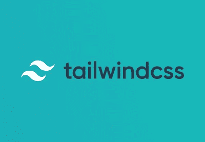

# 使用 Angular 和 Storybook 为 Nrwl NX 工作区添加顺风支持

> 原文：<https://javascript.plainenglish.io/adding-tailwind-support-to-a-nrwl-nx-workspace-with-angular-and-storybook-bf890ea882e?source=collection_archive---------2----------------------->



在本文中，我将解释如何向现有的 [Nrwl NX](https://nx.dev) 工作区(已经配置了 Angular apps/libs 和 [Storybook](https://storybook.js.org/) )添加 [Tailwind](https://tailwindcss.com/) 支持。

本文将*而非*帮助你安装 Nx、Angular 或 Storybook。如果你正在寻找，那么[去别处](https://nx.dev/angular/getting-started/what-is-nx):)

# 安装顺风

[安装顺风](https://tailwindcss.com/docs/installation/)相当简单。

首先，将以下依赖项添加到您的工作区:

```
npm install tailwindcss --save-dev
```

(顺便说一句，官方文档建议将 Tailwind 安装为一个依赖项，而不是 devDependency，但我并不太喜欢 [Adam 的基本原理](https://github.com/tailwindcss/discuss/issues/358)，尽管其中有些道理:p)。

然后，假设您使用的是 SCSS 文件，编辑应用程序的主样式表(通常在 apps/ <app_name>/src/styles.scss 下)，并在顶部添加以下内容:</app_name>

请注意，这些导入并不像现有导入那样以“~”字符开头。我没有时间深入细节，但它对我来说是这样的:)

接下来，使用以下命令创建初始顺风配置文件:

```
npx tailwindcss init
```

正如官方安装指南中所解释的，这将创建一个空的配置文件，稍后您将[按照您认为合适的方式](https://tailwindcss.com/docs/configuration/)对其进行定制。

顺风现在装上了，太好了！

就这样吗？不完全是。如果你试图在这一点上使用一些顺风类，不会发生什么…

那么少了什么呢？嗯，Tailwind 需要一个构建步骤，所以我们需要将它集成到我们的构建系统中。

# 给角形建筑增加顺风支撑

现在 Tailwind 已经在 Nx 工作区中可用了，您需要修改 angular.json 文件，以便将 Tailwind 集成到构建管道中。

最好的方法是使用自定义的 Webpack 配置。这是 Angular 支持的，也很容易做到，但是如果 Angular 脱离 Webpack，将来可能会有问题..不管怎样…

正如顺风的[官方文档中所解释的，可以通过使用](https://tailwindcss.com/docs/installation/#webpack) [PostCSS](https://postcss.org/) 和 [postcss-loader](https://github.com/postcss/postcss-loader) 与 Webpack 集成。

补充说明:PostCSS 是一个复杂的东西，我不会在这里讨论它，但是如果你还不了解它，去看看吧，你可能会喜欢它能为你做的事情。

首先，安装以下依赖项:

```
npm install [@angular](http://twitter.com/angular)-builders/custom-webpack postcss-loader postcss-import postcss-scss autoprefixer --save-dev
```

第一个是[Angular 的库，增加了对使用定制 Webpack 配置进行构建的支持](https://www.npmjs.com/package/@angular-builders/custom-webpack)，其他的是 PostCSS 的必要元素。

最后一个( [autoprefixer](https://github.com/postcss/autoprefixer) )是一个很好的 PostCSS 插件，它将负责在生成的 CSS 代码中添加所有必要的供应商前缀，这样您就不必这么做了。鉴于官方的顺风安装文档中提到了它，我假设它是强制性的，但我可能错了。

这种方法的好消息是，它补充了 Angular CLI 的原始 Webpack 版本，但并没有完全取代它(否则这将是一场噩梦！).

接下来，打开 angular.json，修改应用程序的“架构师”部分，如下所示:

如您所见，您只需替换应用程序配置的“构建”和“服务”部分中的“构建器”设置。你可以让其余的保持原样。

完成后，在构建应用程序时，构建将考虑我们的 Webpack 配置。

接下来，您需要创建 Webpack 配置。

继续在工作区的根目录下创建一个“webpack.config.js”文件，其内容如下:

在这个 Webpack 配置中，您可以看到我们已经定义了从另一个文件导入的单个[规则](https://webpack.js.org/configuration/module/#rule)。我这样做是为了能够在 Storybook 的上下文中重用相同的顺风配置。

为此，您还需要在工作区的根目录下创建“webpack-common.config.js”文件:

在这个 JS 模块中，我们定义并导出了一个 Webpack 规则(基于官方的 Tailwind 文档)。这条规则只是告诉 Webpack。scss”文件应由[post CSS-loader](https://github.com/postcss/postcss-loader)web pack loader 处理。最后，加载程序配置了一些插件，包括 Tailwind！

因此，当应用程序的 Angular build 启动时，它将调用自定义 webpack 配置，这将让 postcss-loader 处理 scss 文件，这又会让 Tailwind 在将它们传递给 autoprefixer 插件之前进行处理。

当然，你可以疯狂地使用 PostCSS 配置，因为它确实是一个强大的工具(这个名字选得很糟糕，因为它实际上可以对你的文件进行预处理和后处理)，但那是另外一个故事了。

要完成这一部分，您还需要一个文件:“helpers.js”，这是一个简单的模块，导出一个我们在 webpack-common.config.js 中使用的实用函数:

这个“root”函数只是返回您需要的任何文件的根目录相对路径。当我们将 Tailwind 与 Storybook 集成时，以及在任何其他需要根目录相对路径的情况下(当您摆弄构建系统时，这是非常常见的)，这将很快被证明是有用的。

此时，你可以开始了，你的应用程序中应该有顺风，你可以利用它。

# 给 Nx 的故事书版本增加顺风支持

既然 Tailwind 已经正确地集成到您的 Nx 工作空间中，那么向 Storybook 版本添加相同的支持就非常简单了。

当 Storybook 通过 Nx CLI 添加到 Nx 工作空间中时，Nx 会添加一个“.”。storybook”文件夹。然后，一旦故事书被添加到某个库中，Nx 也会在那里添加一个. Storybook 文件夹；因此，有两个故事书配置级别。

在每一个里面”。故事书”文件夹中，您会发现多个元素:

如您所见，这里有一个“webpack.config.js”文件。这很酷，这意味着 Storybook 是使用 Webpack 构建的，我们可以对它进行定制，以包含我们之前添加到“webpack.config.js”文件中的 Webpack 规则！

中的“webpack.config.js”文件。storybook”文件夹加载工作空间根文件夹中的“webpack.config.js”文件。storybook”文件夹(即，库本地配置加载/扩展工作空间根配置)

了解了这一点，您就可以决定将定制放在您喜欢的地方。或者通过工作区中 Storybook 的根 webpack 配置进行全局配置，或者在您认为合适的每个库中进行本地配置。选择权在你。如果您计划在所有“支持故事书”的库中使用 Tailwind，那么您可能应该将修改放在根目录下。

如果你想只为一个特定的库添加 Tailwind 支持，那么编辑它的”。storybook/webpack.config.js "文件如下:

上面，我们简单地加载根配置并将我们的规则推入规则数组。干净简单。不过，要注意目录结构中的向上路径；根据库的嵌套情况，它可能需要一些修改；-)

或者(最好是！)，您可以简单地在您的工作区的根目录下修改一下 Storybook 的 Webpack 配置。/.storybook/webpack.config.js”如下:

瞧，Tailwind 现在也可以在你的故事书故事里工作了，不是很棒吗？:)

这种方法的优势(无论是在全局还是本地应用)在于，您可以集中管理您的 Tailwind 和 PostCSS 配置，而不是到处复制。

今天就到这里吧！

## **来自 JavaScript 的简单英语注释**

我们推出了三种新的出版物！通过以下方式表达对我们新出版物的热爱: [**通俗易懂的 AI**](https://medium.com/ai-in-plain-english)、[、**通俗易懂的 UX**、](https://medium.com/ux-in-plain-english)、[、**通俗易懂的 Python**、](https://medium.com/python-in-plain-english)、**、**——谢谢您，继续学习！

我们也一直对帮助推广高质量内容感兴趣。如果您有一篇文章想提交给我们的任何出版物，请用您的 Medium 用户名在[**submissions @ plain English . io**](mailto:submissions@plainenglish.io)**发邮件给我们，我们会将您添加为作家。另外，请告诉我们您想添加到哪个出版物中。**