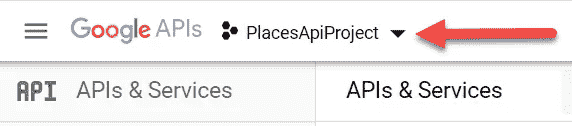
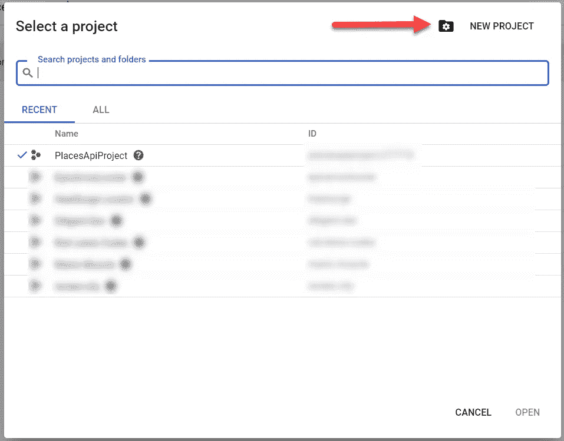
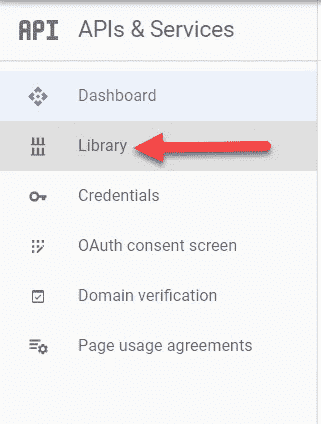
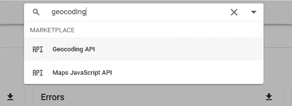
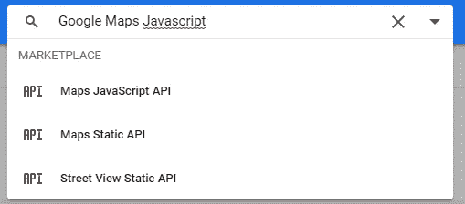
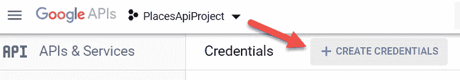
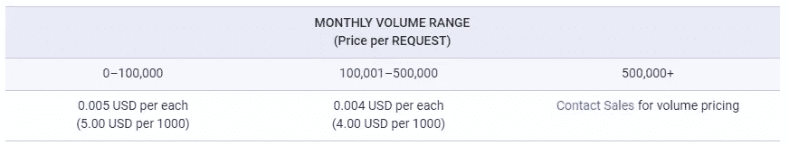
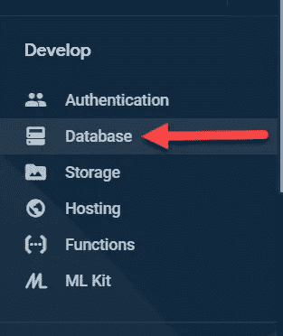
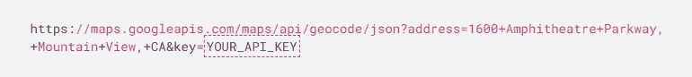
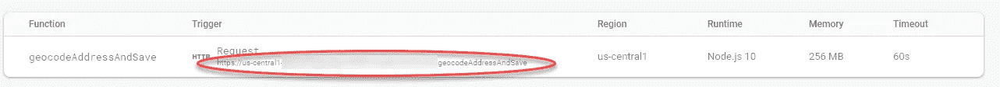

# 使用 Google 地理编码 API、VueJs 和 Firebase 进行地址地理编码

> 原文：<https://javascript.plainenglish.io/address-geocoding-with-google-geocoding-api-vuejs-and-firebase-694c0922df52?source=collection_archive---------2----------------------->


Photo by [Aksonsat Uanthoeng](https://www.pexels.com/@aksonsat-uanthoeng-393797?utm_content=attributionCopyText&utm_medium=referral&utm_source=pexels) from [Pexels](https://www.pexels.com/photo/close-up-photo-of-assorted-color-of-push-pins-on-map-1078850/?utm_content=attributionCopyText&utm_medium=referral&utm_source=pexels)

在你作为专业开发人员的职业生涯中，很有可能会要求你对地址进行地理编码。在我最近的三份工作中，有两份是我亲自做的。事实上，在我的上一家公司，我被要求每天做一些基于位置的事情。

不管是哪家公司，位置在许多软件、网络和移动应用中都扮演着重要角色。无论你是在某个地方登记，还是试图找到你的公司离用户最近的地方，了解一些基本情况都会有所帮助。因此，在本文中，我将向您展示如何使用 Google Maps 和地理编码 API、VueJs 和 Firebase 对地址进行地理编码，并将其显示在地图上。

# Google 地理编码 API 设置

如果你还没有谷歌账户(这些人真的存在吗？)创建一个并前往[谷歌开发者控制台](https://console.developers.google.com/)。

如果您还没有想要使用的项目，您必须创建一个新项目。在左上角，您会看到一个项目下拉列表。



Google Project

如果你点击下拉菜单，将会显示一个模式，让你能够创建一个新的项目。



Google Developer Console Projects

创建项目后，在下拉列表中选择它，然后在左侧菜单中单击 Library。



Google Developer Library

## 地理编码 API

在搜索框中，搜索“地理编码”，找到地理编码 API 并单击它。然后你会被带到一个屏幕，在那里你可以启用它。



Geocoding API

## 映射 JavaScript API

启用地理编码 API 后，搜索 Google Maps JavaScript API。导航到 API 页面并启用它。



Google Maps JavaScript API

## 资格证书

要使用这些 API，我们需要创建一个 API 键。要创建一个，请转到控制台的[凭证部分](https://console.developers.google.com/apis/credentials)。在那里，仔细检查您是否选择了正确的项目，然后单击 CREATE CREDENTIALS。



Create Credentials

点击按钮后，会出现一个下拉菜单。在下拉列表中选择 API 密钥。一旦创建了 API 密钥，就复制它以备后用。

## 启用计费

您还必须启用计费来使用 API。为此，导航到他们的[指令](https://support.google.com/googleapi/answer/6158867?hl=en)并按照步骤操作。不要担心费用，因为你每个月有 200 美元的信用额度。根据定价，你必须对 40，000 个请求进行地理编码，才能开始计算成本。



Pricing

如果你非常担心，那就制定一个预算，在达到要求后关闭服务。在一切关闭之前，我把我的测试账户设置为每月 1 美元。你可以在这里找到更多关于 T8 的信息。

# Firebase 项目设置

我们需要做的第一件事是在 Firebase 中建立一个项目。前往[https://firebase.google.com/](https://firebase.google.com/)创建一个账户，然后点击“前往控制台”。接下来，点击“添加项目”按钮，给它起你喜欢的名字。单击其他选项，选择默认值。

接下来，单击左侧菜单中的“数据库”。



Firebase Database

## Firestore

然后，在屏幕顶部单击“创建数据库”。


Firestore Database Creation

现在，选择在测试模式下启动，并选择默认的服务器位置。


Firestore Test Mode

***警告*** *:这将使你的数据库对任何人开放读写。如果您要在生产设置中使用它，请熟悉* [*Firestore 规则*](https://firebase.google.com/docs/firestore/security/get-started) *并实现* [*认证*](https://firebase.google.com/docs/auth) *。*

## Firebase CLI

Firebase 使得在我们的项目中安装样板函数变得非常简单。在我的上一篇文章中，我们注册了 Firebase，并将配置添加到我们的项目中，但是对于功能，我们需要在我们的计算机上全局安装 [Firebase CLI](https://firebase.google.com/docs/cli) 。为此，打开您的终端并运行以下命令:

```
npm install -g firebase-tools
```

现在我们已经安装了它，我们需要将其同步到我们的帐户。在命令提示符下运行以下命令并登录:

```
firebase login
```

# Vue 项目设置

要创建我们的 Vue 项目，打开您的终端，cd 到您想要的目录，并运行以下命令:

```
npx @vue/cli create google-address-geocoding
```

然后，选择默认预设(默认(babel，eslint))。这将创建一个标准的 Vue 项目，我们将工作了。完成后，在 [VS 代码](https://code.visualstudio.com/)中打开项目。

## 初始化 Firebase

在 VS 代码中，打开一个新终端(Terminal => New Terminal)并运行以下命令:

```
firebase init
```

**选择以下选项:**

*   你准备好继续了吗？(是/否)— **Y**
*   您想为此文件夹设置哪些 Firebase CLI 功能？— **功能**
*   请选择一个选项:**使用现有项目|选择我们之前设置的项目**
*   你想用什么语言写云函数？— JavaScript
*   你想使用 ESLint 来捕捉可能的错误并加强风格吗？— **Y**
*   您想现在安装与 npm 的依赖关系吗？— **Y**

现在，您会注意到我们的项目中有一个名为“functions”的新文件夹。在该文件夹中，有一个 index.js 文件。这是我们编写所有地理编码函数的地方。

## 安装依赖项

接下来，安装一些我们将用于我们的应用程序的包。在终端中运行以下命令:

```
npm install firebase vue2-google-maps axios bootstrap-vue
```

## 将 Firebase 添加到 Vue

现在我们可以用 Firebase 连接我们的 Vue 前端了。回到 Firebase 控制台，点击您的项目。在页面的中间，你会看到一个网络图标。点击那个。


Firebase Web Start

给你的应用取一个昵称，然后点击下一步。然后你会看到一些代码。在


Firebase Config

现在回到您的 Vue 项目，打开 src/main.js。在这个文件中，我们将添加 Bootstrap Vue、Google Maps 和 Firebase。然后，我们将创建一个 Firestore 实例，并将其导出。您的 main.js 文件应该如下所示:

main.js

## 地址表单和谷歌地图

在 src/App.vue 中，我们将添加表单来输入地址。在该表单下，将有谷歌地图，我们将显示我们地理编码和保存的所有地址的地图引脚。

对于表单，我将使用 [Bootstrap-Vue](https://bootstrap-vue.org/) 。这个包给了我们所有包装在方便组件中的引导程序的样式(我强烈推荐你查看他们的[文档](https://bootstrap-vue.org/docs))。

首先，删除 App.vue 中的 boiler-plate hello world 组件和徽标。然后，在 export default 标记中，添加一个数据属性来保存表单值和保存的位置。我们还将为表单提交添加一个占位符方法:

```
data: () => ({
 savedLocations: []
 formData: {
  street: '',
  city: '',
  state: '',
  zip: ''
 } 
}),
methods: {
 async handleFormSubmit() {}
}
```

在模板标签中，让我们添加表单和 google maps:

```
<template>
 <div id="app" class="container mt-5">
  <b-form @submit.prevent="handleFormSubmit">
   <b-row>
    <b-col md="6">
     <b-form-group label="Street">
      <b-form-input v-model="street"></b-form-input>
     </b-form-group>
    </b-col>
   </b-row>
   <b-row>
    <b-col md="3">
     <b-form-group label="City">
      <b-form-input v-model="city"></b-form-input>
     </b-form-group>
    </b-col>
    <b-col md="3">
     <b-form-group label="State">
      <b-form-input v-model="state"></b-form-input>
     </b-form-group>
    </b-col>
    <b-col md="3">
     <b-form-group label="Zip">
      <b-form-input v-model="zip"></b-form-input>
     </b-form-group>
    </b-col>
   </b-row>
   <b-button type="submit" variant="primary">Submit</b-button>
  </b-form><GmapMap
   :center="{lat:39, lng:-95}"
   :zoom="4"
   map-type-id="roadmap"
   style="width: 100%; height: 500px; margin-top:60px;"
  >
   <div v-if="savedLocations.length > 0">
    <GmapMarker
    :key="index"
    v-for="(l, index) in savedLocations"
    :position="{lat:l.geoPoint.latitude, lng:l.geoPoint.longitude}"
    />
   </div>
 </GmapMap>
 </div>
</template>
```

# 燃烧基函数

现在我们已经准备好了 Vue 应用程序，我们可以开始编写 Firebase 函数，该函数将对地址进行地理编码，并将其保存在我们的 [Firestore 数据库](https://firebase.google.com/products/firestore)中。但是，在开始之前，我们需要在 functions 文件夹中安装一些包。

在 VS 代码中打开终端，将 cd 放入 functions 文件夹。然后运行以下命令:

```
npm i axios cors
```

接下来，导航到 functions/index.js 文件，并将其添加到 functions import 下:

```
const admin = require('firebase-admin');
admin.initializeApp();const Firestore = admin.firestore;
const db = Firestore();const axios = require("axios");
const cors = require("cors")({
 origin: true
});const googleMapsApiKey = "YOUR_GOOGLE_API_KEY";
```

现在我们可以开始编码了。在该文件中，您将看到一个 helloWorld 函数示例。取消对它的注释，将名称更改为 geocodeAddressAndSave，然后清理它。

```
exports.geocodeAddressAndSave = functions.https.onRequest((request, response) => {
 response.send();
});
```

如果我们查看 [Google Maps API 文档](https://developers.google.com/maps/documentation/geocoding/start)，我们会发现我们需要请求这个 URL 端点对一个地址进行地理编码:



Google Request URL

我们需要将两个主要部分传递给这个 URL 请求。第一个是**地址**，第二个是你的 **API 密匙**。对于地址，我们将在 Firebase 函数请求的主体中传递它。API 键被硬编码在 index.js 文件的顶部。

一旦我们得到一个有效的响应，我们解析它并提取出我们需要的部分。如果你对传回的所有数据感兴趣，请查看[文档](https://developers.google.com/maps/documentation/geocoding/overview#geocoding)。一旦我们有了我们需要的东西，我们将把它保存在 Firestore 中，并将数据返回到我们的 Vue 应用程序。为了优雅地处理错误，我们将把一切都包装在一个 try/catch 中。

最后，index.js 文件应该是这样的:

index.js — Firebase Function

## 部署

要部署 Firebase 功能，请打开终端并运行以下命令:

```
firebase deploy --only function
```

部署完成后，转到 Firebase 控制台，单击左侧菜单中的 functions，并将 URL 复制到该函数下。



Firebase Function URL

# 从 Vue 调用 Firebase 函数

现在我们已经准备好了 Firebase 函数，我们可以从我们的 Vue 项目中调用它。在我们之前创建的占位符表单提交方法中，我们可以发出一个 axios 请求，并从表单中传递地址。因此，导航到 App.vue 并将 axios 添加到脚本标记的顶部:

```
import axios from 'axios';
```

然后在我们的 handleFormSubmit 方法中添加以下代码，去掉脚本标记(必须将这些标记用于格式化):

handleFormSubmit

## 页面加载的位置

我们需要做的最后一件事是在页面加载时加载我们的 pin。为此，我们将从 main.js 中获取 Firestore 的实例。在 App.vue 中的脚本标记的顶部添加以下内容:

```
import { db } from "./main";
```

然后，我们将使用一个名为 beforeMount 的 Vue 生命周期挂钩来加载保存的位置。在导出默认值中添加以下内容:

```
async beforeMount() {
 const snap = await db.collection("locations").get();snap.docs.forEach((doc) => {
  this.savedLocations.push(doc.data());
 });
}
```

添加完所有内容后，您的 App.vue 文件应该如下所示:

App.vue Final

# 结论

这就是全部了。现在，您拥有了一个对您传递给它的任何有效地址进行地理编码的函数，以及一个显示过去地理编码地址结果的前端。总而言之，这可能比你想象的要容易。一如既往，让我知道你对这个项目的看法。下次再见，祝编码愉快！

bit bucket Repo:[https://bit bucket . org/the diligent dev/Google-address-geocoding/src/master/](https://bitbucket.org/TheDiligentDev/google-address-geocoding/src/master/)

## 如果您喜欢通过观看来学习，本文还有一个视频版本:

Address Geocoding Video Tutorial