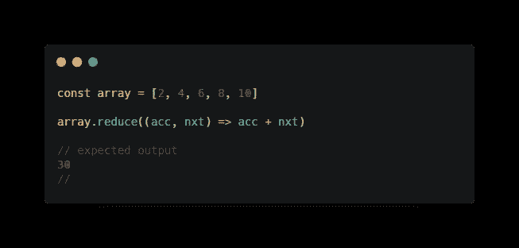

# JavaScript 中的高级数组方法

> 原文：<https://javascript.plainenglish.io/advanced-array-methods-in-javascript-d33e4b12de25?source=collection_archive---------2----------------------->

## 高效操纵数组

# 介绍

数组是类似列表的对象，其原型具有执行遍历和变异操作的方法。——[*MDN*](https://developer.mozilla.org/en-US/docs/Web/JavaScript/Reference/Global_Objects/Array)

在本文中，我们将讨论 JavaScript 中的一些内置数组方法，这些方法将使您的生活变得非常简单，并使您能够在任何数组上执行一些神奇的操作，同时避免代码重复。此外，您将学习使用什么方法以及何时使用它们。事不宜迟，言归正传。

# forEach()

forEach Javascript array 方法用于遍历数组，然后对数组中的每个值运行回调函数，然后返回*。forEach 方法总是返回 undefined，所以如果您尝试从 forEach 方法返回值，您将会得到 undefined。*

*forEach 方法接受回调函数作为其第一个参数。forEach 方法的回调函数接受三个参数，第一个是数组的值，第二个是数组中每一项的索引，第三个是整个数组本身。*

**

*forEach array method in JavaScript*

## *何时使用 forEach 方法*

*观察迭代后，它返回“未定义”。如果你要返回一个值，那么 forEach 方法不适合你，但是如果你要推送到一个在 *forEach* 方法之外的数组，那么考虑使用 *forEach* 方法。*

# *地图()*

*与 forEach 方法不同，map array 方法在数组上调用时会创建一个全新的数组。它遍历数组，对数组中的每个 ***值*** 或中的 ***元素*** 运行回调函数，并返回 ***新数组*** 。*

*它接受三个可选参数和一个非可选参数*，表示数组中要转换的当前元素**

***map 方法不会改变或变异它所调用的原始数组。***

****

**map array method in JavaScript**

## **何时使用地图方法**

**map 方法可用于转换数组中的每个元素，创建新数组，并返回新数组。如果一个新值不会从回调中返回，或者它创建的新数组不会被使用，那么就不应该使用 map 方法。**

# **查找()**

**find array 方法返回数组中第一个*元素的值，该元素与回调函数中的表达式相匹配。如果回调中没有匹配表达式，find 方法将返回 undefined。***

******

***find array method in JavaScript***

## ***何时使用查找方法***

***当您只想在一个数组中有一个值与您在回调中的表达式匹配时，可以使用 find 方法。如果您想要表达式中的所有结果，那么请考虑使用 filter array 方法。***

# ***过滤器()***

***filter 方法是 JavaScript 中 Arrays 上的一种迭代方法，它接受回调作为它的第一个参数，对数组中的每个值运行回调，并从调用它的数组创建一个新的数组，并返回所有与传递给它的回调函数的条件匹配的值。***

***回调的结果将被计算为布尔值。如果回调函数对数组中的某个特定值返回 true，则该值将被添加到新数组中，否则，如果它返回 false，则该值将不会被添加到新数组中，并且回调将移动到数组中的下一项。***

******

***filter array method in JavaScript***

***回调可以接受三个参数:***

1.  ******值*** 的元素***
2.  *****元素的索引*****
3.  *****原*** 阵**

**您不需要传入所有三个参数，只需传入您需要的参数。**

***注意:参数的顺序很重要，首先是项目的值，然后是索引，最后是整个数组。***

# **每()**

**此方法迭代数组，并检查数组中的所有元素是否都传递数组回调函数中的条件。**

***表达式求值为布尔值。* *如果回调计算的任何值返回 false，整个数组将变为 false。否则，它将返回 true。***

****

**every array method in JavaScript**

**从上面的图像中，返回值是假的，因为数组中的所有项都不大于零。只有当 ***数组中的所有项目*** 的回调函数返回真时，它才会返回真。**

# **一些()**

**此方法对调用它的数组上的每个元素运行一个回调函数。如果回调函数对至少一项返回 true，则整个结果变为 true。否则，返回值将变为 false。**

****

**some array method in JavaScript**

**上面的返回值是真的，因为数组中至少有一个数字大于零。这个数组方法与每个相反，因为它检查数组中是否至少有一个元素满足给定的条件。**

# **减少()**

**reduce 方法对被调用的数组中的每个项目运行一个回调函数。回调最多可以接受四个参数。**

1.  *****累加器*—**—累加回调的返回值。它是上次调用回调时返回的累计值。**
2.  *****当前值*** —这是数组中正在处理的当前元素。**
3.  *****索引*** —这是数组中每一项的索引。这是一个可选参数**
4.  *****数组*** —可选参数**

****

**reduce array method in JavaScript**

## **何时使用 reduce 方法**

**当你有一组数字，你想把它们加起来。就像在网上购物车的情况下，您需要添加所有产品的数量，并将总数返回给用户。**

# **结论**

**在本文中，我们讨论了几个内置的 JavaScript 数组方法，它们可以用来对数组执行操作。我们讨论的所有方法都接受一个回调函数作为它的第一个参数，可以用来在调用它们的数组上执行某种操作。**

**如果你觉得这篇文章足智多谋，请给它一些掌声，并在 Twitter 和 GitHub 上关注我。直到我们再次相遇:)**

** [## 电子条形码-概述

### 做最高级别的工作做最高级别的 JavaScript 开发人员和技术作家北极代码的工作…

github.com](https://github.com/ejirocodes)** 

## **有用的资源**

*   **[如何在 JavaScript 中使用数组方法:迭代方法](https://www.digitalocean.com/community/tutorials/how-to-use-array-methods-in-javascript-iteration-methods)**
*   **[array . prototype . reduce()—JavaScript | MDN](https://developer.mozilla.org/en-US/docs/Web/JavaScript/Reference/Global_Objects/Array/reduce)**
*   **[array . prototype . foreach()—JavaScript | MDN](https://developer.mozilla.org/en-US/docs/Web/JavaScript/Reference/Global_Objects/Array/forEach)**
*   **[array . prototype . map()—JavaScript | MDN](https://developer.mozilla.org/en-US/docs/Web/JavaScript/Reference/Global_Objects/Array/map)**
*   **[JavaScript🧐中的数组操作](https://dev.to/thomasaudo/advanced-array-manipulation-in-javascript--fhi)**