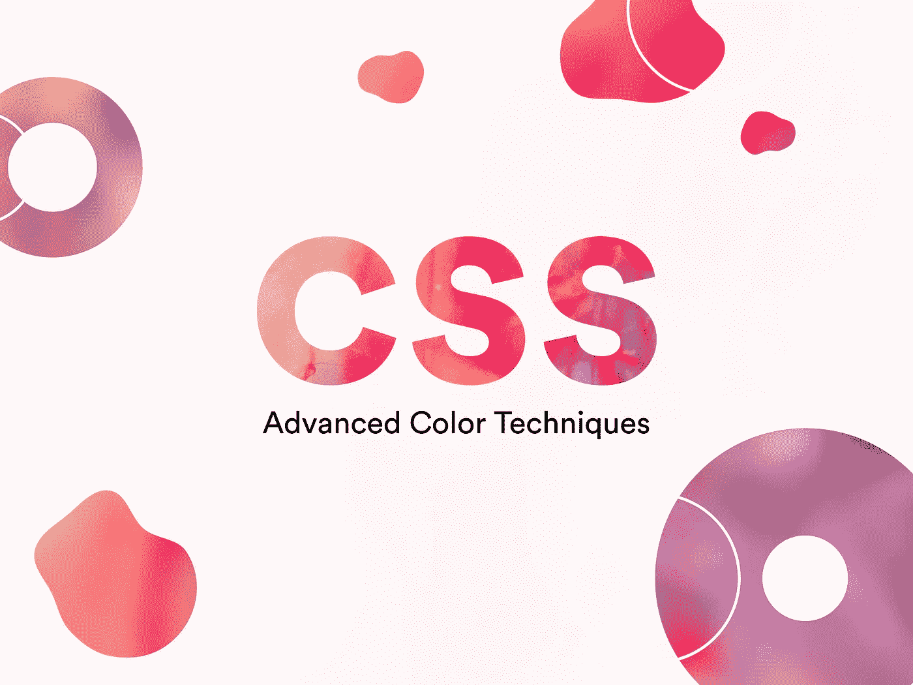

# 高级 CSS 着色技术

> 原文：<https://javascript.plainenglish.io/advanced-css-coloring-techniques-a11fd2ab0365?source=collection_archive---------2----------------------->



## 像专家一样使用颜色的 CSS 技术

如果你正在阅读这篇文章，你可能对 CSS 中不同的支持颜色格式很熟悉，比如关键字，RGB 立方坐标系(`#-hexadecimal, rgb(), rgba()`)，HSL 圆柱坐标系(`hsl(), hsla()`)。

## 今天，我将向您展示新的颜色语法和一致性技术，以创建与设备无关的颜色。

以下是我将涉及的不同主题。

*   现有的语法变体
*   较新的语法格式
*   与设备无关的颜色的颜色配置文件

# 现有的语法变体

你很可能熟悉下面使用颜色的语法变化。

**关键词**

```
color: transparent;
color: dodgerblue;
color: royalblue;
```

## **#十六进制**

```
#RGB[A] - R/G/B are hexadecimal values between 0-9, A-F with optional A (alpha value)color: #05f;
color: #05f0; // (Fully transparent)
color: #05ff; // (Fully opaque)#RRGGBB[AA] - RR/GG/BB are hexadecimal values between 0-9, A-F with optional AA (alpha value)color: #0055ff;
color: #0055ff00; // (Fully transparent)
color: #0055ffff; // (Fully opaque)
```

## **RGBA**

```
rgb[a]() - r/g/b values between 0-255 or 0%-100% and an optional a (alpha value) between 0-1 or 0%-100%color: rgb(0, 85, 255);
color: rgba(0, 85, 255, 0);
color: rgba(0, 85, 255, 1);
color: rgba(0, 85, 255, 0%);
color: rgba(0, 85, 255, 100%);
color: rgb(0%, 33.3%, 100%);
color: rgba(0%, 33.3%, 100%, 0%);
color: rgba(0%, 33.3%, 100%, 100%);
```

## **HSL[A]**

```
hsl[a]() - h value between 0-360, s value between 0%-100%, l value between 0%-100%, and an optional a (alpha value) between 0-1 or 0-100%color: hsl(220, 100%, 50%);
color: hsla(220, 100%, 50%, 0);
color: hsla(220, 100%, 50%, 1);
color: hsla(220, 100%, 50%, 0%);
color: hsla(220, 100%, 50%, 100%);
```

# 较新的语法变体

下面是 CSS 中颜色函数的一些语法改进。

## **只有 RGB 和 HSL 功能的 Alpha 值**

你不需要`rgba()`或`hsla()`只是为了增加阿尔法值。

```
color: **rgb**(0, 85, 255, 1);
color: **rgb**(0, 85, 255, 100%);
color: **hsl**(220, 100%, 50%, 1);
color: **hsl**(220, 100%, 50%, 100%);
```

## **不再需要逗号**

只要在中间加一个空格，就可以了。需要透明的空间？在你的颜色和阿尔法值之间添加`/`。

```
color: rgb(**0 85 255**);
color: hsl(**220 100% 50%**);
color: rgb(**0 85 255 / 1**);
color: rgb(**0 85 255 / 100%**);
color: hsl(**220 100% 50% / 1**);
color: hsl(**220 100% 50% / 100%**);
```

# 与设备无关的颜色的颜色配置文件

你知道你用 CSS 写的颜色可能不是你的用户看到的颜色吗？

CSS 中的颜色使用一种叫做 sRGB [颜色配置文件](https://help.gnome.org/users/gnome-help/stable/color-whatisprofile.html.en#:~:text=A%20color%20profile%20is%20a,gamut%20range%20of%20the%20data.)的东西。使用 RGB 颜色模型，我们可以显示 1670 万种颜色。大多数用户自己的显示器使用 sRGB 颜色配置文件，但是，如果您使用 Mac 设备或使用 Display P3、Adobe RGB 等颜色配置文件的现代显示器，它们比 sRGB 支持更多的色谱，允许用户看到比普通 sRGB 显示器更生动、更鲜明的颜色。

有多种颜色配置文件支持更广的色域，如 Adobe RGB、Prophoto RGB、Rec-2020 等。因此，根据用户显示器校准的颜色配置文件，您在开发应用程序时编写的颜色并不完全是用户看到的颜色。CSS 不支持颜色配置文件，迫使开发人员将自己局限于 sRGB 色谱。但是事情即将改变。

## **介绍颜色()功能**

`color()`功能允许您定义一个颜色配置文件后跟一种颜色，允许开发人员创建与设备无关的颜色。下面是怎么做的。

```
color(profile r g b) - profile takes in the color profile name, followed by r/g/b values between 0-1color: color(display-p3 0 0 0);
```

## 以下是 CSS Level 4 支持的默认颜色配置文件列表:

*   srgb(默认)
*   显示-p3
*   a98-rgb
*   正片 rgb
*   建议 2020

如果您想使用自定义颜色配置文件，您可以使用`@color-profile`来导入配置文件。下面是怎么做的。

```
color: color(--swopc 0.0134 0.8078 0.7451 0.3019);// Add the profile URL to import the color profile and name the 
// profile starting with --
@color-profile --swopc {
  src: url('http://example.org/swop-coated.icc');
}
```

请记住，`color()`功能目前仅在 Safari 中受支持，可能很快就会开始出现在 Chrome 和 Firefox 中。如果你想使用`color()`，并想有一个退路，这里给你。

```
color: rgb(0, 0, 0);
color: color(display-p3 0 0 0);
```

如果您想要检测您的显示器是否支持使用 JavaScript 的颜色配置文件:

```
if (window.matchMedia("(color-gamut: p3)").matches) {
  // Code to color up your app
}
```

# 我究竟为什么要在 CSS 中使用这个颜色配置文件呢？

您不需要使用颜色配置文件。这是一个新的 CSS 功能，目前仅在 Safari 中可用(截至目前，甚至没有 Chrome)。只是颜色配置文件允许您利用支持更宽色域的现代显示器，并使用户体验愉快。

有时颜色之间的差异几乎不明显，有时非常明显。这里有一个[互动比较](https://webkit.org/blog-files/color-gamut/comparison.html)，显示显示器上不同颜色配置文件之间的差异。

你对改善 CSS 中的颜色有更多的想法吗？让我知道你对 CSS 中新的颜色改进的想法。

## 简单英语的 JavaScript

喜欢这篇文章吗？如果有，通过 [**订阅解码获得更多类似内容，我们的 YouTube 频道**](https://www.youtube.com/channel/UCtipWUghju290NWcn8jhyAw) **！**