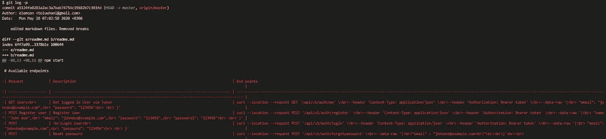

# 高级 Git 命令

> 原文：<https://javascript.plainenglish.io/advanced-git-series-git-log-b51620ea3380?source=collection_archive---------5----------------------->

## 如何使用:git log、单行、graph、p 和 stat

## 在本系列中，我将向您展示几个 git 日志命令

*   - git 日志
*   -单线
*   表示“以某方式写的东西”: autograph
*   -p
*   表示“稳定器”:thermostat | haemostat

# git 日志

该命令显示所有已提交的完整详细信息。

您会发现以下细节:

*   完全提交 SHA 哈希代码；
*   当地总部和分行名称；
*   远程分支的指针；
*   作者姓名和电子邮件；
*   提交日期；
*   提交消息。

## **git-***-***one line**

*git 日志--单行*汇总 *git lo* g 并将 *git 日志*细节折叠成一行。它将 SHA 哈希缩短为前七位数字。如果提交消息的长度超过一行，它将被压缩为一行。

# **git 日志图**

提交的图形显示了每个提交有多少个父提交。

# **git log - graph - oneline**

在这里，我们可以看到哪些提交具有单行格式的多个父提交。

# **git 日志统计**

这显示了在特定提交中所做的更改。更改的文件数量、插入和删除的数量。++'s 和- 's 分别显示插入或删除了多少行。

git log --stat

# **git log -p**

该命令不仅显示被更改的文件，还显示实际发生的更改。在终端中查看文件更改并不方便，但是让我们快速观察文件中发生了哪些代码更改。如果您想方便地观察文件中的任何变化，请使用图形界面软件，如 VS Code、Atom。

git log -p

# **git 日志- <编号>**

该命令指定要显示的最后提交的数量。下面的代码显示了最近四次提交的详细信息。

# **git 日志- <编号> -单行**

显示 git 日志号，即在折叠视图模式下最后提交的具体数量

git log -<number> --oneline

# **git shortlog**

默认情况下，该命令按作者姓名对提交进行排序。作者姓名跟在作者提交的数量之后，放在括号中。在下面的代码中，作者 *elemson* 做了三十一处修改。

**git shortlog**