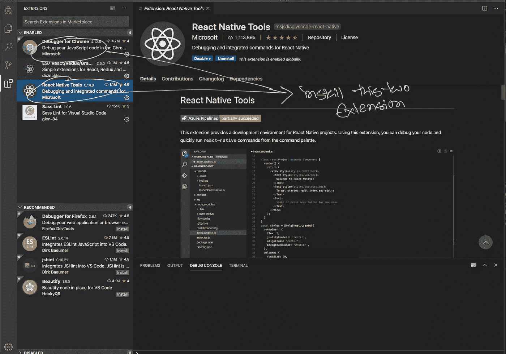

# VSCode 中的高级 React Web 应用程序调试只需 3 个步骤。

> 原文：<https://javascript.plainenglish.io/advanced-javascript-debugging-in-vscode-just-in-3-steps-38c847399742?source=collection_archive---------0----------------------->

## 像专家一样调试 JavaScript 前端应用程序。


Photo by [Andrew Neel](https://unsplash.com/@andrewtneel) from Unsplash

**注意:这篇文章已被弃用。遵循这个** [**环节**](/debugger-for-chrome-is-dead-4f2c1175c26c?sk=02c5ef93457dd2d4b9e50e90a530af7e) **才有可行的方案。**

Debugging a React Application in VSCode.

# 第一步:

首先创建一个 **React** 应用程序，然后**运行**它。

```
npx create-react-app my-app
cd my-app
npm start
```

# 第二步:

Iinstall Crome 和 **React Native Tools** 扩展所需的**调试器。**



Install [React Native Tools](https://marketplace.visualstudio.com/items?itemName=msjsdiag.vscode-react-native) and [Debugger for Chrome](https://marketplace.visualstudio.com/items?itemName=msjsdiag.debugger-for-chrome) from VSCode Extension.

现在创建一个 **launch.json** 文件，如下图所示


This way we will Create launch.json file

# 第三步:

现在打开 launch.json 文件，修改如下。


Replace launch.json “url” with local url

> 就这些。
> 
> 感谢阅读。