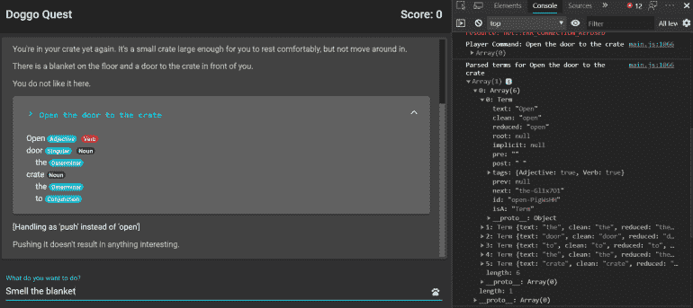
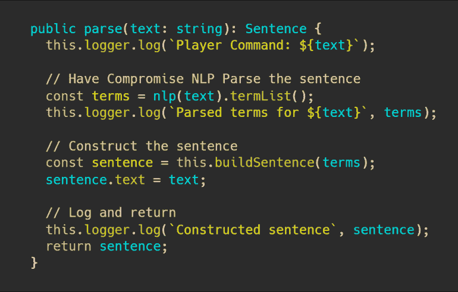
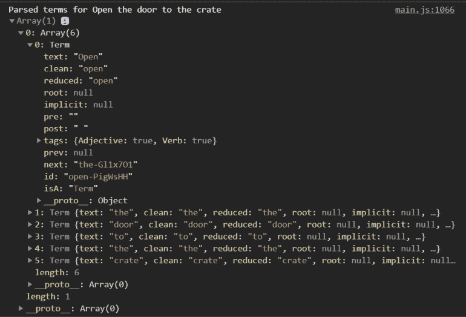
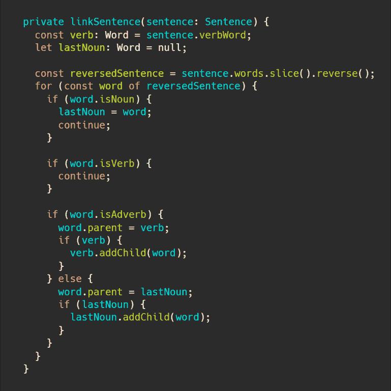
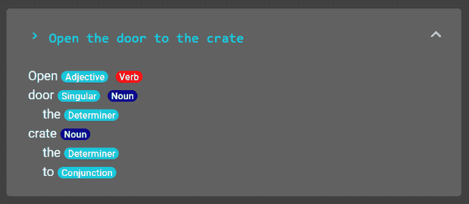

# 用 JavaScript 和妥协构建一个句子解析冒险游戏

> 原文：<https://javascript.plainenglish.io/adventure-game-sentence-parsing-with-compromise-c4ead901da54?source=collection_archive---------5----------------------->

## 用 JavaScript 构建一个有代表性的句子图

在本文中，我将向您展示如何使用[折衷的](https://nlp-compromise.github.io/) JavaScript 库来解释用户输入，并将其转换为分层的句子图。

我将在一个有角度的互动虚构游戏中使用妥协来解释玩家的输入，但是你可以在许多不同的事情上使用妥协，包括:

*   分析地点、名称和公司的文本
*   构建上下文相关的帮助系统
*   根据时态和其他语言规则转换句子

**学习目标**

在本文中，我们将讨论:

*   什么是妥协
*   你如何使用妥协来分析句子
*   基于折衷的句子结构推理

*注意:这篇文章是我写的关于妥协的旧文章* [*的更新版本，范围更窄。此信息适用于 Angular 的现代版本以及 Compromise 的现代版本。*](https://killalldefects.com/2019/09/24/building-text-based-games-with-compromise-nlp/)

# 什么是妥协？

Compromise 是一个 JavaScript 库，目标是在速度和准确性之间达成妥协。我们的目标是拥有一个客户端解析库，速度非常快，可以在您输入的同时运行，同时仍然提供相关的结果。

在本文中，我将使用 Compromise 来分析玩家在基于文本的游戏中输入的命令，并构建一个代表他们输入的句子的整体结构的`Sentence`对象。然后，可以在代码的其他部分使用这句话来处理各种动词，并使应用程序像游戏一样运行。

# 安装和导入折衷

从妥协开始，首先需要将它作为一个依赖项来安装。在我的项目中，我运行`npm i --save compromise`将依赖项保存为运行时依赖项。

接下来，在一个相关的角度服务中，我用这一行导入折衷:

幸运的是，折衷方案包括了 TypeScript 类型定义，所以如果我们选择使用它的话，我们有很强的类型信息可用。

# 折衷的字符串解析

接下来，让我们看看如何妥协可以用来解析文本和操纵它。

看看我下面定义的`parse`方法:

在这里，我使用`nlp(text)`加载并解析输入的文本值。在那里，我可以使用 Compromise 提供的许多方法中的任何一种，但是对我的特定场景最有用的是对结果调用`.termList()`,并查看 Compromise 对我输入的每个单词推断出了什么。

*注意:输入文本不一定是一个句子，它可以是几个段落，如果您需要分析大量文本，Compromised 旨在更大范围内发挥作用。*

当我记录 Compromise 的解析操作的结果时，我看到如下内容:

注意这里的`Term`数组包含一些不同的信息，包括:

*   **文本** —用户键入的原始文本
*   **clean** —用户输入的规范化小写版本。这对于字符串比较很有用
*   **标签** —基于 Compromise 的内部解析规则，包含可能出现在术语上的各种属性的对象。

这个 tags 集合是我将在本文中探讨的折衷的主要好处(除了它能够获取一个句子并将其分解成单独的术语，正如我们刚刚看到的)。

在这里我们看到，`Open`术语的`tags`属性包含了`{Adjective: true, Verb: true}`。这是因为英语是一种复杂的语言，open 可以指打开某物或物体状态的动词，如*开门*。

我们稍后将更多地讨论这种消歧，但现在我们将重点放在 Compromise 识别它知道的英语单词并根据单词拼写和相邻术语的模式对它不知道的单词进行推断的能力上。

Compromise 在这方面的智能对我来说是这类应用程序的主要卖点。妥协让我在很大程度上弄清楚了用户是如何试图构造一个句子的。这让我可以过滤掉我不关心的单词，避免试图在一个简单的游戏项目中编纂整个英语语言。

# 添加抽象层

如果您向上滚动到我的`parse`方法，您会注意到它指定了一个`: Sentence`返回类型。

这是因为我相信只要有可能，就在第三方代码周围添加抽象层。这有许多好处:

*   如果第三方行为或签名发生重大变化，您只需要在几个地方修改签名，因为其他一切都依赖于您自己的对象的签名
*   如果你需要改变一个外部依赖关系，你只需要重新实现通向抽象层的部分
*   将其他对象包装在我自己的对象中使我更容易定义新的方法和属性，从而更容易使用这些代码

为了折衷，我选择实现两个主要的类，一个单词类和一个句子类:

我不会强调这些实现的任何细节，除了声明它们包装了 Compromise 的`Term`类，同时允许我对整个句子进行集成验证和结构分析。

# 验证句子

一旦我有了一个由一系列`Word`对象组成的`Sentence`，我就可以根据英语中*祈使句*(基于命令的)的结构对单词关系做出一些推断。

请注意，在我的应用程序中，我将所有输入视为一个句子，不考虑标点符号。我的验证规则很容易捕捉到包含多个句子的情况，所以我认为没有必要区分句子边界。

具体来说，我验证了句子中的第一个单词是动词。这只对像`Eat the Fish`或`Walk North`这样的祈使句有意义，但这是我们在这样的游戏中期待的句子类型。

接下来，我验证一个句子只包含一个动词(带有`Verb`标签的术语)。任何有两个或更多的都太复杂了，解析器无法处理。

一旦这些检查完成，我就可以开始分析单词之间的关系了。

# 对句子进行推理

我假设这个句子主要围绕一个动词和零个或更多的名词。

然后，我从右到左遍历句子中的每个单词，并应用以下规则:

1.  如果这个词是副词，我会把它和动词联系起来
2.  如果这个单词不是名词、动词或副词，我会将它与最后遇到的名词(如果有的话)联系起来。

完整的方法可以在这里看到:

一旦完成，我就有了一个句子的层次模型。为了便于说明，下面是一个例句的调试视图:

# 后续步骤

通过适当的解析，句子包含了一个相当丰富的句子结构图。这并不意味着玩家的句子有逻辑甚至语法意义，甚至是指游戏世界中存在的东西。

但是，可以将该句子传递给输入命令的特定动词处理程序，后者可以尝试理解该句子并给出适当的回复，尽管这超出了本文的范围，所以请继续关注关于游戏状态管理的后续文章。

*原载于 2020 年 2 月 20 日 https://killalldefects.com**的* [*。*](https://killalldefects.com/2020/02/20/adventure-game-sentence-parsing-with-compromise/)