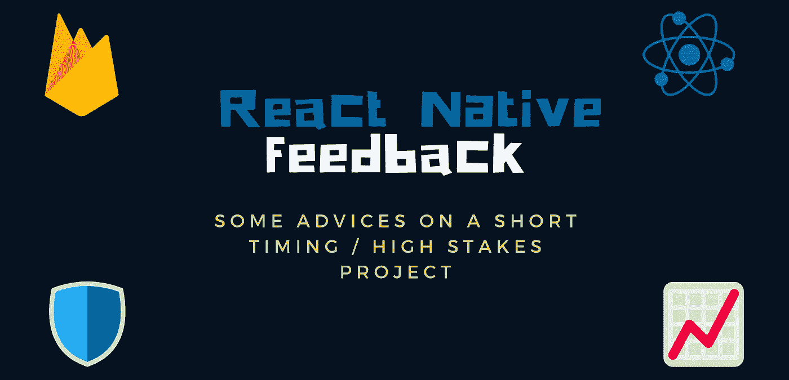
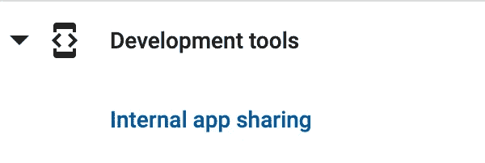

# 短期内的建议会对高风险的本地移动项目产生影响

> 原文：<https://javascript.plainenglish.io/advice-from-a-short-timing-react-native-mobile-project-with-high-stakes-f15e4645bb5c?source=collection_archive---------3----------------------->

## 体验反馈

## 关于我们在 6 周内为一项国际活动实现 15，000 活跃用户/小时和 95，000 下载应用程序的良好决策和错误的反馈。

💡出于权利和保密的原因，我不能透露我参与的项目的名称。

但我会给你一些细节的要求和细节，我们必须处理，以实现这一目标。

*   项目开发比其**最后期限**提前 6 周开始。也就是说没有办法争取更多的时间。
*   来自 5 家公司的 5 个独立团队参与了数据交换、客户、网络开发和移动开发。我的团队使用无服务器 Firebase 函数(Google Cloud 函数)开发了一个带有推送通知的小型后端的移动应用程序。
*   规格和设计在整个项目中不断变化，有很多反复，这就是[精益创业](https://en.wikipedia.org/wiki/Lean_startup)。
*   移动应用程序定期在一些屏幕上进行轮询，以获得近乎实时的更新。由于遗留代码，后端提供商和我们无法在截止日期内实现 web-sockets。
*   我们使用了 **React Native 0.61.X** 、 **GraphQL** 和 **Firebase** 作为主要技术。

主角对在给定时间框架内取得的成就感到满意。我们都从错误和用户反馈中学到了很多，这篇文章旨在帮助人们改善他们的时间表和编程会话，以便在这种压力条件下取得成功。

我们做了一些伟大的选择，但也犯了一些错误。最后，我们学到了很多，并把这些元素作为未来的教训。你应该总是从你的经历中成长。

我把我们学到的东西综合成 5 条建议，它们是:

# ✈️利用远程配置和空中更新来适应你的应用一旦生活

关于移动应用你需要知道的一件事:首次展示惯性非常非常非常长。

## 应用商店验证流程

**🍎众所周知，苹果对应用商店有一个强大而可靠的应用审查程序。**

这是一件好事，因为它从列表中过滤了一些垃圾应用。审查是线性的，大多数应用程序通常需要 12-48 小时。

**🔍谷歌以没有审查程序而闻名**

直到现在，Google play 商店还在遥远的西部。你可以找到任何东西，包括带病毒的应用程序，因为这个评论几乎不存在。

【2019 年夏初，谷歌更新了审查政策，现在据称这些政策变得更强，这是一件好事……至少我第一眼是这么想的……

该应用在 Google play 上的首次审核花了 4 天时间才通过验证…嗯…与他们宣布的一周相比，这已经很快了…

但我不确定为什么花了这么多时间，因为第一次发布是一个有问题的版本，由于 React 原生 Android 加载程序( [*SoLoader*](https://github.com/facebook/SoLoader) )的一个错误，应用程序显示空白屏幕。

尽管如此:我们在 Google play 上得到了验证…谢天谢地，在第一次提交之后，下一次发布在 Google Play 上很快，这只是几分钟的事情。

**💡建议:** *预测应用商店上的部署，并始终首先使用内部应用共享检查您的 Android 应用捆绑包，因为它可能与标准测试不同。*

## 您不能依赖用户更新。

你不能保证你的用户会在活动期间更新他们的应用，但你可以肯定他们会在商店里留下差评😿。

万一你不能快速打补丁，想办法邀请他们来更新。推送通知是很好的工具来帮助解决这个问题，但是因为它们是 4G 或者更低的，所以不要太依赖它。

## 远程配置和 OTA 的帮助

Codepush & Firebase

前两天我们还没用 react-native 和 JS 最相关的一个特性:**O**ver**T**he**A**IR**U**pdate with[code push](https://github.com/microsoft/react-native-code-push)。但是我们使用了 [Firebase 远程配置](https://firebase.google.com/docs/remote-config)，这真的很有帮助。

如果让我再做一次，我肯定会把两者都加上，直接在项目开始的时候。顺便说一下，它们现在是我所有项目脚手架模板的一部分。

1.  **Firebase RC** 让您能够根据分析、用户/应用指标甚至随机性/时间等变量，灵活地远程调整配置。**您可以根据不同的人远程更改功能。**
2.  Codepush 允许你发布新的更新，而不会改变应用程序的全局行为。它非常适合修补和热修复。

**💡建议:** *使用 Codepush 和远程配置，您可以处理任何尚未在预生产中发现的边缘情况。*

## 🇩🇪 🇫🇷 🇪🇸使用本地缓存回退策略远程管理翻译

在活动期间，顾客很容易忘记一些事情或改变主意**。**

> 哦，活动上有人说这个段名不清楚，可以更新一下吗？

在那种情况下，只有两种方法可以帮助他:

1.  您已经启用了 Codepush，并且能够使用 JSON 发布的翻译推送新的 Javascript 包。
2.  或者更好的办法是，你可以使用定制服务或外部提供商(如 [Localizejs](https://localizejs.com/) )远程管理你的翻译。

**💡建议:** *这是一个相当常见的请求。远程管理您的翻译，尽量不要删除，而是添加一个新的，以保持旧版本的向后兼容性。*

# 🛡Defensive 编程对于嵌入式系统来说非常棒

在这个项目中，正如我在上面告诉你的，我们有许多主角，一些拥有尖端技术，一些拥有不太常见的技术。

我们只做前端移动应用程序，使用 GraphQL API，它扮演数据聚合器的角色。

在后端工作的人真的很熟练，但他们没有足够的数据给定的时间框架，以确保交付的数据将遵守给定的格式，我们都知道它可能会在活动期间改变…你知道吗？确实如此。

考虑到这一点，我们应用了一种在嵌入式系统中非常常见的编程风格:🛡 [**防御性编程**](https://en.wikipedia.org/wiki/Defensive_programming) **。**

让我们从维基百科上取一个小定义:

> 防御性编程是[防御性设计](https://en.wikipedia.org/wiki/Defensive_design)的一种形式，旨在确保一个[软件](https://en.wikipedia.org/wiki/Software)在不可预见的情况下继续运行。防御性编程实践通常用于需要高可用性、安全性或安全性的地方。

哇…！看起来它非常适合我们的用例。

简而言之，我们高度依赖 [Lodash](https://lodash.com/docs/4.17.15#get) `[_.get](https://lodash.com/docs/4.17.15#get)`方法来访问我们的变量，并且我们通过 GraphQL 模式类型来处理后端。我们还使用了 React 错误边界、重试按钮、GraphQL 内容缓存。

通过这种方式，我们确保获得最稳定的应用程序，以防止崩溃和糟糕的用户体验。

**💡建议:*永远，永远，永远不要相信传入的远程数据*** *尤其是如果它不是来自你手头的服务器。和你的 QA 工程师一起测试尽可能多的边缘案例。*

# 📊不要忘记收集数据和指标，以便以后改进

**作为应用程序所有者/创建者，你的主要目标是确保用户在你的应用程序上的留存率。在已经是用户的人身上引发转化比获得新用户更容易。**

要实现这一目标，你必须发布三条重要信息:

1.  **第一个是通过你的 app** 追踪用户旅程/行为。查看了什么屏幕，什么时候，以什么顺序。触发了哪些事件。用户是否正确使用和理解了该特性？为此，我们使用了[**Firebase Analytics**](https://firebase.google.com/docs/analytics)和 Google BigQuery。
2.  **其次是崩溃/性能监控:**为此，我们使用了 **Firebase** 中的 [**Crashlytics**](https://firebase.google.com/docs/crashlytics) 和 [**性能监控**](https://firebase.google.com/docs/perf-mon) ，它们都是很棒的工具。
3.  **最后是收集反馈:**为此，我们通过调查收集现场用户反馈。还有商店评论部分和电子邮件。

所有这些指标将推动您的客户在内容交付和许多其他方面的战略。他们还会帮助你发现任何导致应用程序崩溃的陷阱，哪里出了问题，以及需要改进哪些代码。

**💡建议:** *为最终用户设计你的应用程序，总是收集他们的反馈。这样，他们会对你的产品感到关注，也会信任你，从而提高* ***的保留率*** *。*

# ✅代码评审使用小特性，不要找大团队

在那个项目中，就纯移动开发而言，不包括项目经理或设计师等其他人员，我们是一个由 3 名开发人员组成的团队。

**作为一名技术主管，我喜欢少于 5 名开发人员的小团队**

通过让一个小团队处理一件特定的事情，你可以通过测试每个集成并给出反馈，留出足够的时间来正确地审查合并请求。

也更容易对团队的每个成员正在做的事情有一个全局的视野，并且在需要的时候提供帮助。

这使得人们可以避免在功能方面的冲突(或者至少减少冲突)。

此外，在如此短的交付时间内，减少会议和仪式的数量，在功能处理和合并之前，更喜欢直接沟通，以确保一切都正确对齐。

**💡建议:** *保持团队的小规模，在合并请求上花时间检查每件事都是相关的和功能性的，在团队成员之间分享反馈，交付小块的功能。*

# 💤睡觉。

**这可能看起来很愚蠢，但这可能是我能给你的最重要的建议。**

即使风险很大，即使截止日期很近，或者如果你的老板催促你要结果:不要忘记睡觉，通过做其他事情来放松你的大脑。

否则，这样做，你会直接走向倦怠。

如果你筋疲力尽，所有人都输了。

加班(有时是强制性的……)和努力挣更多的钱是可以的，但是心理健康是你需要保持的最重要的东西。努力找到适合自己情况的平衡点。

记住:

> 做墓地首富没有任何意义。