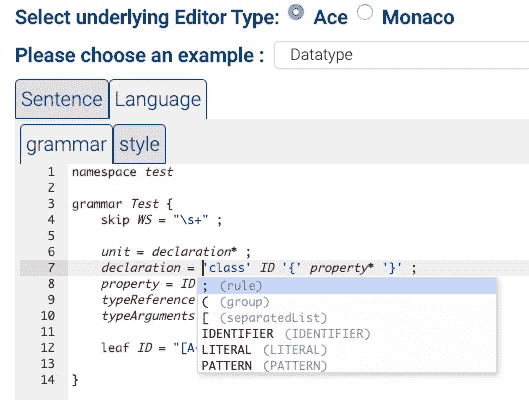

# 为文本输入验证创建自定义的特定于域的语言

> 原文：<https://javascript.plainenglish.io/agl-your-dsl-in-the-web-c9f54595691b?source=collection_archive---------6----------------------->

## 当使用正则表达式是不够的

文本输入是许多 web 应用程序的主要部分。在许多情况下，需要对文本进行验证。也就是说，输入对于任何文本都是无效的，而是对于符合特定规则的文本才是有效的。

在简单的情况下，可以使用正则表达式来验证文本，通过使用文本编辑器，如 [Ace](https://ace.c9.io/) 或 [Monaco](https://microsoft.github.io/monaco-editor/) ，可以通过错误标记和给文本着色向用户提供关于文本有效性的反馈。

Ace 和 Monaco(以及其他 web 文本编辑器)都提供了添加“新语言”的机制。但是在这两种情况下，机制都很重要，并且主要基于正则表达式和特定于语言的代码。

这很好，在许多情况下提供了所有需要的东西。然而，有时我们只是需要多一点。许多语言不能通过正则表达式进行解析。他们需要更高级的[上下文无关语言](https://en.wikipedia.org/wiki/Context-free_grammar)解析器。

# 问题是

为上下文无关语言创建解析器是一项复杂的编程任务，通常使用解析器生成器。有针对 JavaScript 的解析器生成器。例如， [ANTLR](https://www.antlr.org/) 、 [Nearley](https://nearley.js.org/) 或 [PEG.js](https://pegjs.org/) 等等。

我的经验是，即使有了解析器生成器，从你的语言的语法到支持它的编辑器的过程仍然是很重要的。通常我们想要一个编辑器，为语言提供基本的 DSL 支持，包括语法着色、自动完成建议、错误反馈和格式化。

在 Eclipse 编程的世界中， [Xtext](https://www.eclipse.org/Xtext/) 提供了这种能力。但是，尽管有一些初步的工作允许 Xtext 框架以基于 web 浏览器的编辑器为目标，但它从未真正起飞。我相信部分原因是因为生成过程太复杂，耗时太长，特别是因为运行时需要后端服务器。

# 要求

我们想要的是:

1.  纯粹在浏览器中运行(仅前端)
2.  运行起来非常简单快捷(可能不需要生成代码)
3.  接受任何上下文无关的语法
4.  对于几行(可能是一页)文本来说足够快了(假设语法是明确的)。

# 解决方案

好吧，我没有找到任何满足这些开箱即用的要求。所以，我自己写(实现)了一些东西。

我写了一个类似 GLR 的按需扫描的运行时解析器(也就是说，没有解析器生成器，你只需要在运行时给它一个语法)。这不是小事，我从学习不同的解析器算法中获得了很多乐趣(也有一些压力)。我尝试了几次都失败了。但最终产生了一些有用的东西。更好的是，它是用 Kotlin 通用代码编写的，所以它可以在任何 Kotlin 目标平台、JVM、Javascript 等上运行。

然后，在将解析器集成到 Ace 和 Monaco 基于 web 的编辑器中时，我有了更多的压力(和一点乐趣)。这比我想象的要困难得多，主要是因为编辑器似乎不是按照这种方式设计的。然而，这是可能的，尽管我怀疑某个对这些编辑器的代码库更有知识的人可以改进事情。(随意投稿！)

# 最终结果

你可以看到最终结果的[演示。它允许你编辑一个语法，定义风格规则，然后用那个语法写句子。全部在浏览器中，在运行时。](https://info.itemis.com/demo/agl/editor)

如果运气好的话，将来会添加更多的特性(比如格式规则)。

如果您需要任何使用帮助，如果您想做出改进，或者如果您对该主题有任何想法，请随时联系我。

有一个 [github 仓库](https://github.com/dhakehurst/net.akehurst.language)，里面有所有的代码，Apache 2.0 许可证。

【JavaScript 用简单英语写的一句话:我们总是乐于帮助推广高质量的内容。如果你有一篇文章想用简单的英语提交给 JavaScript，请用你的 Medium 用户名发邮件到[submissions@javascriptinplainenglish.com](mailto:submissions@javascriptinplainenglish.com)给我们，我们会把你添加为作者。