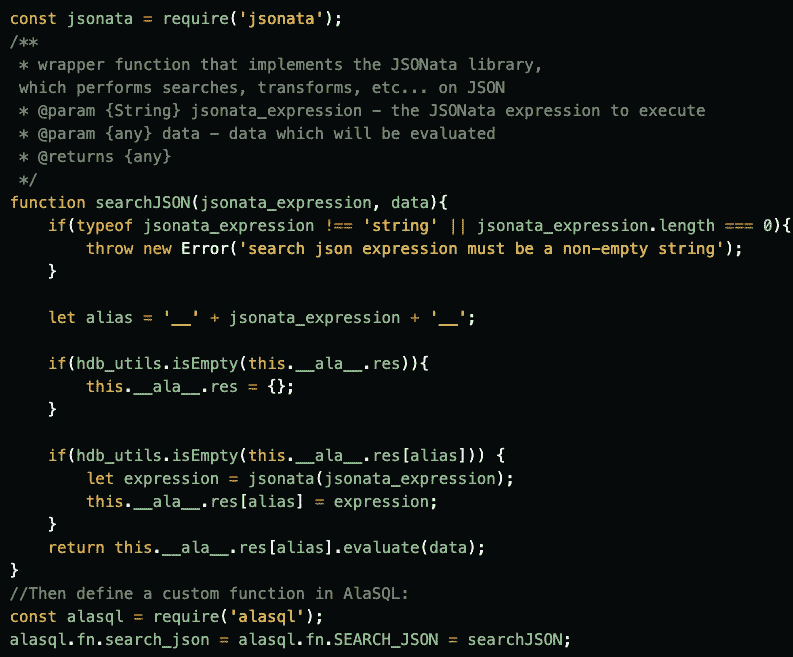

# 行动中的 AlaSQL:JavaScript SQL 数据库

> 原文：<https://javascript.plainenglish.io/alasql-in-action-the-javascript-sql-database-672e7653275f?source=collection_archive---------3----------------------->

# 什么是 AlaSQL？

首先，这个开源项目通过 npm 获得了 **11k 周下载量**，并且在 GitHub 上拥有超过 **5K 颗星。**

我很惊讶地看到，除了我找到的这篇很棒的文章[，网上没有更多关于这个流行的**轻量级客户端内存 SQL 数据库**的帖子。然而，](https://dev.to/jorge_rockr/alasql-a-real-database-for-web-browsers-and-nodejs-24gj) [AlaSQL 的网站](http://alasql.org/)开门见山:

*   浏览器和 Node.js 的 JavaScript SQL 数据库
*   处理传统的关系表和嵌套的 JSON 数据(NoSQL)。
*   从 localStorage、IndexedDB 或 Excel 导出、存储和导入数据。

*有什么不爱？* AlaSQL 设计用于浏览器和 Node.js，速度快，超级易用。[有人说](https://medium.com/@danacodes/alasql-a-query-language-for-javascript-e1540ac238b4#:~:text=AlaSQL%20is%20an%20open%2Dsource,and%20a%20few%20other%20sources.)当你需要快速查找数据，并且想要一个完整数据库或 Redis 的更好的替代方案时，请查阅 AlaSQL。

# 我们也喜欢 AlaSQL

HarperDB 很高兴使用 AlaSQL 作为其后端 SQL 功能。我们选择使用 AlaSQL 是因为它具有广泛的语言支持、良好的支持和可扩展性、能够针对数据集(JSON 或数组)执行 SQL 以及能够生成可重用的函数。

AlaSQL 使我们能够将 SQL 语言转换成抽象语法树(AST ),我们可以通过编程将它解释成我们的数据模型。我们能够将数据输入处理器，处理器可以执行 SQL 固有的计算，在整个项目中使用库中定义的函数作为 API，而不仅仅是在 SQL 调用的上下文中。

AlaSQL 是可扩展的，允许我们创建自定义函数。例如，我们创建了一个名为 SEARCH_JSON 的定制函数，它允许 HarperDB 用户搜索和转换嵌套文档。这个函数包装了一个流行的名为 JSONata 的 npm 包。有了 AlaSQL，我们能够嵌入另一个开源包作为一个简单的函数调用。

我们的实现就像定义函数一样简单(注意:这是示例代码):

*很明显*我们很高兴决定使用 AlaSQL 将 SQL 解释到我们的数据模型中，并对尽可能多的 SQL 运行性能查询。[这就是为什么我们在 6 月 16 日接待了 AlaSQL 的创建者，作为一个展示](https://www.youtube.com/watch?v=ARfWrjXzWSg&t&utm_content=132680797&utm_medium=social&utm_source=twitter&hss_channel=tw-825352688518959105)来深入了解 AlaSQL 是如何被创建的，它是如何变得越来越受欢迎，以及现实世界中的用例和产品。听到 AlaSQL 的创建者马蒂亚斯·兰格尔·伍尔夫和安德烈·格顺的声音真是太棒了。

在对 AlaSQL 进行问答之后，我们的 CTO Kyle Bernhardy 分享了更多关于使用 AlaSQL 作为 HarperDB 的引擎，将复杂的 SQL 解释和解析到我们的数据模型中，并执行简单到复杂的 SQL CRUD 操作，以及公开其他库，如 truf . js、JSONata 等等。

在这个创新的客户端内存 SQL 数据库上寻找更多的资源吗？查看[这个 JavaScript 库](https://www.javascripting.com/view/alasql)旨在:

*   胖客户机上 BI 和 ERP 应用程序的快速内存 SQL 数据处理
*   通过多种格式的数据导入/操作/导出，实现简单的 ETL 和持久性选项
*   所有主要的浏览器、Node.js 和移动应用程序