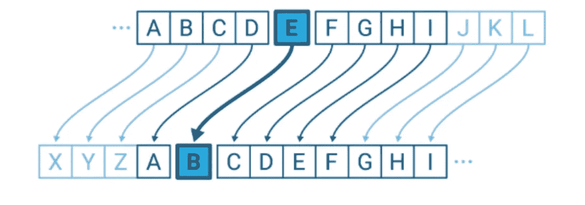
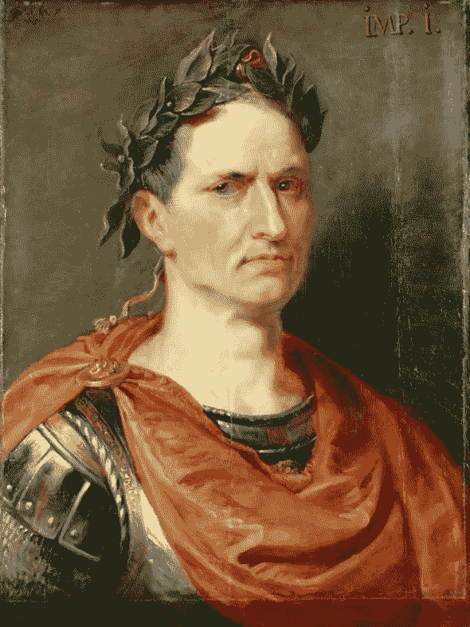

# 算法练习:凯撒密码加密器

> 原文：<https://javascript.plainenglish.io/algorithm-practice-caesar-cipher-encryptor-19e4fe3a613d?source=collection_archive---------10----------------------->

凯撒密码加密机是我们的算法问题演练系列的下一个。在像 [Leetcode](https://leetcode.com/) 这样的网站上，这被归类为“简单”算法，这是另一个在技术面试中经常出现的经典问题，对于任何希望提高解决问题技能的软件工程师来说都是很好的练习。

Src: [IBM Community](https://community.ibm.com/community/user/ibmz-and-linuxone/blogs/subhasish-sarkar1/2020/07/04/caesar-cipher)

## ***背景信息***

首先，一些关于凯撒密码的背景信息，这样我们就知道我们在对付什么了。凯撒密码是*密码学*的一个简单例子，由[韦氏词典](https://www.merriam-webster.com/dictionary/cryptography)定义为 ***:*** *用秘密代码或密码对消息进行加密和解密。*

***:*** *信息的计算机化编码和解码。*

凯撒密码的基础是将字符串中的每个字母在字母表中移位一定的位置(经典的是三个)。凯撒密码也被称为**移位密码**，因为它涉及字母的移位，以隐藏消息的含义。凯撒密码之所以如此命名，是因为据说朱利叶斯·凯撒和他的盟友使用这种加密方法来发送涉及军事机密的秘密消息。

Src: [Julius Caesar Study Guide](https://www.shakespearestudyguide.com/JuliusCae.html)

## ***凯撒密码加密器***

现在我们有了一些关于凯撒密码及其工作原理的背景知识，我们可以继续研究实际的算法问题。*给定一个由小写字母和一个键(非负整数)组成的非空字符串，该键指定字符串中每个字母在字母表中移位多少位，我们的任务是编写一个返回编码字符串的函数。我们希望字母环绕字母表；`z`移动一个位置应返回字母`a`。*

现在，在开始编写代码之前，让我们从概念的角度来考虑这个问题。我们知道我们需要系统地将输入字符串的每个字母移动一定的位置。我们如何才能找到一种方法将每个字母映射到一个数字，以便我们可以一致地表示每个字母，并且还可以通过给定的键轻松地移动每个字母？我们可以自己进行字母到数字的映射，将我们的映射系统存储在一个对象中，其中键是一个整数，值是它对应的字母，但是有没有更简单的方法呢？幸运的是，我们有。

JavaScript 和很多其他编程语言一样，有一个函数可以让我们获得一个字母的 Unicode 值:`charCodeAt()`。这个方便的小内置函数将允许我们有效地创建一个字母表的映射系统。

好的，很好。现在我们已经理清了我们的地图系统，我们需要考虑物流。

让我们初始化一个空数组来保存我们的结果——我们称这个数组为`newLetters`。我们可以遍历传入的字符串，对于字符串中的每个字母，将字母表中的字母转换为 unicode 值。然后，我们可以将关键字(代表我们将字母换位多少个位置的数字)添加到 unicode 值中，以获得新字母的 unicode 值。然后我们将使用 JavaScript 内置函数`String.fromCharCode()`将 unicode 值转换回字符串。最后一步，我们可以将结果放入 newLetters 数组，然后将数组元素连接成一个字符串，以获得最终答案。

## **要记住的事情**

不太复杂，但是我们需要记住一些重要的事情。首先，知道`a`的 unicode 值是 97，`z`的 unicode 值是 122 是有帮助的。我们的 unicode 值必须在 97 和 122 之间才能保持在字母表内。

为了确保我们的字母环绕字母表(也就是说，z 移动 1 个位置就是 a)，如果一个 unicode 值超过 122，我们将使用模运算符将其强制为小于 122 的值。因为`a`等于 97，所以我们将上一步中使用模运算符得到的数字加到 96 上，得到一个对应于字母表中一个字母的值。

作为另一个防止得到大数字的安全措施，我们还可以将密钥强制为一个可管理的数字。由于英语字母表是由 26 个字母组成的，我们知道将字母移动 26 个位置会使我们处于开始时的同一位置，这就违背了密码的目的。所以我们可以使用模运算符来确保密钥小于 26。

## **结果代码**

现在我们已经浏览了解决方案的概念，在这里花一点时间来思考如何实际编码。先自己试试吧。如果你的代码杂乱无章，不像你希望的那样枯燥，那也没关系——先找到一个可行的解决方案，然后你就可以重构和清理你的代码了。

下面是我的代码: