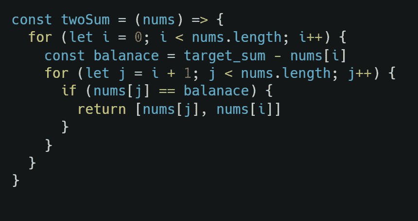
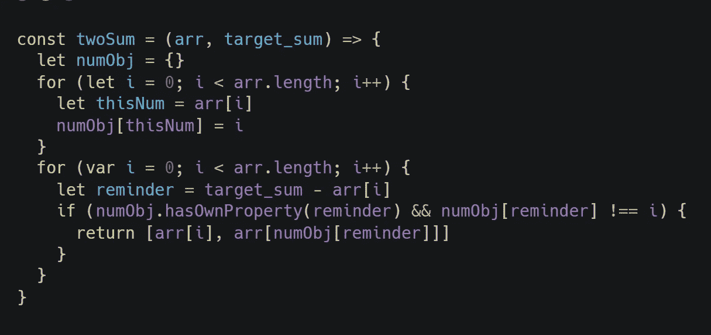
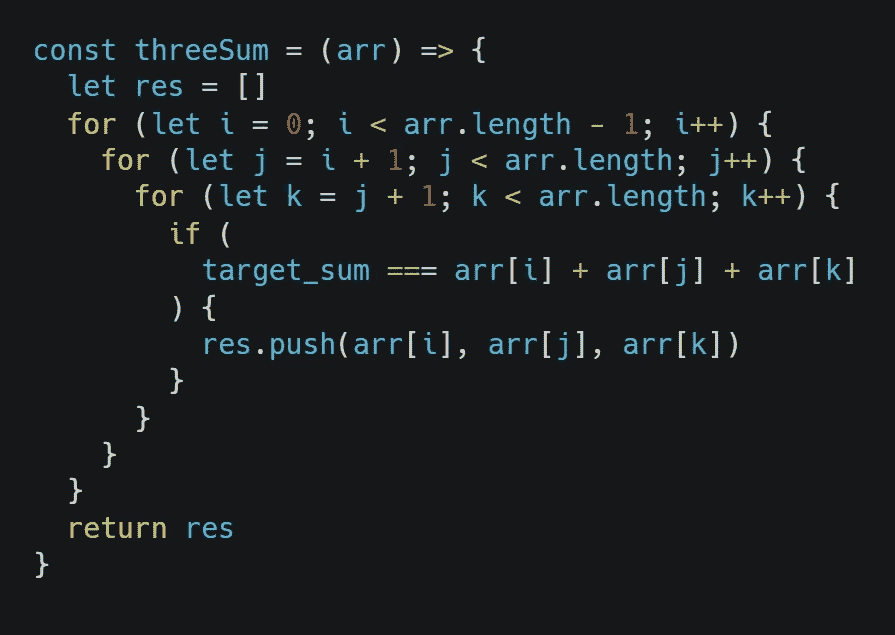
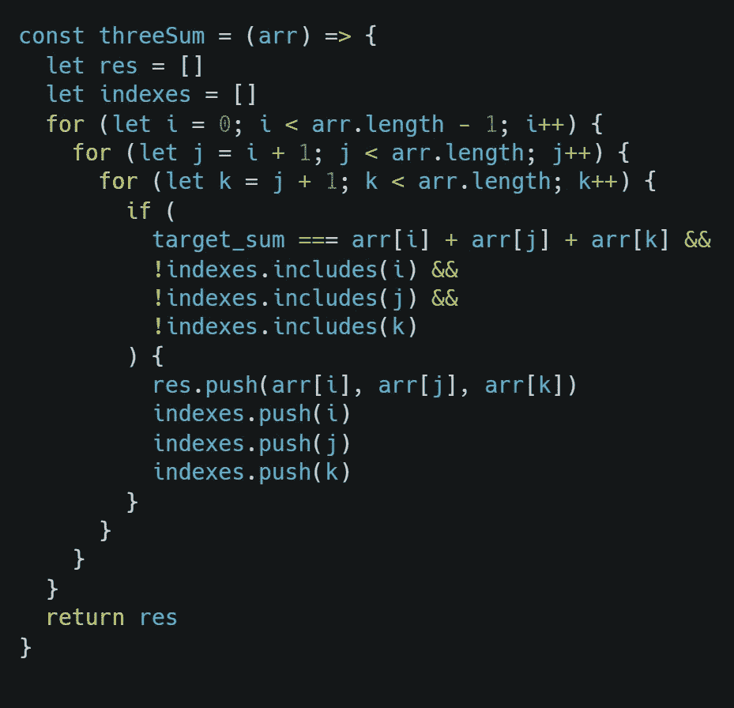
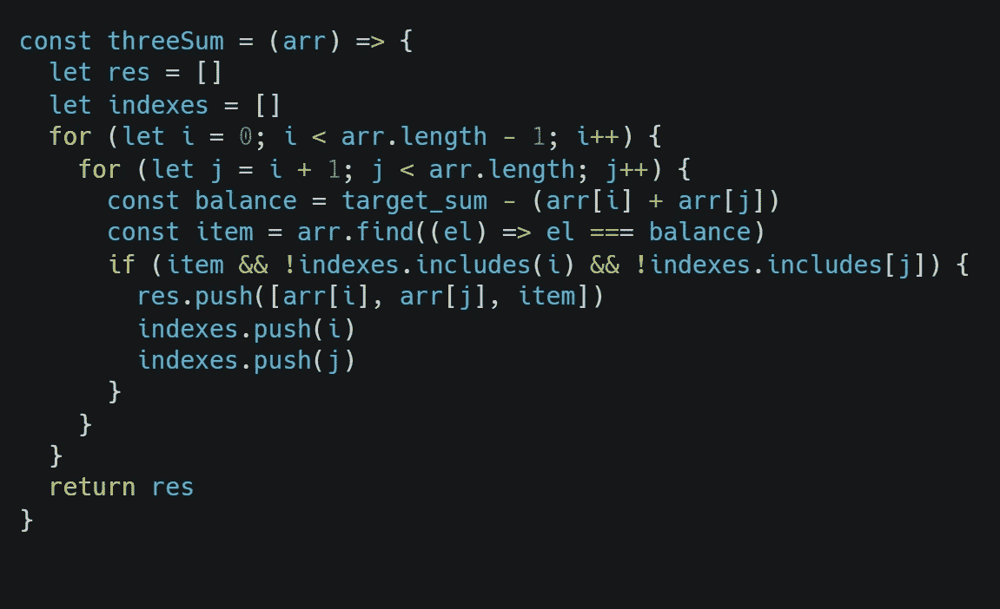

# 算法问题求解:二和与三和问题

> 原文：<https://javascript.plainenglish.io/algorithm-problem-solving-two-sum-and-three-sum-problem-762606f68b65?source=collection_archive---------4----------------------->


Problem Solving : Two-Sum and Three-Sum Problem

> **更新:这篇文章目前包含三和问题的强力方法，不久将更新更好的方法。**

我已经开始探索 2020 年代码的出现。对于第一天，场景包括编写一个程序来找出“n”个数字的乘积，这些数字加起来等于给定的目标总值。所以，理想地找到这两三个元素是关键。本文解释了实现这一点的各种方法。

# **两个求和问题的问题陈述**

给定一个整数数组`nums`和一个整数`target_sum`，返回*两个数，使它们相加为* `target_sum`。

例如，假设您的样本输入包含以下内容，并且提供的目标总和是 **2020**

```
1721
979
366
299
675
1456
```

在这个列表中，总计为`2020`的两个条目是`1721`和`299`。

## 方法 1:暴力

暴力方法很简单。循环遍历每个元素`x` 并查找是否有另一个值`y`，该值等于`y = target_sum — x`。



Brute Force way to solve two sum problem using JavaScript

## 方法 2:使用哈希映射。

时间复杂度和空间复杂度之间的权衡是相反的，在我们的第二种方法中，我们将创建一个散列表。在第一个 for 循环中，我们遍历数组，并将 hashMap 中的元素分配给 push。



Reducing the time complexity in internal for loop from O(n*2) to O(n)

在我们的第二个 for 循环中，我们使用 hasOwnProperty 并尝试查找 target_sum 和当前 index 元素之间的差值元素。

# 三个和问题的问题陈述

给定一个由 *n* 个整数组成的数组`nums`，在`nums`中是否有元素 *a* 、 *b* 、 *c* 使得*a*+*b*+*c*=`target_sum`？找出数组中所有唯一的三元组，给出`target_sum`的和。

例如，假设您的样本输入包含以下内容，并且提供的目标总和是 **2020**

```
1721
979
366
299
675
1456
```

在上面的列表中，总计为`2020`的三个条目是`979`、`366`和`675`。

## 方法 1:暴力

在这种方法中，我们尝试计算当前元素(使用第一个 for 循环获得)与接下来两个后续元素(使用下面的 for 循环获得)的和。



Solving Three sum problem using Brute Force

## 做一些修正

在上述方法中，每个 I、j 和 k 变量的索引被访问的次数多于所需次数。从而创建重复条目。我们可以通过简单地跟踪如下访问的索引来避免这种情况。执行所需的时间将几乎相同，但我们至少会摆脱重复。



Removing Duplicate entries in three sum solution set

## 美化最内层循环中的代码

就像我们在 Two Sum 方法 2 中所做的一样，我们可以在最内部的 for 循环中使用 Array.find()方法，使它看起来很漂亮(它对当前的时间复杂度没有影响)。



Reducing the time complexity in innermost for loop from O(n) to O(1)

上述解决方案没有优化到使用最短的执行时间。然而，他们至少会让你重新开始你是如何看待动态编程的。

在我的同名 GitHub repo 中探索更多关于 ***adventOfCode*** 问题语句及其解决方案的信息。这是链接

[](https://github.com/Kailashw/adventOfCode) [## 凯拉什/adventOfCode

### 《降临代码》是一个小型编程难题的年度降临日历，适用于各种技能集和技能水平…

github.com](https://github.com/Kailashw/adventOfCode)