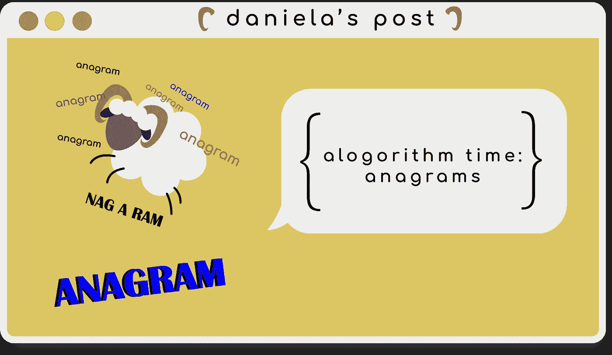
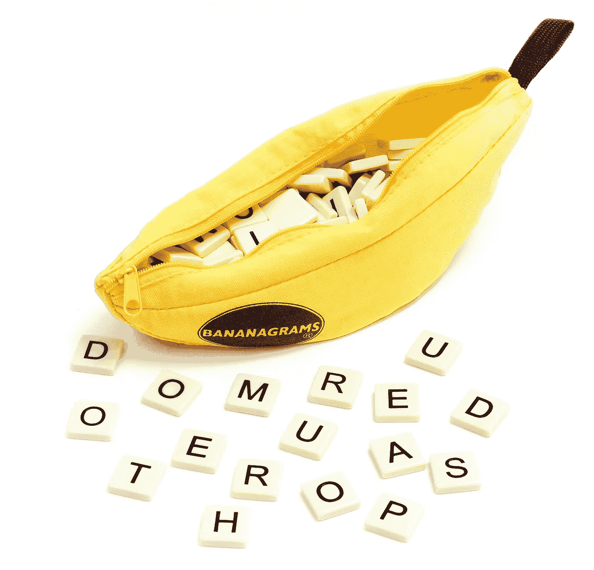

# 算法时间:字谜

> 原文：<https://javascript.plainenglish.io/algorithm-time-anagrams-4f76f68a937f?source=collection_archive---------5----------------------->

一种算法将带你回到你的[香蕉图](https://bananagrams.com/)时代。



If you missed it, ‘nag a ram’ is an anagram for anagram!

正如我在之前的帖子中提到的，我将深入算法的世界，并邀请大家一起来。人多力量大，尤其是对我的新兵训练营的毕业生来说。本周我得了重感冒，所以我没有深入柯尔特·斯蒂尔的[算法课程](https://www.udemy.com/course/js-algorithms-and-data-structures-masterclass/)，但是我遇到了我的第一个单独的算法问题。这还不算最疯狂的，所以我欣然接受了挑战。在今天的博文中，我将创建一个算法来验证作为字谜的给定输入。如果你不熟悉变位词，它们是由另一个单词/短语的字母组成的重新排列的单词/短语。比如:`cat`和`act`，`maple`和`ample`。为了让我们测试某个东西是否是变位词，我们需要某种比较装置来比较我们的两个输入，或者更好，我们可以写一个算法！

# 问题是🤷🏻‍♀️

那么我们最初的提示是什么样的呢？

```
Given two strings, write a function to determine if the second string is an anagram of the first. An anagram is a word, phrase, or name formed by rearranging the letters of another, such as *cinema* and *iceman*.
```

让我们重申一下这个提示。我们正在编写一个函数来检查两个字符串是否是字谜。嘣。说起来容易做起来难，对吗？尽管只有两句话，我们的提示还是给了我们几个方向。首先，我们的最终结果很可能是一个“是/否”的回答，或者在我们的例子中，是一个布尔值`true`或`false`。第二，我们解决方案的重点将围绕字母字符。第三，我们算法背后的逻辑将涉及到比较一个输入和另一个输入的内容，所以我们肯定会使用循环。最后要注意的一点是关于字谜本身。变位词的规则之一是必须使用所有的字母，包括重复的字母。

至于输入和输出，我们希望发生的是像`cat`和`tac`这样的输入会输出`true`，但是`cat`和`dog`会输出`false`。另一个需要考虑的例子是短语。像`school master`和`the classroom`这样的输入也应该输出`true`。我们将放弃其中一个输入可能是空字符串或数值的极端情况，并假设一切正常，我们的输入肯定是字符串数据类型(如果你正在进行一次真正的面试，问你的面试官肯定很重要！).

# 分解它🕺🏻

阅读完提示后直接进入编码总是会导致我重新阅读问题，删除代码块，因为这不是提示所要求的，或者对下一步该做什么感到困惑。将事情分解成更小的任务不仅有助于给自己指明方向，也有助于面试官了解你的思维过程。对于我们的字谜问题，我把它分成 5 个步骤。这也是从:1 开始。逻辑的东西，2。返回对或错的答案。您的方法可能看起来与我的不同，但这是我为自己的解决方案提出的流程。当我想出这些步骤时，我也开始思考一些小细节，以便以后研究。重点是为你的解决方案如何工作创建一个路线图。

```
**function anagrams(input A, input B) {**
1\. Establish counters (object).
2\. Loop through first array to make the first counter.
 *a. Use conditional block to determine if the letter is in our counter object (use shorthand/ternary???).
   b. Consider where you want to convert to lowercase and test for ALPHABETICAL values.*
 3\. Repeat the same step for the second array and second counter.
 4\. Create final loop that will check to see if letters from the FIRST input are in the SECOND input based on 2 conditions.
 *a. Whether or not the key/letter exists in the second string.
   b. Making sure the frequency of that letter (once it does exist)   is the same in both strings.*
 5\. If the all letters pass the test, return true that it is a valid anagram.
**}**
```

# 我们来编码吧！⌨️

既然我们对自己在做什么有了更清晰的概念，是时候把我们的文本转换成代码了。

我们的第一步:`establish counters`是需要的，因为我们想创建一种方法，让我们看到哪些字母被使用，以及它们在我们的输入中出现了多少次。我们想要创建一些东西，我们可以使用它作为我们输入看起来像什么的参考点，类似于`{a: 1, c:1, t: 1}`。

```
**1\. Establish counters (object).**  
let frequencyCounter1 = {} 
let frequencyCounter2 = {}
```

第二步和第三步:`looping through our first array to create a counter object`。我们将创建一个对象，它是通过循环遍历第一个数组并检查当前字母是否是 counter 对象中的一个键来实现的。如果是一个键，我们将把我们的计数器加 1，如果不是，我们将创建一个新的键，初始计数为 1。你可以从一个经典的`for`循环开始，但是我在第一次重构后使用了一个`[for...of](https://developer.mozilla.org/en-US/docs/Web/JavaScript/Reference/Statements/for...of)`语句。因为字谜也可以包括短语，这意味着我们可爱的字符串可能不是一个单词，所以我们只想关心字母而不是空格。为了节省时间，我使用了一个正则表达式来测试字母。如果它通过了测试，那么我要么增加当前的字母数**要么**用那个字母创建一个新的密钥。第三步是我的代码中可能比较枯燥的部分，但是现在还可以，因为我们正在创建这个算法，因为它只需要两个输入。

```
**2/3\. Loop through first array to make the first counter.**  
for(let letter of stringA) {
   **a. Lowercased here for uniformity and dryness   **  
   let char = letter.toLowerCase()    
   if(/[a-z]/.test(char)) {
 **a. Conditional block that determines if the letter is in our      counter object. If it is, add one to it, if not set it at zero so we can start at 1\.**  
     frequencyCounter1[char] = (frequencyCounter1[char] || 0) + 1  
   }  
}
```

第四步:`create a final loop that will compare both counter objects to see if they match`。需要注意的一点是，我们的计数器是对象而不是数组。不同之处在于，我们可以用我们的`for`循环平滑地遍历数组，但是如果我们用一个对象来尝试，就会遇到麻烦。为了从计数器对象中获取一个数组，我通过使用`Object.keys()`收集键(字母)来检查我们的键(字母)是否都在两个计数器对象中，从而满足了我们的第一个条件。如果我们在两个对象中没有得到相同的字母，它就不是一个变位词，它返回`false`。如果所有的字母都相同，那么我们必须通过比较同一个键的每个值来测试它们出现的频率或次数。如果他们我们没有得到相同的数字，低，看，这不是一个变位。

```
**4\. Create final loop that will check to see if letters are in both counter objects.** for(let key of Object.keys(frequencyCounter1)) {
   **a. Whether or not the key/letter exists in the second string.** if(!frequencyCounter2[key]) {
     return false
   }
 **b. Making sure the frequency of that letter (once it does exist)    is the same in both strings.** if (frequencyCounter1[key] !== frequencyCounter2[key]) {
     return false
  }
}
```

第五步: `return true if it really is an anagram`这是我们一直在等待的。如果我们的计数器对象在字母和频率上都匹配，那么我们最终可以输出`true`。

```
**5\. Return true if it really is an anagram 🎉** return true
```

# 我们的字谜解决方案💡

# 最后的想法☕️



最后，我对代码进行了三次重构。其中一些是为了风格的目的，而另一些是为了功能性，因为我一直在思考更小的条件。将来，在创建第二个计数器时，我想让我的解决方案更干燥一点。回到我们的朋友 Big O 符号，我的算法的时间复杂度是 O(N ),因为我有三个独立的循环，而不是嵌套循环。就空间而言，它们肯定会占据更多的空间，因为我的两个对象都会增加，尤其是字母的频率(感谢上帝有 25 个字母的字母表)。虽然我确实比我预期的多花了一点时间，但算法最终肯定会教会你不止一项新技能。希望在这个变位算法之后，你可以从`sobs`到`boss`！