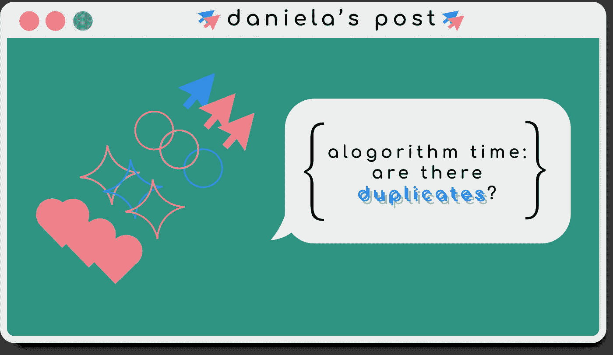

# 算法时间:有重复的吗？

> 原文：<https://javascript.plainenglish.io/algorithm-time-are-there-duplicates-2ade620b2d5f?source=collection_archive---------4----------------------->

*试图弄清楚在你的函数中，你是否会养育三胞胎、四胞胎或仅仅是复制品。*



我仍然徘徊在算法池的 2 英尺边上，但我已经熟悉了解决问题的不同类型的方法。是的，不同方法的想法，尤其是在编程中，对我来说并不新鲜，但是在处理一个诱人的新问题时，给公共模式一个名称和面孔会有很大帮助。通过使用问题解决模式，有一个起点和大致的前进方向是很好的。本周我将特别关注两个被[柯尔特·斯蒂尔](https://www.udemy.com/js-algorithms-and-data-structures-masterclass/)称为频率计数器和多指针模式的东西。如果算法还不是你的难题，试着想出几种不同的解决方案来解决你觉得舒服的问题。这篇文章就像一个选择你自己的方法风格，记住，解决方案并不局限于你看到的那些！所以让我们开始吧。


The “hard way” being attempting to solve algos in different run times after finally getting that one solution that gives you the correct outputs.

# 问题是🤷🏻‍♂️

这就是我们要做的。

```
Implement a function called, **areThereDuplicates** which accepts a **variable number of arguments**, and checks whether there are any duplicates among the arguments passed in.*areThereDuplicates(1, 2, 3) //false
areThereDuplicates(1, 2, 2) //true
areThereDuplicates("c", "a", "t", "s", "s") //true*
```

幸运的是，这个提示非常直接。我们正在检查是否有相同的重复或值。通常我们会看到像数组这样的结构作为我们的输入，但是这里我们看到的是“可变数量的参数”。在创建我们的解决方案时，我们将处理如何访问和处理参数。我们所知道的是，我们将会收到某种形式的价值集合。要注意的第二点是，我们的输出将是布尔值`true`或`false`。至于我们逻辑中的“我们到底要怎么做”部分，检查两个值是否相同听起来像是比较，所以我们会在我们的混合物中加入一点。

# 分解它🎧

对于这篇文章，你可以选择你自己的冒险方式来阅读，我会给出三种不同的方法。前两个处理的是解决问题的模式，而最后一个更多的是奖励回合。

## 计数式频率计

通过对象跟踪数据频率的频率计数器模式。在我们构造了这个对象之后，我们可以用它来确定我们的输出！这有点像我们所拥有的一个迷你清单。

```
function **areThereDuplicates**() {
1\. Create our counter (object).
2\. Loop through our arguments.
    a. If that argument is in our object, add 1 to it.
    b. If it's not in our object, create it in our object.
3\. Check our newly made argument by looping through it to see if there are duplicates.
    a. If a keys value has more than 1 count, then there duplicates
4\. If we finish the loop without returning anything, then there are no duplicates
}
```

## 多个指针

多指针模式有助于避免在另一个循环中循环。通过使用循环，我们使用索引遍历一个结构，但是它通常被限制在一个引用点: *i* 。如果使用多指针模式，我们可以通过使用两个或更多变量作为索引来最大化循环。两个`i`总比一个好！(🥁)

```
function **areThereDuplicates**() {
*(Can we turn our arguments into a sorted array???)* 1\. Create our first point of reference starting at 1.2\. Loop through our sorted array to create the second point of reference starting at the beginning of the array (0).
    a. If an element is equal to the next element, return true.
    b. If not, then continue adding to our points.
3\. If by the end of our looping we haven't found a duplicate, then looks like there aren't any so return false.
}
```

## 一艘班轮…

我已经意识到，那些我总是惊讶地盯着的一行解决方案往往是在花了很长时间分析一个问题之后才出现的。有时你可以用纯粹的逻辑得出一个解决方案，它会让你摸不着头脑。

```
function **areThereDuplicates**() {1\. What if we take our original arguments collection and compare it to a copy that has weeded out the duplicates...?
    a. what does it mean if they **aren't** the same?
}
```

# 我们来编码吧！👩🏻‍💻

与我以前的算法“让我们编码”部分不同，我一步一步地去做，这一部分将只强调是什么使每个模式独特。这不会是一个详细的指南，但我也不会让你蒙在鼓里。需要注意的重要一点是，我们可以通过调用`arguments`对象来访问传递给函数的任何参数

## 计数式频率计

让这种模式起作用的是创建对象的能力。如果没有，我们就看不到我们统计的数据。

```
let frequencyCounter = {}; **2\. Loop through our arguments.** for(let val in arguments) {
    **a. If that argument is in our object, add 1 to it.
    b. If it's not in our object, create it in our object.** frequencyCounter[arguments[val]] = (frequencyCounter[arguments[val]] || 0) + 1}
```

## 多个指针

对于指针，我们需要确保在迭代时正确使用它们。另外，不要忘记增加不受循环控制的任何其他指针。虽然`arguments`看起来像一个数组，但它更像一个对象，所以我冒昧地在`[Array.from()](https://developer.mozilla.org/en-US/docs/Web/JavaScript/Reference/Global_Objects/Array/from)`的帮助下将我们的输入转换成一个有序的数组。

```
let j = 1 **2\. Loop through our sorted array to create the second point of reference starting at the beginning of the array (0).** for(let val in sortedArr){ **a. If an element is equal to the next element, return true.**    if(sortedArr[val] === sortedArr[j]) {
      return true
    } else {
    **b. If not, then continue adding to our points.
**      j++}
}
```

## 一艘班轮…

通过将我们的参数转换成一个数组，我们可以通过使用`Set()`来确定新创建的数组是否与参数相同，从而消除任何重复的值。我们通过观察收藏的规模来做到这一点。如果这两个不相同，这意味着我们在某个地方有副本，但现在已经不存在了。

```
**1\. What if we take our original arguments collection and compare it to a copy that has weeded out the duplicates...?** return new Set(arguments).size !== arguments.length
```

# 我们的复制解决方案🌟

## 计数式频率计

## 多个指针

## 一艘班轮…

# 最后的想法…🍵


Photo by [Jørgen Håland](https://unsplash.com/@jhaland?utm_source=medium&utm_medium=referral) on [Unsplash](https://unsplash.com?utm_source=medium&utm_medium=referral)

我知道为一个问题创建两个甚至三个不同的解决方案看起来有些过分，但是它确实能帮助你准确地理解你的功能中发生了什么。你开始熟悉你的解决方案的每一个角落和缝隙，以及你对它的理解。通过创建它们，你也开始习惯于注意到如果你的输入有几百个值的话，一些解决方案会更好。感谢您阅读我的复制算法的复制解决方案！