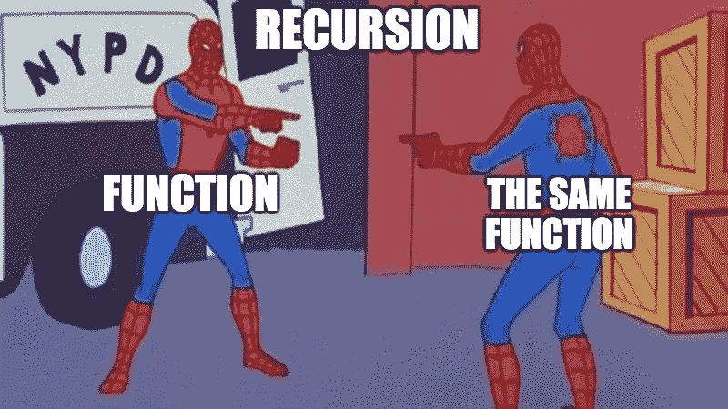

# 算法时间:递归

> 原文：<https://javascript.plainenglish.io/algorithm-time-recursion-795161ba5d40?source=collection_archive---------10----------------------->

## *将递归思想引入我们的算法工具带。*


*Cue The Twilight Zone intro music*

我在编程中遇到的最令人满意的事情之一是能够在其他函数中重用一个函数。把一个大问题分解成小问题，看到它起作用，会给人一种惊奇和自豪的感觉。从同样的意义上讲，如果一个函数不在一个函数中调用其他函数，而是在它自己内部调用它自己，那会怎么样呢？递归是不断给予、给予、给予、给予的礼物。“递归”这个词起初听起来有点吓人，但是通过在概念层面上理解它，我们解决问题的过程会变得更加强大。



Recursion with the help of a friendly neighborhood spider(s).

# **引擎盖下🚜**


Photo by [Sean Pollock](https://unsplash.com/@seanpollock?utm_source=medium&utm_medium=referral) on [Unsplash](https://unsplash.com?utm_source=medium&utm_medium=referral)

## 一次短途旅行

首先，让我们让递归的想法看似合理。假设你在一楼，你需要去一栋建筑的屋顶。不幸的是，你没有传送能力，所以你乘电梯。电梯检查一楼是否是屋顶，看到不是，就忽略它，继续向上。它重复这个过程，直到你在最顶端。继续经过顶楼是没有意义的，因为否则你会在空中。它知道停在最高的楼层。一旦你看到了风景，你需要回到下面。同样的过程以相反的时间顺序重复，因为你在最大的楼层，而不是一楼。你愉快地离开，没有意识到你刚刚参与了一个递归过程。

## 定义递归

那么这一切对我们来说意味着什么呢？递归是一种解决问题的方法，它涉及到一个进程在它的进程中调用它自己。我们可能遇到的一个潜在问题是一个永无止境的过程，因为我们不断地调用它。要使一个函数被认为是递归的，有两件事是必需的:一个基本情况和一个不同输入的重复动作。

基本情况是帮助我们的递归函数停止的条件。在我们的电梯例子中，它不会继续向上越过顶层，因为没有更多的楼层可以通过。如果你在一个数组中寻找，函数不应该超过数组中元素的数量，因为这样它就不会计算任何东西。在编写我们的基本用例时，要记住的一件重要事情是，确保我们使用`return`在代码运行后实际停止任何代码。

结合我们的基本情况，我们需要通过确保使用输入的不同版本而不是原始版本来确保我们的输入实际上可以到达我们的基本情况。如果我们有一个名为`countDown`的函数，它打印一个倒计数，我们输入 10，我们的基本情况是当它达到 1 时就停止，我们需要确保当我们调用`countDown`时，比之前的输入少 1。这意味着下一个`countDown`输入将是 9 而不是 10。否则，我们的函数将永远不会命中我们的基本用例。

我们的递归函数的基本布局可能如下所示:

```
function **recursiveExample**(input) {
     **Base Case:**
     If the input reaches this condition, return and stop the loop **Recursion:**
     Calls recursiveExample(altInput) with an altered input
}
```

## 调用栈


The call stack helps “manage” functions calls within a program or process kinda like a Kris Jenner to Kim Kardashian situation.

为了跟踪一个函数对自身或任何调用的所有调用，我们可以参考调用栈。调用堆栈是一种堆栈数据结构，有助于管理进程中发生的事情。每当一个新函数被调用时，它将被放置或推到“堆栈”的顶部。除非看到函数已经结束，否则该调用不会从堆栈中移除或弹出。从上到下依次删除呼叫。有了递归，同一个函数将不断被推到我们的堆栈中，如果没有基本情况，我们可能会以堆栈溢出结束([听起来很熟悉吧](https://stackoverflow.com/)？).当考虑递归调用时，煎饼叠在一起从上到下吃的想法是要记住的。每个调用都等待另一个调用完成或返回值。一旦它到达最顶层和最底层，它将开始处理堆栈中的其他调用，并一个接一个地删除它们。

# 一个简短的例子💬

既然我们已经知道了引擎盖下发生了什么。这是一个简短的片段，描述了从我们的电梯例子返回的函数可能的样子。

We’ll cover recursive examples more in depth next week!

# 结束语🥤


If you’ve made it to the end of this article, try searching “Recursion” on Google and you’ll now understand what happens when you do.

递归让你提前几个步骤思考。在构建和测试某些问题的解决方案时，您开始在头脑中构建一个迷你调用堆栈。当处理更复杂的数据集和结构时，我们可以使用递归来创建简单快捷的解决方案。现在，理解递归背后的概念以及被认为是递归的函数意味着什么是很重要的。

*下周的博客文章将涵盖使用 algos 的更复杂的例子，敬请关注！*