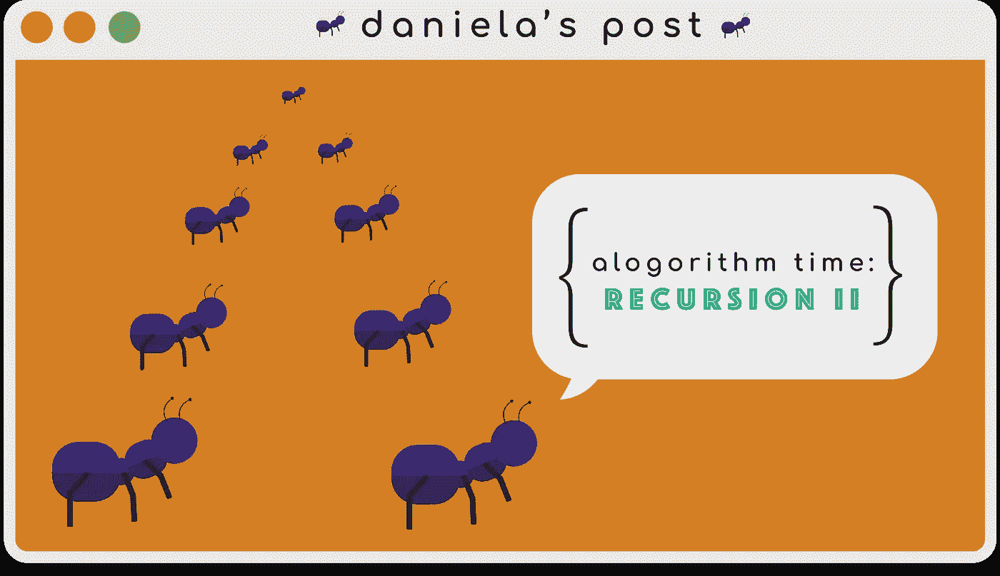
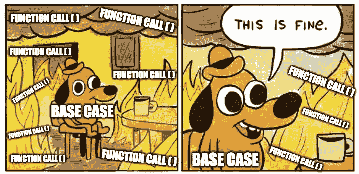
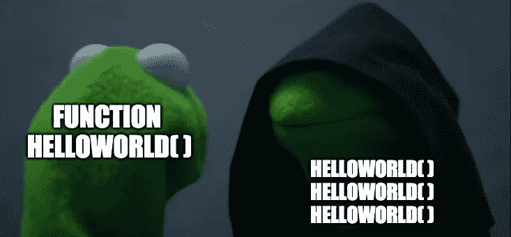

# 算法时间:递归 Pt。二

> 原文：<https://javascript.plainenglish.io/algorithm-time-recursion-pt-ii-f621a8171325?source=collection_archive---------8----------------------->

## 理解递归本身就是一项壮举，但是实现它就是另一回事了。



Like Ant-Man, our function’s call stack eventually starts to look like a tree 🧐.

这篇文章将延续上周的文章，在那里我深入研究了递归思想的含义。回顾一下，递归是一种解决问题的方法，它涉及到一个进程在它的进程中调用它自己。就 JavaScript 而言，它是一个调用自身的函数。如果你有一个名为`helloWorld()`的函数，你可能会看到在其中调用`helloWorld()`。在编写函数时，我们必须记住，为了防止函数创建无限循环和超出调用堆栈，我们需要一个基本用例。如果达到某个条件，它将作为一种中断循环的方式。现在您已经熟悉了，让我们来看看递归的实际应用。



Never forget about your base case!

# 问题是👀

```
Write a function called **collectOddNumbers** which accepts an array of integers and collects all the **odd values** within the array.*collectOddNumbers([1, 2, 3, 4]) // 1, 3
collectOddNumbers([10, 3, 2, 31, 4, 3]) // 3, 31, 3*
```

那么这个提示在问我们什么呢？我们将接收一些随机数，但是我们想要返回的只是奇数的值。通常我们可以使用迭代的方法，比如使用`for`循环，来遍历数组，但是我们只能依靠我们的函数。我们还必须开始考虑，我们可以设置什么条件，使我们的函数不会无限运行。一个`for`循环由一个初始表达式、一个条件和一个递增表达式组成。该条件用于确保语句仅基于是否满足它而运行(对/错)。相反，这项工作将被交给我们的基本用例，它将在我们的函数`collectOddNumbers()`开始时被检查。最后，我们必须确保我们实际上用一个不同于之前给定的输入值来调用我们的函数，否则我们只会评估相同的输入，而我们的基本情况永远不会达到。

# 分解它🎤

如果我们只是在大声思考，我们的函数应该遍历我们的集合，执行某种逻辑来检查它是否奇怪，然后将该值放在某个地方。在我们的过程结束时，我们应该得到另一个只包含奇数的集合。现在我们遇到了一个有趣的问题。如果我们使用迭代，我们将在一个数组中存储我们的奇数集合。因为我们使用递归，所以每次调用函数时，建议一次只计算一个值。我们仍然可以使用数组来存储奇数，但是一次只能存储一个。我们的 return 语句必须考虑到，在我们的堆栈中，我们将结束几个小数组，它们需要变成一个大数组。

```
**function collectOddNumbers(arr) {** 1\. Create an array that'll collect our odd number.
2\. Establish base case that checks whether or not we have any values left.
  a. No more values? Return an empty collection. 
3\. Logic that checks to see if the number is odd.
  a. If it is, push that value into our array.
4\. Call our function again.
  a. Refine our collection by turning all arrays into one.
  b. Remove the current value from our array for the next input.
5\. Return our collection that contains **only odd** numbers.
**}**
```

# 我们来编码吧！💻

是时候将我们的战略付诸行动了。

我们需要一些东西来保存奇怪的值。因为我们的函数是递归的，我们在过程中定义的任何值都会被重置，所以我们可以一次记住一个值。我们会确保稍后再将它们全部收集起来，所以不要担心。

```
**1\. Create an array that'll collect our odd number.
**  let oddNums = [];
```

在任何事情发生之前，我们首先必须完成我们的基本案例。如果我们检查值并不断减少输入，当我们没有值要检查时会发生什么？我们停下来。我们的基本情况应该是查看我们的数组中是否还有剩余的内容。如果我们什么都没有，我们就返回一个空数组。如果我们不返回任何东西，我们将在集合中以`undefined`结束。

```
**2\. Establish base case that checks whether or not we have any values left.
  a. No more values? Return an empty collection.
**  if(input.length === 0) {
    return oddNums;
  }
```

我们到底如何检查一个值是否是奇数？甚至像 2、4 或 6 这样的值都有两个共同点:它们可以被 2 整除并且没有余数。我们可以使用这个逻辑来检查是否有任何值没有余数 0。

```
**3\. Logic that checks to see if the number is odd.
  a. If it is, push that value into our array.**
  if(input[0] % 2 !== 0) {
    oddNums.push(input[0])
  }
```

现在有一个稍微棘手的问题。为了使我们的函数符合基本情况，我们通过使用`[slice()](https://developer.mozilla.org/en-US/docs/Web/JavaScript/Reference/Global_Objects/Array/slice)`将当前值从数组的其余部分中分离出来，不断地改变输入。这样，下一次调用将计算数组中的下一个值。对于每个调用，我们都希望通过使用`[concat()](https://developer.mozilla.org/en-US/docs/Web/JavaScript/Reference/Global_Objects/Array/concat)`来确保下面的数组合并成一个。最后，我们将使用新的单个数组来重新定义我们的集合，这个集合要么包含一个值，要么包含一个空数组。如果这难以想象，请向下滚动到“解决方案”部分，查看这个流程的小树形图！👇🏼

```
**4\. Call our function again.
  a. Refine our collection by turning all arrays into one.**
 **b. Remove the current value from our array for the next input.**  oddNums = oddNums.concat(collectOddNumbers(input.slice(1)))
```

经过我们所有的努力，我们想看到我们创造的美丽的单数组，所以返回它！

```
**5\. Return our collection that contains *only* *odd* numbers.
**  return oddNums
```

# 有一面堆叠的解决方案🍔

有了递归，我发现通过创建一棵小树，可以更容易地想象调用堆栈的样子，以及它们的返回值的样子。从一个较小的输入开始，这也有助于了解随着栈的增加你的函数是如何工作的。我在我们的解决方案中包括了它可能的样子！

# 最后的想法🥛

如果使用迭代，递归的每个过程几乎都像是经历一个循环。我们的基本情况将作为我们通常在循环结构中看到的条件。现在，即使在我们使用的例子中，我们一次只有一个“循环”,因为我们只在进程中调用了一次函数，这可能会变得更混乱。注意，我曾经提到过*这个词。*进程不仅限于调用自己一次，而是可以调用自己多次。对于每个调用，我们可以开始构建一个值树，而不是等待循环结束，我们可以让每个循环同时发生。我知道，疯狂的权利🤯？



Looking at you [fibonacci sequence algorithm](https://www.thepolyglotdeveloper.com/2015/01/fibonacci-sequence-printed-javascript/).