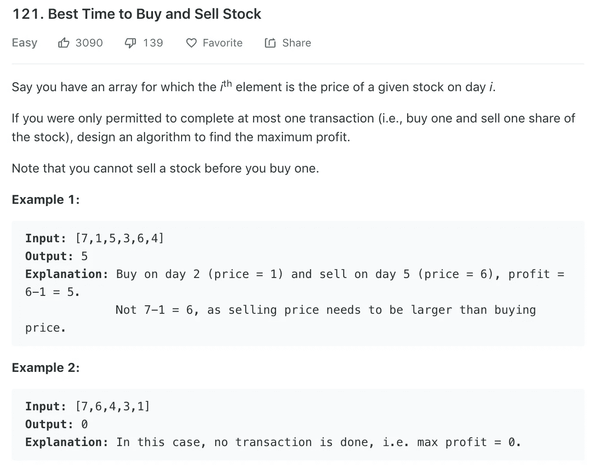
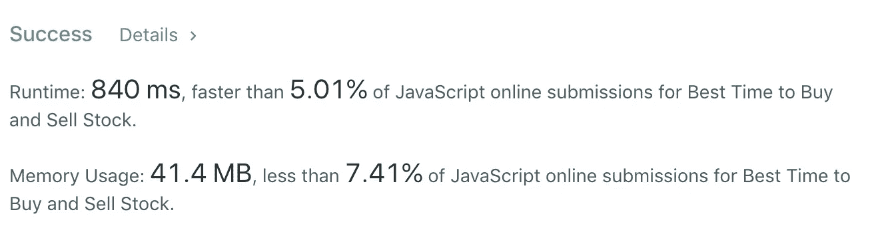
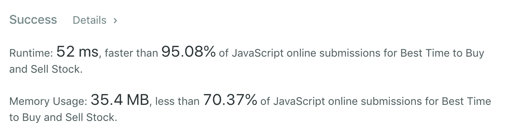

# 算法 101:用 JavaScript 买卖股票的最佳时机

> 原文：<https://javascript.plainenglish.io/algorithms-101-best-time-to-buy-and-sell-stock-in-javascript-7a2249b29495?source=collection_archive---------1----------------------->

## Noob 诉 LeetCode，第 8 集，数组操作


Photo by [Chris Liverani](https://unsplash.com/@chrisliverani?utm_source=unsplash&utm_medium=referral&utm_content=creditCopyText) on [Unsplash](https://unsplash.com/s/photos/stock-trading?utm_source=unsplash&utm_medium=referral&utm_content=creditCopyText)

在阅读 LeetCode“简单”类别中的顶级面试问题时，我发现了这个问题:



我的第一个方法是这样的。对于数组中的每个数字——我们称之为*买入*——找到右边最大的元素——我们称之为*卖出。I* f 卖出低于买入，让我们从买入中减去卖出，称结果为*盈利*。

同时，我们将有另一个名为 *maxProfit* 的变量，它从零开始。在每个循环结束时，如果利润大于*最大利润*，那么我们将设置*最大利润*等于利润。如果这让你感到困惑，我会把它分成以下几个步骤。

# 第一步。迭代，同时跟踪索引

```
var maxProfit = function(prices) {
   let profit
   let maxProfit = 0

   prices.forEach(function(buy, index) {
       // more code here
   })  
    return maxProfit    
};
```

# 第二步。在右边创建一个新的元素子数组

```
let rest = prices.slice(index + 1)
//it's index + 1 because we want all elements to the right ...
```

# 第三步。找出子数组中最大的数字

但是…如果我们在看数组的最后一个元素，那么`rest = []`。为了说明这种边缘情况，让我们首先检查一下 *rest* 是否不为空。我们将使用 javaScript 的 [Math.max()](https://developer.mozilla.org/en-US/docs/Web/JavaScript/Reference/Global_Objects/Math/max) 来查找最大值。我们会在出售时保存价值。

```
if(rest){
    let sell = Math.max(...rest)
}
```

# **步骤四。计算利润**

如果卖出大于买入(按照挑战规则的要求)，我们可以这样计算利润:

```
if (sell > buy){
 profit = sell — buy
 }
```

# 第五步。检查利润是否大于最大利润

对于每一笔购买，我们都在计算利润。我们从零开始获取最大利润。现在，在我们的循环中，我们需要比较两者，并且总是将较大的值分配给 *maxProfit* :

`profit > maxProfit ? maxProfit = profit : null`

最后，在循环结束时，我们返回 *maxProfit* :

```
var maxProfit = function(prices) {
   let profit
   let maxProfit = 0

   prices.forEach(function(buy, index) {
       let rest = prices.slice(index + 1)       
       if (rest){
         let sell = Math.max(...rest)      
           sell > buy ? profit = sell - buy : null
            profit > maxProfit ? maxProfit = profit : null    
     }     
   })  
    return maxProfit    
};
```

有用！但是它的表现如何呢？

can you say SLoooooooooooowwwwwwww ….?

我们是倒数 5%的人！



为什么？因为我们有嵌套循环——for 循环中的 if 循环，更不用说每个嵌套循环的两个三元运算了。

# 我们需要不同的方法！

我们的第一个方法是将数组分成两个数组，一个嵌套在另一个中。这次，我们只迭代一次。我们仍然会为 maxProfit 设置一个初始值。我们还将为 min 设置一个初始值(最小值，即最低价格)。

```
var maxProfit = function(prices) {
    let maxProfit = 0;
    let min = prices[0];
    for(let i = 1; i < prices.length; i++) {
    // more code here
    }
}
```

当我们迭代时，我们将把我们最近的 *min* 值与下一个元素进行比较，并将这两个值中较小的一个设置为 *min* 的新值。我们使用 javaScript 的 [Math.min()](https://developer.mozilla.org/en-US/docs/Web/JavaScript/Reference/Global_Objects/Math/min) 。

```
const prices = [7,1,5,3,6,4]
min = Math.min(prices[i], min);
        //i = 1, min = Math.min(1,7) => 1
```

# 跟踪利润

在同一个循环中，我们还更新最大利润，我们将它定义为 *maxProfit* 的前一个值，或者当前价格减去 *min* 。

```
maxProfit = Math.max(maxProfit, prices[i] - min);
```

下面看看这些值在每次循环后是如何更新的:

```
const prices = [7,1,5,3,6,4]for(let i = 1; i < prices.length; i++) { min = Math.min(prices[i], min);
        //i = 1, lowestPrice = Math.min(1,7) => 1
        //i = 2, lowestPrice = Math.min(5,1) => 1
        //i = 3, lowestPrice = Math.min(3,1) => 1
        //i = 4, lowestPrice = Math.min(6,1) => 1
        //i = 5, lowestPrice = Math.min(4,1) => 1 maxProfit = Math.max(maxProfit, prices[i] - min);
        //i = 1, Math.max(0, 1 - 1) => 0
        //i = 2, Math.max(0, 5 - 1) => 4
        //i = 3, Math.max(4, 3 - 1) => 4
        //i = 4, Math.max(4, 6 - 1) => 5
        //i = 5, Math.max(5, 4 - 1) => 5
    }
```

现在一起:

```
const maxProfit = function(prices) {
    let maxProfit = 0;
    let lowestPrice  = prices[0];
    for(let i = 1; i < prices.length; i++) {
        min = Math.min(prices[i], min);
        maxProfit = Math.max(maxProfit, prices[i] - min);
    }
    return maxProfit;
};
```

有用！这次我们只使用了一个循环，外加 Math.max()和 Math.min():



[*接下来:算法 101，#9:红宝石和 JS 中的宝石*](https://medium.com/@joanrigdon/algorithms-101-jewels-and-stones-in-ruby-and-javascript-c22fce37ad2b)

[*以防你错过:算法 101，# 7:JavaScript 中的入室抢劫犯*](https://medium.com/javascript-in-plain-english/algorithms-101-best-time-to-buy-and-sell-stock-in-javascript-7a2249b29495)

版权所有琼·印第安纳·琳斯 2019