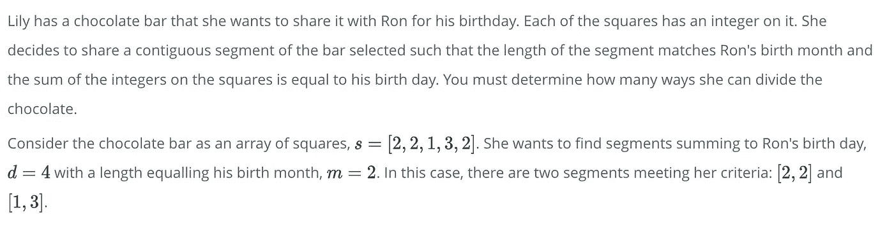
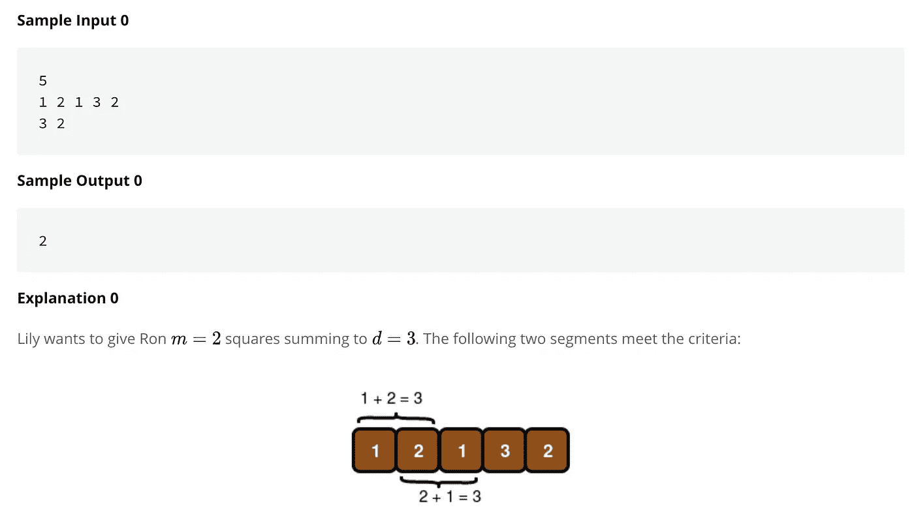

# 算法 101:JavaScript 中的生日巧克力

> 原文：<https://javascript.plainenglish.io/algorithms-101-birthday-chocolate-in-javascript-f5fcbd639bf3?source=collection_archive---------4----------------------->

## Noob 诉算法#10，数组操作


yes, i am more attracted to algorithms when they mention chocolate …

有个女孩，莉莉。她想送她的朋友巧克力作为生日礼物，但是有条件！

[以下是 HackerRank](https://www.hackerrank.com/challenges/the-birthday-bar/problem) 的问题:



对于那些通过图片学得更好的人，请继续阅读。在下面的输入示例中，5 是巧克力条的方块数；第二行是那些方块中的整数；第三行是他的出生日期(3)，后面是他的出生月份(2)。



who knew gifting chocolate could be so complicated?

我们从这里开始:

```
function birthday(s, d, m) {
     // s = array of integers 
     // d = date  
     // m = month
}
```

# **观察/选择你的武器……**

注意事项:

1.  整数必须是连续的——这意味着我们需要保持数组的顺序。所以我们可能不会用。sort()；但是我们将使用一个循环。
2.  我们需要一行中的 *m 个*整数加起来正好等于 *d，*因此在循环时，我们将希望一次查看 *m 个*连续整数的总和。如果你想按顺序查看数组的一部分，slice()就是你的工具！

# 把问题分解成更小的问题

只有当我们有 *m* 个连续的方块加起来达到 *d* 时，我们才会送出巧克力。假设我们至少有 m 个正方形(这是一种边缘情况，我们可以稍后检查)，下面是我们要做的:

1.  一次遍历数组的一部分；切片的长度为*米*
2.  获取该切片的总和
3.  如果总和等于日期，则递增计数器
4.  归还柜台


loop!

# 第一步。让我们循环并切片()…

切片略显棘手！它有两个参数，一个起始索引和一个结束索引。您的切片将在结束索引之前结束*。[文档在此处。](https://www.w3schools.com/jsref/jsref_slice_array.asp)*

所以 array.slice(0，2)给出了从第 0 个索引到(但不包括)索引 2 的数组“切片”:

```
let array = [apple, bobcat, couch]
let slice = array.slice(0,2)
// slice = [apple, bobcat] 
```

在我们的代码中，我们希望检查当前索引加上接下来两个索引的总和，因此我们的切片将如下所示:

```
function birthday(s, d, m) { for(let i = 0; i < s.length - 1; i++){
          let subArray = s.slice(i, i+m)
          if subArray.length === m {
             // more code here } }}
```

注意:如果您在一个数组上一次循环一个项目，从第一个索引(i = 0)开始并在结尾停止，其中索引是 array . length-1。

在我们的例子中，我们希望确保我们总是一次查看 *m* 个方块。例如，如果 m 是 5，并且我们的循环一直持续到我们从最后一个元素开始切片，我们不会得到 5 个整数；我们会得到最后一个元素。

我们可以通过将 I 的最大值设置为:`i < s.length — 1 — m.`来说明这一点，但由于 Noob 无法解决的原因，这样做会使算法无法通过 HackerRank 的一些测试。*知道原因请评论！！*

作为一种变通方法，我添加了一个额外的 if 语句来检查我的子数组的长度实际上等于 m。

```
function birthday(s, d, m) { for(let i = 0; i < s.length - 1; i++){
          let subArray = s.slice(i, i+m)
          if subArray.length === m {
             // more code here } }}
```

# 第二步。获取切片的总和

这是使用 JavaScript 的 reduce()方法的最佳场合。

`let sum = subArray.reduce((a,b) => a + b, 0)`

# 第三步。如果总和等于日期，则递增计数器

要增加一个计数器，我们必须设置一个。我们将在循环之前设置我们的，在循环期间操作计数器，然后在循环之后返回计数器。

在循环内部，我们将像这样递增:

```
if(sum === d){
     counter += 1
}
```

到目前为止，我们的代码如下所示:

```
function birthday(s, d, m) {
    let counter = 0 for(let i = 0; i < s.length - 1; i++){
          let subArray = s.slice(i, i+m)
          if subArray.length === m {
             let sum = subArray.reduce((a,b) => a + b, 0)
             if(sum === d){
                  counter += 1          
              }
           }
     } return counter
}
```

# 现在，对于边缘情况…

边缘情况比较奇怪——例如，如果你的数组 *s* 包含一些字母，而不仅仅是数字，那该怎么办？或者如果 *s* 不总是一个数组等等呢？人们很容易过度想象输入可能有什么问题。

在一周 5 天每天几个小时解决算法的几个星期后，我开始注意到你可以通过仔细阅读方向来节省大量时间。这些指示通常排除了可能的边缘情况。

对于这个问题，以下是 HackerRank 关于输入及其约束的注释:


换句话说，在一定的范围内，我们总是可以期待整数。

然而，在这些参数范围内，仍然存在特殊情况。出生月份是 11 月怎么办？在这种情况下， *m* 等于 11，我们要寻找 11 个连续的巧克力方块，它们的整数加起来等于 *d* 。但是如果我们的巧克力少于 11 块，无论整数是多少，我们都不会成功。

我们可以这样处理边缘情况:

```
//edge case, month greater than # of squares in barlet counter = 0;if(m > s.length ){
     return counter
}
```

另一个边缘案例:

如果出生月份是一月，*和*只有一块巧克力会怎么样？那么方块上的整数必须等于该日期。我们可以这样处理这种边缘情况:

```
//edge case month is one, only one square of chocolate.if(s.length === 1 && m === 1){ if (s[0] === d) { return 1
     }
}
```

现在一起:

```
function birthday(s, d, m) { //edge case #1, m > squares of chocolate
     let counter = 0;
     if(m > s.length ){
           return counter
     } //edge case #2, month is jan, only one square of choc.
     if(s.length === 1 && m === 1){
          if (s[0] === d) {
               return 1
          }
      } for(let i = 0; i < s.length - 1; i++){
          let subArray = s.slice(i, i+m)
          if subArray.length === m {
             let sum = subArray.reduce((a,b) => a + b, 0)
             if(sum === d){
                  counter += 1          
              }
           }
     } return counter
}
```

有用！现在我在想巧克力…

版权所有琼·印第安纳·琳斯 2019

接下来: [*算法 101、#11、公主、豆豆&红宝石中的递归*](https://medium.com/@joanrigdon/algorithms-101-princesses-peas-and-recursion-in-ruby-dffb44799d6e)

*以防你错过:* [*算法 101、#9、红宝石中的宝石和 JavaScript*](https://medium.com/javascript-in-plain-english/algorithms-101-jewels-and-stones-in-ruby-and-javascript-c22fce37ad2b)