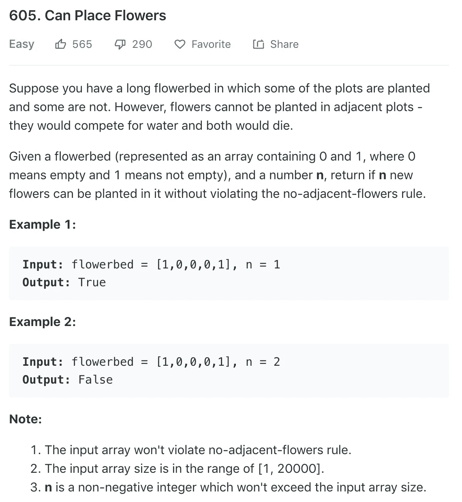
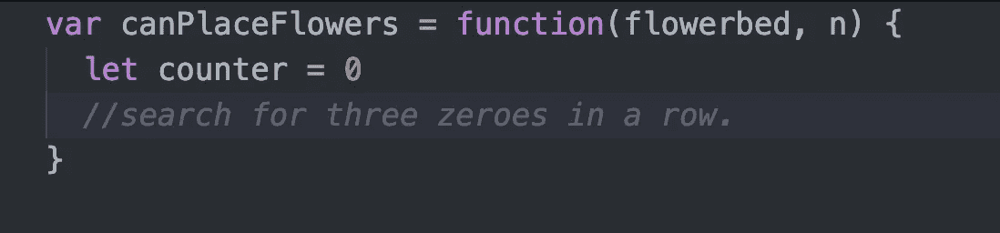
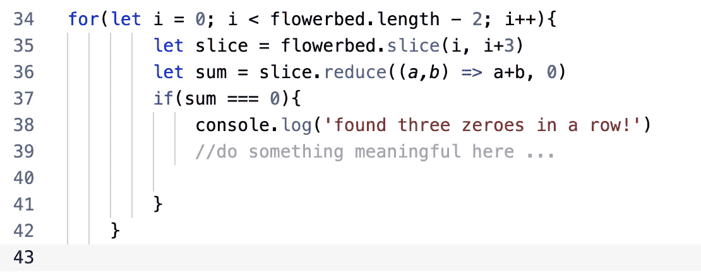
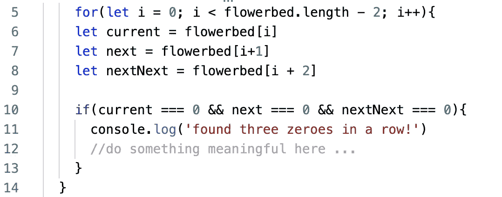
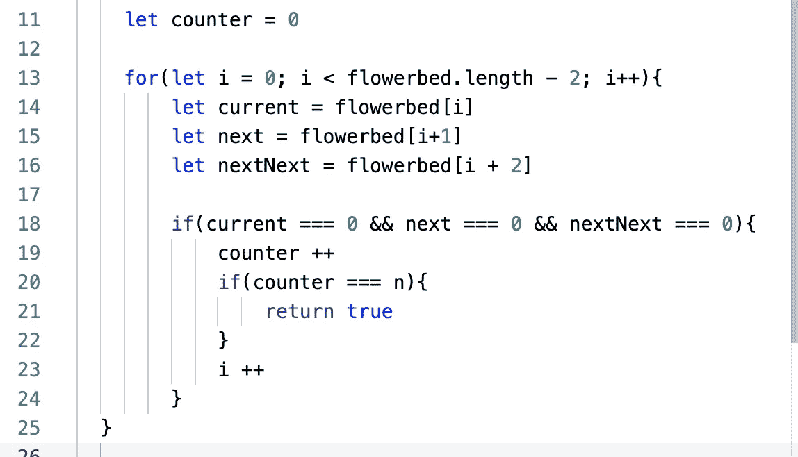
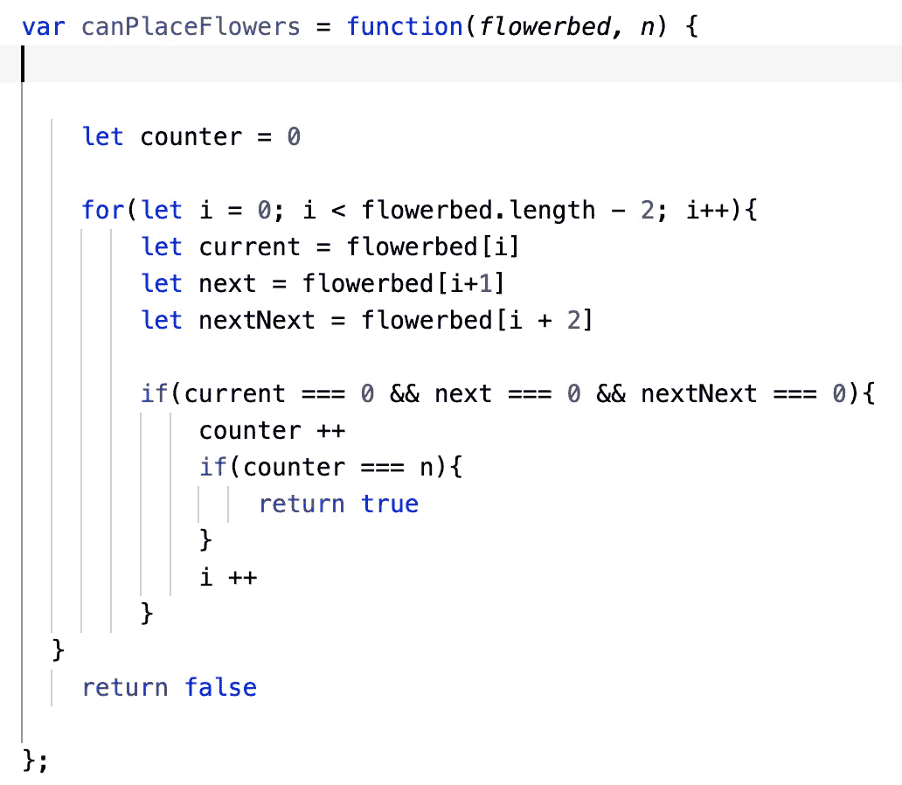
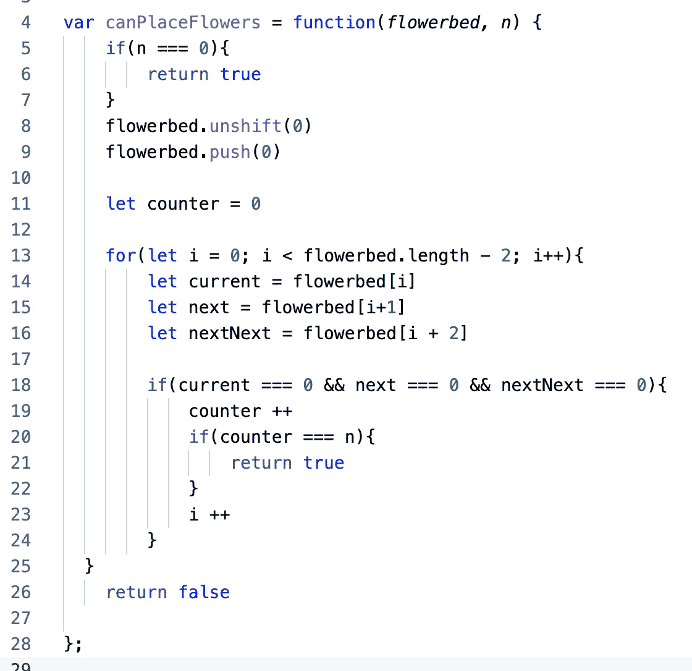
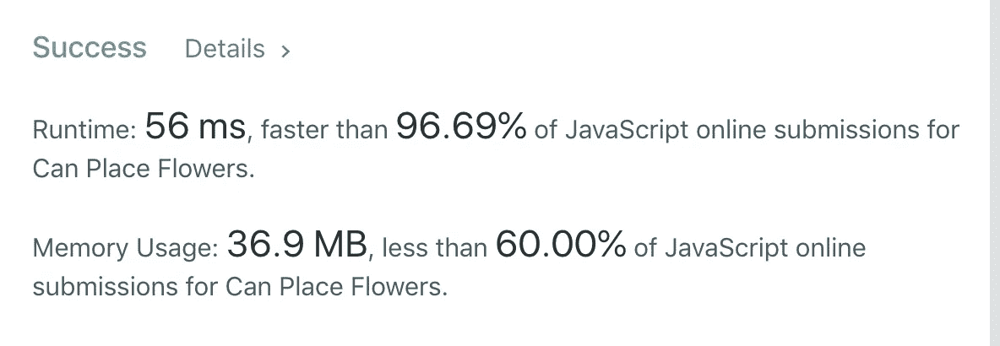

# 算法 101:可以在 JavaScript 中放置鲜花

> 原文：<https://javascript.plainenglish.io/algorithms-101-can-place-flowers-in-javascript-b87c6cb1dc24?source=collection_archive---------1----------------------->

## Noob 诉 Leetcode #15，数组操作

[今天来自 LeetCode 的挑战](https://leetcode.com/problems/can-place-flowers/)让我期待下一个种植季节:


sunflower from my garden …



## 分解问题。

我们可以通过以下几个步骤来解决上面的简单例子:

1.  从零开始计数。
2.  从左到右，连续寻找三个空图(零)。
3.  如果你发现连续三块空地，在中间种一朵花，然后增加你的计数器。如果你的计数器等于你应该种的花的数量，你的工作就完成了！返回 `true.`如果没有，继续前进。

4.从你刚刚种的花右边的空白地块开始，回到第 2 步，重复直到你的`counter = n`或者直到你的地块用完。

## 第一步。设置计数器。



ok, that was easy.

## 第二步。更难的部分:连续搜索三个零。

假设您有这个数组:`[1,0,0,0,1]`

您如何使用代码来发现一行中是否有三个零？

## 选项一:使用。切片()

我们可以用。*切片()*一次检查三种元素的“切片”。



让我们打开包装。

在第 34 行，我们在数组上循环。由于我们想一次检查三个项目，当`i < flowerbed.length -2`——数组中倒数第三个项目时，我们将停止循环。

在第 21 行，我们抓取花坛数组的一个片段，从索引 *i* 开始，到索引 *i+3 之前的元素结束。*

在第 22 行，我们使用*。reduce()* 将数组缩减为单个值，在这种情况下，是其元素的总和。如果和等于零，我们知道我们已经找到了三个元素。

## 选项 B:避免切片()…

我们可以在数组上循环，如果找到零，我们可以检查下两个元素的值:



由于 slice 复制了数组的三个元素，然后对它们进行操作，因此它应该比我们的第一种方法使用更多的内存，运行速度也更慢。

而且，没有。切片()和。reduce()更容易阅读，这意味着它也更容易维护。所以让我们使用选项 b。

## 第三步。递增我们的计数器，并将计数器与我们应该种植的植物数量进行比较。



在上面的代码中，当我们找到三个零时，我们用`counter++.`递增计数器，然后，如果计数器等于我们应该种植的植物数量，我们通过返回真打破循环。

如果没有，我们需要做一些特别的事情。假设我们从以下开始:

`[ 1, 0, 0, 0, 0, 1 ]`

我们找到了三个零，(从上面的第三个零开始)，并在中间“种”了一朵花。虽然我们实际上没有用代码改变数组，但是当我们考虑未来的种植地块时，我们需要考虑到我们刚刚种了一朵花——也就是说，中间的零现在应该是数字 1。

**在**之前 `[ 1, **0**, **0, 0**, 0, 1 ]`

**后:**后:`[ 1, **0**, **1, 0**, 0, 1 ]`

上面，我把我们正在看的三个元素用粗体显示。如果这三个元素在一行中不为零，我们就移到右边的下一个元素，再次搜索。

但是如果我们找到三个零，我们就在中间加一株植物。当我们再次开始寻找时，我们不需要考虑植物(它现在是 1)。相反，我们可以跳过它，看看我们刚刚种植的花之后的元素。

记住，每次循环后， *i* 加 1，这意味着我们向右移动一个元素，然后重新开始。但是在我们种下一朵花之后，我们希望 *i* 增加 2。我们通过在第 23 行添加一个`i++`来做到这一点。然后在循环结束时， *i* 再次递增。

## 还是在第三步:我们成功了吗？

现在，如果我们完成了循环，而计数器没有达到 n，我们就不能根据规则种植 n 朵花。所以在 if 循环之后，我们需要返回 false。



## 但是等等…边缘案例呢？

我们有一些特殊情况需要考虑。如果一个花坛长这样，我们想种一朵花怎么办？

`[ 0, 0, 1]`

实际上，我们的代码将返回‘false’—因为我们的代码在决定是否可以种植时会在一行中寻找三个零。在上面的例子中，第一个零适合种植，因为它在数组的开始。

如果数组以两个零结尾，我们也会遇到同样的特殊情况:

`[1, 0, 0]`

我们可以通过编写代码来处理这些边缘情况，如果第一个或最后两个元素是零，就将计数器递增 1，然后在一个元素之后开始循环，并在一个元素之前结束循环。

或者，我们可以简单地在数组的开头和结尾加一个零。

```
flowerbed.unshift(0)
flowerbed.push(0)
```

所以`[ 0, 0, 1, 0, 0]`

会变成:`[0, 0, 0, 1, 0, 0, 0]`

我们可以用这种方法解决边缘情况，因为我们实际上永远不会将植物添加到数组中的第一个或最后一个地块；我们总是把它加到三个空地块中间。

## 最终边缘情况——如果 n 为零呢？

我们的代码现在适用于所有情况，除了一种情况:当我们有一个已经完全种植的花坛，我们应该添加零朵花。说明提醒我们，我们得到的花坛将始终遵循种植规则。所以不管我们得到什么样的花坛，如果我们必须添加零朵花，我们应该返回 true——什么也改变不了总是有可能的！

下面是最终的代码:



而且……(老实说，LeetCode 的计时器在相同代码的后续提交之间变化很大……)它运行得相当快:



你可以在 repl.it 上玩代码[:](https://repl.it/@Joan_IndianaInd/canPlantFlowers)

https://repl.it/@Joan_IndianaInd/canPlantFlowers

版权所有琼·印第安纳·琳斯 2019

以防你错过: [*算法 101，# 14:JavaScript 中的快乐数字*](https://medium.com/javascript-in-plain-english/algorithms-101-happy-number-in-javascript-bddeb3d17035)