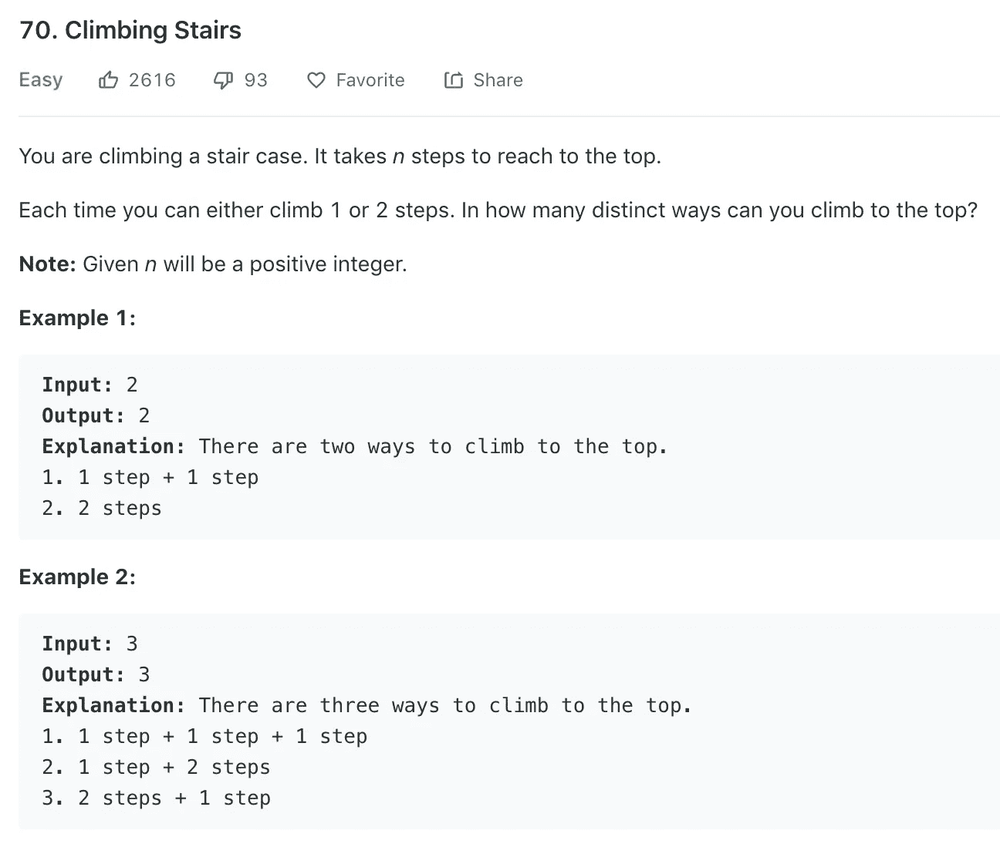
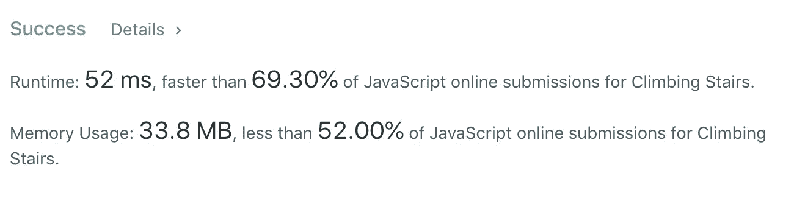

# 算法 101:用 JavaScript 爬楼梯

> 原文：<https://javascript.plainenglish.io/algorithms-101-climbing-stairs-in-javascript-c8dec14cb2f6?source=collection_archive---------2----------------------->

Noob v. LeetCode，第 4 集，重新学习斐波那契数列


每天早上 11 点，我都会和我熨斗组的一些人聚在一起研究算法。[今天的字谜来自 LeetCode:](https://leetcode.com/problems/climbing-stairs/)



你必须从某个地方开始。我的第一个方法是这样的:根据例子，每两步有两种可能的组合，每三步有三种可能的组合。

但这并不完全正确，因为一个组合总是一步一个脚印。所以也许模式应该是:

```
//if divisible by 2, maxCombos = pairs + 1?
//if divisible by 3, maxCombos = triples x 2 + 1?
```

我们花了一段时间尝试各种不同的算法。它们不起作用。

然后我们做了第一步:写出楼梯总数为 1、2、3、4、5 时的输入= >输出模式。这相对容易做到，因为当我们的代码通过了 n = 2 的测试时，它将在 n=3 时失败；当我们将它固定为 n = 3 时，它会在 n = 4 或 n=5 时失败，每次，LeetCode 都会给出预期的输出。

模式:

```
number of stairs : max combos
1:1
2:2
3:3
4:5
5:8
```

我们试图从如何从 1 到 2，如何从 3 到 2 等方面来理解这种模式，换句话说，只看前一个元素就能看到下一个元素。

但是，正如我们在逆向工程一些其他解决方案后被提醒的那样，这是经典的[斐波那契数列](https://en.wikipedia.org/wiki/Fibonacci_number)，从 0 和 1 开始，将最后两个元素相加得到下一个元素，然后继续下去。

因为 0 + 1 = 1，所以模式中的下一个数字是 1；因为 1 + 1 = 2，所以下一个数是 2，以此类推:

`0,1,1,2,3,5,8,13 ...`

斐波那契模式存在于自然界的许多螺旋元素中，从鹦鹉螺壳的大小到向日葵从中心到外部种子数量的增加。


我们发现我们正在处理斐波纳契数列，这使得我们更容易理解我们发现的一个解决方案:

```
var climbStairs = function(n) {
   const ary =[1,1];
   if(n>1){
        for(let i = 2; i <= n ; i++){
           ary[i] = ary[i-1] + ary[i-2];
       }
   };
   return ary.pop()
}
```

在第 2 行，我们设置一个数组等于斐波纳契数列的前两个数字(在 0 之后)。

我们从说明中知道，爬楼梯的次数永远是正整数(大于 0)。如果`n`是 1，我们不进入循环，我们使用`ary.pop()`返回数组的最后一个元素，也就是 1。太好了。现在两个怎么样，等等？

在我们的 *for* 循环中，我们的目标是向数组中添加一个新元素，它等于前面两个元素的总和。

这是算法的工作原理

```
for(let i = 2; i <= n ; i++){
           ary[i] = ary[i-1] + ary[i-2];

           //when i = 2
           // ary[2] = ary[2-1] + ary[2-2]
           //=> ary[2] = ary[1] + ary[0]
           //=> ie new element = sum of previous two elements
           // ary = [1,1,2] //when i - 3 
           //ary[3] = ary[3-1] + ary[3-2]
           //=> ary[3] = ary[2] + ary[1]
           // ary = [1,1,2,3] //etc }
```

当`*i = n*`时，循环停止。此时，数组中的最后一个元素是组合的最大数量，所以我们用 ary.pop()返回这个数字。

我们组中的一个人注意到，当我们返回 ary[ary.length — 1]而不是 ary.pop()时，数组运行得稍微快一些。

我们的优化解决方案:

```
var climbStairs = function(n) {
 const ary =[1,1];
 if(n>1){
 for(let i = 2; i <= n ; i++){
 ary[i] = ary[i-1] + ary[i-2];
 }
 };
 return ary[ary.length — 1]
}
```

运行良好！



*接下来:* [*算法 101 #5、JavaScript 中的山羊拉丁文*](https://medium.com/javascript-in-plain-english/algorithms-101-goat-latin-in-javascript-d388cc29dc73)

[*以防你错过:算法 101 # 3:Javascript 中下一个最伟大的元素*](https://medium.com/@joanrigdon/algorithms-101-next-greatest-element-493e224f82b5)

版权所有琼·印第安纳·琳斯 2019