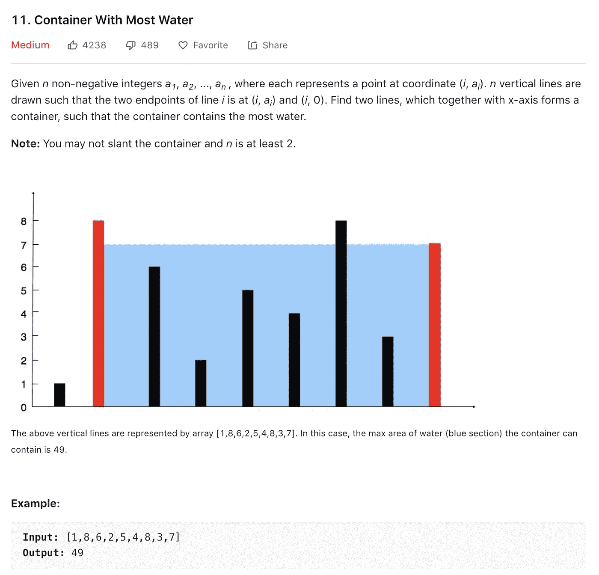
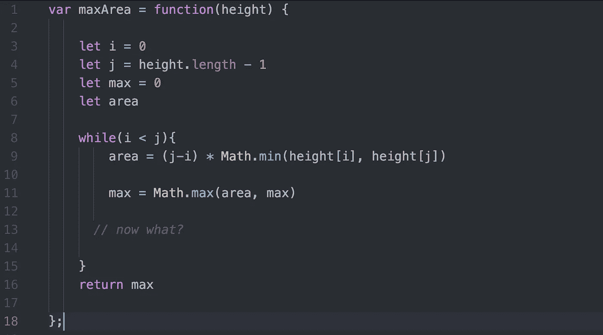
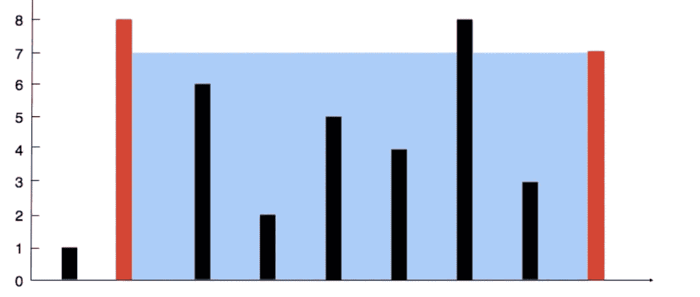
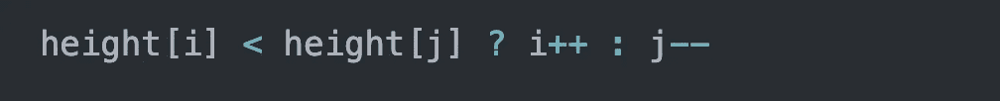
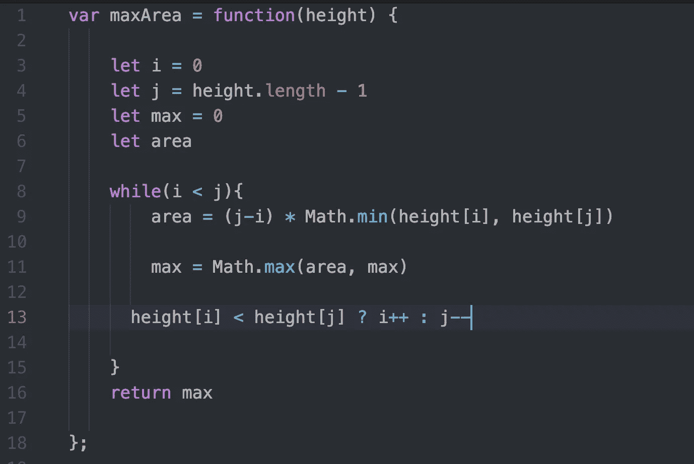
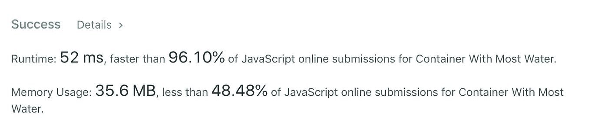

# 算法 101:JavaScript 中含水量最高的容器

> 原文：<https://javascript.plainenglish.io/algorithms-101-container-with-most-water-in-javascript-8843a962ee0f?source=collection_archive---------1----------------------->

## Noob v .算法# 20，从外向内迭代

Photo by [Doğukan Şahin](https://unsplash.com/@dogukan?utm_source=unsplash&utm_medium=referral&utm_content=creditCopyText) on [Unsplash](https://unsplash.com/s/photos/infinity-pool?utm_source=unsplash&utm_medium=referral&utm_content=creditCopyText)

如果你像我一样是个菜鸟，你可能会害怕 LeetCode 上的“中级”算法。事实证明，其中有几个其实比所谓容易的更容易。这里温和的介绍一下中级。

今天来自 Leetcode 的[挑战是选择盛水最多的容器:](https://leetcode.com/problems/container-with-most-water/)

# 我们来谈谈体积

水的体积将会是`height x length x depth`。在我们的例子中，深度是容器从前到后的厚度——我们假设它不变。所以对于这个挑战，我们只关心`height x length`。

**身高:**如你所见，身高不一。在上图中，我们有一个容器，一边高 8 个单位，另一边高 7 个单位。当我们进行计算时，我们必须选择较低的一个高度，因为容器的体积受到其最低壁的限制。

**宽度**:在上图中我们可以看到 9 面墙。我们的容器的宽度是右边墙的 x 坐标减去左边的 x 坐标。因为我们的输入数据是数组的形式，所以我们将使用索引号而不是 x 坐标来进行计算。

# 从外到内

我们这些菜鸟有从左到右迭代的习惯:

`(for let i = 0; i < array.length; i++)`

或者，当我们感觉大胆时，从右到左:

`(for let j= array.length = 1; j >= 0 ; j--)`

在这种情况下，我们需要双管齐下。

我们将从外墙开始，选择高度较低的一面，乘以宽度(右墙的指数减去左墙的指数)。我们将结果称为*区域*。

同时，我们将设置一个名为 *max* 的变量，默认值为 0。每次我们计算面积的时候，我们会把它和最大值进行比较，然后把最大值设置为两个值中较高的一个。

到目前为止，我们的代码如下所示:

让我们打开包装:

在第 3 行，我们设置`i` 等于左墙的索引，从`0`开始。

在第 4 行，我们从输入数组的最后一个元素`height.length — 1.`开始，设置 *j* 等于右墙的索引

在第 5 行和第 6 行，我们为 max 和 area 声明了变量。*(我们为什么不设面积等于零呢？我们可以，但我们不需要。我们将计算面积——正如你在第 9 行看到的。但是我们从不计算 max——我们只是将它设置为两个变量中较高的一个，所以我们需要给它一个初始值 0。)*

在第 11 行，我们使用 [JavaScript 的 Math.max()](https://developer.mozilla.org/en-US/docs/Web/JavaScript/Reference/Global_Objects/Math/max) 返回我们传递给它的最大值。

在第 8 行，我们说我们要迭代，而我们的左墙，`i` 仍在我们的右墙的左侧(即小于)，`j` *。*

# 试驾—第一次循环

假设我们有一个初始输入，`height = [1,8,6,2,5,4,8,3,7]`

在我们的第一个循环中，`i = 0`，`j = 8`(记住，这些是索引，不是值)。

`height[i]`处的墙高 1 个单位。`height[j]`处的墙是 7。

宽度为`j — i => 8 — 0 = 8`。

Area = `height of lower wall * width => 1 x 8 = 8.`

我们将其与初始值为`0`的`max`进行比较。由于`area`大于`max`，我们设置`max`等于`8`。

现在我们完成了第一个循环。

# 第二次循环我们用哪种方式迭代？

在我们的第一个循环中，我们的左墙比右墙低。现在我们要比较下一个两面墙的组合。下一个组合应该包括我们已经有的两堵墙中较高的那堵，加上紧挨着较短的那堵墙。

因为我们的右墙更高，所以让我们“保持”它(即，让我们不要改变右墙的索引`j`的值)。相反，让我们将`i` 增加 1，这意味着我们新的左墙在索引 1 处。

在我们的第一个循环中，我们比较了索引为 0 的墙，现在，在我们的下一个循环中，我们将比较索引为 1 和 8 的墙(下面的红色墙)。

since the left wall is higher, keep it; decrement j to check out the next right wall…

这是它的代码。

if left wall is lower than right wall, select a new left wall; otherwise select a new right wall …

然后我们继续循环，直到`i`和`j`在中间相遇。

现在一起:

而且……它跑得相当快:

你可以在 PythonTutor.com 上看到实时执行的代码，也可以在 repl.it 上玩它:

[https://repl.it/@Joan_IndianaInd/container-with-most-water](https://repl.it/@Joan_IndianaInd/container-with-most-water)

版权所有琼·印第安纳·琳斯 2019

接下来:[算法 101、#21、.JavaScript 中的 includes()与 index of()/两个数组的交集。](https://medium.com/@joanrigdon/algorithms-101-includes-vs-indexof-in-javascript-7f1b4af04127)

*以防你错过:* [*算法 101，#19，JavaScript 中的水平天井*](https://medium.com/javascript-in-plain-english/algorithms-101-level-patio-in-javascript-c9e98696694e)